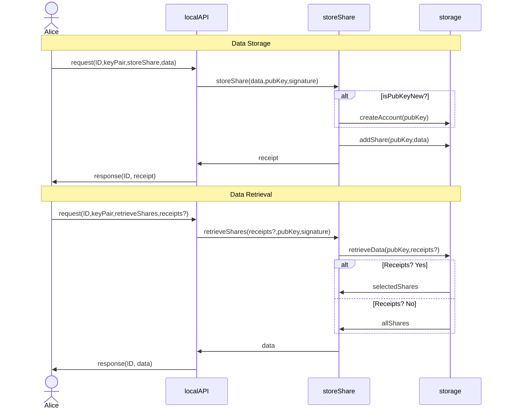
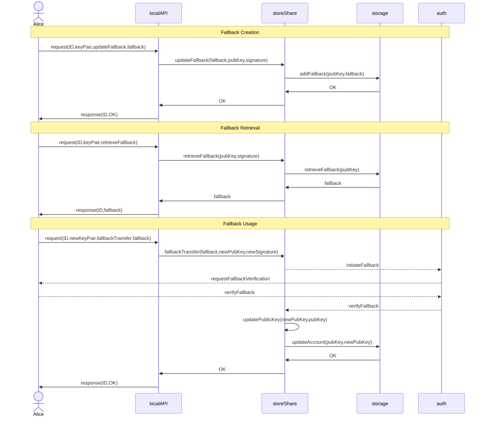
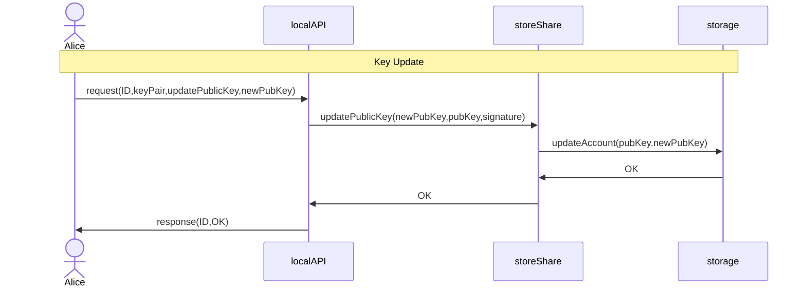
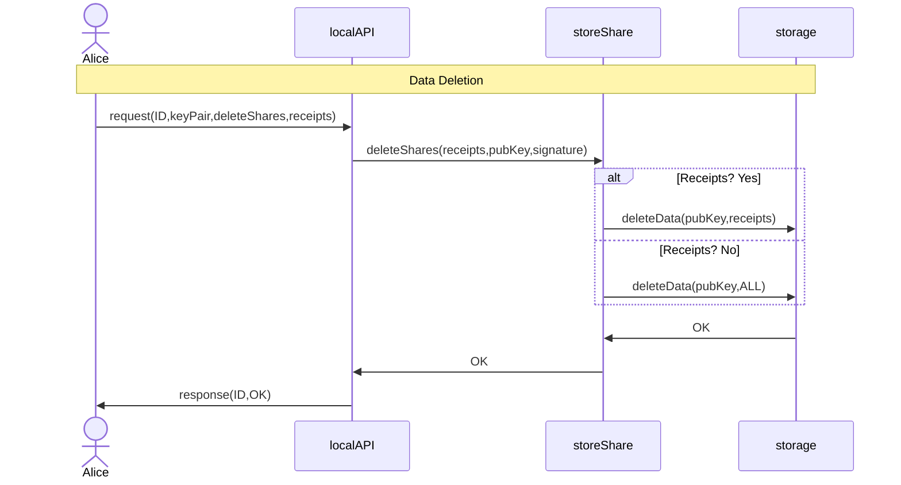
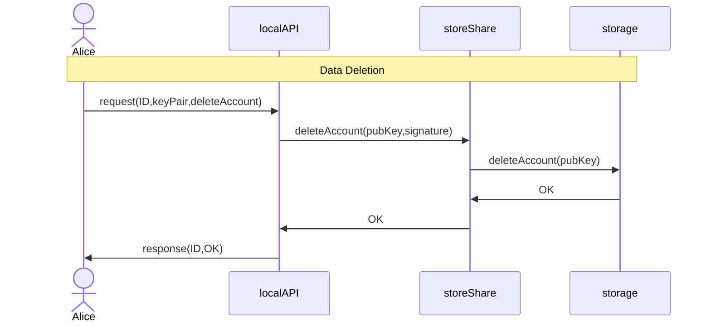

# Sequence Diagrams for CSR Share Servers

This set of exemplar sequence diagrams for a CSR Share Servers assumes the sample commands in [ExampleStore](https://github.com/BlockchainCommons/BCSwiftFoundation/blob/d355f0847d8bea9bac5fba8ddfdb8c29c281f9f7/Tests/BCFoundationTests/ExampleStore/ExampleStore.swift). It is not necessarily the only way to construct the flow of similar functions.

## I. Data Flow: Storing & Retrieving a Share

The standard data flow for a share server involves the storage of data and the later retrieval of that data.

## II. Data Flow: Establishing & Using Fallbacks

One of the [Gordian Principles](https://github.com/BlockchainCommons/Gordian#gordian-principles) is "resilience". In particular, making it hard for a user to lose their data is a core architectural requirement. For our CSR model, this is done via a fallback. This creates an additional data flow: the user may establish a fallback, and if they do and later lose their keypair, they may use the fallback to reset the keypair. 

It's vitally important that a user establish a fallback shortly after storing their initial data, because until they do, their keypair remains a Single Point of Failure (SPOF). Requiring a fallback, though technically optional, should thus be considered a step in the Data Flow immediately after Data Storage.

The `updatePublicKey` function can also be triggered directly by a user.

## IIIa. Data Flow: Deleting a Share

The lifecycle of a share in a share server usually ends with a deletion command.

This might be a deletion of some or all shares, which might occur prior to re-entry into the system with a new `storeShare` request.

## IIIb. Data Flow: Deleting an Account

Alternatively, a user might decide to delete their account with a share server entirely.

