# A Technical Introduction to Gordian Envelopes

Please see our [Introduction to Gordian Envelopes](Envelope-Intro.md) for our introductory discussion of what Gordian Envelopes are, why they're useful, and how they're used.

> Gordian Envelope is a specification for the achitecture of a “smart document". It supports the storage, backup, encryption, authentication, and transmission of data, with natively supported cryptography and explicit support for Merkle-based selective disclosure. It's designed to protect digital assets including seeds, keys, Decentralized Identifiers (DIDs), Verifiable Credentials (VCs), and Verifiable Presentations (VPs).

This document outlines the most important technical features of Gordian Envelopes in abstract Alice and Bob form. See our [Use Case Intro](Envelope-Use-Case-Intro.md) for more real-world focused designs.

## Envelope Structure

The Gordian Envelope is organized with semantic triples: subject-predicate-object. These are essentially statements such as "Alice Knows Bob". Given that Gordian Envelopes are designed to store and transmit digital assets they might actually be storage statements such as "Seed is XXX", credential statements such as "Bob is certified as a welder", or certification statements such as "This statement is certified by the Welder's Guild of Normal, Illinois".

Each envelope has one subject, but can have zero or more predicate-object pairs, which are called assertions.

_All examples in this overview are generated with [envelope-cli-swift](https://github.com/BlockchainCommons/envelope-cli-swift), using the `--mermaid` flag. The Reference App is suggested as an excellent way to further explore the technical details of Gordian Envelope. Please see the [Envelope-CLI Docs](https://github.com/BlockchainCommons/envelope-cli-swift/tree/master/Docs) for its usage._

Though an envelope can include just a Subject, the most basic example of a full semantic triple is:
```
"Alice" [
    "knows": "Bob"
]
```
In this case, "Alice" is the subject, while the predicate of "knows" and the object of "Bob" form an assertion.

Using `envelope-cli`, all Gordian Envelope output can be displayed in three forms. The standard text output is shown above. 

The `--tree` text output uses a different text formatting that also includes hashes:
```
e54d6fd3 NODE
    27840350 subj "Alice"
    55560bdf ASSERTION
        7092d620 pred "knows"
        9a771715 obj "Bob"
```
Finally the graphical `--mermaid` output also includes hashes, but it can get very large (and the text can get very tiny) for big trees:

(Most examples here and in the Use Cases doc that follows will use the default and mermaid outputs.)

Multiple assertions are possible:
```
"Alice" [
    "likes": "Bob"
    "hates": "Charlie"
]
```

However the abstract examples in this techinical overview will largely constrain themselves to a simple single-assertion envelope.

> _See the [Envelope Docs](https://github.com/BlockchainCommons/BCSwiftSecureComponents/tree/master/Docs) for more information on basic envelope structure, especially [02-Envelope](https://github.com/BlockchainCommons/BCSwiftSecureComponents/blob/master/Docs/02-ENVELOPE.md) and [03-Envelope-Notation](https://github.com/BlockchainCommons/BCSwiftSecureComponents/blob/master/Docs/03-ENVELOPE-NOTATION.md). Also see the [Envelope-CLI Docs](https://github.com/BlockchainCommons/envelope-cli-swift/tree/master/Docs), especially [01-Overview](https://github.com/BlockchainCommons/envelope-cli-swift/blob/master/Docs/1-OVERVIEW.md)._

## Sub Envelopes

Each element of a semantic triple can itself be an envelope. This allows for an infinitely recursive structure. 

One purpose of doing so is to allow for the inclusion of more metadata about any individual element (usually the subject or the object)

For example, the following shows a slightly more realistic usage of our abstract example, where Alice and Bob are actually represented by DIDs, which each contain more info on the user, including a user name and public keys that can be used to identify them:
```
{
    CID(d44c5e0a) [
        "userName": "Lil Alice"
        controller: CID(d44c5e0a)
        publicKeys: PublicKeyBase
    ]
} [
    "knows": CID(24b5b23d) [
        "userName": "Bob Bobbery"
        controller: CID(24b5b23d)
        publicKeys: PublicKeyBase
    ]
]
```

Obviously, this can grow increasingly complex:
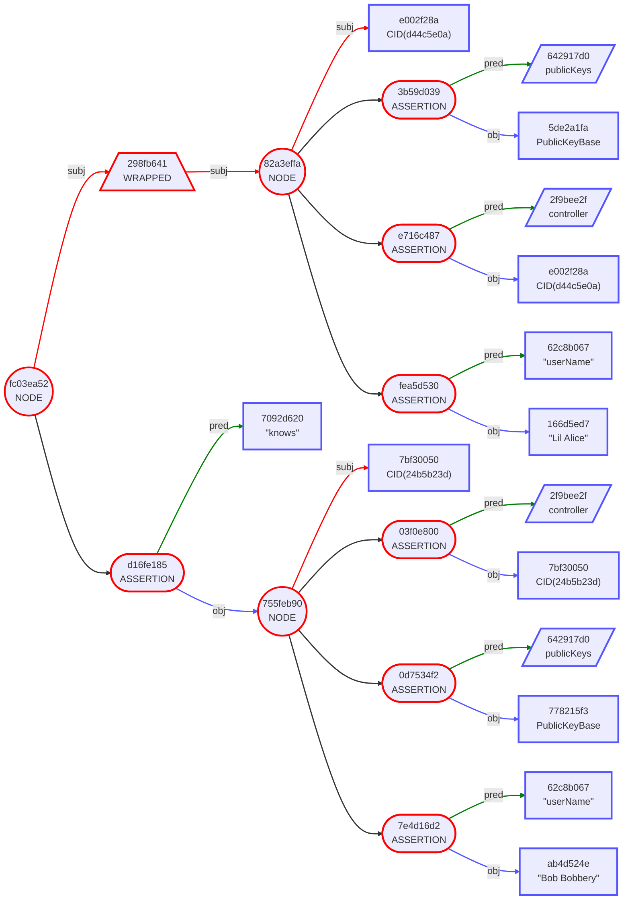

> _Complex metadata offers the best examples of sub-envelopes. See [the Metadata Example in the Envelope Docs](https://github.com/BlockchainCommons/BCSwiftSecureComponents/blob/master/Docs/07-EXAMPLES.md#example-10-complex-metadata) and [04-Metadata-Example](https://github.com/BlockchainCommons/envelope-cli-swift/blob/master/Docs/4-METADATA-EXAMPLE.md) in the Envelope-CLI docs._

## Wrapped Envelopes

In a semantic triple the assertion always refers to the subject. Multiple assertions _all_ refer to the same subject, such as the above example of Alice both liking Bob and hating Charlie. But what if you wanted an assertion to apply to an entire triple? For example, what if you wanted to say that Alice's knowing Bob was a fact that was known by Victor?

This **does not** do the job:
```
"Alice" [
    "knows": "Bob"
    "knownBy": "Victor"
]
```
That actually says that Alice knows Bob and that Alice is knownBy Victor. That's not the same thing at all!

In order to instead allow Victor to known about the other semantic triple requires the enclosure of the Alice-knows-Bob triple in a new envelope, which is then used as a subject that Victor can known. (As you should recall, _everything_, including the Subject, can be an envelope).

This is the other major use of sub-envelopes, but it's a common enough pattern that it has its own name: it's a "wrapped envelope".

Here's what that looks like:
```
{
    "Alice" [
        "knows": "Bob"
    ]
} [
    "knownBy": "Victor"
]
```
The use of wrapped envelopes makes Mermaid markup increasingly helpful:
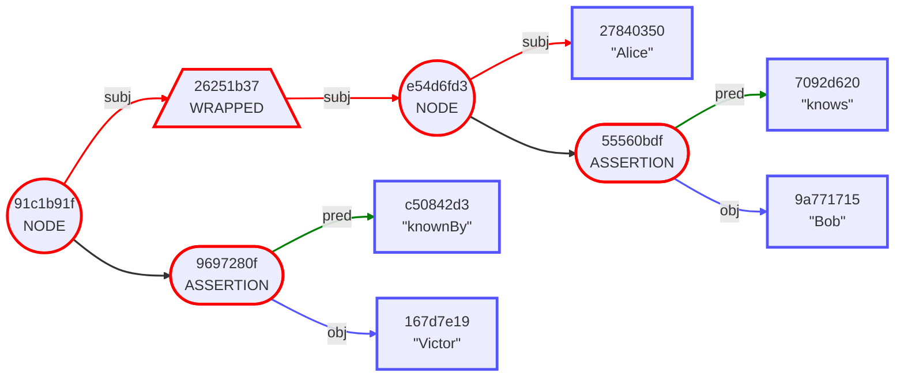
Because this makes it clear that the entire Alice-knows-Bob statement has been wrapped and that's what's `knownBy` Victor.

There are many different cases where applying an assertion to not just a subject but a full triple (that's been made into an envelope and then _used_ as a subject) is useful. One of those uses is a very common use case: signing.

## Signing Envelopes

One of the biggest advantages of wrapped envelopes is that you can use to allow someone to verify the entire assertion (or set of assertions) by using the wrapped envelope as a subject and applying a signature as an object using the "known" predicate of `verifiedBy`.

This is what that would look like:
```
{
    "Alice" [
        "knows": "Bob"
    ]
} [
    verifiedBy: Signature
]
```
Or alternatively:

These verifications can later be checked to ensure that the subject envelope is what was actually signed by the `verifiedBy` assertion.

More complexity is possible, for example by attaching additional information on who is doing the verifying:
```
{
    {
        "Alice" [
            "knows": "Bob"
        ]
    } [
        "verifierInfo": CID(d44c5e0a) [
            "trustedSource": "https://www.blockchaincommons.com/pki/d44c5e0a"
            "userName": "Lil Alice"
            controller: CID(d44c5e0a)
            publicKeys: PublicKeyBase
        ]
    ]
} [
    verifiedBy: Signature
]
```

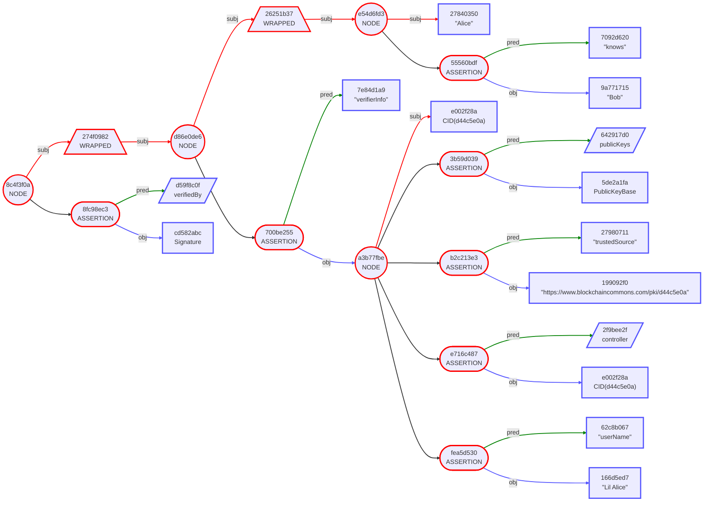
Here we see that the core Alice-knows-Bob information has been wrapped and `verifierInfo` has been attached to it, and then that has been wrapped and signed. Whew! 

(Obviously, care still needs to be taken, with the verifier having a high degree of responsibility: they need to make sure the verifierInfo is correct to know that the signature is meaningful! A `trustedSource` has been suggested as a root of truth, but even that needs to be taken with a grain of salt!)

> _Further examples of Signing, including Multi-Signing, can be found in the [Examples of the Envelope Docs](https://github.com/BlockchainCommons/BCSwiftSecureComponents/blob/master/Docs/07-EXAMPLES.md#example-2-signed-plaintext) and the [Examples of the Envelope-CLI Docs](https://github.com/BlockchainCommons/envelope-cli-swift/blob/master/Docs/2-BASIC-EXAMPLES.md#example-2-signed-plaintext)._

## Hashing Envelopes

The Mermaid examples in this introduction all include the first four bytes of a hash digest for each node. This is a standard feature of Gordian Envelope: its nested triples form a structured Merkle Tree. 

We use the phrase "structured Merkle Tree" because the structure is not quite the same as a pure Merkle Tree:

In a pure Merkle Tree, leaves are ordered sequence of objects (such as Bitcoin Transactions) that carry semantic content, with intenal nodes then being hashes of their child nodes. In Gordian Envelopes, each element in the tree instead has a digest made from its semantic content and the content of its children. 

In other words, every point in a Gordian Envelope that carries a digest *also* carries semantic content, while in a Merkle tree, *only* the leaves carry semantic content.

Hashes can be used to prove the contents of an Envelope and its sub-envelopes without necessarily revealing the contents. This becomes important for the last two major capabilities of Gordian Envelopes: elision and encryption.

## Eliding Envelopes

One of the biggest advances of Gordian Envelope is that it includes elision as a fundamental principle. Any element of an Envelope may be elided; the elision may be done by the Holder (not just an Issuer, as is the case with most extant credential data structures); and elision does not change the hashes of the Envelope.

Take as an example the signed Alice Knows Bob example:
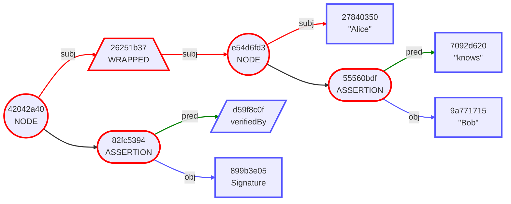

Note the hashes: `27840350` for Alice, `55560bdf` for the Knows-Bob Assertion, `e54d6fd3` for the overall Node, and `26251b37` for the Wrapped Envelope of that Node. (We're ignoring the `verifiedBy` assertion and also the overall node because signature hashes _will_ change every time they're signed, as a natural characteristic of how signing works: it has a random factor.)

We can elide everything but the signature and see that the hashing holds up:
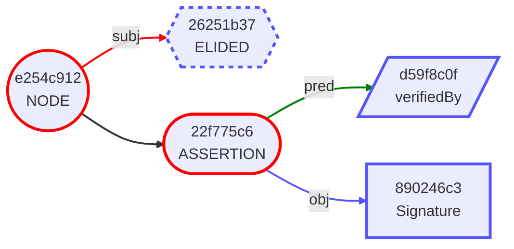
That `26251b37` was indeed the hash of the signed envelope that is currently elided.

As we reveal things step-by-step, known hashes appear, allowing for selective disclosure of exactly the material we want to reveal, while maintaining verifiability:
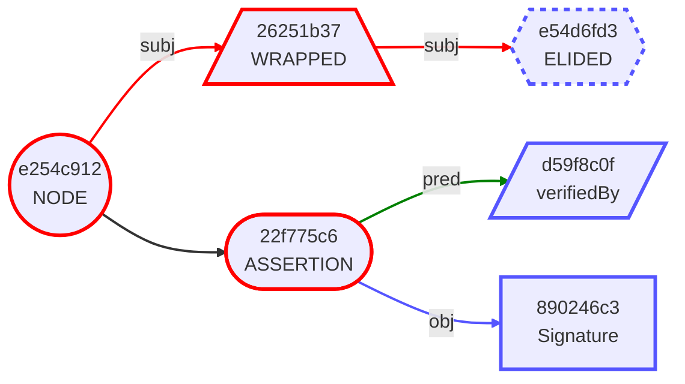

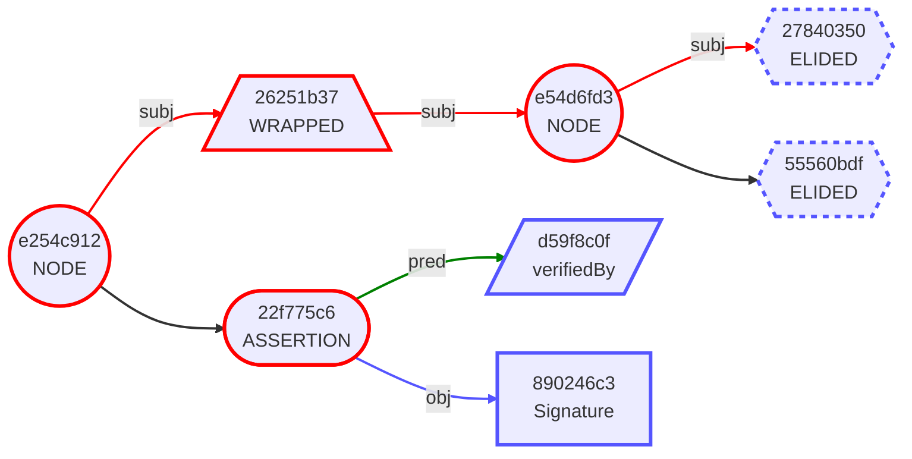
In this case, we might reveal that Alice is the subject of an assertion, without having to reveal the other half of the equation:
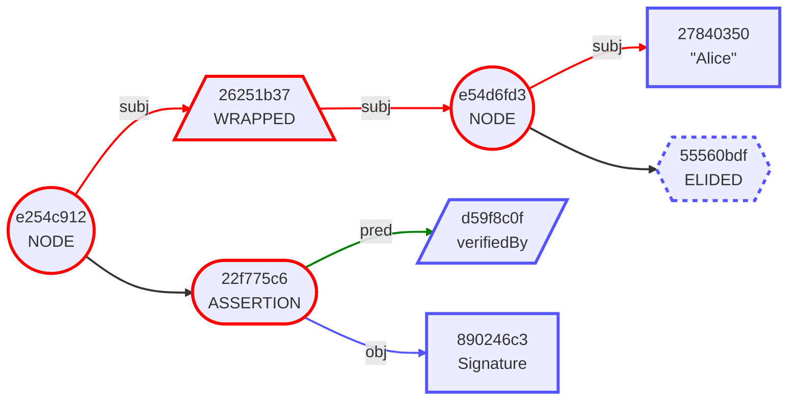
However, this example is obviously abstract, and intended mainly for its simplicity. In a more realistic case, a Gordian Envelope with multiple assertions would be partially elided to only reveal some of what it contains.

Remember Alice's two-part Envelope?

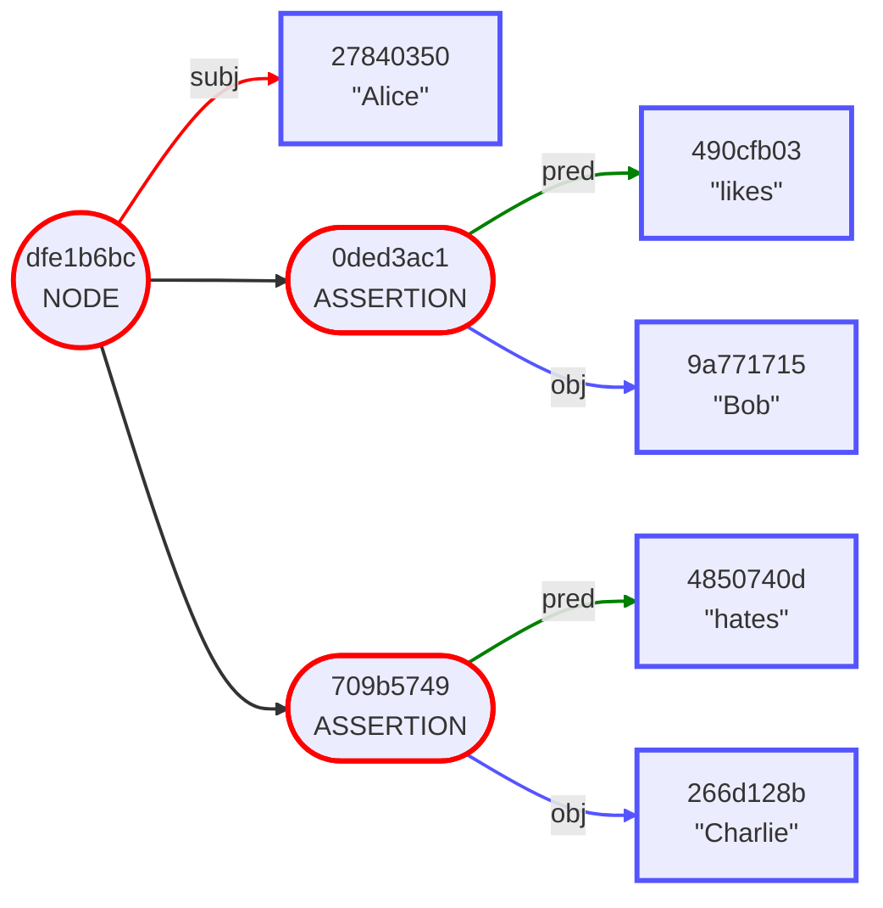
In this example, she might want to reveal that she likes Bob without revealing that she hates Charlie!
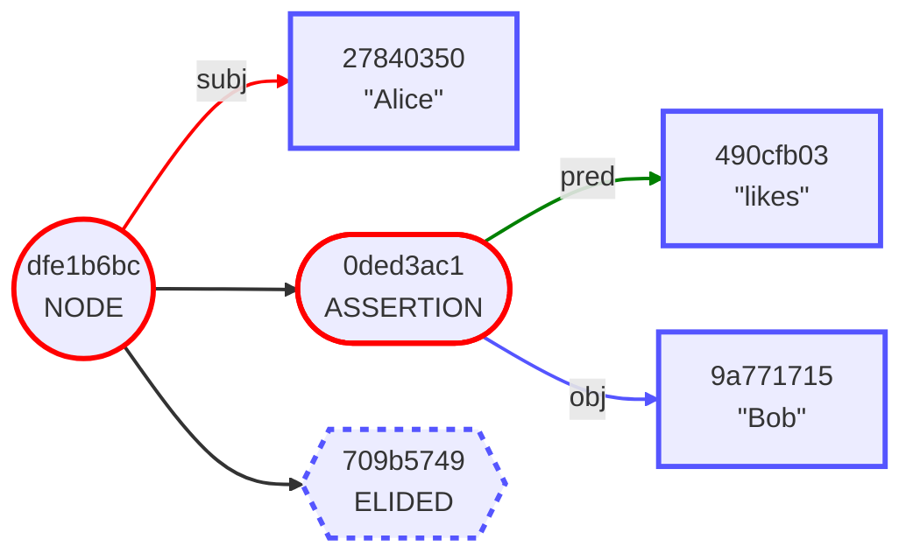
Again, note that all the hashes have stayed the same, even for the Elided branch and its parent.

To make this abstract example even more realistic, in the case of credentials the Holder could choose which credentials to share and which not to.

> _Further examples of redaction may be found in [09-Elision-Redaction](https://github.com/BlockchainCommons/BCSwiftSecureComponents/blob/master/Docs/09-ELISION-REDACTION.md) in the Envelope Docs and [07-VC-Elision-Example](https://github.com/BlockchainCommons/envelope-cli-swift/blob/master/Docs/7-VC-ELISION-EXAMPLE.md) in the Envelope-CLI docs._

## Encrypting Envelopes

Obviously, the critical tool in the Gordian-Envelope toolbox is encryption, as it allows for the protection of contents.

This penultimate example uses the old favorite:
```
"Alice" [
    "knows": "Bob"
]
```
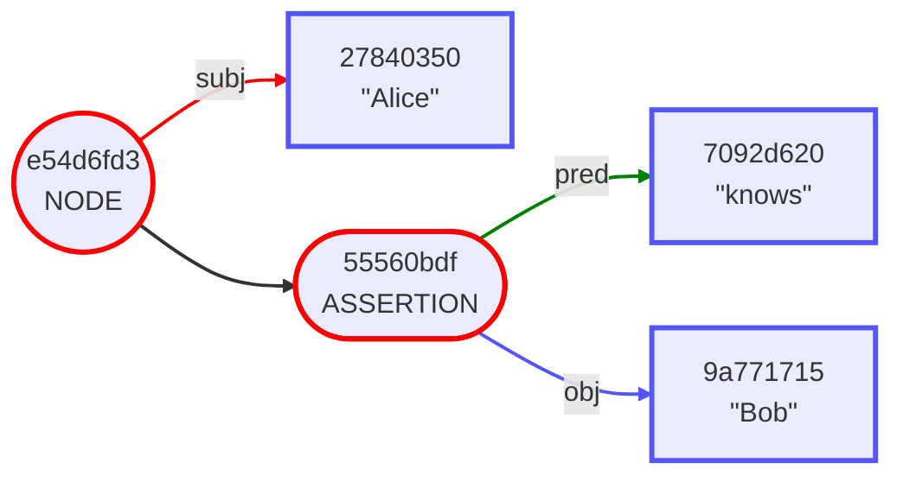

Just as with any assertion, encryption applies to the Subject. So the default application of Encryption on Alice-Knows-Bob would result in the following:
```
ENCRYPTED [
    "knows": "Bob"
]
```
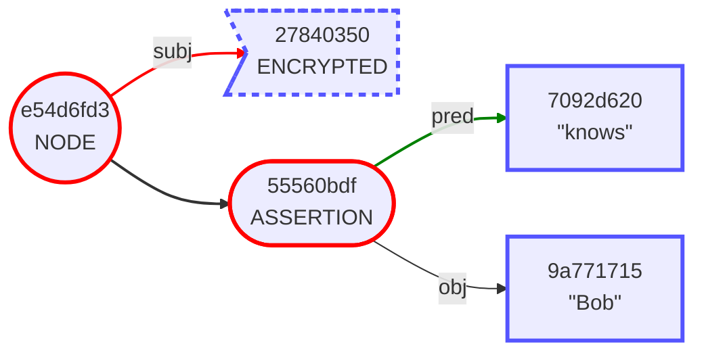
(Note once more than the hash of the root node stayed the same!)

The fact that only the subject is encrypted means that wrapping is again required if you want to encrypt the entire contents of an Envelope.

Wrapping results in:
```
{
    "Alice" [
        "knows": "Bob"
    ]
}
```
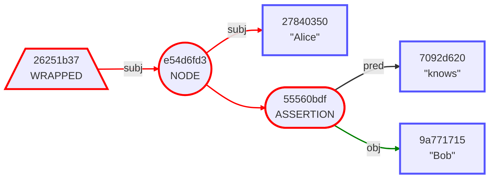
Then encrypting reduces that to:
```
ENCRYPTED
```
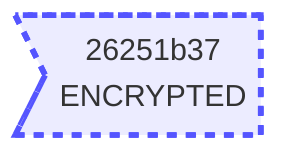

Which is probably what was intended in the first place!

There is a change in the hash from the standard Alice-Knows-Bob envelope, but that's because we're now seeing the hash of the wrapped envelope:


A wrapped, encrypted envelope can continue to be layered, for example by signing the encrypted data:
```
ENCRYPTED [
    verifiedBy: Signature
]
```
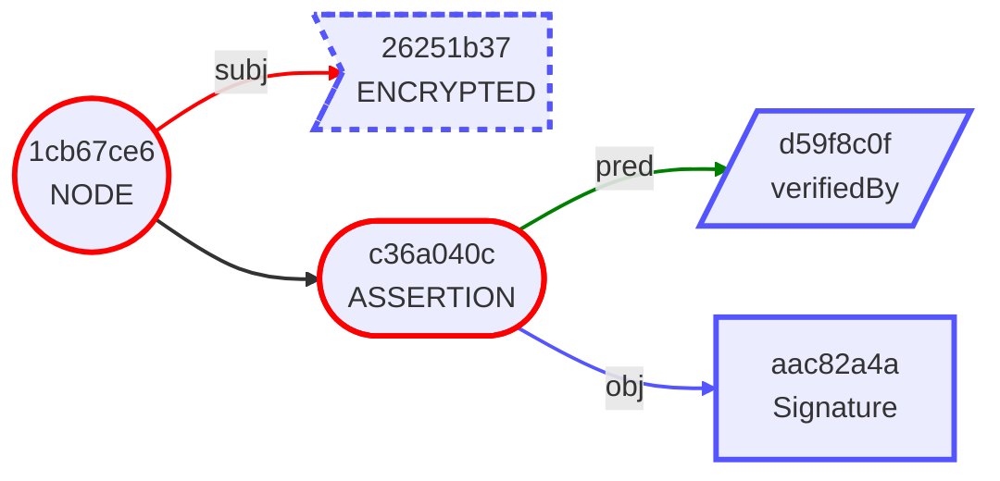
Once more, it's envelopes all the way down!

> _For further examples see [Symmetric Encryption](https://github.com/BlockchainCommons/BCSwiftSecureComponents/blob/master/Docs/07-EXAMPLES.md#example-4-symmetric-encryption) and additional examples in the Envelope Docs and [Symmetric Encryption](https://github.com/BlockchainCommons/envelope-cli-swift/blob/master/Docs/2-BASIC-EXAMPLES.md#example-4-symmetric-encryption) and additional examples in the Envelope-CLI docs._

## Salting Envelopes

The above examples on hashing, eliding, and encrypting all depend on selective correlation: we're using hashes to purposefully allow correlation, in order to suport the use of inclusion proofs or other means of selective disclosure.

This is _not_ always a desirable characteristic. If guesses can be made about the contents of elided or encrypted data, they can be solved! In situations where that is an issue, Gordian Envelope supports salting.

The methodology behind salting is simple: add a new assertion to an Envelope that contains `salt` as a predicate and a random number as an object.

This is particularly useful when adding it to a subject, predicate, or object that might be easily guessable and that you don't _want_ to be easily guessable. The subject, predicate, or object becomes an evelope containing salt as an assertion.

The following example shows a salt of the subject "Alice":
```
{
    "Alice" [
        salt: Salt
    ]
} [
    "knows": "Bob"
```
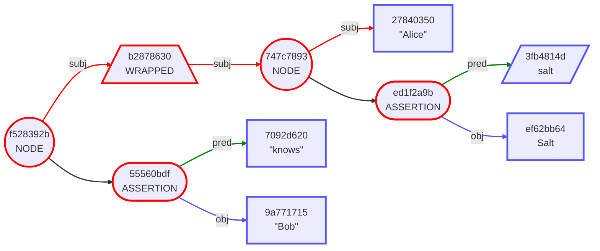
The standard hash of "Alice", `27840350`, is now replaced with a wrapped Envelope hash of `c0f5df62` thanks to the inclusion of salt. Where a brute-force search might be able to determine that Alice were `27840350` even when Alice was elided or encrypted, the same would not be true for the salted hash of `c0f5df62`.

Different use cases might require that selective correlation should either be used or foiled; salt is what makes the latter happen.

> For further examples see [08-Noncorrelation](https://github.com/BlockchainCommons/BCSwiftSecureComponents/blob/master/Docs/08-NONCORRELATION.md) in the Gordian Envelope docs.

## Final Notes

This technical introduction is intended to give a broad overview of the major capabilities of Gordian Envelopes with diagrams demonstrating what those Envelopes actually look like.

For further details please see the [Envelope Docs](https://github.com/BlockchainCommons/BCSwiftSecureComponents/tree/master/Docs) and if you are able, follow-along with the [Envelope-CLI Docs](https://github.com/BlockchainCommons/envelope-cli-swift/tree/master/Docs). Those documents provide _much_ more detail on all the examples here. In some cases the examples here were drawn from those docs.


