# Gordian Envelope Use Case: Self-Sovereign Control of Assets

The following set of use cases demonstrates how Gordian Envelopes can protect digital assets controlled in an individual, self-sovereign way. They are presented progressively: each use case builds on the previous one by demonstrating a new capability. They all refer to the same user (Sam) with the same self-sovereign storage needs.

Gordian Envelopes are powerful for the self-sovereign control of assets because they provide storage that is both resilient and secure. The security comes from the use of encryption in Envelopes while the resilience comes from Gordian Envelope's versatility in deciding what's encrypted and what's not, its ability to store high amounts of metadata, and its system of permits, which allow Envelopes to be opened in a wide variety of ways.

* [Part One: Simple Storage of Secrets](https://github.com/BlockchainCommons/Gordian/blob/master/Docs/Envelope-Use-Cases-Assets.md#part-one-simple-storage-of-secrets)
   * #1: [Sam Stores a Secret (Secure Storage with Metadata)](https://github.com/BlockchainCommons/Gordian/blob/master/Docs/Envelope-Use-Cases-Assets.md#1-sam-stores-a-secret-secure-storage-with-metadata)
   * #2: [Sam is Salty about Compliance (Non-Correlation)](https://github.com/BlockchainCommons/Gordian/blob/master/Docs/Envelope-Use-Cases-Assets.md#2-sam-is-salty-about-compliance-non-correlation)
   * #3: [Sam Gets Paranoid about Privacy (Wrapped Encryption)](https://github.com/BlockchainCommons/Gordian/blob/master/Docs/Envelope-Use-Cases-Assets.md#3-sam-gets-paranoid-about-privacy-wrapped-encryption)
* [Part Two: Raising Resilience of Restricted Results](https://github.com/BlockchainCommons/Gordian/blob/master/Docs/Envelope-Use-Cases-Assets.md#part-two-raising-resilience-of-restricted-results)
   * #4: [Sam Gets Rigorous about Resilience (SSKR Permit)](https://github.com/BlockchainCommons/Gordian/blob/master/Docs/Envelope-Use-Cases-Assets.md#4-sam-gets-rigorous-about-resilience-sskr-permit)
   * #5: [Sam Promotes a Partner (Multi-Permit)](https://github.com/BlockchainCommons/Gordian/blob/master/Docs/Envelope-Use-Cases-Assets.md#5-sam-promotes-a-partner-multi-permit)

## Part One: Simple Storage of Secrets

This first set of progressive use cases demonstrates how to store secret information, how to improve resilience with metadata, how to improve privacy with salting, and how to improve security with wrapped encryption.

### #1: Sam Stores a Secret (Secure Storage with Metadata)

> _Problem Solved:_ Sam wants to securely and resiliently store data that he personally controls.

Sam has too many keys! In order to organize them in a secure way, he plans to place each private key in an encrypted Gordian Envelope, indexed by the pubkey. But, he'll go beyond that and also add metadata to the secure storage mechanism; this will allow him to rebuild the private key if he loses the symmetric key he used to encrypt the Envelope!

The basic Gordian Envelope just combines the key's `xpub` as its subject with its `xprv` as an object:
```
"xpub6CiXsHfXkeXW2GBijsfihd64i8nebEWgxTxEq7j2ntT3GpyGKrP4v6dnz7ZNiZufVavY6pPwLTvdiUWSFD7tbCMpb3dvkpUqPiMdh4BRrso" [
    "xprv": "xprv9yjBTn8dvGyCon7Fdr8iLV9LA6xABmnqbF2e2jKREYv4Q2e7nK4pNJKK8qrLMJNKHrNTyHUatP7TepCeTHPWv64HQShKfy6eNxUzDgStSBg"
]
```
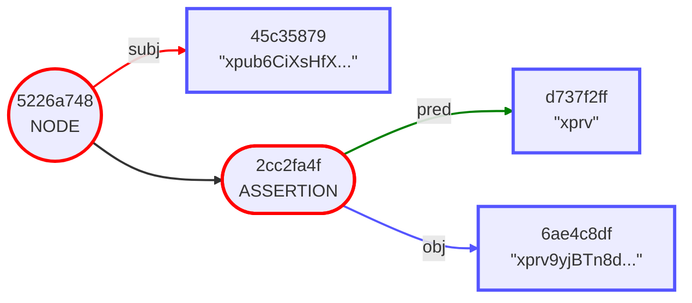
Sam is planning to encrypt this private-key information with a single symmetric-encryption key, and he's aware of the dangers that causes for resilience: the symmetric key becomes a Single Point of Failure. 

He can't get around that (yet) but he can use the structure of the Envelope to offer _other_ ways to rebuild his private keys. He adds a metadata hint to each Envelope: the `derivationPath` and the `seedDigest` of the seed used to create the keys. He does this by turning the `xprv` object into a new envelope containing the additional information as assertions.

```
"xpub6CiXsHfXkeXW2GBijsfihd64i8nebEWgxTxEq7j2ntT3GpyGKrP4v6dnz7ZNiZufVavY6pPwLTvdiUWSFD7tbCMpb3dvkpUq…" [
    "xprv": "xprv9yjBTn8dvGyCon7Fdr8iLV9LA6xABmnqbF2e2jKREYv4Q2e7nK4pNJKK8qrLMJNKHrNTyHUatP7TepCeTHPWv64HQShKfy6e…" [
        "derivationPath": "m/44h/0h/0h"
        "seedDigest": "d5377c9d8a2d064dc8e83d6c3557c6b0"
    ]
]
```
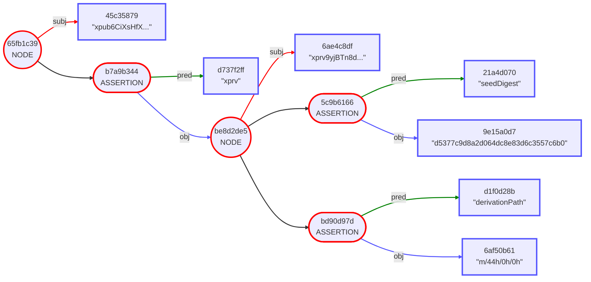
With that done, he encrypts the `xprv` key with his symmetric key. 
```
"xpub6CiXsHfXkeXW2GBijsfihd64i8nebEWgxTxEq7j2ntT3GpyGKrP4v6dnz7ZNiZufVavY6pPwLTvdiUWSFD7tbCMpb3dvkpUq…" [
    "xprv": ENCRYPTED [
        "derivationPath": "m/44h/0h/0h"
        "seedDigest": "d5377c9d8a2d064dc8e83d6c3557c6b0"
    ]
]
```

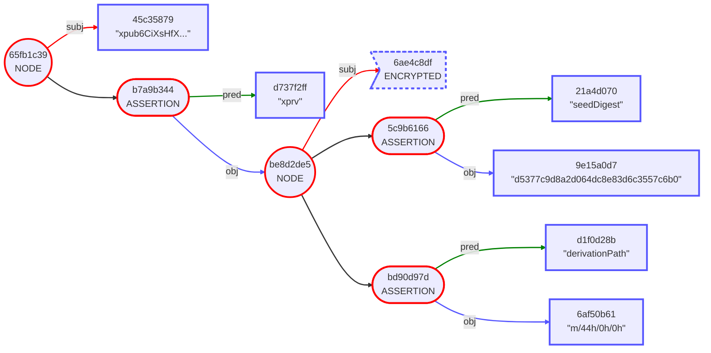
Now, Sam can rapidly look up his many `xprvs` through their `xpubs` while storing them securely. If he ever loses the symmetric key that he used to encrypt his Gordian Envelopes, he can regenerate the private keys from the separately stored seeds, based on the `seedDigest` and `derivationPath` information.

### #2. Sam is Salty about Compliance (Non-Correlation)

> _Problem Solved:_ Sam needs to avoid potential correlation of his data through hashes when selective disclosure is required.

Sam foresees a near-future where compliance regulations will require him to prove ownership of his private key. This will likely require selective disclosure. Sam is worried about the possibility of correlation for the additional data he's stored in his Gordian Envelope, even when it's elided.

The problem is that standard word like "derivationPath" or "seedDigest" or "m/44h/0h/0h" might be guessable by brute-forcing against the hash of the data. Fortunately, the problem is solvable by adding salt to those three elements. This adds a large random number as an assertion for each standard words. They can no longer be guessed. Even if their hashes need to be revealed as part of a compliance disclosure, the contents will remain secret.

```
"xpub6CiXsHfXkeXW2GBijsfihd64i8nebEWgxTxEq7j2ntT3GpyGKrP4v6dnz7ZNiZufVavY6pPwLTvdiUWSFD7tbCMpb3dvkpUq…" [
    "xprv": "xprv9yjBTn8dvGyCon7Fdr8iLV9LA6xABmnqbF2e2jKREYv4Q2e7nK4pNJKK8qrLMJNKHrNTyHUatP7TepCeTHPWv64HQShKfy6e…" [
        "derivationPath" [
            salt: Salt
        ]
        : "m/44h/0h/0h" [
            salt: Salt
        ]
        "seedDigest" [
            salt: Salt
        ]
        : "d5377c9d8a2d064dc8e83d6c3557c6b0"
    ]
]
```
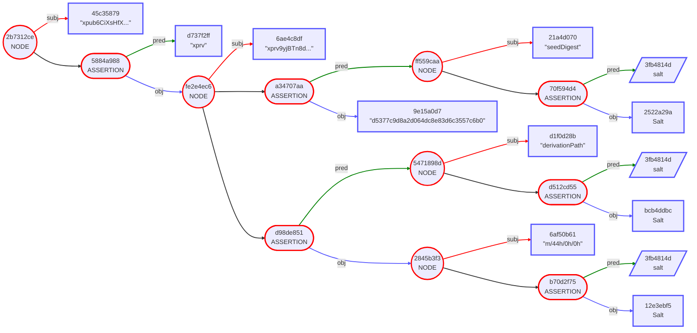

### #3. Sam Gets Paranoid about Privacy (Wrapped Encryption)

> _Problem Solved:_ Sam wants to add additional security and privacy, even if there is a cost.

SmartCustody is a constant battle between resilience and security. A few years later, Sam is rolling in the cryptocurrency earnings and decides that maybe he doesn't want his key derivation information sitting in plain sight. So, he adjusts all of his envelopes to allow the encryption of _everything_. 

This requires "wrapping" the `xprv` information from the previous envelope, which means encapsulating it, and storing it as the subject of a new envelope. Encryption is an assertion, which means that it applies only to a subject. Previously that subject was just the `xprv`, but now it's the `xprv` and its subsidiary information.

(In the process of this adjusment, Sam also removes the salts he previously added, since eliding of the additional data is no longer an issue, and it makes the example clearer.)

Here's what the Gordian Envelope looked like originally:
```
"xpub6CiXsHfXkeXW2GBijsfihd64i8nebEWgxTxEq7j2ntT3GpyGKrP4v6dnz7ZNiZufVavY6pPwLTvdiUWSFD7tbCMpb3dvkpUq…" [
    "xprv": "xprv9yjBTn8dvGyCon7Fdr8iLV9LA6xABmnqbF2e2jKREYv4Q2e7nK4pNJKK8qrLMJNKHrNTyHUatP7TepCeTHPWv64HQShKfy6e…" [
        "derivationPath": "m/44h/0h/0h"
        "seedDigest": "d5377c9d8a2d064dc8e83d6c3557c6b0"
    ]
]
```
Here it is with the `xprv` information wrapped:
```
"xpub6CiXsHfXkeXW2GBijsfihd64i8nebEWgxTxEq7j2ntT3GpyGKrP4v6dnz7ZNiZufVavY6pPwLTvdiUWSFD7tbCMpb3dvkpUq…" [
    "xprv": {
        "xprv9yjBTn8dvGyCon7Fdr8iLV9LA6xABmnqbF2e2jKREYv4Q2e7nK4pNJKK8qrLMJNKHrNTyHUatP7TepCeTHPWv64HQShKfy6e…" [
            "derivationPath": "m/44h/0h/0h"
            "seedDigest": "d5377c9d8a2d064dc8e83d6c3557c6b0"
        ]
    }
]
```
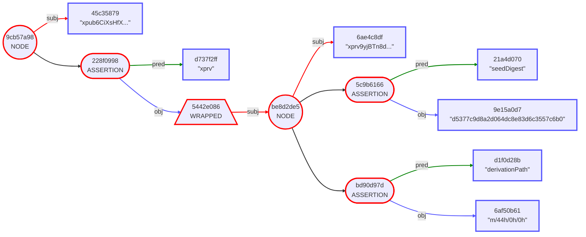
Now, when Sam encrypts his data, he will encrypt everything within the envelope, not just the `xprv` itself.

```
"xpub6CiXsHfXkeXW2GBijsfihd64i8nebEWgxTxEq7j2ntT3GpyGKrP4v6dnz7ZNiZufVavY6pPwLTvdiUWSFD7tbCMpb3dvkpUq…" [
    "xprv": ENCRYPTED
]
```
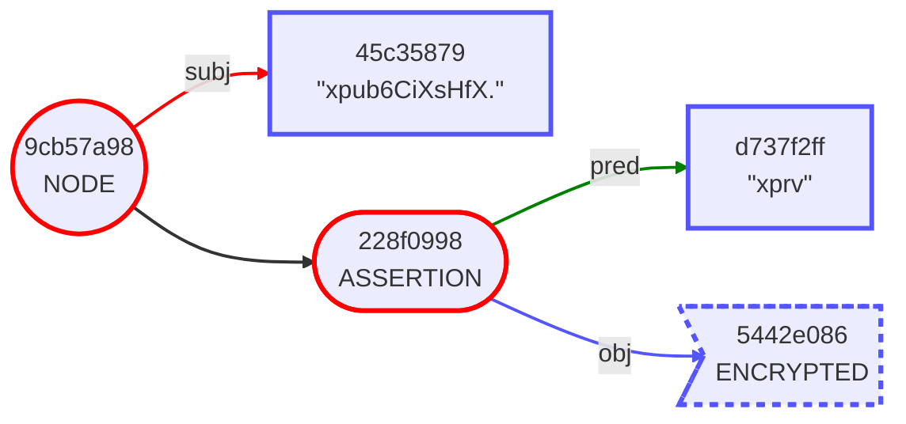
Of course, if Sam loses the symmetric key used to encrypt his  Gordian Envelope without any metadata backup, he's going to have a very bad day ...

## Part Two: Raising Resilience of Restricted Results

The second set of progressive use cases continues Sam's story, but demonstrates how to improve resilience when metadata can't be used, using either SSKR shares or multi-permits.

### #4. Sam Gets Rigorous about Resilience (SSKR Permit)

> _Problem Solved:_ Sam wants to improve the resilience of his secrets by allowing for the possibility that some keys might be lost.
  
Sam's private key envelopes should provide good resilience. Unless he gets paranoid about privacy, they each contain metadata hints on how to regenerate that key from its seed. Even if he loses the symmetric key to an envelope's permit, he has enough information to rebuild the content by other means.

Sam will not have the same luxury with the envelopes that contain his seeds, especially since they must adhere to a very high level of security since they're the ultimate source of all his keys. He needs a new methodology for resilience: he thus chooses to lock his seed envelopes with Shamir's Secret Sharing, using the SSKR library.

Sam starts with the following seed:
```
HEX: 3f706e65f830bac081faafbb93730d3b
DIGEST: 651e44509ca8c719d25169f7e5e67d328e15007e171e1df2968b4a806d74984f

ur:crypto-seed/oyadgdfhjojtihyadyrdrtlyzsperkmujkbtfrhetehdax
```

Sam puts the UR version of the seed in an envelope indexed by the seed digest:

```
"651e44509ca8c719d25169f7e5e67d328e15007e171e1df2968b4a806d74984f" [
    "seed": "ur:crypto-seed/oyadgdfhjojtihyadyrdrtlyzsperkmujkbtfrhetehdax"
]
```
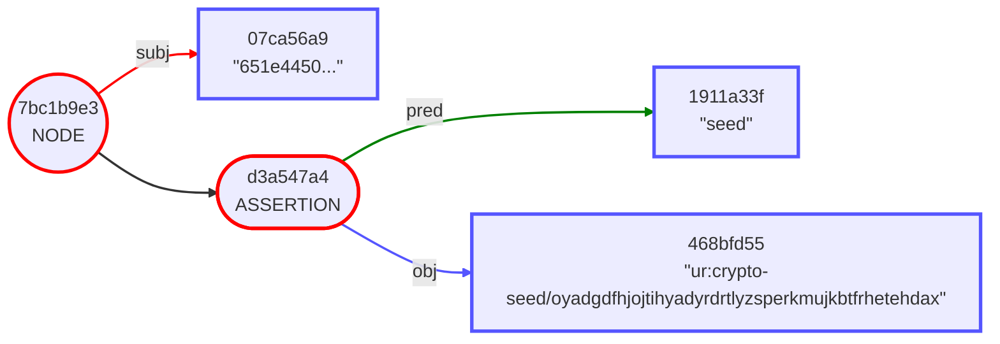
Sam then shards the envelope with SSKR. This is a four-part process:
1. Wrap the envelope.
2. Encrypt the envelope.
3. Shard the encryption key into multiple shares.
4. Attach each shard to a separate version of the encrypted data as an assertion.

Here is what Sam's wrapped envelope looks like:
```
{
    "651e44509ca8c719d25169f7e5e67d328e15007e171e1df2968b4a806d74984f" [
        "seed": "ur:crypto-seed/oyadgdfhjojtihyadyrdrtlyzsperkmujkbtfrhetehdax"
    ]
}
```
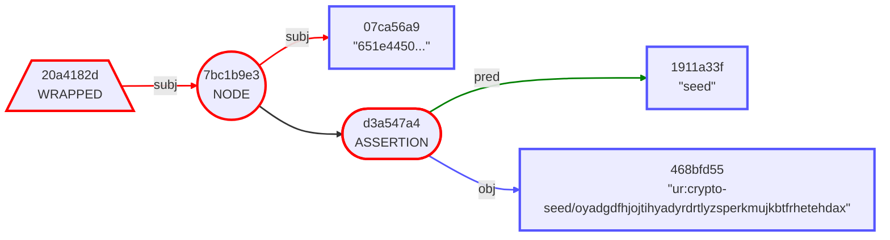
Here is the encrypted envelope:
```
ENCRYPTED
```
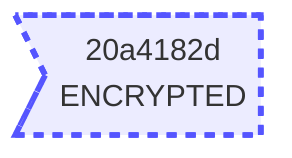
Here is the envelope once it's been matched up with an SSKR share:
```
ENCRYPTED [
    sskrShare: SSKRShare
]
```
There are actually three versions of this envelope, each containing a share of the encryption key. Because he did a 2-of-3 sharding, Sam can recover the encrypted contents with any two different versions of the envelope.

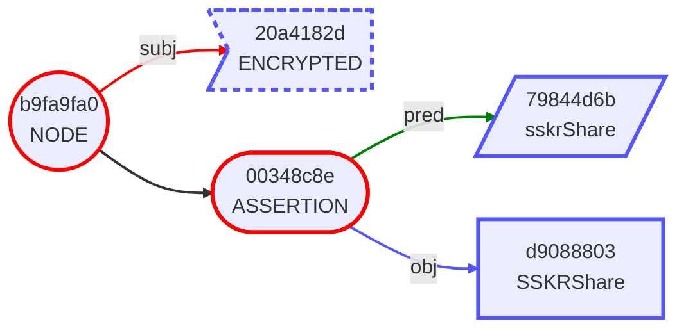


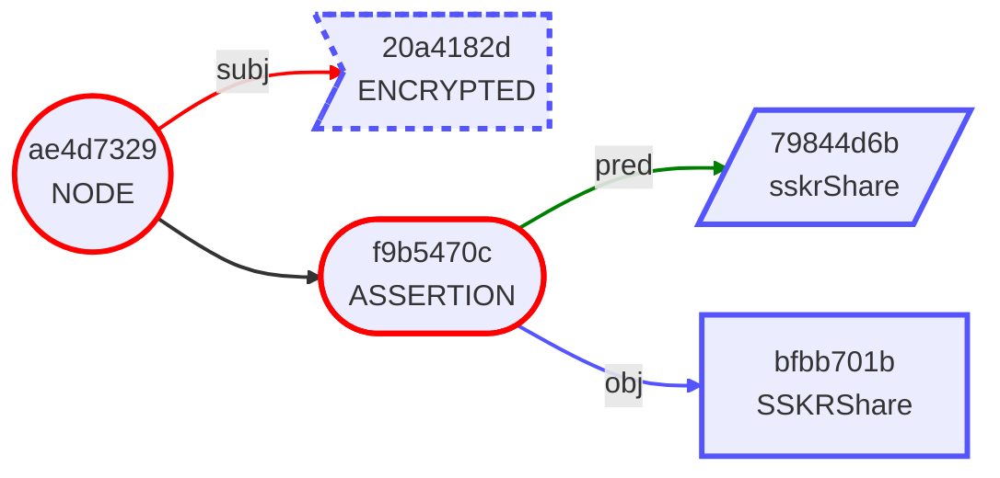
Note that all three Gordian Envelopes have the exact same encrypted data, whose hash matches the wrapped information that Sam is storing, but that they each contain a different SSKRshare, as shown by that hash.

Sam stores one copy of his share at home, one at his bank, and one at work. If he ever loses the seed, he can restore it by bringing any two of these shares together.

_See [02-SSKR-Example](https://github.com/BlockchainCommons/envelope-cli-swift/blob/master/Docs/3-SSKR-EXAMPLE.md) in the Envelope-CLI docs for an example of how to produce SSKR shared Envelopes with the CLI._

### #5. Sam Promotes a Partner (Multi-permit)

> _Problem Solved:_ Sam wants to give someone else access to his digital assets, without affecting his current resilient setup.

Sam takes on a partner: his lovely wife, Sophia. He now wants to make it easy for her to recover his funds if something happens to him. To do so, he rerolls his envelope with a second permit. It can still be opened with SSKR shares (which must be regenerated as part of the process), but now the envelope is also locked with Sophia's public key, which allows her to open it with her private key.

The three sharded Envelopes are created in the same way as when Sam just locked them with his SSKR shares, but now when the encryption occurs, a second assertion is added to each envelope, `hasRecipient`:
```
ENCRYPTED [
    hasRecipient: SealedMessage
    sskrShare: SSKRShare
]
```

As usual, the Mermaid output shows a bit of actual detail. Not only is the `sskrShare` different for each envelope, but so is each `sealedMessage`.


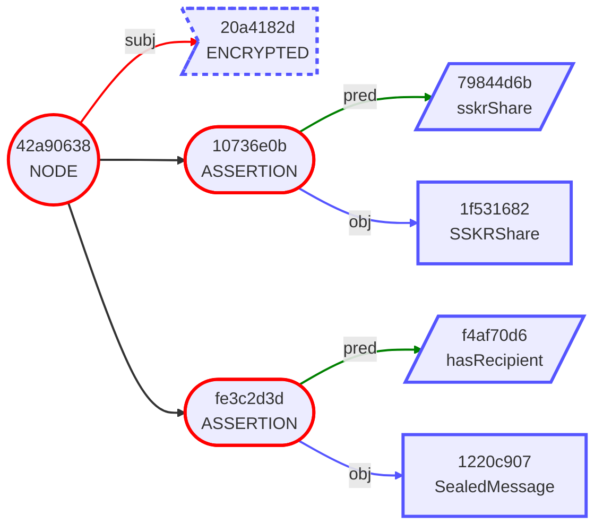

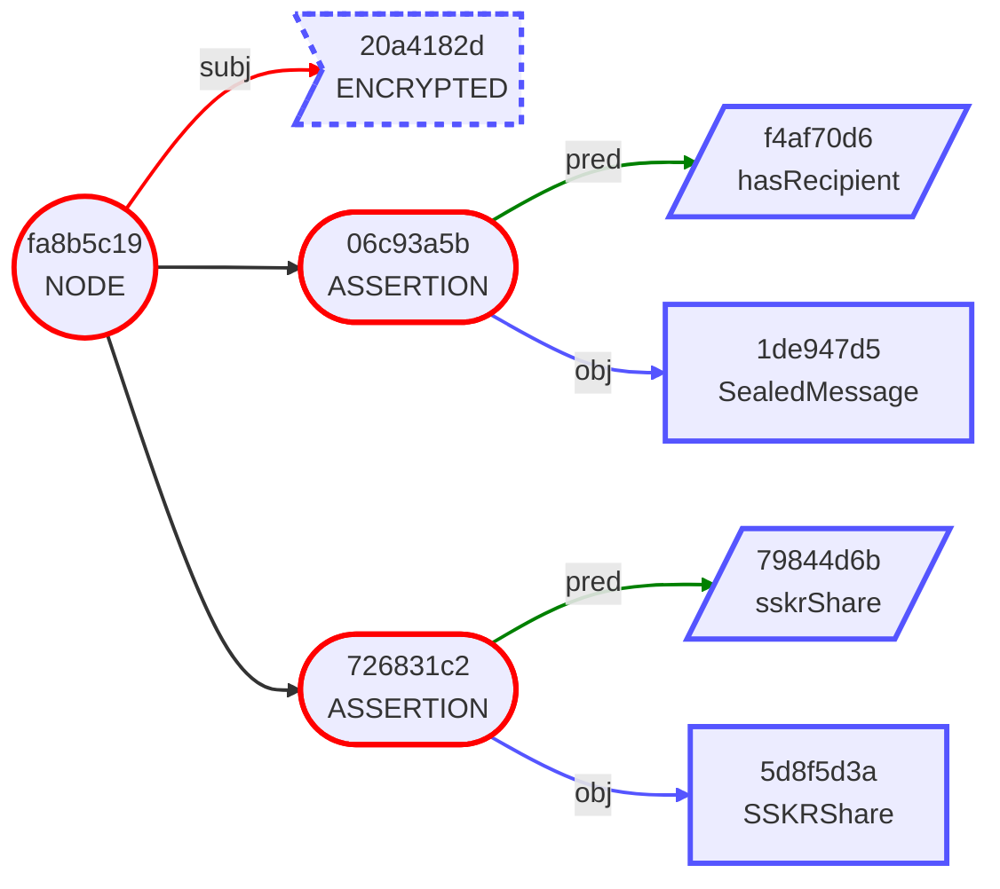
That's because the creation of the `SealedMessage` is a multi-part process. The major steps are:

1. Randomly generate a nonce.
2. Encrypt the symmetric key used to encrypt the Envelope using the recipient's public key and the nonce.
3. Store the encrypted key and the nonce in a `crypto-message`](https://github.com/BlockchainCommons/Research/blob/master/papers/bcr-2022-001-secure-message.md#cddl-for-secure-message)

It's the usage of a nonce in each encryption that causes the `SealedMessage` for each share of the Envelope to vary.

Now, Sam can feel increasingly comfortable about the resilience of his envelope, knowing that not only can he recover it by putting together SSKR shares, but that his wife can recover it as well, using her private key (which presumably is protected from both compromise and failure using its own #SmartCustody methodology).

### Related

* [02-SSKR-Example](https://github.com/BlockchainCommons/envelope-cli-swift/blob/master/Docs/3-SSKR-EXAMPLE.md) in the Envelope-CLI docs for an example of how to produce SSKR shared Envelopes with the CLI. The example includes a multi-permit envelope.
* [Other Envelope Use Cases](https://github.com/BlockchainCommons/Gordian/blob/master/Docs/Envelope-Intro.md#usage-of-envelopes)

