# Gordian Envelope Use Cases: Data Distribution

...

## Data Use Case Table of Contents

...

## Part One: Public Crypt-Finger

This first set of use cases lays out entirely public use cases of Gordian Envelope for data distribution, where everything is seen by all parties. It includes: how to create basic (structured) information, how to make that data verifiable, and how to timestamp that data.

### #1: Carmen Makes Basic Info Available (Structured Data)

> _Problem Solved:_ Carmen wants to make basic user information available in a structured way.

Carmen has used the internet long enough that she used to `finger` internet users to find basic information about them. Now she uses [WebFinger](https://www.rfc-editor.org/rfc/rfc7033) for even more details. However, she wants to be able to release her information in a more modular, privacy-preserving way. Thus, she begins to design "CryptFinger".

The foundational design of CryptFinger isn't that different from WebFinger. It will allow her to reveal data about a user in a structured way. The benefits of using CryptFinger over WebFinger will come as she begins to use privacy-preserving techniques of authentication, elision, and proofs.

When a user wants to find out information about `carmen@cryptfinger.com` they contact the `cryptfinger.com` cryptfinger server and request information about here:
```
"carmen@cryptfinger.com" [
    "alias": "admin@cryptfinger.com"
    "alias": "carmen@blockchaincommons.com"
    "alias": "carmen@mycarmentsite.com"
    "cid": "ur:crypto-cid/hdcxrtgorddsrnfmryleehhnfmynylnecwldpapafskphsgwfgmdgwmusthlzecfltiosskorers"
    "hasPublication": "Cryptfinger Design Notes" [
        "pubdate": "2022-10-11"
        "url": "https://blockchaincommons.com/design-notes/cryptfinger.html"
        "version": "1.3.1"
        isA: "non-fiction article"
    ]
    "hasPublication": "Zen and the Art of Cryptfinger Design" [
        "ISBN-13": "978-1-04-876475-8"
        "hasTranslation": "Zen y el arte del diseño Cryptfinger" [
            "ISBN-13": "978-0-421-94892-1"
            "language": "es"
            "pubDate": "2022-02-22"
            isA: "non-fiction book"
        ]
        "language": "en"
        "pubDate": "2022-01-17"
        isA: "non-fiction book"
    ]
    "phoneNumber": "510-555-0143"
    "pubkey": "ur:crypto-pubkeys/lftaaosehdcxwpjnrpftbdbbnlmdpsvtrllpchlomeutbzrhcxdputiarhlrtpfhsaiygdayzswetpvahd…"
]
```

```mermaid
graph LR
    1(("f5bea12d<br/>NODE"))
    2["4f59e396<br/>#quot;carmen@cryptfinger.com#quot;"]
    3(["0595bb3a<br/>ASSERTION"])
    4["4e7cdd69<br/>#quot;alias#quot;"]
    5["09cfa295<br/>#quot;carmen@mycarmentsite.com#quot;"]
    6(["152f509c<br/>ASSERTION"])
    7["7ed9572e<br/>#quot;hasPublication#quot;"]
    8(("2c51cecb<br/>NODE"))
    9["14dce19e<br/>#quot;Zen and the Art of Cryptfinger Design#quot;"]
    10(["18048890<br/>ASSERTION"])
    11["c91b36b2<br/>#quot;pubDate#quot;"]
    12["ae96f205<br/>#quot;2022-01-17#quot;"]
    13(["76f63c9c<br/>ASSERTION"])
    14["0846979e<br/>#quot;language#quot;"]
    15["409b5893<br/>#quot;en#quot;"]
    16(["7c4c63e7<br/>ASSERTION"])
    17["d41c6a7e<br/>#quot;hasTranslation#quot;"]
    18(("8dc1f383<br/>NODE"))
    19["91ee71f8<br/>#quot;Zen y el arte del diseño Cryptfinger#quot;"]
    20(["23335db9<br/>ASSERTION"])
    21["c91b36b2<br/>#quot;pubDate#quot;"]
    22["c4f05fb4<br/>#quot;2022-02-22#quot;"]
    23(["2c5d3a5f<br/>ASSERTION"])
    24["10a46e16<br/>#quot;ISBN-13#quot;"]
    25["4ed1acab<br/>#quot;978-0-421-94892-1#quot;"]
    26(["9db68d01<br/>ASSERTION"])
    27["0846979e<br/>#quot;language#quot;"]
    28["dd2f866d<br/>#quot;es#quot;"]
    29(["bcf92721<br/>ASSERTION"])
    30[/"8982354d<br/>isA"/]
    31["fde87c34<br/>#quot;non-fiction book#quot;"]
    32(["bcf92721<br/>ASSERTION"])
    33[/"8982354d<br/>isA"/]
    34["fde87c34<br/>#quot;non-fiction book#quot;"]
    35(["e0afce84<br/>ASSERTION"])
    36["10a46e16<br/>#quot;ISBN-13#quot;"]
    37["18e2fcf5<br/>#quot;978-1-04-876475-8#quot;"]
    38(["320d0c70<br/>ASSERTION"])
    39["bf9638d1<br/>#quot;phoneNumber#quot;"]
    40["48af8880<br/>#quot;510-555-0143#quot;"]
    41(["366c06f1<br/>ASSERTION"])
    42["7ed9572e<br/>#quot;hasPublication#quot;"]
    43(("3b6cf8f0<br/>NODE"))
    44["8edf5b50<br/>#quot;Cryptfinger Design Notes#quot;"]
    45(["3a9a5b75<br/>ASSERTION"])
    46["0e0066da<br/>#quot;pubdate#quot;"]
    47["54ac7f35<br/>#quot;2022-10-11#quot;"]
    48(["4514d304<br/>ASSERTION"])
    49["b22687d9<br/>#quot;version#quot;"]
    50["b94ba9a2<br/>#quot;1.3.1#quot;"]
    51(["87b4fe55<br/>ASSERTION"])
    52[/"8982354d<br/>isA"/]
    53["8c645acc<br/>#quot;non-fiction article#quot;"]
    54(["da22ca9e<br/>ASSERTION"])
    55["7fce2d08<br/>#quot;url#quot;"]
    56["fda96fd7<br/>#quot;https://blockchaincommons.com/design-notes/cryptfinger.html#quot;"]
    57(["58711216<br/>ASSERTION"])
    58["97dc30c5<br/>#quot;cid#quot;"]
    59["601a1a59<br/>#quot;ur:crypto-cid/hdcxrtgorddsrnfmryleehhnfmynylnecwldpapafskphsgwfgmdgwmusthlzecfltiosskorers#quot;"]
    60(["77c587c5<br/>ASSERTION"])
    61["d52596f8<br/>#quot;pubkey#quot;"]
    62["a1163580<br/>#quot;ur:crypto-pubkeys/lftaaosehdcxwpjnrpftbdbbnlmdpsvtrllpchlomeutbzrhcxdputiarhlrtpfhsaiygdayzswetpvahd…#quot;"]
    63(["aff1bb37<br/>ASSERTION"])
    64["4e7cdd69<br/>#quot;alias#quot;"]
    65["3bc0d518<br/>#quot;admin@cryptfinger.com#quot;"]
    66(["ba480823<br/>ASSERTION"])
    67["4e7cdd69<br/>#quot;alias#quot;"]
    68["37f5a7a1<br/>#quot;carmen@blockchaincommons.com#quot;"]
    1 -->|subj| 2
    1 --> 3
    3 -->|pred| 4
    3 -->|obj| 5
    1 --> 6
    6 -->|pred| 7
    6 -->|obj| 8
    8 -->|subj| 9
    8 --> 10
    10 -->|pred| 11
    10 -->|obj| 12
    8 --> 13
    13 -->|pred| 14
    13 -->|obj| 15
    8 --> 16
    16 -->|pred| 17
    16 -->|obj| 18
    18 -->|subj| 19
    18 --> 20
    20 -->|pred| 21
    20 -->|obj| 22
    18 --> 23
    23 -->|pred| 24
    23 -->|obj| 25
    18 --> 26
    26 -->|pred| 27
    26 -->|obj| 28
    18 --> 29
    29 -->|pred| 30
    29 -->|obj| 31
    8 --> 32
    32 -->|pred| 33
    32 -->|obj| 34
    8 --> 35
    35 -->|pred| 36
    35 -->|obj| 37
    1 --> 38
    38 -->|pred| 39
    38 -->|obj| 40
    1 --> 41
    41 -->|pred| 42
    41 -->|obj| 43
    43 -->|subj| 44
    43 --> 45
    45 -->|pred| 46
    45 -->|obj| 47
    43 --> 48
    48 -->|pred| 49
    48 -->|obj| 50
    43 --> 51
    51 -->|pred| 52
    51 -->|obj| 53
    43 --> 54
    54 -->|pred| 55
    54 -->|obj| 56
    1 --> 57
    57 -->|pred| 58
    57 -->|obj| 59
    1 --> 60
    60 -->|pred| 61
    60 -->|obj| 62
    1 --> 63
    63 -->|pred| 64
    63 -->|obj| 65
    1 --> 66
    66 -->|pred| 67
    66 -->|obj| 68
    style 1 stroke:red,stroke-width:3.0px
    style 2 stroke:#55f,stroke-width:3.0px
    style 3 stroke:red,stroke-width:3.0px
    style 4 stroke:#55f,stroke-width:3.0px
    style 5 stroke:#55f,stroke-width:3.0px
    style 6 stroke:red,stroke-width:3.0px
    style 7 stroke:#55f,stroke-width:3.0px
    style 8 stroke:red,stroke-width:3.0px
    style 9 stroke:#55f,stroke-width:3.0px
    style 10 stroke:red,stroke-width:3.0px
    style 11 stroke:#55f,stroke-width:3.0px
    style 12 stroke:#55f,stroke-width:3.0px
    style 13 stroke:red,stroke-width:3.0px
    style 14 stroke:#55f,stroke-width:3.0px
    style 15 stroke:#55f,stroke-width:3.0px
    style 16 stroke:red,stroke-width:3.0px
    style 17 stroke:#55f,stroke-width:3.0px
    style 18 stroke:red,stroke-width:3.0px
    style 19 stroke:#55f,stroke-width:3.0px
    style 20 stroke:red,stroke-width:3.0px
    style 21 stroke:#55f,stroke-width:3.0px
    style 22 stroke:#55f,stroke-width:3.0px
    style 23 stroke:red,stroke-width:3.0px
    style 24 stroke:#55f,stroke-width:3.0px
    style 25 stroke:#55f,stroke-width:3.0px
    style 26 stroke:red,stroke-width:3.0px
    style 27 stroke:#55f,stroke-width:3.0px
    style 28 stroke:#55f,stroke-width:3.0px
    style 29 stroke:red,stroke-width:3.0px
    style 30 stroke:#55f,stroke-width:3.0px
    style 31 stroke:#55f,stroke-width:3.0px
    style 32 stroke:red,stroke-width:3.0px
    style 33 stroke:#55f,stroke-width:3.0px
    style 34 stroke:#55f,stroke-width:3.0px
    style 35 stroke:red,stroke-width:3.0px
    style 36 stroke:#55f,stroke-width:3.0px
    style 37 stroke:#55f,stroke-width:3.0px
    style 38 stroke:red,stroke-width:3.0px
    style 39 stroke:#55f,stroke-width:3.0px
    style 40 stroke:#55f,stroke-width:3.0px
    style 41 stroke:red,stroke-width:3.0px
    style 42 stroke:#55f,stroke-width:3.0px
    style 43 stroke:red,stroke-width:3.0px
    style 44 stroke:#55f,stroke-width:3.0px
    style 45 stroke:red,stroke-width:3.0px
    style 46 stroke:#55f,stroke-width:3.0px
    style 47 stroke:#55f,stroke-width:3.0px
    style 48 stroke:red,stroke-width:3.0px
    style 49 stroke:#55f,stroke-width:3.0px
    style 50 stroke:#55f,stroke-width:3.0px
    style 51 stroke:red,stroke-width:3.0px
    style 52 stroke:#55f,stroke-width:3.0px
    style 53 stroke:#55f,stroke-width:3.0px
    style 54 stroke:red,stroke-width:3.0px
    style 55 stroke:#55f,stroke-width:3.0px
    style 56 stroke:#55f,stroke-width:3.0px
    style 57 stroke:red,stroke-width:3.0px
    style 58 stroke:#55f,stroke-width:3.0px
    style 59 stroke:#55f,stroke-width:3.0px
    style 60 stroke:red,stroke-width:3.0px
    style 61 stroke:#55f,stroke-width:3.0px
    style 62 stroke:#55f,stroke-width:3.0px
    style 63 stroke:red,stroke-width:3.0px
    style 64 stroke:#55f,stroke-width:3.0px
    style 65 stroke:#55f,stroke-width:3.0px
    style 66 stroke:red,stroke-width:3.0px
    style 67 stroke:#55f,stroke-width:3.0px
    style 68 stroke:#55f,stroke-width:3.0px
    linkStyle 0 stroke:red,stroke-width:2.0px
    linkStyle 1 stroke-width:2.0px
    linkStyle 2 stroke:green,stroke-width:2.0px
    linkStyle 3 stroke:#55f,stroke-width:2.0px
    linkStyle 4 stroke-width:2.0px
    linkStyle 5 stroke:green,stroke-width:2.0px
    linkStyle 6 stroke:#55f,stroke-width:2.0px
    linkStyle 7 stroke:red,stroke-width:2.0px
    linkStyle 8 stroke-width:2.0px
    linkStyle 9 stroke:green,stroke-width:2.0px
    linkStyle 10 stroke:#55f,stroke-width:2.0px
    linkStyle 11 stroke-width:2.0px
    linkStyle 12 stroke:green,stroke-width:2.0px
    linkStyle 13 stroke:#55f,stroke-width:2.0px
    linkStyle 14 stroke-width:2.0px
    linkStyle 15 stroke:green,stroke-width:2.0px
    linkStyle 16 stroke:#55f,stroke-width:2.0px
    linkStyle 17 stroke:red,stroke-width:2.0px
    linkStyle 18 stroke-width:2.0px
    linkStyle 19 stroke:green,stroke-width:2.0px
    linkStyle 20 stroke:#55f,stroke-width:2.0px
    linkStyle 21 stroke-width:2.0px
    linkStyle 22 stroke:green,stroke-width:2.0px
    linkStyle 23 stroke:#55f,stroke-width:2.0px
    linkStyle 24 stroke-width:2.0px
    linkStyle 25 stroke:green,stroke-width:2.0px
    linkStyle 26 stroke:#55f,stroke-width:2.0px
    linkStyle 27 stroke-width:2.0px
    linkStyle 28 stroke:green,stroke-width:2.0px
    linkStyle 29 stroke:#55f,stroke-width:2.0px
    linkStyle 30 stroke-width:2.0px
    linkStyle 31 stroke:green,stroke-width:2.0px
    linkStyle 32 stroke:#55f,stroke-width:2.0px
    linkStyle 33 stroke-width:2.0px
    linkStyle 34 stroke:green,stroke-width:2.0px
    linkStyle 35 stroke:#55f,stroke-width:2.0px
    linkStyle 36 stroke-width:2.0px
    linkStyle 37 stroke:green,stroke-width:2.0px
    linkStyle 38 stroke:#55f,stroke-width:2.0px
    linkStyle 39 stroke-width:2.0px
    linkStyle 40 stroke:green,stroke-width:2.0px
    linkStyle 41 stroke:#55f,stroke-width:2.0px
    linkStyle 42 stroke:red,stroke-width:2.0px
    linkStyle 43 stroke-width:2.0px
    linkStyle 44 stroke:green,stroke-width:2.0px
    linkStyle 45 stroke:#55f,stroke-width:2.0px
    linkStyle 46 stroke-width:2.0px
    linkStyle 47 stroke:green,stroke-width:2.0px
    linkStyle 48 stroke:#55f,stroke-width:2.0px
    linkStyle 49 stroke-width:2.0px
    linkStyle 50 stroke:green,stroke-width:2.0px
    linkStyle 51 stroke:#55f,stroke-width:2.0px
    linkStyle 52 stroke-width:2.0px
    linkStyle 53 stroke:green,stroke-width:2.0px
    linkStyle 54 stroke:#55f,stroke-width:2.0px
    linkStyle 55 stroke-width:2.0px
    linkStyle 56 stroke:green,stroke-width:2.0px
    linkStyle 57 stroke:#55f,stroke-width:2.0px
    linkStyle 58 stroke-width:2.0px
    linkStyle 59 stroke:green,stroke-width:2.0px
    linkStyle 60 stroke:#55f,stroke-width:2.0px
    linkStyle 61 stroke-width:2.0px
    linkStyle 62 stroke:green,stroke-width:2.0px
    linkStyle 63 stroke:#55f,stroke-width:2.0px
    linkStyle 64 stroke-width:2.0px
    linkStyle 65 stroke:green,stroke-width:2.0px
    linkStyle 66 stroke:#55f,stroke-width:2.0px
```

More innovations will come as Carmen adds on privacy-preserving features from Gordian Envelope.

### #2: Carmen Makes Crypt-Finger Verifiable (Signatures)

> _Problem Solved:_ Carmen wants to make user information verifiable.

Carmen's first expansion of her CryptFinger design is to make it verifiable. This will have some limited utility when data is initially accessed. Users can check the signature of the CryptFinger results against a public key, and verify that it matches the public key. If the public key is hosted on the same URL as the CryptFinger data, then it proves that the CryptFinger app hasn't been compromised. If it's hosted on a Public-Key Infrastructure (PKI) server, it may offer different assurances. (For any validation of this sort, the validator is the one responsible for figuring out how strong any assurances are and what the implicit dangers are.)

data can be authenticated through signatures and validation

### #3: Carmen Add Timestamps to Crypt-Finger (Timestamp)

data can be timestamped

## Part Two: Private Crypt-Finger

### #4: Carmen Protects Crypt-Finger (Elision)

data can be differently elided for different sorts of queries (inside/outside firewall)


### #5: Carmen Makes Crypt-Finger Progressive (Progressive Trust)

data can be entirely elided so that it's only visible to queries that know to ask for the data
data can be released through a model of progressive trust by slowly reducing elision

### #6: Carmen Makes Crypt-Finger Provable (Inclusion Proof)

data can be entirely elided so that it's only visible to queries if someone provides a hash and a proof that allows them to verify the data
