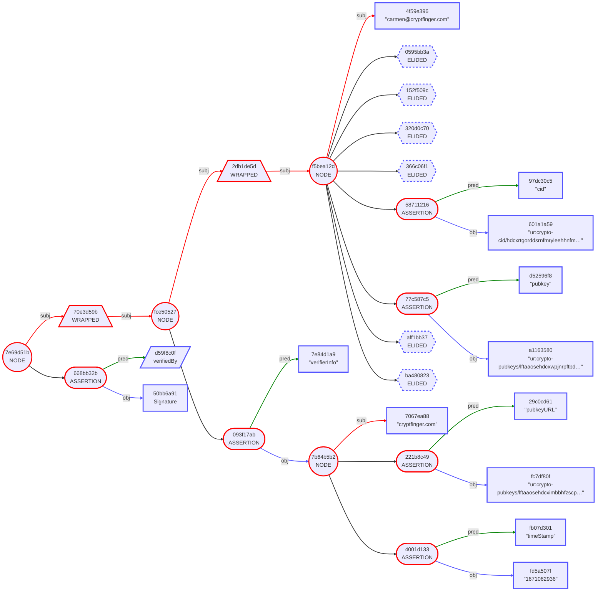

# Gordian Envelope Use Cases: Data Distribution

...

## Data Use Case Table of Contents

* [Part One: Public CryptFinger](https://github.com/BlockchainCommons/Gordian/blob/master/Docs/Envelope-Use-Cases-Data.md#part-one-public-cryptfinger)
   * [#1: Carmen Makes Basic Info Available (Structured Data)](https://github.com/BlockchainCommons/Gordian/blob/master/Docs/Envelope-Use-Cases-Data.md#1-carmen-makes-basic-info-available-structured-data)
   * [#2: Carmen Makes CryptFinger Verifiable (Signatures)](https://github.com/BlockchainCommons/Gordian/blob/master/Docs/Envelope-Use-Cases-Data.md#2-carmen-makes-cryptfinger-verifiable-signatures)
   * [#3: Carmen Add Chronology to CryptFinger (Timestamp)](https://github.com/BlockchainCommons/Gordian/blob/master/Docs/Envelope-Use-Cases-Data.md#3-carmen-add-chronology-to-cryptfinger-timestamp)
* [Part Two: Private CryptFinger](https://github.com/BlockchainCommons/Gordian/blob/master/Docs/Envelope-Use-Cases-Data.md#part-two-private-cryptfinger)
   * [#4: Carmen Protects CryptFinger (Elision)](https://github.com/BlockchainCommons/Gordian/blob/master/Docs/Envelope-Use-Cases-Data.md#4-carmen-protects-cryptfinger-elision)
   * [#5: Carmen Makes CryptFinger Provable (Inclusion Proof)](https://github.com/BlockchainCommons/Gordian/blob/master/Docs/Envelope-Use-Cases-Data.md#5-carmen-makes-cryptfinger-provable-inclusion-proof)
...

## Part One: Public CryptFinger

This first set of use cases lays out Gordian Envelope use cases for public data distribution, where everything is seen by all parties. It includes: how to create basic (structured) information, how to make that data verifiable, and how to timestamp that data.

### #1: Carmen Makes Basic Info Available (Structured Data)

> _Problem Solved:_ Carmen wants to make basic user information available in a structured way.

Carmen has used the internet long enough that she used to `finger` internet users to find basic information about them. Now she uses [WebFinger](https://www.rfc-editor.org/rfc/rfc7033) for even more details. However, she wants to be able to release her information in a more modular, privacy-preserving way. Thus, she begins to design "CryptFinger".

When a user wants to find out information about `carmen@cryptfinger.com` they contact the `cryptfinger.com` cryptfinger server and request information about her.

The foundational design of CryptFinger isn't that different from WebFinger. It will allow a user to reveal their data in a structured way. The benefits of using CryptFinger over WebFinger will come as Carmen begins to use privacy-preserving techniques of authentication, elision, and proofs. But in the meantime, here's what a foundational CryptFinger response might look like:

```
"carmen@cryptfinger.com" [
    "alias": "admin@cryptfinger.com"
    "alias": "carmen@blockchaincommons.com"
    "alias": "carmen@mycarmentsite.com"
    "cid": "ur:crypto-cid/hdcxrtgorddsrnfmryleehhnfmynylnecwldpapafskphsgwfgmdgwmusthlzecfltiosskorers"
    "hasPublication": "Cryptfinger Design Notes" [
        "pubdate": "2022-10-11"
        "url": "https://blockchaincommons.com/design-notes/cryptfinger.html"
        "version": "1.3.1"
        isA: "non-fiction article"
    ]
    "hasPublication": "Zen and the Art of Cryptfinger Design" [
        "ISBN-13": "978-1-04-876475-8"
        "hasTranslation": "Zen y el arte del diseño Cryptfinger" [
            "ISBN-13": "978-0-421-94892-1"
            "language": "es"
            "pubDate": "2022-02-22"
            isA: "non-fiction book"
        ]
        "language": "en"
        "pubDate": "2022-01-17"
        isA: "non-fiction book"
    ]
    "phoneNumber": "510-555-0143"
    "pubkey": "ur:crypto-pubkeys/lftaaosehdcxwpjnrpftbdbbnlmdpsvtrllpchlomeutbzrhcxdputiarhlrtpfhsaiygdayzswetpvahdcxsfmocxiarketgeoemyaawmiogyftjyfwvaolndimuolgwlsrdyoyhddwgwjyjefylylnpdoe"
    isA: "programmer"
    isA: "writer"
]
```

```mermaid
graph LR
    1(("5c6ec4a2<br/>NODE"))
    2["4f59e396<br/>#quot;carmen@cryptfinger.com#quot;"]
    3(["0595bb3a<br/>ASSERTION"])
    4["4e7cdd69<br/>#quot;alias#quot;"]
    5["09cfa295<br/>#quot;carmen@mycarmentsite.com#quot;"]
    6(["152f509c<br/>ASSERTION"])
    7["7ed9572e<br/>#quot;hasPublication#quot;"]
    8(("2c51cecb<br/>NODE"))
    9["14dce19e<br/>#quot;Zen and the Art of Cryptfinger Design#quot;"]
    10(["18048890<br/>ASSERTION"])
    11["c91b36b2<br/>#quot;pubDate#quot;"]
    12["ae96f205<br/>#quot;2022-01-17#quot;"]
    13(["76f63c9c<br/>ASSERTION"])
    14["0846979e<br/>#quot;language#quot;"]
    15["409b5893<br/>#quot;en#quot;"]
    16(["7c4c63e7<br/>ASSERTION"])
    17["d41c6a7e<br/>#quot;hasTranslation#quot;"]
    18(("8dc1f383<br/>NODE"))
    19["91ee71f8<br/>#quot;Zen y el arte del diseño Cryptfinger#quot;"]
    20(["23335db9<br/>ASSERTION"])
    21["c91b36b2<br/>#quot;pubDate#quot;"]
    22["c4f05fb4<br/>#quot;2022-02-22#quot;"]
    23(["2c5d3a5f<br/>ASSERTION"])
    24["10a46e16<br/>#quot;ISBN-13#quot;"]
    25["4ed1acab<br/>#quot;978-0-421-94892-1#quot;"]
    26(["9db68d01<br/>ASSERTION"])
    27["0846979e<br/>#quot;language#quot;"]
    28["dd2f866d<br/>#quot;es#quot;"]
    29(["bcf92721<br/>ASSERTION"])
    30[/"8982354d<br/>isA"/]
    31["fde87c34<br/>#quot;non-fiction book#quot;"]
    32(["bcf92721<br/>ASSERTION"])
    33[/"8982354d<br/>isA"/]
    34["fde87c34<br/>#quot;non-fiction book#quot;"]
    35(["e0afce84<br/>ASSERTION"])
    36["10a46e16<br/>#quot;ISBN-13#quot;"]
    37["18e2fcf5<br/>#quot;978-1-04-876475-8#quot;"]
    38(["320d0c70<br/>ASSERTION"])
    39["bf9638d1<br/>#quot;phoneNumber#quot;"]
    40["48af8880<br/>#quot;510-555-0143#quot;"]
    41(["366c06f1<br/>ASSERTION"])
    42["7ed9572e<br/>#quot;hasPublication#quot;"]
    43(("3b6cf8f0<br/>NODE"))
    44["8edf5b50<br/>#quot;Cryptfinger Design Notes#quot;"]
    45(["3a9a5b75<br/>ASSERTION"])
    46["0e0066da<br/>#quot;pubdate#quot;"]
    47["54ac7f35<br/>#quot;2022-10-11#quot;"]
    48(["4514d304<br/>ASSERTION"])
    49["b22687d9<br/>#quot;version#quot;"]
    50["b94ba9a2<br/>#quot;1.3.1#quot;"]
    51(["87b4fe55<br/>ASSERTION"])
    52[/"8982354d<br/>isA"/]
    53["8c645acc<br/>#quot;non-fiction article#quot;"]
    54(["da22ca9e<br/>ASSERTION"])
    55["7fce2d08<br/>#quot;url#quot;"]
    56["fda96fd7<br/>#quot;https://blockchaincommons.com/design-not…#quot;"]
    57(["58711216<br/>ASSERTION"])
    58["97dc30c5<br/>#quot;cid#quot;"]
    59["601a1a59<br/>#quot;ur:crypto-cid/hdcxrtgorddsrnfmryleehhnfm…#quot;"]
    60(["77c587c5<br/>ASSERTION"])
    61["d52596f8<br/>#quot;pubkey#quot;"]
    62["a1163580<br/>#quot;ur:crypto-pubkeys/lftaaosehdcxwpjnrpftbd…#quot;"]
    63(["aff1bb37<br/>ASSERTION"])
    64["4e7cdd69<br/>#quot;alias#quot;"]
    65["3bc0d518<br/>#quot;admin@cryptfinger.com#quot;"]
    66(["ba480823<br/>ASSERTION"])
    67["4e7cdd69<br/>#quot;alias#quot;"]
    68["37f5a7a1<br/>#quot;carmen@blockchaincommons.com#quot;"]
    69(["c1a9c8a1<br/>ASSERTION"])
    70[/"8982354d<br/>isA"/]
    71["73fca274<br/>#quot;programmer#quot;"]
    72(["fa6f4cc6<br/>ASSERTION"])
    73[/"8982354d<br/>isA"/]
    74["7b82b07e<br/>#quot;writer#quot;"]
    1 -->|subj| 2
    1 --> 3
    3 -->|pred| 4
    3 -->|obj| 5
    1 --> 6
    6 -->|pred| 7
    6 -->|obj| 8
    8 -->|subj| 9
    8 --> 10
    10 -->|pred| 11
    10 -->|obj| 12
    8 --> 13
    13 -->|pred| 14
    13 -->|obj| 15
    8 --> 16
    16 -->|pred| 17
    16 -->|obj| 18
    18 -->|subj| 19
    18 --> 20
    20 -->|pred| 21
    20 -->|obj| 22
    18 --> 23
    23 -->|pred| 24
    23 -->|obj| 25
    18 --> 26
    26 -->|pred| 27
    26 -->|obj| 28
    18 --> 29
    29 -->|pred| 30
    29 -->|obj| 31
    8 --> 32
    32 -->|pred| 33
    32 -->|obj| 34
    8 --> 35
    35 -->|pred| 36
    35 -->|obj| 37
    1 --> 38
    38 -->|pred| 39
    38 -->|obj| 40
    1 --> 41
    41 -->|pred| 42
    41 -->|obj| 43
    43 -->|subj| 44
    43 --> 45
    45 -->|pred| 46
    45 -->|obj| 47
    43 --> 48
    48 -->|pred| 49
    48 -->|obj| 50
    43 --> 51
    51 -->|pred| 52
    51 -->|obj| 53
    43 --> 54
    54 -->|pred| 55
    54 -->|obj| 56
    1 --> 57
    57 -->|pred| 58
    57 -->|obj| 59
    1 --> 60
    60 -->|pred| 61
    60 -->|obj| 62
    1 --> 63
    63 -->|pred| 64
    63 -->|obj| 65
    1 --> 66
    66 -->|pred| 67
    66 -->|obj| 68
    1 --> 69
    69 -->|pred| 70
    69 -->|obj| 71
    1 --> 72
    72 -->|pred| 73
    72 -->|obj| 74
    style 1 stroke:red,stroke-width:3.0px
    style 2 stroke:#55f,stroke-width:3.0px
    style 3 stroke:red,stroke-width:3.0px
    style 4 stroke:#55f,stroke-width:3.0px
    style 5 stroke:#55f,stroke-width:3.0px
    style 6 stroke:red,stroke-width:3.0px
    style 7 stroke:#55f,stroke-width:3.0px
    style 8 stroke:red,stroke-width:3.0px
    style 9 stroke:#55f,stroke-width:3.0px
    style 10 stroke:red,stroke-width:3.0px
    style 11 stroke:#55f,stroke-width:3.0px
    style 12 stroke:#55f,stroke-width:3.0px
    style 13 stroke:red,stroke-width:3.0px
    style 14 stroke:#55f,stroke-width:3.0px
    style 15 stroke:#55f,stroke-width:3.0px
    style 16 stroke:red,stroke-width:3.0px
    style 17 stroke:#55f,stroke-width:3.0px
    style 18 stroke:red,stroke-width:3.0px
    style 19 stroke:#55f,stroke-width:3.0px
    style 20 stroke:red,stroke-width:3.0px
    style 21 stroke:#55f,stroke-width:3.0px
    style 22 stroke:#55f,stroke-width:3.0px
    style 23 stroke:red,stroke-width:3.0px
    style 24 stroke:#55f,stroke-width:3.0px
    style 25 stroke:#55f,stroke-width:3.0px
    style 26 stroke:red,stroke-width:3.0px
    style 27 stroke:#55f,stroke-width:3.0px
    style 28 stroke:#55f,stroke-width:3.0px
    style 29 stroke:red,stroke-width:3.0px
    style 30 stroke:#55f,stroke-width:3.0px
    style 31 stroke:#55f,stroke-width:3.0px
    style 32 stroke:red,stroke-width:3.0px
    style 33 stroke:#55f,stroke-width:3.0px
    style 34 stroke:#55f,stroke-width:3.0px
    style 35 stroke:red,stroke-width:3.0px
    style 36 stroke:#55f,stroke-width:3.0px
    style 37 stroke:#55f,stroke-width:3.0px
    style 38 stroke:red,stroke-width:3.0px
    style 39 stroke:#55f,stroke-width:3.0px
    style 40 stroke:#55f,stroke-width:3.0px
    style 41 stroke:red,stroke-width:3.0px
    style 42 stroke:#55f,stroke-width:3.0px
    style 43 stroke:red,stroke-width:3.0px
    style 44 stroke:#55f,stroke-width:3.0px
    style 45 stroke:red,stroke-width:3.0px
    style 46 stroke:#55f,stroke-width:3.0px
    style 47 stroke:#55f,stroke-width:3.0px
    style 48 stroke:red,stroke-width:3.0px
    style 49 stroke:#55f,stroke-width:3.0px
    style 50 stroke:#55f,stroke-width:3.0px
    style 51 stroke:red,stroke-width:3.0px
    style 52 stroke:#55f,stroke-width:3.0px
    style 53 stroke:#55f,stroke-width:3.0px
    style 54 stroke:red,stroke-width:3.0px
    style 55 stroke:#55f,stroke-width:3.0px
    style 56 stroke:#55f,stroke-width:3.0px
    style 57 stroke:red,stroke-width:3.0px
    style 58 stroke:#55f,stroke-width:3.0px
    style 59 stroke:#55f,stroke-width:3.0px
    style 60 stroke:red,stroke-width:3.0px
    style 61 stroke:#55f,stroke-width:3.0px
    style 62 stroke:#55f,stroke-width:3.0px
    style 63 stroke:red,stroke-width:3.0px
    style 64 stroke:#55f,stroke-width:3.0px
    style 65 stroke:#55f,stroke-width:3.0px
    style 66 stroke:red,stroke-width:3.0px
    style 67 stroke:#55f,stroke-width:3.0px
    style 68 stroke:#55f,stroke-width:3.0px
    style 69 stroke:red,stroke-width:3.0px
    style 70 stroke:#55f,stroke-width:3.0px
    style 71 stroke:#55f,stroke-width:3.0px
    style 72 stroke:red,stroke-width:3.0px
    style 73 stroke:#55f,stroke-width:3.0px
    style 74 stroke:#55f,stroke-width:3.0px
    linkStyle 0 stroke:red,stroke-width:2.0px
    linkStyle 1 stroke-width:2.0px
    linkStyle 2 stroke:green,stroke-width:2.0px
    linkStyle 3 stroke:#55f,stroke-width:2.0px
    linkStyle 4 stroke-width:2.0px
    linkStyle 5 stroke:green,stroke-width:2.0px
    linkStyle 6 stroke:#55f,stroke-width:2.0px
    linkStyle 7 stroke:red,stroke-width:2.0px
    linkStyle 8 stroke-width:2.0px
    linkStyle 9 stroke:green,stroke-width:2.0px
    linkStyle 10 stroke:#55f,stroke-width:2.0px
    linkStyle 11 stroke-width:2.0px
    linkStyle 12 stroke:green,stroke-width:2.0px
    linkStyle 13 stroke:#55f,stroke-width:2.0px
    linkStyle 14 stroke-width:2.0px
    linkStyle 15 stroke:green,stroke-width:2.0px
    linkStyle 16 stroke:#55f,stroke-width:2.0px
    linkStyle 17 stroke:red,stroke-width:2.0px
    linkStyle 18 stroke-width:2.0px
    linkStyle 19 stroke:green,stroke-width:2.0px
    linkStyle 20 stroke:#55f,stroke-width:2.0px
    linkStyle 21 stroke-width:2.0px
    linkStyle 22 stroke:green,stroke-width:2.0px
    linkStyle 23 stroke:#55f,stroke-width:2.0px
    linkStyle 24 stroke-width:2.0px
    linkStyle 25 stroke:green,stroke-width:2.0px
    linkStyle 26 stroke:#55f,stroke-width:2.0px
    linkStyle 27 stroke-width:2.0px
    linkStyle 28 stroke:green,stroke-width:2.0px
    linkStyle 29 stroke:#55f,stroke-width:2.0px
    linkStyle 30 stroke-width:2.0px
    linkStyle 31 stroke:green,stroke-width:2.0px
    linkStyle 32 stroke:#55f,stroke-width:2.0px
    linkStyle 33 stroke-width:2.0px
    linkStyle 34 stroke:green,stroke-width:2.0px
    linkStyle 35 stroke:#55f,stroke-width:2.0px
    linkStyle 36 stroke-width:2.0px
    linkStyle 37 stroke:green,stroke-width:2.0px
    linkStyle 38 stroke:#55f,stroke-width:2.0px
    linkStyle 39 stroke-width:2.0px
    linkStyle 40 stroke:green,stroke-width:2.0px
    linkStyle 41 stroke:#55f,stroke-width:2.0px
    linkStyle 42 stroke:red,stroke-width:2.0px
    linkStyle 43 stroke-width:2.0px
    linkStyle 44 stroke:green,stroke-width:2.0px
    linkStyle 45 stroke:#55f,stroke-width:2.0px
    linkStyle 46 stroke-width:2.0px
    linkStyle 47 stroke:green,stroke-width:2.0px
    linkStyle 48 stroke:#55f,stroke-width:2.0px
    linkStyle 49 stroke-width:2.0px
    linkStyle 50 stroke:green,stroke-width:2.0px
    linkStyle 51 stroke:#55f,stroke-width:2.0px
    linkStyle 52 stroke-width:2.0px
    linkStyle 53 stroke:green,stroke-width:2.0px
    linkStyle 54 stroke:#55f,stroke-width:2.0px
    linkStyle 55 stroke-width:2.0px
    linkStyle 56 stroke:green,stroke-width:2.0px
    linkStyle 57 stroke:#55f,stroke-width:2.0px
    linkStyle 58 stroke-width:2.0px
    linkStyle 59 stroke:green,stroke-width:2.0px
    linkStyle 60 stroke:#55f,stroke-width:2.0px
    linkStyle 61 stroke-width:2.0px
    linkStyle 62 stroke:green,stroke-width:2.0px
    linkStyle 63 stroke:#55f,stroke-width:2.0px
    linkStyle 64 stroke-width:2.0px
    linkStyle 65 stroke:green,stroke-width:2.0px
    linkStyle 66 stroke:#55f,stroke-width:2.0px
    linkStyle 67 stroke-width:2.0px
    linkStyle 68 stroke:green,stroke-width:2.0px
    linkStyle 69 stroke:#55f,stroke-width:2.0px
    linkStyle 70 stroke-width:2.0px
    linkStyle 71 stroke:green,stroke-width:2.0px
    linkStyle 72 stroke:#55f,stroke-width:2.0px
```

More innovations will come as Carmen adds on privacy-preserving features from Gordian Envelope.

### #2: Carmen Makes CryptFinger Verifiable (Signatures)

> _Problem Solved:_ Carmen wants to make user information verifiable.

Carmen's first expansion of her CryptFinger design is to make it verifiable. This will have some limited utility when data is initially accessed. Users can check the signature of the CryptFinger results against a public key, and verify that the signature matches that public key. If the public key is hosted on the same URL as the CryptFinger data, then it proves that the CryptFinger app hasn't been compromised. If it's hosted on a Public-Key Infrastructure (PKI) server, it may offer assurances about thes server itself. (For any validation of this sort, the validator is the one responsible for figuring out how strong any assurances are and what the implicit dangers are.)

However, making CryptFinger verifiable offers a more powerful expansion: the Envelopes containing CryptFinger results can now be passed around, and those Envelopes can be validated at any time by any holder. An Envelope could even be verified far in the future if there's some remaining proof of the public key that was used to sign the Envelope! If a third-party ever tries to make changes to a CryptFinger Envelope's content, the Envelope will no longer be verifiable! 

In order to add authentication to CryptFinger results, Carmen wraps them, adds verifier data, then wraps that and signs it. The result is a signature that applies to the verifier data and the original CryptFinger data alike.

Here's Carmen's CryptFinger results with the verifier info:
```
{
    "carmen@cryptfinger.com" [
        "alias": "admin@cryptfinger.com"
        "alias": "carmen@blockchaincommons.com"
        "alias": "carmen@mycarmentsite.com"
        "cid": "ur:crypto-cid/hdcxrtgorddsrnfmryleehhnfmynylnecwldpapafskphsgwfgmdgwmusthlzecfltiosskorers"
        "hasPublication": "Cryptfinger Design Notes" [
            "pubdate": "2022-10-11"
            "url": "https://blockchaincommons.com/design-notes/cryptfinger.html"
            "version": "1.3.1"
            isA: "non-fiction article"
        ]
        "hasPublication": "Zen and the Art of Cryptfinger Design" [
            "ISBN-13": "978-1-04-876475-8"
            "hasTranslation": "Zen y el arte del diseño Cryptfinger" [
                "ISBN-13": "978-0-421-94892-1"
                "language": "es"
                "pubDate": "2022-02-22"
                isA: "non-fiction book"
            ]
            "language": "en"
            "pubDate": "2022-01-17"
            isA: "non-fiction book"
        ]
        "phoneNumber": "510-555-0143"
        "pubkey": "ur:crypto-pubkeys/lftaaosehdcxwpjnrpftbdbbnlmdpsvtrllpchlomeutbzrhcxdputiarhlrtpfhsaiygdayzswetpvahdcxsfmocxiarketgeoemyaawmiogyftjyfwvaolndimuolgwlsrdyoyhddwgwjyjefylylnpdoe"
        isA: "programmer"
        isA: "writer"
    ]
} [
    "verifierInfo": "cryptfinger.com" [
        "pubkeyURL": "ur:crypto-pubkeys/lftaaosehdcximbbhfzscptyrdptctdiykhskekgpmashheslnfdrepfrljonnglaevoasremulytpvahdcxfxlssfkiaogyeyrtaszeluzmgedkcppdwyfdzcdryntdtplkinlbmkskjkrlnnjngsbemhne"
    ]
]
```

```mermaid
graph LR
    1(("a32da170<br/>NODE"))
    2[/"db8ea56e<br/>WRAPPED"\]
    3(("5c6ec4a2<br/>NODE"))
    4["4f59e396<br/>#quot;carmen@cryptfinger.com#quot;"]
    5(["0595bb3a<br/>ASSERTION"])
    6["4e7cdd69<br/>#quot;alias#quot;"]
    7["09cfa295<br/>#quot;carmen@mycarmentsite.com#quot;"]
    8(["152f509c<br/>ASSERTION"])
    9["7ed9572e<br/>#quot;hasPublication#quot;"]
    10(("2c51cecb<br/>NODE"))
    11["14dce19e<br/>#quot;Zen and the Art of Cryptfinger Design#quot;"]
    12(["18048890<br/>ASSERTION"])
    13["c91b36b2<br/>#quot;pubDate#quot;"]
    14["ae96f205<br/>#quot;2022-01-17#quot;"]
    15(["76f63c9c<br/>ASSERTION"])
    16["0846979e<br/>#quot;language#quot;"]
    17["409b5893<br/>#quot;en#quot;"]
    18(["7c4c63e7<br/>ASSERTION"])
    19["d41c6a7e<br/>#quot;hasTranslation#quot;"]
    20(("8dc1f383<br/>NODE"))
    21["91ee71f8<br/>#quot;Zen y el arte del diseño Cryptfinger#quot;"]
    22(["23335db9<br/>ASSERTION"])
    23["c91b36b2<br/>#quot;pubDate#quot;"]
    24["c4f05fb4<br/>#quot;2022-02-22#quot;"]
    25(["2c5d3a5f<br/>ASSERTION"])
    26["10a46e16<br/>#quot;ISBN-13#quot;"]
    27["4ed1acab<br/>#quot;978-0-421-94892-1#quot;"]
    28(["9db68d01<br/>ASSERTION"])
    29["0846979e<br/>#quot;language#quot;"]
    30["dd2f866d<br/>#quot;es#quot;"]
    31(["bcf92721<br/>ASSERTION"])
    32[/"8982354d<br/>isA"/]
    33["fde87c34<br/>#quot;non-fiction book#quot;"]
    34(["bcf92721<br/>ASSERTION"])
    35[/"8982354d<br/>isA"/]
    36["fde87c34<br/>#quot;non-fiction book#quot;"]
    37(["e0afce84<br/>ASSERTION"])
    38["10a46e16<br/>#quot;ISBN-13#quot;"]
    39["18e2fcf5<br/>#quot;978-1-04-876475-8#quot;"]
    40(["320d0c70<br/>ASSERTION"])
    41["bf9638d1<br/>#quot;phoneNumber#quot;"]
    42["48af8880<br/>#quot;510-555-0143#quot;"]
    43(["366c06f1<br/>ASSERTION"])
    44["7ed9572e<br/>#quot;hasPublication#quot;"]
    45(("3b6cf8f0<br/>NODE"))
    46["8edf5b50<br/>#quot;Cryptfinger Design Notes#quot;"]
    47(["3a9a5b75<br/>ASSERTION"])
    48["0e0066da<br/>#quot;pubdate#quot;"]
    49["54ac7f35<br/>#quot;2022-10-11#quot;"]
    50(["4514d304<br/>ASSERTION"])
    51["b22687d9<br/>#quot;version#quot;"]
    52["b94ba9a2<br/>#quot;1.3.1#quot;"]
    53(["87b4fe55<br/>ASSERTION"])
    54[/"8982354d<br/>isA"/]
    55["8c645acc<br/>#quot;non-fiction article#quot;"]
    56(["da22ca9e<br/>ASSERTION"])
    57["7fce2d08<br/>#quot;url#quot;"]
    58["fda96fd7<br/>#quot;https://blockchaincommons.com/design-not…#quot;"]
    59(["58711216<br/>ASSERTION"])
    60["97dc30c5<br/>#quot;cid#quot;"]
    61["601a1a59<br/>#quot;ur:crypto-cid/hdcxrtgorddsrnfmryleehhnfm…#quot;"]
    62(["77c587c5<br/>ASSERTION"])
    63["d52596f8<br/>#quot;pubkey#quot;"]
    64["a1163580<br/>#quot;ur:crypto-pubkeys/lftaaosehdcxwpjnrpftbd…#quot;"]
    65(["aff1bb37<br/>ASSERTION"])
    66["4e7cdd69<br/>#quot;alias#quot;"]
    67["3bc0d518<br/>#quot;admin@cryptfinger.com#quot;"]
    68(["ba480823<br/>ASSERTION"])
    69["4e7cdd69<br/>#quot;alias#quot;"]
    70["37f5a7a1<br/>#quot;carmen@blockchaincommons.com#quot;"]
    71(["c1a9c8a1<br/>ASSERTION"])
    72[/"8982354d<br/>isA"/]
    73["73fca274<br/>#quot;programmer#quot;"]
    74(["fa6f4cc6<br/>ASSERTION"])
    75[/"8982354d<br/>isA"/]
    76["7b82b07e<br/>#quot;writer#quot;"]
    77(["cf57039c<br/>ASSERTION"])
    78["7e84d1a9<br/>#quot;verifierInfo#quot;"]
    79(("de057405<br/>NODE"))
    80["7067ea88<br/>#quot;cryptfinger.com#quot;"]
    81(["221b8c49<br/>ASSERTION"])
    82["29c0cd61<br/>#quot;pubkeyURL#quot;"]
    83["fc7df80f<br/>#quot;ur:crypto-pubkeys/lftaaosehdcximbbhfzscp…#quot;"]
    1 -->|subj| 2
    2 -->|subj| 3
    3 -->|subj| 4
    3 --> 5
    5 -->|pred| 6
    5 -->|obj| 7
    3 --> 8
    8 -->|pred| 9
    8 -->|obj| 10
    10 -->|subj| 11
    10 --> 12
    12 -->|pred| 13
    12 -->|obj| 14
    10 --> 15
    15 -->|pred| 16
    15 -->|obj| 17
    10 --> 18
    18 -->|pred| 19
    18 -->|obj| 20
    20 -->|subj| 21
    20 --> 22
    22 -->|pred| 23
    22 -->|obj| 24
    20 --> 25
    25 -->|pred| 26
    25 -->|obj| 27
    20 --> 28
    28 -->|pred| 29
    28 -->|obj| 30
    20 --> 31
    31 -->|pred| 32
    31 -->|obj| 33
    10 --> 34
    34 -->|pred| 35
    34 -->|obj| 36
    10 --> 37
    37 -->|pred| 38
    37 -->|obj| 39
    3 --> 40
    40 -->|pred| 41
    40 -->|obj| 42
    3 --> 43
    43 -->|pred| 44
    43 -->|obj| 45
    45 -->|subj| 46
    45 --> 47
    47 -->|pred| 48
    47 -->|obj| 49
    45 --> 50
    50 -->|pred| 51
    50 -->|obj| 52
    45 --> 53
    53 -->|pred| 54
    53 -->|obj| 55
    45 --> 56
    56 -->|pred| 57
    56 -->|obj| 58
    3 --> 59
    59 -->|pred| 60
    59 -->|obj| 61
    3 --> 62
    62 -->|pred| 63
    62 -->|obj| 64
    3 --> 65
    65 -->|pred| 66
    65 -->|obj| 67
    3 --> 68
    68 -->|pred| 69
    68 -->|obj| 70
    3 --> 71
    71 -->|pred| 72
    71 -->|obj| 73
    3 --> 74
    74 -->|pred| 75
    74 -->|obj| 76
    1 --> 77
    77 -->|pred| 78
    77 -->|obj| 79
    79 -->|subj| 80
    79 --> 81
    81 -->|pred| 82
    81 -->|obj| 83
    style 1 stroke:red,stroke-width:3.0px
    style 2 stroke:red,stroke-width:3.0px
    style 3 stroke:red,stroke-width:3.0px
    style 4 stroke:#55f,stroke-width:3.0px
    style 5 stroke:red,stroke-width:3.0px
    style 6 stroke:#55f,stroke-width:3.0px
    style 7 stroke:#55f,stroke-width:3.0px
    style 8 stroke:red,stroke-width:3.0px
    style 9 stroke:#55f,stroke-width:3.0px
    style 10 stroke:red,stroke-width:3.0px
    style 11 stroke:#55f,stroke-width:3.0px
    style 12 stroke:red,stroke-width:3.0px
    style 13 stroke:#55f,stroke-width:3.0px
    style 14 stroke:#55f,stroke-width:3.0px
    style 15 stroke:red,stroke-width:3.0px
    style 16 stroke:#55f,stroke-width:3.0px
    style 17 stroke:#55f,stroke-width:3.0px
    style 18 stroke:red,stroke-width:3.0px
    style 19 stroke:#55f,stroke-width:3.0px
    style 20 stroke:red,stroke-width:3.0px
    style 21 stroke:#55f,stroke-width:3.0px
    style 22 stroke:red,stroke-width:3.0px
    style 23 stroke:#55f,stroke-width:3.0px
    style 24 stroke:#55f,stroke-width:3.0px
    style 25 stroke:red,stroke-width:3.0px
    style 26 stroke:#55f,stroke-width:3.0px
    style 27 stroke:#55f,stroke-width:3.0px
    style 28 stroke:red,stroke-width:3.0px
    style 29 stroke:#55f,stroke-width:3.0px
    style 30 stroke:#55f,stroke-width:3.0px
    style 31 stroke:red,stroke-width:3.0px
    style 32 stroke:#55f,stroke-width:3.0px
    style 33 stroke:#55f,stroke-width:3.0px
    style 34 stroke:red,stroke-width:3.0px
    style 35 stroke:#55f,stroke-width:3.0px
    style 36 stroke:#55f,stroke-width:3.0px
    style 37 stroke:red,stroke-width:3.0px
    style 38 stroke:#55f,stroke-width:3.0px
    style 39 stroke:#55f,stroke-width:3.0px
    style 40 stroke:red,stroke-width:3.0px
    style 41 stroke:#55f,stroke-width:3.0px
    style 42 stroke:#55f,stroke-width:3.0px
    style 43 stroke:red,stroke-width:3.0px
    style 44 stroke:#55f,stroke-width:3.0px
    style 45 stroke:red,stroke-width:3.0px
    style 46 stroke:#55f,stroke-width:3.0px
    style 47 stroke:red,stroke-width:3.0px
    style 48 stroke:#55f,stroke-width:3.0px
    style 49 stroke:#55f,stroke-width:3.0px
    style 50 stroke:red,stroke-width:3.0px
    style 51 stroke:#55f,stroke-width:3.0px
    style 52 stroke:#55f,stroke-width:3.0px
    style 53 stroke:red,stroke-width:3.0px
    style 54 stroke:#55f,stroke-width:3.0px
    style 55 stroke:#55f,stroke-width:3.0px
    style 56 stroke:red,stroke-width:3.0px
    style 57 stroke:#55f,stroke-width:3.0px
    style 58 stroke:#55f,stroke-width:3.0px
    style 59 stroke:red,stroke-width:3.0px
    style 60 stroke:#55f,stroke-width:3.0px
    style 61 stroke:#55f,stroke-width:3.0px
    style 62 stroke:red,stroke-width:3.0px
    style 63 stroke:#55f,stroke-width:3.0px
    style 64 stroke:#55f,stroke-width:3.0px
    style 65 stroke:red,stroke-width:3.0px
    style 66 stroke:#55f,stroke-width:3.0px
    style 67 stroke:#55f,stroke-width:3.0px
    style 68 stroke:red,stroke-width:3.0px
    style 69 stroke:#55f,stroke-width:3.0px
    style 70 stroke:#55f,stroke-width:3.0px
    style 71 stroke:red,stroke-width:3.0px
    style 72 stroke:#55f,stroke-width:3.0px
    style 73 stroke:#55f,stroke-width:3.0px
    style 74 stroke:red,stroke-width:3.0px
    style 75 stroke:#55f,stroke-width:3.0px
    style 76 stroke:#55f,stroke-width:3.0px
    style 77 stroke:red,stroke-width:3.0px
    style 78 stroke:#55f,stroke-width:3.0px
    style 79 stroke:red,stroke-width:3.0px
    style 80 stroke:#55f,stroke-width:3.0px
    style 81 stroke:red,stroke-width:3.0px
    style 82 stroke:#55f,stroke-width:3.0px
    style 83 stroke:#55f,stroke-width:3.0px
    linkStyle 0 stroke:red,stroke-width:2.0px
    linkStyle 1 stroke:red,stroke-width:2.0px
    linkStyle 2 stroke:red,stroke-width:2.0px
    linkStyle 3 stroke-width:2.0px
    linkStyle 4 stroke:green,stroke-width:2.0px
    linkStyle 5 stroke:#55f,stroke-width:2.0px
    linkStyle 6 stroke-width:2.0px
    linkStyle 7 stroke:green,stroke-width:2.0px
    linkStyle 8 stroke:#55f,stroke-width:2.0px
    linkStyle 9 stroke:red,stroke-width:2.0px
    linkStyle 10 stroke-width:2.0px
    linkStyle 11 stroke:green,stroke-width:2.0px
    linkStyle 12 stroke:#55f,stroke-width:2.0px
    linkStyle 13 stroke-width:2.0px
    linkStyle 14 stroke:green,stroke-width:2.0px
    linkStyle 15 stroke:#55f,stroke-width:2.0px
    linkStyle 16 stroke-width:2.0px
    linkStyle 17 stroke:green,stroke-width:2.0px
    linkStyle 18 stroke:#55f,stroke-width:2.0px
    linkStyle 19 stroke:red,stroke-width:2.0px
    linkStyle 20 stroke-width:2.0px
    linkStyle 21 stroke:green,stroke-width:2.0px
    linkStyle 22 stroke:#55f,stroke-width:2.0px
    linkStyle 23 stroke-width:2.0px
    linkStyle 24 stroke:green,stroke-width:2.0px
    linkStyle 25 stroke:#55f,stroke-width:2.0px
    linkStyle 26 stroke-width:2.0px
    linkStyle 27 stroke:green,stroke-width:2.0px
    linkStyle 28 stroke:#55f,stroke-width:2.0px
    linkStyle 29 stroke-width:2.0px
    linkStyle 30 stroke:green,stroke-width:2.0px
    linkStyle 31 stroke:#55f,stroke-width:2.0px
    linkStyle 32 stroke-width:2.0px
    linkStyle 33 stroke:green,stroke-width:2.0px
    linkStyle 34 stroke:#55f,stroke-width:2.0px
    linkStyle 35 stroke-width:2.0px
    linkStyle 36 stroke:green,stroke-width:2.0px
    linkStyle 37 stroke:#55f,stroke-width:2.0px
    linkStyle 38 stroke-width:2.0px
    linkStyle 39 stroke:green,stroke-width:2.0px
    linkStyle 40 stroke:#55f,stroke-width:2.0px
    linkStyle 41 stroke-width:2.0px
    linkStyle 42 stroke:green,stroke-width:2.0px
    linkStyle 43 stroke:#55f,stroke-width:2.0px
    linkStyle 44 stroke:red,stroke-width:2.0px
    linkStyle 45 stroke-width:2.0px
    linkStyle 46 stroke:green,stroke-width:2.0px
    linkStyle 47 stroke:#55f,stroke-width:2.0px
    linkStyle 48 stroke-width:2.0px
    linkStyle 49 stroke:green,stroke-width:2.0px
    linkStyle 50 stroke:#55f,stroke-width:2.0px
    linkStyle 51 stroke-width:2.0px
    linkStyle 52 stroke:green,stroke-width:2.0px
    linkStyle 53 stroke:#55f,stroke-width:2.0px
    linkStyle 54 stroke-width:2.0px
    linkStyle 55 stroke:green,stroke-width:2.0px
    linkStyle 56 stroke:#55f,stroke-width:2.0px
    linkStyle 57 stroke-width:2.0px
    linkStyle 58 stroke:green,stroke-width:2.0px
    linkStyle 59 stroke:#55f,stroke-width:2.0px
    linkStyle 60 stroke-width:2.0px
    linkStyle 61 stroke:green,stroke-width:2.0px
    linkStyle 62 stroke:#55f,stroke-width:2.0px
    linkStyle 63 stroke-width:2.0px
    linkStyle 64 stroke:green,stroke-width:2.0px
    linkStyle 65 stroke:#55f,stroke-width:2.0px
    linkStyle 66 stroke-width:2.0px
    linkStyle 67 stroke:green,stroke-width:2.0px
    linkStyle 68 stroke:#55f,stroke-width:2.0px
    linkStyle 69 stroke-width:2.0px
    linkStyle 70 stroke:green,stroke-width:2.0px
    linkStyle 71 stroke:#55f,stroke-width:2.0px
    linkStyle 72 stroke-width:2.0px
    linkStyle 73 stroke:green,stroke-width:2.0px
    linkStyle 74 stroke:#55f,stroke-width:2.0px
    linkStyle 75 stroke-width:2.0px
    linkStyle 76 stroke:green,stroke-width:2.0px
    linkStyle 77 stroke:#55f,stroke-width:2.0px
    linkStyle 78 stroke:red,stroke-width:2.0px
    linkStyle 79 stroke-width:2.0px
    linkStyle 80 stroke:green,stroke-width:2.0px
    linkStyle 81 stroke:#55f,stroke-width:2.0px
```

Here it is signed:
```
{
    {
        "carmen@cryptfinger.com" [
            "alias": "admin@cryptfinger.com"
            "alias": "carmen@blockchaincommons.com"
            "alias": "carmen@mycarmentsite.com"
            "cid": "ur:crypto-cid/hdcxrtgorddsrnfmryleehhnfmynylnecwldpapafskphsgwfgmdgwmusthlzecfltiosskorers"
            "hasPublication": "Cryptfinger Design Notes" [
                "pubdate": "2022-10-11"
                "url": "https://blockchaincommons.com/design-notes/cryptfinger.html"
                "version": "1.3.1"
                isA: "non-fiction article"
            ]
            "hasPublication": "Zen and the Art of Cryptfinger Design" [
                "ISBN-13": "978-1-04-876475-8"
                "hasTranslation": "Zen y el arte del diseño Cryptfinger" [
                    "ISBN-13": "978-0-421-94892-1"
                    "language": "es"
                    "pubDate": "2022-02-22"
                    isA: "non-fiction book"
                ]
                "language": "en"
                "pubDate": "2022-01-17"
                isA: "non-fiction book"
            ]
            "phoneNumber": "510-555-0143"
            "pubkey": "ur:crypto-pubkeys/lftaaosehdcxwpjnrpftbdbbnlmdpsvtrllpchlomeutbzrhcxdputiarhlrtpfhsaiygdayzswetpvahdcxsfmocxiarketgeoemyaawmiogyftjyfwvaolndimuolgwlsrdyoyhddwgwjyjefylylnpdoe"
            isA: "programmer"
            isA: "writer"
        ]
    } [
        "verifierInfo": "cryptfinger.com" [
            "pubkeyURL": "ur:crypto-pubkeys/lftaaosehdcximbbhfzscptyrdptctdiykhskekgpmashheslnfdrepfrljonnglaevoasremulytpvahdcxfxlssfkiaogyeyrtaszeluzmgedkcppdwyfdzcdryntdtplkinlbmkskjkrlnnjngsbemhne"
        ]
    ]
} [
    verifiedBy: Signature
]
```


```mermaid
graph LR
    1(("0558b5ab<br/>NODE"))
    2[/"70e25996<br/>WRAPPED"\]
    3(("a32da170<br/>NODE"))
    4[/"db8ea56e<br/>WRAPPED"\]
    5(("5c6ec4a2<br/>NODE"))
    6["4f59e396<br/>#quot;carmen@cryptfinger.com#quot;"]
    7(["0595bb3a<br/>ASSERTION"])
    8["4e7cdd69<br/>#quot;alias#quot;"]
    9["09cfa295<br/>#quot;carmen@mycarmentsite.com#quot;"]
    10(["152f509c<br/>ASSERTION"])
    11["7ed9572e<br/>#quot;hasPublication#quot;"]
    12(("2c51cecb<br/>NODE"))
    13["14dce19e<br/>#quot;Zen and the Art of Cryptfinger Design#quot;"]
    14(["18048890<br/>ASSERTION"])
    15["c91b36b2<br/>#quot;pubDate#quot;"]
    16["ae96f205<br/>#quot;2022-01-17#quot;"]
    17(["76f63c9c<br/>ASSERTION"])
    18["0846979e<br/>#quot;language#quot;"]
    19["409b5893<br/>#quot;en#quot;"]
    20(["7c4c63e7<br/>ASSERTION"])
    21["d41c6a7e<br/>#quot;hasTranslation#quot;"]
    22(("8dc1f383<br/>NODE"))
    23["91ee71f8<br/>#quot;Zen y el arte del diseño Cryptfinger#quot;"]
    24(["23335db9<br/>ASSERTION"])
    25["c91b36b2<br/>#quot;pubDate#quot;"]
    26["c4f05fb4<br/>#quot;2022-02-22#quot;"]
    27(["2c5d3a5f<br/>ASSERTION"])
    28["10a46e16<br/>#quot;ISBN-13#quot;"]
    29["4ed1acab<br/>#quot;978-0-421-94892-1#quot;"]
    30(["9db68d01<br/>ASSERTION"])
    31["0846979e<br/>#quot;language#quot;"]
    32["dd2f866d<br/>#quot;es#quot;"]
    33(["bcf92721<br/>ASSERTION"])
    34[/"8982354d<br/>isA"/]
    35["fde87c34<br/>#quot;non-fiction book#quot;"]
    36(["bcf92721<br/>ASSERTION"])
    37[/"8982354d<br/>isA"/]
    38["fde87c34<br/>#quot;non-fiction book#quot;"]
    39(["e0afce84<br/>ASSERTION"])
    40["10a46e16<br/>#quot;ISBN-13#quot;"]
    41["18e2fcf5<br/>#quot;978-1-04-876475-8#quot;"]
    42(["320d0c70<br/>ASSERTION"])
    43["bf9638d1<br/>#quot;phoneNumber#quot;"]
    44["48af8880<br/>#quot;510-555-0143#quot;"]
    45(["366c06f1<br/>ASSERTION"])
    46["7ed9572e<br/>#quot;hasPublication#quot;"]
    47(("3b6cf8f0<br/>NODE"))
    48["8edf5b50<br/>#quot;Cryptfinger Design Notes#quot;"]
    49(["3a9a5b75<br/>ASSERTION"])
    50["0e0066da<br/>#quot;pubdate#quot;"]
    51["54ac7f35<br/>#quot;2022-10-11#quot;"]
    52(["4514d304<br/>ASSERTION"])
    53["b22687d9<br/>#quot;version#quot;"]
    54["b94ba9a2<br/>#quot;1.3.1#quot;"]
    55(["87b4fe55<br/>ASSERTION"])
    56[/"8982354d<br/>isA"/]
    57["8c645acc<br/>#quot;non-fiction article#quot;"]
    58(["da22ca9e<br/>ASSERTION"])
    59["7fce2d08<br/>#quot;url#quot;"]
    60["fda96fd7<br/>#quot;https://blockchaincommons.com/design-not…#quot;"]
    61(["58711216<br/>ASSERTION"])
    62["97dc30c5<br/>#quot;cid#quot;"]
    63["601a1a59<br/>#quot;ur:crypto-cid/hdcxrtgorddsrnfmryleehhnfm…#quot;"]
    64(["77c587c5<br/>ASSERTION"])
    65["d52596f8<br/>#quot;pubkey#quot;"]
    66["a1163580<br/>#quot;ur:crypto-pubkeys/lftaaosehdcxwpjnrpftbd…#quot;"]
    67(["aff1bb37<br/>ASSERTION"])
    68["4e7cdd69<br/>#quot;alias#quot;"]
    69["3bc0d518<br/>#quot;admin@cryptfinger.com#quot;"]
    70(["ba480823<br/>ASSERTION"])
    71["4e7cdd69<br/>#quot;alias#quot;"]
    72["37f5a7a1<br/>#quot;carmen@blockchaincommons.com#quot;"]
    73(["c1a9c8a1<br/>ASSERTION"])
    74[/"8982354d<br/>isA"/]
    75["73fca274<br/>#quot;programmer#quot;"]
    76(["fa6f4cc6<br/>ASSERTION"])
    77[/"8982354d<br/>isA"/]
    78["7b82b07e<br/>#quot;writer#quot;"]
    79(["cf57039c<br/>ASSERTION"])
    80["7e84d1a9<br/>#quot;verifierInfo#quot;"]
    81(("de057405<br/>NODE"))
    82["7067ea88<br/>#quot;cryptfinger.com#quot;"]
    83(["221b8c49<br/>ASSERTION"])
    84["29c0cd61<br/>#quot;pubkeyURL#quot;"]
    85["fc7df80f<br/>#quot;ur:crypto-pubkeys/lftaaosehdcximbbhfzscp…#quot;"]
    86(["0559d5bc<br/>ASSERTION"])
    87[/"d59f8c0f<br/>verifiedBy"/]
    88["0bda9def<br/>Signature"]
    1 -->|subj| 2
    2 -->|subj| 3
    3 -->|subj| 4
    4 -->|subj| 5
    5 -->|subj| 6
    5 --> 7
    7 -->|pred| 8
    7 -->|obj| 9
    5 --> 10
    10 -->|pred| 11
    10 -->|obj| 12
    12 -->|subj| 13
    12 --> 14
    14 -->|pred| 15
    14 -->|obj| 16
    12 --> 17
    17 -->|pred| 18
    17 -->|obj| 19
    12 --> 20
    20 -->|pred| 21
    20 -->|obj| 22
    22 -->|subj| 23
    22 --> 24
    24 -->|pred| 25
    24 -->|obj| 26
    22 --> 27
    27 -->|pred| 28
    27 -->|obj| 29
    22 --> 30
    30 -->|pred| 31
    30 -->|obj| 32
    22 --> 33
    33 -->|pred| 34
    33 -->|obj| 35
    12 --> 36
    36 -->|pred| 37
    36 -->|obj| 38
    12 --> 39
    39 -->|pred| 40
    39 -->|obj| 41
    5 --> 42
    42 -->|pred| 43
    42 -->|obj| 44
    5 --> 45
    45 -->|pred| 46
    45 -->|obj| 47
    47 -->|subj| 48
    47 --> 49
    49 -->|pred| 50
    49 -->|obj| 51
    47 --> 52
    52 -->|pred| 53
    52 -->|obj| 54
    47 --> 55
    55 -->|pred| 56
    55 -->|obj| 57
    47 --> 58
    58 -->|pred| 59
    58 -->|obj| 60
    5 --> 61
    61 -->|pred| 62
    61 -->|obj| 63
    5 --> 64
    64 -->|pred| 65
    64 -->|obj| 66
    5 --> 67
    67 -->|pred| 68
    67 -->|obj| 69
    5 --> 70
    70 -->|pred| 71
    70 -->|obj| 72
    5 --> 73
    73 -->|pred| 74
    73 -->|obj| 75
    5 --> 76
    76 -->|pred| 77
    76 -->|obj| 78
    3 --> 79
    79 -->|pred| 80
    79 -->|obj| 81
    81 -->|subj| 82
    81 --> 83
    83 -->|pred| 84
    83 -->|obj| 85
    1 --> 86
    86 -->|pred| 87
    86 -->|obj| 88
    style 1 stroke:red,stroke-width:3.0px
    style 2 stroke:red,stroke-width:3.0px
    style 3 stroke:red,stroke-width:3.0px
    style 4 stroke:red,stroke-width:3.0px
    style 5 stroke:red,stroke-width:3.0px
    style 6 stroke:#55f,stroke-width:3.0px
    style 7 stroke:red,stroke-width:3.0px
    style 8 stroke:#55f,stroke-width:3.0px
    style 9 stroke:#55f,stroke-width:3.0px
    style 10 stroke:red,stroke-width:3.0px
    style 11 stroke:#55f,stroke-width:3.0px
    style 12 stroke:red,stroke-width:3.0px
    style 13 stroke:#55f,stroke-width:3.0px
    style 14 stroke:red,stroke-width:3.0px
    style 15 stroke:#55f,stroke-width:3.0px
    style 16 stroke:#55f,stroke-width:3.0px
    style 17 stroke:red,stroke-width:3.0px
    style 18 stroke:#55f,stroke-width:3.0px
    style 19 stroke:#55f,stroke-width:3.0px
    style 20 stroke:red,stroke-width:3.0px
    style 21 stroke:#55f,stroke-width:3.0px
    style 22 stroke:red,stroke-width:3.0px
    style 23 stroke:#55f,stroke-width:3.0px
    style 24 stroke:red,stroke-width:3.0px
    style 25 stroke:#55f,stroke-width:3.0px
    style 26 stroke:#55f,stroke-width:3.0px
    style 27 stroke:red,stroke-width:3.0px
    style 28 stroke:#55f,stroke-width:3.0px
    style 29 stroke:#55f,stroke-width:3.0px
    style 30 stroke:red,stroke-width:3.0px
    style 31 stroke:#55f,stroke-width:3.0px
    style 32 stroke:#55f,stroke-width:3.0px
    style 33 stroke:red,stroke-width:3.0px
    style 34 stroke:#55f,stroke-width:3.0px
    style 35 stroke:#55f,stroke-width:3.0px
    style 36 stroke:red,stroke-width:3.0px
    style 37 stroke:#55f,stroke-width:3.0px
    style 38 stroke:#55f,stroke-width:3.0px
    style 39 stroke:red,stroke-width:3.0px
    style 40 stroke:#55f,stroke-width:3.0px
    style 41 stroke:#55f,stroke-width:3.0px
    style 42 stroke:red,stroke-width:3.0px
    style 43 stroke:#55f,stroke-width:3.0px
    style 44 stroke:#55f,stroke-width:3.0px
    style 45 stroke:red,stroke-width:3.0px
    style 46 stroke:#55f,stroke-width:3.0px
    style 47 stroke:red,stroke-width:3.0px
    style 48 stroke:#55f,stroke-width:3.0px
    style 49 stroke:red,stroke-width:3.0px
    style 50 stroke:#55f,stroke-width:3.0px
    style 51 stroke:#55f,stroke-width:3.0px
    style 52 stroke:red,stroke-width:3.0px
    style 53 stroke:#55f,stroke-width:3.0px
    style 54 stroke:#55f,stroke-width:3.0px
    style 55 stroke:red,stroke-width:3.0px
    style 56 stroke:#55f,stroke-width:3.0px
    style 57 stroke:#55f,stroke-width:3.0px
    style 58 stroke:red,stroke-width:3.0px
    style 59 stroke:#55f,stroke-width:3.0px
    style 60 stroke:#55f,stroke-width:3.0px
    style 61 stroke:red,stroke-width:3.0px
    style 62 stroke:#55f,stroke-width:3.0px
    style 63 stroke:#55f,stroke-width:3.0px
    style 64 stroke:red,stroke-width:3.0px
    style 65 stroke:#55f,stroke-width:3.0px
    style 66 stroke:#55f,stroke-width:3.0px
    style 67 stroke:red,stroke-width:3.0px
    style 68 stroke:#55f,stroke-width:3.0px
    style 69 stroke:#55f,stroke-width:3.0px
    style 70 stroke:red,stroke-width:3.0px
    style 71 stroke:#55f,stroke-width:3.0px
    style 72 stroke:#55f,stroke-width:3.0px
    style 73 stroke:red,stroke-width:3.0px
    style 74 stroke:#55f,stroke-width:3.0px
    style 75 stroke:#55f,stroke-width:3.0px
    style 76 stroke:red,stroke-width:3.0px
    style 77 stroke:#55f,stroke-width:3.0px
    style 78 stroke:#55f,stroke-width:3.0px
    style 79 stroke:red,stroke-width:3.0px
    style 80 stroke:#55f,stroke-width:3.0px
    style 81 stroke:red,stroke-width:3.0px
    style 82 stroke:#55f,stroke-width:3.0px
    style 83 stroke:red,stroke-width:3.0px
    style 84 stroke:#55f,stroke-width:3.0px
    style 85 stroke:#55f,stroke-width:3.0px
    style 86 stroke:red,stroke-width:3.0px
    style 87 stroke:#55f,stroke-width:3.0px
    style 88 stroke:#55f,stroke-width:3.0px
    linkStyle 0 stroke:red,stroke-width:2.0px
    linkStyle 1 stroke:red,stroke-width:2.0px
    linkStyle 2 stroke:red,stroke-width:2.0px
    linkStyle 3 stroke:red,stroke-width:2.0px
    linkStyle 4 stroke:red,stroke-width:2.0px
    linkStyle 5 stroke-width:2.0px
    linkStyle 6 stroke:green,stroke-width:2.0px
    linkStyle 7 stroke:#55f,stroke-width:2.0px
    linkStyle 8 stroke-width:2.0px
    linkStyle 9 stroke:green,stroke-width:2.0px
    linkStyle 10 stroke:#55f,stroke-width:2.0px
    linkStyle 11 stroke:red,stroke-width:2.0px
    linkStyle 12 stroke-width:2.0px
    linkStyle 13 stroke:green,stroke-width:2.0px
    linkStyle 14 stroke:#55f,stroke-width:2.0px
    linkStyle 15 stroke-width:2.0px
    linkStyle 16 stroke:green,stroke-width:2.0px
    linkStyle 17 stroke:#55f,stroke-width:2.0px
    linkStyle 18 stroke-width:2.0px
    linkStyle 19 stroke:green,stroke-width:2.0px
    linkStyle 20 stroke:#55f,stroke-width:2.0px
    linkStyle 21 stroke:red,stroke-width:2.0px
    linkStyle 22 stroke-width:2.0px
    linkStyle 23 stroke:green,stroke-width:2.0px
    linkStyle 24 stroke:#55f,stroke-width:2.0px
    linkStyle 25 stroke-width:2.0px
    linkStyle 26 stroke:green,stroke-width:2.0px
    linkStyle 27 stroke:#55f,stroke-width:2.0px
    linkStyle 28 stroke-width:2.0px
    linkStyle 29 stroke:green,stroke-width:2.0px
    linkStyle 30 stroke:#55f,stroke-width:2.0px
    linkStyle 31 stroke-width:2.0px
    linkStyle 32 stroke:green,stroke-width:2.0px
    linkStyle 33 stroke:#55f,stroke-width:2.0px
    linkStyle 34 stroke-width:2.0px
    linkStyle 35 stroke:green,stroke-width:2.0px
    linkStyle 36 stroke:#55f,stroke-width:2.0px
    linkStyle 37 stroke-width:2.0px
    linkStyle 38 stroke:green,stroke-width:2.0px
    linkStyle 39 stroke:#55f,stroke-width:2.0px
    linkStyle 40 stroke-width:2.0px
    linkStyle 41 stroke:green,stroke-width:2.0px
    linkStyle 42 stroke:#55f,stroke-width:2.0px
    linkStyle 43 stroke-width:2.0px
    linkStyle 44 stroke:green,stroke-width:2.0px
    linkStyle 45 stroke:#55f,stroke-width:2.0px
    linkStyle 46 stroke:red,stroke-width:2.0px
    linkStyle 47 stroke-width:2.0px
    linkStyle 48 stroke:green,stroke-width:2.0px
    linkStyle 49 stroke:#55f,stroke-width:2.0px
    linkStyle 50 stroke-width:2.0px
    linkStyle 51 stroke:green,stroke-width:2.0px
    linkStyle 52 stroke:#55f,stroke-width:2.0px
    linkStyle 53 stroke-width:2.0px
    linkStyle 54 stroke:green,stroke-width:2.0px
    linkStyle 55 stroke:#55f,stroke-width:2.0px
    linkStyle 56 stroke-width:2.0px
    linkStyle 57 stroke:green,stroke-width:2.0px
    linkStyle 58 stroke:#55f,stroke-width:2.0px
    linkStyle 59 stroke-width:2.0px
    linkStyle 60 stroke:green,stroke-width:2.0px
    linkStyle 61 stroke:#55f,stroke-width:2.0px
    linkStyle 62 stroke-width:2.0px
    linkStyle 63 stroke:green,stroke-width:2.0px
    linkStyle 64 stroke:#55f,stroke-width:2.0px
    linkStyle 65 stroke-width:2.0px
    linkStyle 66 stroke:green,stroke-width:2.0px
    linkStyle 67 stroke:#55f,stroke-width:2.0px
    linkStyle 68 stroke-width:2.0px
    linkStyle 69 stroke:green,stroke-width:2.0px
    linkStyle 70 stroke:#55f,stroke-width:2.0px
    linkStyle 71 stroke-width:2.0px
    linkStyle 72 stroke:green,stroke-width:2.0px
    linkStyle 73 stroke:#55f,stroke-width:2.0px
    linkStyle 74 stroke-width:2.0px
    linkStyle 75 stroke:green,stroke-width:2.0px
    linkStyle 76 stroke:#55f,stroke-width:2.0px
    linkStyle 77 stroke-width:2.0px
    linkStyle 78 stroke:green,stroke-width:2.0px
    linkStyle 79 stroke:#55f,stroke-width:2.0px
    linkStyle 80 stroke:red,stroke-width:2.0px
    linkStyle 81 stroke-width:2.0px
    linkStyle 82 stroke:green,stroke-width:2.0px
    linkStyle 83 stroke:#55f,stroke-width:2.0px
    linkStyle 84 stroke-width:2.0px
    linkStyle 85 stroke:green,stroke-width:2.0px
    linkStyle 86 stroke:#55f,stroke-width:2.0px
```

### #3: Carmen Add Chronology to CryptFinger (Timestamp)

> _Problem Solved:_ Carmen wants to make the release time of CryptFinger results verifiable as well.

Because Gordian Envelopes can be saved, stored, and resent, dating them becomes an issue. It's vital to know whether CryptFinger results are relatively new or grossly out of date. Fortunately, adding verifiable dates is very simple as long as authentication is already being used. A date just needs to be included in `verifierInfo`. Since that information is afterward signed, the date can be trusted — or at least it can be trusted to the level that a validator trusts the verifier.
```
{
    {
        "carmen@cryptfinger.com" [
            "alias": "admin@cryptfinger.com"
            "alias": "carmen@blockchaincommons.com"
            "alias": "carmen@mycarmentsite.com"
            "cid": "ur:crypto-cid/hdcxrtgorddsrnfmryleehhnfmynylnecwldpapafskphsgwfgmdgwmusthlzecfltiosskorers"
            "hasPublication": "Cryptfinger Design Notes" [
                "pubdate": "2022-10-11"
                "url": "https://blockchaincommons.com/design-notes/cryptfinger.html"
                "version": "1.3.1"
                isA: "non-fiction article"
            ]
            "hasPublication": "Zen and the Art of Cryptfinger Design" [
                "ISBN-13": "978-1-04-876475-8"
                "hasTranslation": "Zen y el arte del diseño Cryptfinger" [
                    "ISBN-13": "978-0-421-94892-1"
                    "language": "es"
                    "pubDate": "2022-02-22"
                    isA: "non-fiction book"
                ]
                "language": "en"
                "pubDate": "2022-01-17"
                isA: "non-fiction book"
            ]
            "phoneNumber": "510-555-0143"
            "pubkey": "ur:crypto-pubkeys/lftaaosehdcxwpjnrpftbdbbnlmdpsvtrllpchlomeutbzrhcxdputiarhlrtpfhsaiygdayzswetpvahdcxsfmocxiarketgeoemyaawmiogyftjyfwvaolndimuolgwlsrdyoyhddwgwjyjefylylnpdoe"
            isA: "programmer"
            isA: "writer"
        ]
    } [
        "verifierInfo": "cryptfinger.com" [
            "pubkeyURL": "ur:crypto-pubkeys/lftaaosehdcximbbhfzscptyrdptctdiykhskekgpmashheslnfdrepfrljonnglaevoasremulytpvahdcxfxlssfkiaogyeyrtaszeluzmgedkcppdwyfdzcdryntdtplkinlbmkskjkrlnnjngsbemhne"
            "timeStamp": "1671062936"
        ]
    ]
} [
    verifiedBy: Signature
]
```

```mermaid
graph LR
    1(("0fdbc99e<br/>NODE"))
    2[/"e5cfa3bc<br/>WRAPPED"\]
    3(("b9833f36<br/>NODE"))
    4[/"db8ea56e<br/>WRAPPED"\]
    5(("5c6ec4a2<br/>NODE"))
    6["4f59e396<br/>#quot;carmen@cryptfinger.com#quot;"]
    7(["0595bb3a<br/>ASSERTION"])
    8["4e7cdd69<br/>#quot;alias#quot;"]
    9["09cfa295<br/>#quot;carmen@mycarmentsite.com#quot;"]
    10(["152f509c<br/>ASSERTION"])
    11["7ed9572e<br/>#quot;hasPublication#quot;"]
    12(("2c51cecb<br/>NODE"))
    13["14dce19e<br/>#quot;Zen and the Art of Cryptfinger Design#quot;"]
    14(["18048890<br/>ASSERTION"])
    15["c91b36b2<br/>#quot;pubDate#quot;"]
    16["ae96f205<br/>#quot;2022-01-17#quot;"]
    17(["76f63c9c<br/>ASSERTION"])
    18["0846979e<br/>#quot;language#quot;"]
    19["409b5893<br/>#quot;en#quot;"]
    20(["7c4c63e7<br/>ASSERTION"])
    21["d41c6a7e<br/>#quot;hasTranslation#quot;"]
    22(("8dc1f383<br/>NODE"))
    23["91ee71f8<br/>#quot;Zen y el arte del diseño Cryptfinger#quot;"]
    24(["23335db9<br/>ASSERTION"])
    25["c91b36b2<br/>#quot;pubDate#quot;"]
    26["c4f05fb4<br/>#quot;2022-02-22#quot;"]
    27(["2c5d3a5f<br/>ASSERTION"])
    28["10a46e16<br/>#quot;ISBN-13#quot;"]
    29["4ed1acab<br/>#quot;978-0-421-94892-1#quot;"]
    30(["9db68d01<br/>ASSERTION"])
    31["0846979e<br/>#quot;language#quot;"]
    32["dd2f866d<br/>#quot;es#quot;"]
    33(["bcf92721<br/>ASSERTION"])
    34[/"8982354d<br/>isA"/]
    35["fde87c34<br/>#quot;non-fiction book#quot;"]
    36(["bcf92721<br/>ASSERTION"])
    37[/"8982354d<br/>isA"/]
    38["fde87c34<br/>#quot;non-fiction book#quot;"]
    39(["e0afce84<br/>ASSERTION"])
    40["10a46e16<br/>#quot;ISBN-13#quot;"]
    41["18e2fcf5<br/>#quot;978-1-04-876475-8#quot;"]
    42(["320d0c70<br/>ASSERTION"])
    43["bf9638d1<br/>#quot;phoneNumber#quot;"]
    44["48af8880<br/>#quot;510-555-0143#quot;"]
    45(["366c06f1<br/>ASSERTION"])
    46["7ed9572e<br/>#quot;hasPublication#quot;"]
    47(("3b6cf8f0<br/>NODE"))
    48["8edf5b50<br/>#quot;Cryptfinger Design Notes#quot;"]
    49(["3a9a5b75<br/>ASSERTION"])
    50["0e0066da<br/>#quot;pubdate#quot;"]
    51["54ac7f35<br/>#quot;2022-10-11#quot;"]
    52(["4514d304<br/>ASSERTION"])
    53["b22687d9<br/>#quot;version#quot;"]
    54["b94ba9a2<br/>#quot;1.3.1#quot;"]
    55(["87b4fe55<br/>ASSERTION"])
    56[/"8982354d<br/>isA"/]
    57["8c645acc<br/>#quot;non-fiction article#quot;"]
    58(["da22ca9e<br/>ASSERTION"])
    59["7fce2d08<br/>#quot;url#quot;"]
    60["fda96fd7<br/>#quot;https://blockchaincommons.com/design-not…#quot;"]
    61(["58711216<br/>ASSERTION"])
    62["97dc30c5<br/>#quot;cid#quot;"]
    63["601a1a59<br/>#quot;ur:crypto-cid/hdcxrtgorddsrnfmryleehhnfm…#quot;"]
    64(["77c587c5<br/>ASSERTION"])
    65["d52596f8<br/>#quot;pubkey#quot;"]
    66["a1163580<br/>#quot;ur:crypto-pubkeys/lftaaosehdcxwpjnrpftbd…#quot;"]
    67(["aff1bb37<br/>ASSERTION"])
    68["4e7cdd69<br/>#quot;alias#quot;"]
    69["3bc0d518<br/>#quot;admin@cryptfinger.com#quot;"]
    70(["ba480823<br/>ASSERTION"])
    71["4e7cdd69<br/>#quot;alias#quot;"]
    72["37f5a7a1<br/>#quot;carmen@blockchaincommons.com#quot;"]
    73(["c1a9c8a1<br/>ASSERTION"])
    74[/"8982354d<br/>isA"/]
    75["73fca274<br/>#quot;programmer#quot;"]
    76(["fa6f4cc6<br/>ASSERTION"])
    77[/"8982354d<br/>isA"/]
    78["7b82b07e<br/>#quot;writer#quot;"]
    79(["093f17ab<br/>ASSERTION"])
    80["7e84d1a9<br/>#quot;verifierInfo#quot;"]
    81(("7b64b5b2<br/>NODE"))
    82["7067ea88<br/>#quot;cryptfinger.com#quot;"]
    83(["221b8c49<br/>ASSERTION"])
    84["29c0cd61<br/>#quot;pubkeyURL#quot;"]
    85["fc7df80f<br/>#quot;ur:crypto-pubkeys/lftaaosehdcximbbhfzscp…#quot;"]
    86(["4001d133<br/>ASSERTION"])
    87["fb07d301<br/>#quot;timeStamp#quot;"]
    88["fd5a507f<br/>#quot;1671062936#quot;"]
    89(["be666d13<br/>ASSERTION"])
    90[/"d59f8c0f<br/>verifiedBy"/]
    91["67d8c52d<br/>Signature"]
    1 -->|subj| 2
    2 -->|subj| 3
    3 -->|subj| 4
    4 -->|subj| 5
    5 -->|subj| 6
    5 --> 7
    7 -->|pred| 8
    7 -->|obj| 9
    5 --> 10
    10 -->|pred| 11
    10 -->|obj| 12
    12 -->|subj| 13
    12 --> 14
    14 -->|pred| 15
    14 -->|obj| 16
    12 --> 17
    17 -->|pred| 18
    17 -->|obj| 19
    12 --> 20
    20 -->|pred| 21
    20 -->|obj| 22
    22 -->|subj| 23
    22 --> 24
    24 -->|pred| 25
    24 -->|obj| 26
    22 --> 27
    27 -->|pred| 28
    27 -->|obj| 29
    22 --> 30
    30 -->|pred| 31
    30 -->|obj| 32
    22 --> 33
    33 -->|pred| 34
    33 -->|obj| 35
    12 --> 36
    36 -->|pred| 37
    36 -->|obj| 38
    12 --> 39
    39 -->|pred| 40
    39 -->|obj| 41
    5 --> 42
    42 -->|pred| 43
    42 -->|obj| 44
    5 --> 45
    45 -->|pred| 46
    45 -->|obj| 47
    47 -->|subj| 48
    47 --> 49
    49 -->|pred| 50
    49 -->|obj| 51
    47 --> 52
    52 -->|pred| 53
    52 -->|obj| 54
    47 --> 55
    55 -->|pred| 56
    55 -->|obj| 57
    47 --> 58
    58 -->|pred| 59
    58 -->|obj| 60
    5 --> 61
    61 -->|pred| 62
    61 -->|obj| 63
    5 --> 64
    64 -->|pred| 65
    64 -->|obj| 66
    5 --> 67
    67 -->|pred| 68
    67 -->|obj| 69
    5 --> 70
    70 -->|pred| 71
    70 -->|obj| 72
    5 --> 73
    73 -->|pred| 74
    73 -->|obj| 75
    5 --> 76
    76 -->|pred| 77
    76 -->|obj| 78
    3 --> 79
    79 -->|pred| 80
    79 -->|obj| 81
    81 -->|subj| 82
    81 --> 83
    83 -->|pred| 84
    83 -->|obj| 85
    81 --> 86
    86 -->|pred| 87
    86 -->|obj| 88
    1 --> 89
    89 -->|pred| 90
    89 -->|obj| 91
    style 1 stroke:red,stroke-width:3.0px
    style 2 stroke:red,stroke-width:3.0px
    style 3 stroke:red,stroke-width:3.0px
    style 4 stroke:red,stroke-width:3.0px
    style 5 stroke:red,stroke-width:3.0px
    style 6 stroke:#55f,stroke-width:3.0px
    style 7 stroke:red,stroke-width:3.0px
    style 8 stroke:#55f,stroke-width:3.0px
    style 9 stroke:#55f,stroke-width:3.0px
    style 10 stroke:red,stroke-width:3.0px
    style 11 stroke:#55f,stroke-width:3.0px
    style 12 stroke:red,stroke-width:3.0px
    style 13 stroke:#55f,stroke-width:3.0px
    style 14 stroke:red,stroke-width:3.0px
    style 15 stroke:#55f,stroke-width:3.0px
    style 16 stroke:#55f,stroke-width:3.0px
    style 17 stroke:red,stroke-width:3.0px
    style 18 stroke:#55f,stroke-width:3.0px
    style 19 stroke:#55f,stroke-width:3.0px
    style 20 stroke:red,stroke-width:3.0px
    style 21 stroke:#55f,stroke-width:3.0px
    style 22 stroke:red,stroke-width:3.0px
    style 23 stroke:#55f,stroke-width:3.0px
    style 24 stroke:red,stroke-width:3.0px
    style 25 stroke:#55f,stroke-width:3.0px
    style 26 stroke:#55f,stroke-width:3.0px
    style 27 stroke:red,stroke-width:3.0px
    style 28 stroke:#55f,stroke-width:3.0px
    style 29 stroke:#55f,stroke-width:3.0px
    style 30 stroke:red,stroke-width:3.0px
    style 31 stroke:#55f,stroke-width:3.0px
    style 32 stroke:#55f,stroke-width:3.0px
    style 33 stroke:red,stroke-width:3.0px
    style 34 stroke:#55f,stroke-width:3.0px
    style 35 stroke:#55f,stroke-width:3.0px
    style 36 stroke:red,stroke-width:3.0px
    style 37 stroke:#55f,stroke-width:3.0px
    style 38 stroke:#55f,stroke-width:3.0px
    style 39 stroke:red,stroke-width:3.0px
    style 40 stroke:#55f,stroke-width:3.0px
    style 41 stroke:#55f,stroke-width:3.0px
    style 42 stroke:red,stroke-width:3.0px
    style 43 stroke:#55f,stroke-width:3.0px
    style 44 stroke:#55f,stroke-width:3.0px
    style 45 stroke:red,stroke-width:3.0px
    style 46 stroke:#55f,stroke-width:3.0px
    style 47 stroke:red,stroke-width:3.0px
    style 48 stroke:#55f,stroke-width:3.0px
    style 49 stroke:red,stroke-width:3.0px
    style 50 stroke:#55f,stroke-width:3.0px
    style 51 stroke:#55f,stroke-width:3.0px
    style 52 stroke:red,stroke-width:3.0px
    style 53 stroke:#55f,stroke-width:3.0px
    style 54 stroke:#55f,stroke-width:3.0px
    style 55 stroke:red,stroke-width:3.0px
    style 56 stroke:#55f,stroke-width:3.0px
    style 57 stroke:#55f,stroke-width:3.0px
    style 58 stroke:red,stroke-width:3.0px
    style 59 stroke:#55f,stroke-width:3.0px
    style 60 stroke:#55f,stroke-width:3.0px
    style 61 stroke:red,stroke-width:3.0px
    style 62 stroke:#55f,stroke-width:3.0px
    style 63 stroke:#55f,stroke-width:3.0px
    style 64 stroke:red,stroke-width:3.0px
    style 65 stroke:#55f,stroke-width:3.0px
    style 66 stroke:#55f,stroke-width:3.0px
    style 67 stroke:red,stroke-width:3.0px
    style 68 stroke:#55f,stroke-width:3.0px
    style 69 stroke:#55f,stroke-width:3.0px
    style 70 stroke:red,stroke-width:3.0px
    style 71 stroke:#55f,stroke-width:3.0px
    style 72 stroke:#55f,stroke-width:3.0px
    style 73 stroke:red,stroke-width:3.0px
    style 74 stroke:#55f,stroke-width:3.0px
    style 75 stroke:#55f,stroke-width:3.0px
    style 76 stroke:red,stroke-width:3.0px
    style 77 stroke:#55f,stroke-width:3.0px
    style 78 stroke:#55f,stroke-width:3.0px
    style 79 stroke:red,stroke-width:3.0px
    style 80 stroke:#55f,stroke-width:3.0px
    style 81 stroke:red,stroke-width:3.0px
    style 82 stroke:#55f,stroke-width:3.0px
    style 83 stroke:red,stroke-width:3.0px
    style 84 stroke:#55f,stroke-width:3.0px
    style 85 stroke:#55f,stroke-width:3.0px
    style 86 stroke:red,stroke-width:3.0px
    style 87 stroke:#55f,stroke-width:3.0px
    style 88 stroke:#55f,stroke-width:3.0px
    style 89 stroke:red,stroke-width:3.0px
    style 90 stroke:#55f,stroke-width:3.0px
    style 91 stroke:#55f,stroke-width:3.0px
    linkStyle 0 stroke:red,stroke-width:2.0px
    linkStyle 1 stroke:red,stroke-width:2.0px
    linkStyle 2 stroke:red,stroke-width:2.0px
    linkStyle 3 stroke:red,stroke-width:2.0px
    linkStyle 4 stroke:red,stroke-width:2.0px
    linkStyle 5 stroke-width:2.0px
    linkStyle 6 stroke:green,stroke-width:2.0px
    linkStyle 7 stroke:#55f,stroke-width:2.0px
    linkStyle 8 stroke-width:2.0px
    linkStyle 9 stroke:green,stroke-width:2.0px
    linkStyle 10 stroke:#55f,stroke-width:2.0px
    linkStyle 11 stroke:red,stroke-width:2.0px
    linkStyle 12 stroke-width:2.0px
    linkStyle 13 stroke:green,stroke-width:2.0px
    linkStyle 14 stroke:#55f,stroke-width:2.0px
    linkStyle 15 stroke-width:2.0px
    linkStyle 16 stroke:green,stroke-width:2.0px
    linkStyle 17 stroke:#55f,stroke-width:2.0px
    linkStyle 18 stroke-width:2.0px
    linkStyle 19 stroke:green,stroke-width:2.0px
    linkStyle 20 stroke:#55f,stroke-width:2.0px
    linkStyle 21 stroke:red,stroke-width:2.0px
    linkStyle 22 stroke-width:2.0px
    linkStyle 23 stroke:green,stroke-width:2.0px
    linkStyle 24 stroke:#55f,stroke-width:2.0px
    linkStyle 25 stroke-width:2.0px
    linkStyle 26 stroke:green,stroke-width:2.0px
    linkStyle 27 stroke:#55f,stroke-width:2.0px
    linkStyle 28 stroke-width:2.0px
    linkStyle 29 stroke:green,stroke-width:2.0px
    linkStyle 30 stroke:#55f,stroke-width:2.0px
    linkStyle 31 stroke-width:2.0px
    linkStyle 32 stroke:green,stroke-width:2.0px
    linkStyle 33 stroke:#55f,stroke-width:2.0px
    linkStyle 34 stroke-width:2.0px
    linkStyle 35 stroke:green,stroke-width:2.0px
    linkStyle 36 stroke:#55f,stroke-width:2.0px
    linkStyle 37 stroke-width:2.0px
    linkStyle 38 stroke:green,stroke-width:2.0px
    linkStyle 39 stroke:#55f,stroke-width:2.0px
    linkStyle 40 stroke-width:2.0px
    linkStyle 41 stroke:green,stroke-width:2.0px
    linkStyle 42 stroke:#55f,stroke-width:2.0px
    linkStyle 43 stroke-width:2.0px
    linkStyle 44 stroke:green,stroke-width:2.0px
    linkStyle 45 stroke:#55f,stroke-width:2.0px
    linkStyle 46 stroke:red,stroke-width:2.0px
    linkStyle 47 stroke-width:2.0px
    linkStyle 48 stroke:green,stroke-width:2.0px
    linkStyle 49 stroke:#55f,stroke-width:2.0px
    linkStyle 50 stroke-width:2.0px
    linkStyle 51 stroke:green,stroke-width:2.0px
    linkStyle 52 stroke:#55f,stroke-width:2.0px
    linkStyle 53 stroke-width:2.0px
    linkStyle 54 stroke:green,stroke-width:2.0px
    linkStyle 55 stroke:#55f,stroke-width:2.0px
    linkStyle 56 stroke-width:2.0px
    linkStyle 57 stroke:green,stroke-width:2.0px
    linkStyle 58 stroke:#55f,stroke-width:2.0px
    linkStyle 59 stroke-width:2.0px
    linkStyle 60 stroke:green,stroke-width:2.0px
    linkStyle 61 stroke:#55f,stroke-width:2.0px
    linkStyle 62 stroke-width:2.0px
    linkStyle 63 stroke:green,stroke-width:2.0px
    linkStyle 64 stroke:#55f,stroke-width:2.0px
    linkStyle 65 stroke-width:2.0px
    linkStyle 66 stroke:green,stroke-width:2.0px
    linkStyle 67 stroke:#55f,stroke-width:2.0px
    linkStyle 68 stroke-width:2.0px
    linkStyle 69 stroke:green,stroke-width:2.0px
    linkStyle 70 stroke:#55f,stroke-width:2.0px
    linkStyle 71 stroke-width:2.0px
    linkStyle 72 stroke:green,stroke-width:2.0px
    linkStyle 73 stroke:#55f,stroke-width:2.0px
    linkStyle 74 stroke-width:2.0px
    linkStyle 75 stroke:green,stroke-width:2.0px
    linkStyle 76 stroke:#55f,stroke-width:2.0px
    linkStyle 77 stroke-width:2.0px
    linkStyle 78 stroke:green,stroke-width:2.0px
    linkStyle 79 stroke:#55f,stroke-width:2.0px
    linkStyle 80 stroke:red,stroke-width:2.0px
    linkStyle 81 stroke-width:2.0px
    linkStyle 82 stroke:green,stroke-width:2.0px
    linkStyle 83 stroke:#55f,stroke-width:2.0px
    linkStyle 84 stroke-width:2.0px
    linkStyle 85 stroke:green,stroke-width:2.0px
    linkStyle 86 stroke:#55f,stroke-width:2.0px
    linkStyle 87 stroke-width:2.0px
    linkStyle 88 stroke:green,stroke-width:2.0px
    linkStyle 89 stroke:#55f,stroke-width:2.0px
```

This is just one option for timestamping Gordian Envelopes.

If a simpler method of timestamping was required, possibly without any internet access, then an incrementing number could be included: each time the CryptFinger data was updated, the value would go up by one. This wouldn't allow a CryptFinger to be dated, but it would allow for the determination of the newest result from any pair of results.

If a less-centralized method of timestamping was required, that didn't depend on the verification of a single party, then a result could be stored on a blockchain with strong write-only properties. The identifier and the hash of the signed Envelope could be stored together (e.g. "carmen@cryptfinger.com: 7e69d51b"), allowing the block's timestamp to be absolutely tied to a specific version of an Envelope. 

To make it easier to lookup the timestamp, the signed envelope could be wrapped, and a pointer to the block entry could be added to that wrapped envelope as a new assertion. In pseudo-code, the result would like something like this:

```
"SIGNED ENVELOPE" [
    "blockchainTimestamp": "https://www.blockchainenvelopetimestamp.com/198123"
]
```
That new version of the Envelope could even be signed by the original Verifier!

## Part Two: Private CryptFinger

Authentication can create strong advantages for data lookup, for verifying data, for creating portable data, and for adding additional data such as timestamps. However, the biggest advantages in CryptFinger come with the usage of elision. Now, data can be displayed dynamically so that different things are shown to different people, all without changing either the core authentication of an Envelope or its hash — which might be registered in other places such as a timestamping blockchain. Specific use cases reveal: how to elide data; how to allow data proof without explicit revelation; and how to progressively reveal data.

### #4: Carmen Protects CryptFinger (Elision)

> _Problem Solved:_ Carmen doesn't want to make all of her data available to everyone.

Not all of Carmen's data is appropriate for everyone to see. In particular, she'd like for her phone number to be available to members of her company but not to the general public. This is easy enough to do on the internet: the phone number can be given out to people who access Carmen's CryptFinger from a company network but not to those who access from outside the company network.

How to display that info is a totally different question. A classic data retrieval program would just issue different responses in different situations. Unfortunately when data is authenticated and even timestamped, doing so becomes increasingly problematic. Do you repeatedly sign every variation of the CryptFinger? Do you add a new timestamp, even if the underlying data has not changed? If you don't, how do you determine which data response is canonical, especially in situations where multiple responses are all subsets of the original data set, but not necessarily subsets of each other?

Fortunately, Gordian Envelope offers an answer to this: data can be elided. Its hashes remain consistent, so that users can see something has been removed, and authentication remains valid. More notably, multiple elided trees are still obviously parallel, leaving them all canonical (but some with partial data sets). Multiple subsets of the same data could even be merged together! 

However, when data has been elided, the underlying data can not be determined (unless it proves correlatable, either purposefully, as in one of the following examples, or accidentally, as a result of poor design).

Ultimately, Carmen decides that the public should only see the most minimal version of CryptFinger, containing a `cid` and a `pubkey` and nothing more:
```
{
    {
        "carmen@cryptfinger.com" [
            "cid": "ur:crypto-cid/hdcxrtgorddsrnfmryleehhnfmynylnecwldpapafskphsgwfgmdgwmusthlzecfltiosskorers"
            "pubkey": "ur:crypto-pubkeys/lftaaosehdcxwpjnrpftbdbbnlmdpsvtrllpchlomeutbzrhcxdputiarhlrtpfhsaiygdayzswetpvahdcxsfmocxiarketgeoemyaawmiogyftjyfwvaolndimuolgwlsrdyoyhddwgwjyjefylylnpdoe"
            ELIDED (6)
        ]
    } [
        "verifierInfo": "cryptfinger.com" [
            "pubkeyURL": "ur:crypto-pubkeys/lftaaosehdcximbbhfzscptyrdptctdiykhskekgpmashheslnfdrepfrljonnglaevoasremulytpvahdcxfxlssfkiaogyeyrtaszeluzmgedkcppdwyfdzcdryntdtplkinlbmkskjkrlnnjngsbemhne"
            "timeStamp": "1671062936"
        ]
    ]
} [
    verifiedBy: Signature
]
```

Note that the overall hash of the Merkle-tree used by Gordian Envelope remains the same: `7e69d51b`. In addition, the signature remains valid, even though information has been elided _and_ the data has _not_ been signed again.

Anyone inside of Carmen's company who can see the complete CryptFinger results will know that it matches this external result because it contains the same hash. As a result, there's no need to determine is one is newer than the other!

### #5: Carmen Makes CryptFinger Provable (Inclusion Proof)

> _Problem Solved:_ Carmen wants to make her aliases verifiable.

Carmen does not want to publish info on her aliases, such as `carmen@blockchaincommons.com`, because doing so would just increase the amount of spam that she receives at those accounts. However, she does want to make those aliases verifiable. If someone wants to know if `carmen@blockchaincommons.com` is also `carmen@cryptfinger.com` she wants to allow them to verify that in an easily automatable way that doesn't require her to do anything. Fortunately, this is trivial given the CryptFinger structure that she has created.

All that Carmen needs to do is reveal how aliases are stored within her WebFinger structure. Once she has, anyone can create an assertion for `alias anyaddress@anysite`, properly lower casing the address per Carmen's specification.
```
"alias": "carmen@blockchaincommons.com"
```

Once they've done so, they can compare the hash of the assertion (`ba480823`) to the `ELIDED` assertions in Carmen's CryptFinger. They'll discover that one of the `ELIDED` assertions hashes to `ba480823`. This verifies their knowledge of Carmen's alias without anyone ever publishing it!

Keep in mind, this sort of [selective correlation](https://github.com/WebOfTrustInfo/rwot11-the-hague/blob/master/draft-documents/selective-correlation.md) should always be a choice. Carmen chose to make her information correlatable to people who already knew it (or at the least were willing to search for the information) by publishing the format of her assertion and by not making any attempts to hide that correlation.

If Carmen instead wanted to block correlation, for example if she _didn't_ want people to be able to guess her phone number, which they could theoretically do if they knew the data format by going through every phone number in America (or maybe just in her local area), she could easily _select_ to avoid that _correlation_ by adding salt to an assertion, as in the ["Sam is Salty about Correlation" use case](https://github.com/BlockchainCommons/Gordian/blob/master/Docs/Envelope-Use-Cases-Assets.md#2-sam-is-salty-about-compliance-non-correlation). Other methodologies are also possible, such as restructuring data into bundles so that singular hashes do not refer to singular assertions without the revelation of additional data, an example of which is provided in the ["Paul Proves Proficiency with Improved Privacy" use case](https://github.com/BlockchainCommons/Gordian/blob/master/Docs/Envelope-Use-Cases-Educational.md#6-paul-proves-proficiency-with-improved-privacy-herd-privacy-with-non-correlation).

### #6: Carmen Makes CryptFinger Progressive (Progressive Trust)

> _Problem Solved:_ Carmen wants to progressively reveal information over time.

Though Carmen is initially limiting CryptFinger information released outside of her company, she wants to be able to progressively release additional information as she gains trust with external users. This model of [progressive trust](https://www.blockchaincommons.com/musings/musings-progressive-trust/) is how trust works in the real-world, when we meet people, introduce ourselves, and slowly give them more information about ourselves. It makes sense for CryptFinger to follow that same methodology.

This could be done by hand, based on growing connection to another person. She could introduce her publications quite early, as they're pretty public information. She might prioritize her aliases and introduce them as someone else introduces themselves. She might save her phone number to only be given to someone who she's created a real connection with, and perhaps even met in person. The other user can meanwhile continue to verify this is all of Carmen's actual information, as any new Gordian Envelopes will match the signatures and hashes of existing Gordian Envelopes (presuming they're just revelations of a previously elided Envelope).

However, progressive-trust algorithms could be even more powerful, as they'd allow Carmen to automatically reveal more information from her CryptFinger without having to make a decision at every stage. One methodology might be for a user to use an inclusion proof to reveal that they know something about Carmen, and then to receive additional data related to that revelation.

-- So add some "isA" ... author, programmer, etc.
-- and then check against one of those
-- and show revealed info

[this requires going back, adding in the isA, but should hopefully be easy with my scripts]


---

#7? Herd Privacy of Users?
Some way to differentiate it meaningfully from Educational example?


data can be entirely elided so that it's only visible to queries that know to ask for the data
data can be released through a model of progressive trust by slowly reducing elision

