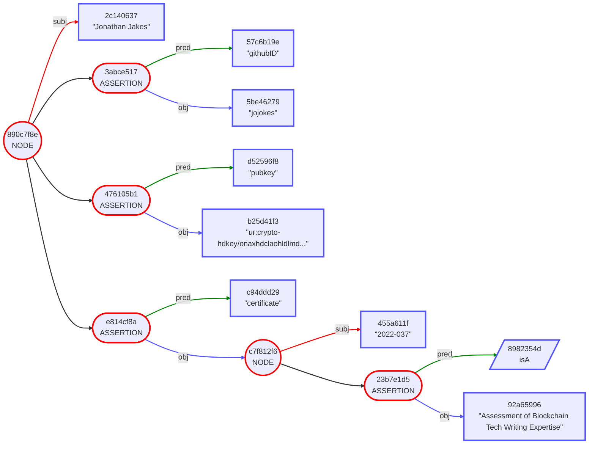

# Gordian Envelope Use Case: Educational Credentials

The following set of use cases demonstrate the use of Gordian Envelopes to store educational credentials. Individual categories are presented progressively: each use case builds on the previous one by demonstrating a new capability. The first set refers to Danika Kaschak, an electrical engineer and her official credentials. A standalone use case then focuses on the more ad-hoc credentials possible through a Web of Trust. Finally, another set of use cases demonstrates the distribution of credentials with a different priority: herd privacy.

Gordian Envelopes are useful for credentials in large part because of their ability to support advanced features such as elision, peer-based attestation, and herd privacy. They go far beyond just presenting validatable credentials to allowing the individual holders to decide what gets credentialed, what gets shown, how, and in what context. They thus add self-sovereign control to the standard rubric of Verifiable Credentials.

* [Part One: Official Credentials](https://github.com/BlockchainCommons/Gordian/blob/master/Docs/Envelope-Use-Cases-Educational.md#part-one-official-credentials)
   * #1: [Danika Proves Her Worth (Credentials, Signature)](https://github.com/BlockchainCommons/Gordian/blob/master/Docs/Envelope-Use-Cases-Educational.md#1-danika-proves-her-worth-credentials-signature)
   * #2: [Danika Restricts Her Revelations (Elision)](https://github.com/BlockchainCommons/Gordian/blob/master/Docs/Envelope-Use-Cases-Educational.md#2-danika-restricts-her-revelations-elision)
   * #3: [Thunder & Lightning Spotlights Danika (Third-Party Repackaging)](https://github.com/BlockchainCommons/Gordian/blob/master/Docs/Envelope-Use-Cases-Educational.md#3-thunder--lightning-spotlights-danika-third-party--repackaging)
* [Part Two: Web of Trust Credentials](https://github.com/BlockchainCommons/Gordian/blob/master/Docs/Envelope-Use-Cases-Educational.md#part-two-web-of-trust-credentials)
   * #4: [Omar Offers an Open Badge (Web of Trust Credentials)](https://github.com/BlockchainCommons/Gordian/blob/master/Docs/Envelope-Use-Cases-Educational.md#4-omar-offers-an-open-badge-web-of-trust-credentials)
* [Part Three: Herd Privacy Credentials](https://github.com/BlockchainCommons/Gordian/blob/master/Docs/Envelope-Use-Cases-Educational.md#part-three-herd-privacy-credentials)
   * #5: [Paul Private Proves Proficiency (Herd Privacy)](https://github.com/BlockchainCommons/Gordian/blob/master/Docs/Envelope-Use-Cases-Educational.md#5-paul-privately-proves-proficiency-herd-privacy)

_The Danika Kaschak examples in #1 through #3 are drawn directly from [07-Elision-Example](https://github.com/BlockchainCommons/envelope-cli-swift/blob/master/Docs/7-VC-ELISION-EXAMPLE.md), one of the documents for the [Envelope-CLI app](https://github.com/BlockchainCommons/envelope-cli-swift)._

## Part One: Official Credentials

This first set of use cases demonstrates how to create (and sign) simple credentials, how the subject can elide data, how another holder can elide data, and how additional parties can add data and even new signatures to a credential.

### #1. Danika Proves Her Worth (Credentials, Signature)

> _Problem Solved:_ Danika needs to be able to prove her credentials as an electrical engineer without depending on a centralized authority.

Danika is a credentialed electrical engineer who maintains her certification through continuing education. In past years she would have listed her credentials and then potential employers would have had to go to the certification board to verify them. This was ideal for no one, because most employers didn't check certifications (leaving them vulnerable), and if they did, the check was beholden to the certification board, who might fail to verify valid credentials for any number of reasons.

Enter the new world of digital credentials. Danika is now able to show a single Gordian Envelope which lists her exact credentials:

```
CID(4676635a) [
    "certificateNumber": "123-456-789"
    "continuingEducationUnits": 1.5
    "expirationDate": 2028-01-01
    "firstName": "Danika"
    "issueDate": 2022-09-01
    "lastName": "Kaschak"
    "photo": "This is Danika Kaschak's photo."
    "professionalDevelopmentHours": 15
    "subject": "RF and Microwave Engineering"
    "topics": CBOR
    "ur:pub": "ur:crypto-pubkeys/lftaaosehdcxztpl..."
    controller: "Example Electrical Engineering Board"
    isA: "Certificate of Completion"
    issuer: "Example Electrical Engineering Board"
]
```

Of course a credential like this only has real value if it's signed; this is what ensures that no one has to reach out to the certification board, because they've issued a signed certificate in advance. 

Now, checking Danika's credentials is easy, because the signature just needs to be validated against a PKI, and that shouldn't depend on the certification board responding in a timely and appropriate way.
```
{
    CID(4676635a) [
        "certificateNumber": "123-456-789"
        "continuingEducationUnits": 1.5
        "expirationDate": 2028-01-01
        "firstName": "Danika"
        "issueDate": 2022-09-01
        "lastName": "Kaschak"
        "photo": "This is Danika Kaschak's photo."
        "professionalDevelopmentHours": 15
        "subject": "RF and Microwave Engineering"
        "topics": CBOR
        "ur:pub": "ur:crypto-pubkeys/lftaaosehdcxztpl..."
        controller: "Example Electrical Engineering Board"
        isA: "Certificate of Completion"
        issuer: "Example Electrical Engineering Board"
    ]
} [
    note: "Signed by Example Electrical Engineering Board"
    verifiedBy: Signature
]

```

The new envelope wraps the original credentials and both signs them and adds a note describing the signature. Additional hints for PKI to lookup the signature could also have been added.

### #2. Danika Restricts Her Revelations (Elision)

> _Problem Solved:_ Danika wants to avoid prejudice when using her credentials in job applications.

Danika is very confident in her prowess as an electrical engineer, but she fears prejudice when she seeks employment. Primarily, she is concerned about prejudice over her Eastern Europe name, but she also fears prejudice over the recent date of her certification. As a result, she produces a new, elided version of her credential that omits that information as well as other details that she considers irrelevent to her application.
```
{
    CID(4676635a) [
        "expirationDate": 2028-01-01
        "subject": "RF and Microwave Engineering"
        isA: "Certificate of Completion"
        issuer: "Example Electrical Engineering Board"
        ELIDED (10)
    ]
} [
    note: "Signed by Example Electrical Engineering Board"
    verifiedBy: Signature
]
```

Danika can now get a prejudice-free review of her credentials while still verifying that they're hers by proving ownership of her CID.

Note that all of the hashes in the Structured Merkle Tree stay the same despite the elision. That means that the certification board's signature remains valid as well.

Danika supplements her certification with excellent scores in a third-party proctored test (producing another credential), and is hired by Thunder & Lightning Inc.

## 3. Thunder & Lightning Spotlights Danika (Third-Party  Repackaging)

> _Problem Solved:_ Thunder & Lightning Inc. needs to repackage Danika's credentials for their customers.

Thunder & Lightning Inc. is ready to send Danika to a job site! To do so they must both reveal and affirm her credentials to the job-site supervisors. Even though they are neither the issuer nor the holder of Danika's educational credentials, Thunder & Lightning is able to produce their own version of Danika's credentials.

They want Danika's name in the credentials, so they must ask her for a new copy, but then they elide the rest of the information just like she did. This is one of the strengths of Gordian Envelope: each party who holds the Envelope (or even an already-elided form of the Envelope) can choose how to further elide it to match their own requirements and their own risk models.
```
{
    CID(4676635a) [
        "expirationDate": 2028-01-01
        "firstName": "Danika"
        "lastName": "Kaschak"
        "subject": "RF and Microwave Engineering"
        isA: "Certificate of Completion"
        issuer: "Example Electrical Engineering Board"
        ELIDED (8)
    ]
} [
    note: "Signed by Example Electrical Engineering Board"
    verifiedBy: Signature
]
```

However, Thunder & Lightning Inc. also needs to add details of Danika's work with them. They do that by wrapping the original envelope and adding information on Danika's employment.
```
{
    {
        CID(4676635a) [
            "expirationDate": 2028-01-01
            "firstName": "Danika"
            "lastName": "Kaschak"
            "subject": "RF and Microwave Engineering"
            isA: "Certificate of Completion"
            issuer: "Example Electrical Engineering Board"
            ELIDED (8)
        ]
    } [
        note: "Signed by Example Electrical Engineering Board"
        verifiedBy: Signature
    ]
} [
    "employeeHiredDate": 2022-10-01
    "employeeStatus": "active"
]
```

There's one final step. Since Thunder & Lightning Inc. added what are essentially new credentials, they need to wrap the envelope one more time, then sign it, to make their new claims verifiable.
```
{
    {
        {
            CID(4676635a) [
                "expirationDate": 2028-01-01
                "firstName": "Danika"
                "lastName": "Kaschak"
                "subject": "RF and Microwave Engineering"
                isA: "Certificate of Completion"
                issuer: "Example Electrical Engineering Board"
                ELIDED (8)
            ]
        } [
            note: "Signed by Example Electrical Engineering Board"
            verifiedBy: Signature
        ]
    } [
        "employeeHiredDate": 2022-10-01
        "employeeStatus": "active"
    ]
} [
    note: "Signed by Thunder & Lightning Inc."
    verifiedBy: Signature
]
```


In case the checksums have gotten too small to read, here's a look at the three stages of this use case using the `--tree` function from `envelope-cli`:

**Redacted Credential:**
```
820fcb63 NODE
    d8f990a1 subj WRAPPED
        b891373a subj NODE
            3b888f3c subj CID(4676635a)
            3d00d64f ELIDED
            44736993 ELIDED
            46d6cfea ASSERTION
                8982354d pred isA
                112e2cdb obj "Certificate of Completion"
            4a69fca3 ELIDED
            5545f6e2 ASSERTION
                954c8356 pred issuer
                4035b4bd obj "Example Electrical Engineering Board"
            5e75ff3b ELIDED
            61689bb7 ASSERTION
                e6c2932d pred "expirationDate"
                b91eea18 obj 2028-01-01
            82825e3e ASSERTION
                eb62836d pred "lastName"
                86236e63 obj "Kaschak"
            a0274d1c ELIDED
            e0070876 ASSERTION
                0eb38394 pred "subject"
                b059b0f2 obj "RF and Microwave Engineering"
            e96b24d9 ELIDED
            eb1f3ba0 ELIDED
            f57c11a8 ASSERTION
                c4d5323d pred "firstName"
                03ead475 obj "Danika"
            fcb3d37a ELIDED
    040e7274 ASSERTION
        d59f8c0f pred verifiedBy
        3f1752a0 obj Signature
    afe231cc ASSERTION
        61fb6a6b pred note
        f4bf011f obj "Signed by Example Electrical Engineering Board"
```
**Redacted Credential with Employment Credentials:**
```
abdedfa9 NODE
    41c818e9 subj WRAPPED
        820fcb63 subj NODE
            d8f990a1 subj WRAPPED
                b891373a subj NODE
                    3b888f3c subj CID(4676635a)
                    3d00d64f ELIDED
                    44736993 ELIDED
                    46d6cfea ASSERTION
                        8982354d pred isA
                        112e2cdb obj "Certificate of Completion"
                    4a69fca3 ELIDED
                    5545f6e2 ASSERTION
                        954c8356 pred issuer
                        4035b4bd obj "Example Electrical Engineering Board"
                    5e75ff3b ELIDED
                    61689bb7 ASSERTION
                        e6c2932d pred "expirationDate"
                        b91eea18 obj 2028-01-01
                    82825e3e ASSERTION
                        eb62836d pred "lastName"
                        86236e63 obj "Kaschak"
                    a0274d1c ELIDED
                    e0070876 ASSERTION
                        0eb38394 pred "subject"
                        b059b0f2 obj "RF and Microwave Engineering"
                    e96b24d9 ELIDED
                    eb1f3ba0 ELIDED
                    f57c11a8 ASSERTION
                        c4d5323d pred "firstName"
                        03ead475 obj "Danika"
                    fcb3d37a ELIDED
            040e7274 ASSERTION
                d59f8c0f pred verifiedBy
                3f1752a0 obj Signature
            afe231cc ASSERTION
                61fb6a6b pred note
                f4bf011f obj "Signed by Example Electrical Engineering Board"
    0001c9c5 ASSERTION
        134a1704 pred "employeeHiredDate"
        a3687c5b obj 2022-10-01
    310b027f ASSERTION
        f942ee55 pred "employeeStatus"
        919eb85d obj "active"
```
**Redacted Credentials with Employment Warranty:**
```
275ac4ea NODE
    a7bf95d5 subj WRAPPED
        abdedfa9 subj NODE
            41c818e9 subj WRAPPED
                820fcb63 subj NODE
                    d8f990a1 subj WRAPPED
                        b891373a subj NODE
                            3b888f3c subj CID(4676635a)
                            3d00d64f ELIDED
                            44736993 ELIDED
                            46d6cfea ASSERTION
                                8982354d pred isA
                                112e2cdb obj "Certificate of Completion"
                            4a69fca3 ELIDED
                            5545f6e2 ASSERTION
                                954c8356 pred issuer
                                4035b4bd obj "Example Electrical Engineering Board"
                            5e75ff3b ELIDED
                            61689bb7 ASSERTION
                                e6c2932d pred "expirationDate"
                                b91eea18 obj 2028-01-01
                            82825e3e ASSERTION
                                eb62836d pred "lastName"
                                86236e63 obj "Kaschak"
                            a0274d1c ELIDED
                            e0070876 ASSERTION
                                0eb38394 pred "subject"
                                b059b0f2 obj "RF and Microwave Engineering"
                            e96b24d9 ELIDED
                            eb1f3ba0 ELIDED
                            f57c11a8 ASSERTION
                                c4d5323d pred "firstName"
                                03ead475 obj "Danika"
                            fcb3d37a ELIDED
                    040e7274 ASSERTION
                        d59f8c0f pred verifiedBy
                        3f1752a0 obj Signature
                    afe231cc ASSERTION
                        61fb6a6b pred note
                        f4bf011f obj "Signed by Example Electrical Engineering Board"
            0001c9c5 ASSERTION
                134a1704 pred "employeeHiredDate"
                a3687c5b obj 2022-10-01
            310b027f ASSERTION
                f942ee55 pred "employeeStatus"
                919eb85d obj "active"
    36367ff6 ASSERTION
        d59f8c0f pred verifiedBy
        edca9a73 obj Signature
    829934e2 ASSERTION
        61fb6a6b pred note
        0dca250c obj "Signed by Thunder & Lightning Inc."
```

## Part Two: Web of Trust Credentials

It can be relatively easy to validate official credentials from centralized authorities. However, Gordian Envelopes also allow for the issuance of peer-to-peer credentials by incorporating metadata that can aid in their validation.

### 4. Omar Offers an Open Badge [Web of Trust Credentials]

> _Problem Solved:_ Jonathan wants to prove his expertise in blockchain tech writing, but there are no official credentials. 

Jonathan has been doing technical writing on blockchains for a few years and wants to extend that into a freelance career. Unfortunately, most of his extant writing has been internal documents and so he can't point potential employers to them. 

Omar, an expert in blockchain technical writing, has GitHub repos that are filled with examples of his own excellent writing, and that's led him to offer Open Badges for other people whose writing he thinks is up to spec. He creates credentials for them signed with his GitHub private key.

After positively assessing Jonath's tech writing, Omar creates a credential that identifies Jonathan and certifies his expertise.
```
"Jonathan Jakes" [
    "certificate": "2022-037" [
        isA: "Assessment of Blockchain Tech Writing Expertise"
    ]
    "githubID": "jojokes"
    "pubkey": "ur:crypto-hdkey/onaxhdclaohldlmdrtlacxhnfpptplfyltwelafsnezslyndhllnvdimmwlpylkbwzjltbdmenaahdcxlejt"
]
```

Omar then adds on information to identify himself by using a `certifiedBy` predicate that he places in the `certificate`:
```
"Jonathan Jakes" [
    "certificate": "2022-037" [
        "certifiedBy": "Omar Chaim" [
            "githubID": "omarc-bc-guy"
            "pubkeyURL": "https://github.com/omarc-bc-guy.keys"
        ]
        isA: "Assessment of Blockchain Tech Writing Expertise"
    ]
    "githubID": "jojokes"
    "pubkey": "ur:crypto-hdkey/onaxhdclaohldlmdrtlacxhnfpptplfyltwelafsnezslyndhllnvdimmwlpylkbwzjltbdmenaahdcxlejt"
]
```

The `githubID` acts as Omar's own credentials. Validators can view it to decide the worth of Omar's certification, as is traditional in a web of trust. `pubkeyURL` is meant as a hint so that validators don't have to figure out where to look up the public key associated with the GitHub-ID, but obviously any validator will need to thoughtfully consider whether the hint is proper and links to the ID shown.

To finalize the Open Badge, Omar must then wrap the envelope and sign it with the private key associated with the public key he has registered on GitHub.
```
{
    "Jonathan Jakes" [
        "certificate": "2022-037" [
            "certifiedBy": "Omar Chaim" [
                "githubID": "omarc-bc-guy"
                "pubkeyURL": "https://github.com/omarc-bc-guy.keys"
            ]
            isA: "Assessment of Blockchain Tech Writing Expertise"
        ]
        "githubID": "jojokes"
        "pubkey": "ur:crypto-hdkey/onaxhdclaohldlmdrtlacxhnfpptplfyltwelafsnezslyndhllnvdimmwlpylkbwzjltbdmenaahdcxlejt"
    ]
} [
    verifiedBy: Signature
]
```


## Part Three: Herd Privacy Credentials

Educational credentials are usually presumed to be packaged in discrete Envelopes that identify a single user. However, some situations may benefit from conglomerating thousands of credentials in a single Envelope, giving each of those users privacy  even from the credential issuer!

### 5. Paul Privately Proves Proficiency [Herd Privacy]

> _Problem Solved:_ Paul wants a credential, but he doesn't trust the organization giving out the credentials with his personal information!

Paul wants to get a credential showing proficiency in Gordian Envelope from Blockchain Commons, but he's a good Cypherpunk: he knows not to trust any organization. Fortunately, Blockchain Commons has privacy-protecting options.

Paul can take an online test in either Basic form (automated Q&A with a time limit) or Advanced form (Q&A with a live proctor on Zoom). He chooses the former, again for privacy reasons. After he succeeds at the test (50 out of 50, of course!), he needs to get his credential.

At this point, more credential issuers would require Paul to give up an email address and then mail them the personal credential, but Blockchain Commons' privacy preserving methodology simply requires Paul to give them a DID (for which he presumably controls the private key). They'll then embed that DID in a very large Envelope with the credentials of everyone who succeeded at the test that month. (Paul must wait until the Envelope is generated before he can prove anything!)

At the end of the month, Blockchain Commons creates a large Gordian Envelope that contains the DIDs of everyone who passed their test that month, with a statement as to whether each DID `isBasic` or `isAdvanced`.

(An actual example would likely have hundreds of entries to ensure herd privacy. The following examples notably reduce that for readability.)
```
"Blockchain Commons Certifactions #13" [
    "certifiedBy": "Blockchain Commons" [
        "pubkeyURL": "https://www.blockchaincommons.com/certification.keys"
    ]
    "date": "11-01-2022"
    "isAdvanced": "ur:crypto-cid/hdcxbetimuglwppshfqdsahsktgmnelsjnbdcanspmnshkpecxcfztlkiohgenytntmkaxjngadt"
    "isAdvanced": "ur:crypto-cid/hdcxjsdwaegrpfwmbkehhscwmshpchlnhhayadadwszcghhtmnzcgomhutcmytldfwpadmdlcwfe"
    "isAdvanced": "ur:crypto-cid/hdcxmhtnnlcshsjzhywyhgttsrgulstdwdnezesekosndnfxswzezolrfdcwlulacxeopdkghnht"
    "isBasic": "ur:crypto-cid/hdcxaepthffshppabkgydawmlftbpfrnaefzrdjehybwtskgmwveenwzntpyhdrpsfqzsgqdftnb"
    "isBasic": "ur:crypto-cid/hdcxdkmhpfathyyltnnboypsemehkimudnkgeyosgolncfmdnboypsecpsghtefzetkndpeylrfz"
    "isBasic": "ur:crypto-cid/hdcxfnmdsrgdkbvekoecwevystbaztbwcshpqdbzkeatjlndlywepyctlkvwemhkiyhtenwnghda"
    "isBasic": "ur:crypto-cid/hdcxhnutcyktgtfxotvegrhllypakenlgoetmnnlimsktppkssloghpahsdeparktbkerebatyce"
    "isBasic": "ur:crypto-cid/hdcxiadtuowtsrynlfbslgplynrlonpfbaeolkbzztsngtasjpenwmdevojsgmplishhurkebnts"
    "isBasic": "ur:crypto-cid/hdcxmnktvdgeettlfmbklytaseayoeplwynbsawdurmuuelbbsfxbbaxkkpsemjovybzswqdssva"
    "isBasic": "ur:crypto-cid/hdcxuykblalfdalsvaplrfzsoxqdvdclstmdtssfdatkmecwnsbzmseohswldaytdmsfbwaxvewp"
]

```

As usual, a signature is required to verify credentials. The credentials are thus wrapped and signed. This signature should match the `pubkeyURL` provided.
```
{
    "Blockchain Commons Certifactions #13" [
        "certifiedBy": "Blockchain Commons" [
            "pubkeyURL": "https://www.blockchaincommons.com/certification.keys"
        ]
        "date": "11-01-2022"
        "isAdvanced": "ur:crypto-cid/hdcxbetimuglwppshfqdsahsktgmnelsjnbdcanspmnshkpecxcfztlkiohgenytntmkaxjngadt"
        "isAdvanced": "ur:crypto-cid/hdcxjsdwaegrpfwmbkehhscwmshpchlnhhayadadwszcghhtmnzcgomhutcmytldfwpadmdlcwfe"
        "isAdvanced": "ur:crypto-cid/hdcxmhtnnlcshsjzhywyhgttsrgulstdwdnezesekosndnfxswzezolrfdcwlulacxeopdkghnht"
        "isBasic": "ur:crypto-cid/hdcxaepthffshppabkgydawmlftbpfrnaefzrdjehybwtskgmwveenwzntpyhdrpsfqzsgqdftnb"
        "isBasic": "ur:crypto-cid/hdcxdkmhpfathyyltnnboypsemehkimudnkgeyosgolncfmdnboypsecpsghtefzetkndpeylrfz"
        "isBasic": "ur:crypto-cid/hdcxfnmdsrgdkbvekoecwevystbaztbwcshpqdbzkeatjlndlywepyctlkvwemhkiyhtenwnghda"
        "isBasic": "ur:crypto-cid/hdcxhnutcyktgtfxotvegrhllypakenlgoetmnnlimsktppkssloghpahsdeparktbkerebatyce"
        "isBasic": "ur:crypto-cid/hdcxiadtuowtsrynlfbslgplynrlonpfbaeolkbzztsngtasjpenwmdevojsgmplishhurkebnts"
        "isBasic": "ur:crypto-cid/hdcxmnktvdgeettlfmbklytaseayoeplwynbsawdurmuuelbbsfxbbaxkkpsemjovybzswqdssva"
        "isBasic": "ur:crypto-cid/hdcxuykblalfdalsvaplrfzsoxqdvdclstmdtssfdatkmecwnsbzmseohswldaytdmsfbwaxvewp"
    ]
} [
    verifiedBy: Signature
]
```

However, to create herd privacy, Blockchain Commons doesn't release the full Envelope. Instead, they release an elided version that only contains the certification information and signature.
```
{
    "Blockchain Commons Certifactions #13" [
        "certifiedBy": "Blockchain Commons" [
            "pubkeyURL": "https://www.blockchaincommons.com/certification.keys"
        ]
        "date": "11-01-2022"
        ELIDED (10)
    ]
} [
    verifiedBy: Signature
]
```

Note that each elided entry of certification still has its prior hash. All that Paul needs to do is prove that he can generate one of those hashes with his CID, and he proves his certification!

Blockchain Commons publishes instructions for how to do so. Test takers just need to create an assertion with either the "isBasic" predicate or the "isAdvanced" predicate and their portable `ur:crypto-cid`. When they hash that assertion with BLAKE3, they can then prove that the digest is part of the partially redacted list of credentials.

Paul creates his assertion based on the instructions:
```
"isBasic": "ur:crypto-cid/hdcxiadtuowtsrynlfbslgplynrlonpfbaeolkbzztsngtasjpenwmdevojsgmplishhurkebnts"
```

He then creates the digest of that credential:
```
ur:crypto-digest/hdcxhdwnsntebthnrhzmzsjpvazttpzctlmhcwrffnlthhgdkptscsayzmcxndpdessabzjekbur
```
That's the Blake3 hash of his assertion in UR form. If converted to hex, it is:
```
58F1CDD30D60B9FFFA72E6FCD8FDD5901BBC3C875C5075D71808FF209BA839C2
```
As can be seen, that matches the third redacted hash in the Mermaid diagram above, which was the `isBasic` assertion for `ur:crypto-cid/hdcxiadtuowtsrynlfbslgplynrlonpfbaeolkbzztsngtasjpenwmdevojsgmplishhurkebnts`.

Now, Paul can point to Blockchain Common's partially redacted tree of November 2022 certifications, reveal his CID, acknowledge that he passed the basic testing, and show his digest. Together these facts prove that the CID is part of the tree. 

More notably, Paul can decide never to reveal his CID, and then it's more difficult to prove that it's a member of this group.

Mind you, because the tree is partially redacted, and because no particular attempt has been made to prevent correlation, its possible that CIDs in the Envelope could be guessed. There are several ways this could be prevented. They all require Blockchain Commons to provide additional information to Paul, increasing the communication requirements (and thus potentially impacting privacy), but they add strong non-correlation defenses.

1.) Blockchain Commons could choose to fully redact the Envelope, publishing only a top-level hash. They would then supply Paul with a path to his lower-level hash by partially redacting the tree when he supplied them with his CID. Paul could then prove his presence in the Envelope with his digest and that path. If that path were to be more widely released, there would be the same correlation problems, but obviously they'd be lesser because it probably would never be widely published.

2.) Alternatively, Blockchain Commons could restructure the Envelope so that every 5 or 10 or 20 CIDs are placed in a subenvelope. Their publicly published proof would only show the hashes of these subenvelopes, which will be relatively impossible to correlate. Paul would then be able to request a path to his own subenvelope. Even if this path were more widely released, there would only be a possibility of correlation for the other CIDs that happen to be in that subenvelope.

3.) Finally, Blockchain Commons could choose to salt every CID in the Envelope. They would then have to supply Paul with his salt. (The twin limitations here are that salting everything dramatically increases the size of the Envelope and that Paul has a piece of data that he can't lose).

_Herd privacy is one of the strong, unique features of Gordian Envelope. We plan to extend these Educational examples with a few more looks at it, either extending the alternative methodologies discussed here or offering other features._

### Related Files

* [Other Envelope Use Cases](https://github.com/BlockchainCommons/Gordian/blob/master/Docs/Envelope-Intro.md#usage-of-envelopes)

