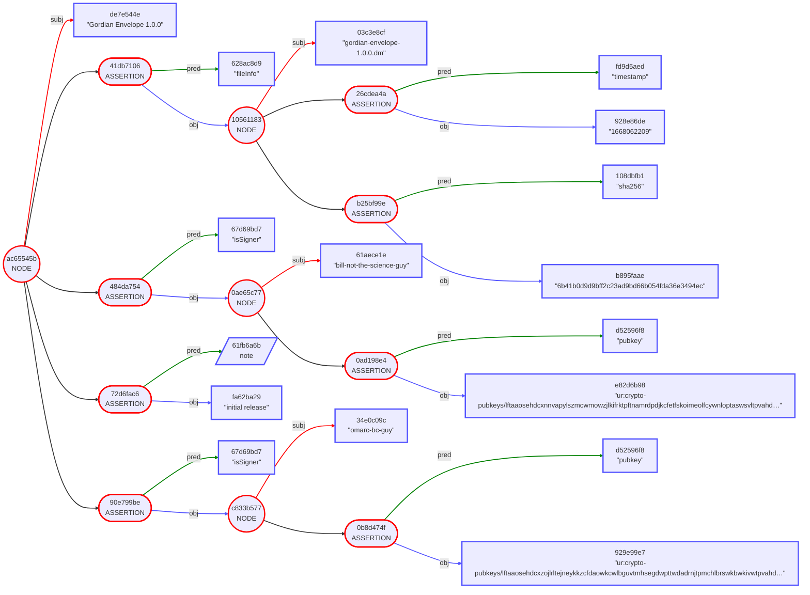
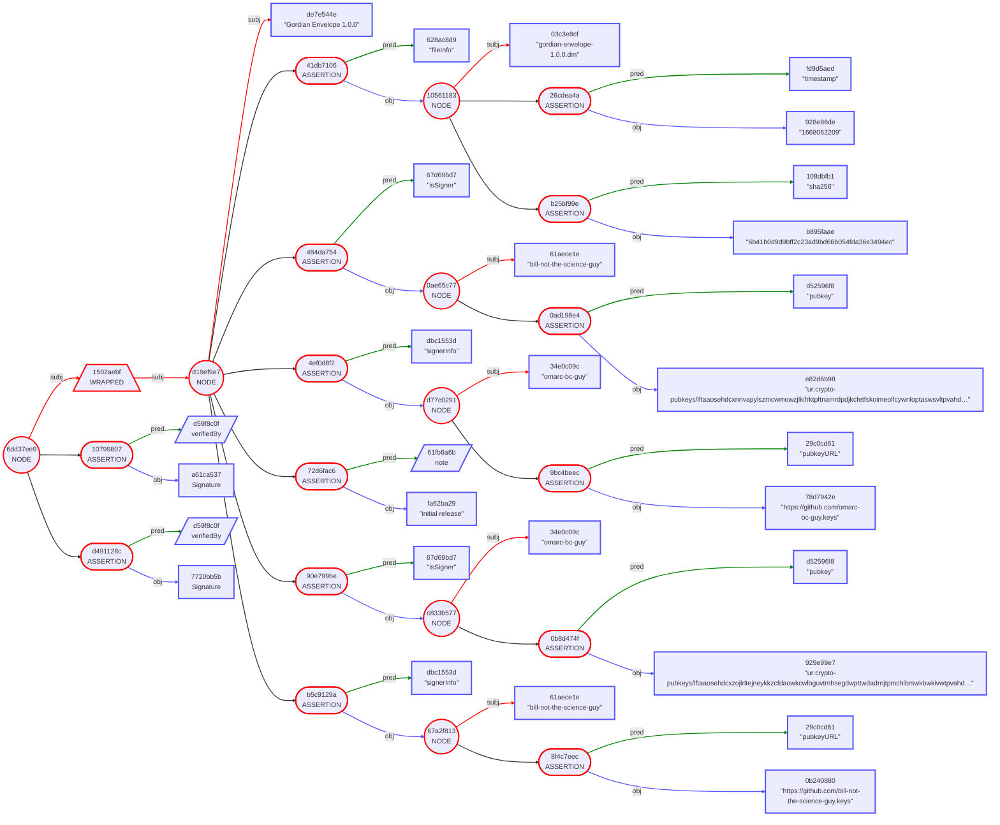
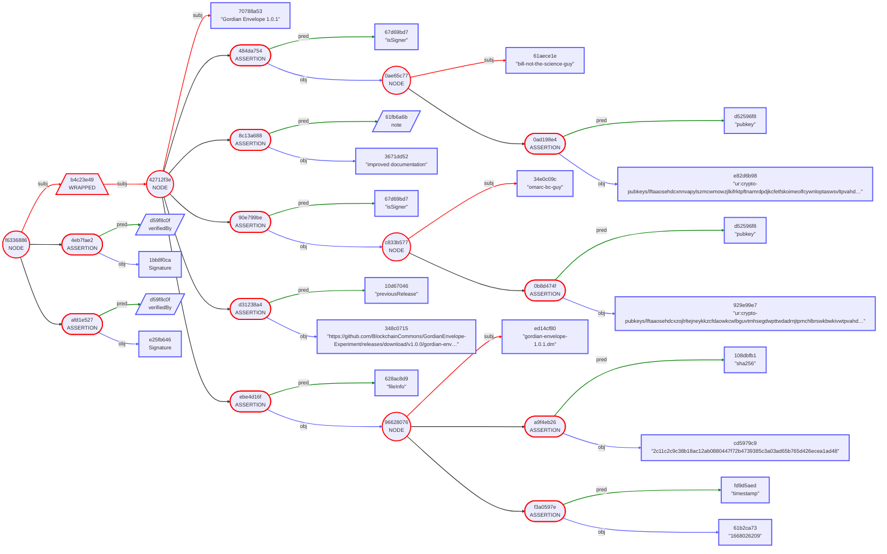

## Gordian Envelope Use Case: Software Signing

Envelopes can be used in a variety of collaborative forms. Following are examples of collaborative signing, where a group of individuals jointly declare the validity of an envelope to ensure the trustworthiness of a software release.  The three use cases are presented progressively, demonstrating how a group of users can jointly validate the contents of an envelope, even as the group evolves over time.

Gordian Envelopes are useful for signing applications in large part because of their ability to combine signatures with metadata and to chain that information over time through multiple signed documents. This allows for the creation of a history of signatures, which can have a variety of applications.

* #1: [Casey Codifies Software Releases](https://github.com/BlockchainCommons/Gordian/blob/master/Docs/Envelope-Use-Cases-Software.md#1-casey-codifies-software-releases-multiple-signatures-structured-data)
* #2: [Casey Chains His Software Releases](https://github.com/BlockchainCommons/Gordian/blob/master/Docs/Envelope-Use-Cases-Software.md#2-casey-chains-his-software-releases-chained-data)
* #3: [Casey Changes Up His Software Releases](https://github.com/BlockchainCommons/Gordian/blob/master/Docs/Envelope-Use-Cases-Software.md#3-casey-changes-up-his-software-releases-chained-changes)

## Software Signing

This set of use cases describes how a user can structure and sign data, how he can chain envelopes of data over time, and how he can change up signers over time. They demonstrate how well-structured envelopes can decrease validation costs and improve trust.

### 1. Casey Codifies Software Releases [Multiple Signatures, Structured Data]

> _Problem:_ Casey needs to produce multi-signed software releases using structured files that are easily checkable by automated means.

The possibility of malicious actors injecting code into software is a [prime attack vector](https://github.com/WebOfTrustInfo/rwot11-the-hague/blob/master/final-documents/taking-out-the-crud-five-fabulous-did-attacks.md#1-create-the-did-creation-switcharoo), especially on the modern internet with its open-source repositories. Thus, checksumming and signing sotware releases has become increasingly important. Unfortunately, it remains very ad hoc, with styles of release varying widely and information often split among many files.

Casey decides on a methodology where he'll store all of the information in a single Gordian Envelope with regularized data. He fills in an Envelope with a list of all the files, a list of all the signers, data on each, and some additional notes:

```
"Gordian Envelope 1.0.0" [
    "fileInfo": "gordian-envelope-1.0.0.dm" [
        "sha256": "6b41b0d9d9bff2c23ad9bd66b054fda36e3494ec"
        "timestamp": "1668062209"
    ]
    "isSigner": "bill-not-the-science-guy" [
        "pubkey": "ur:crypto-pubkeys/lftaaosehdcxnnvapylszmcwmowzjlkifrktpftnamrdpdjkcfetfskoimeolfcywnloptaswsvltpvahd…"
    ]
    "isSigner": "omarc-bc-guy" [
        "pubkey": "ur:crypto-pubkeys/lftaaosehdcxzojlrltejneykkzcfdaowkcwlbguvtmhsegdwpttwdadrnjtpmchlbrswkbwkivwtpvahd…"
    ]
    note: "initial release"
]
```


Since this is the initial release of the Envelope, no one knows whether the signers can be trusted or not. Casey bootstraps the envelope by adding `signerInfo` hints, which tell validators where they can go to get more information about the included public keys. As usual, validators will then have to thoughtfully address the trustworthiness of that information.

```
"Gordian Envelope 1.0.0" [
    "fileInfo": "gordian-envelope-1.0.0.dm" [
        "sha256": "6b41b0d9d9bff2c23ad9bd66b054fda36e3494ec"
        "timestamp": "1668062209"
    ]
    "isSigner": "bill-not-the-science-guy" [
        "pubkey": "ur:crypto-pubkeys/lftaaosehdcxnnvapylszmcwmowzjlkifrktpftnamrdpdjkcfetfskoimeolfcywnloptaswsvltpvahd…"
    ]
    "isSigner": "omarc-bc-guy" [
        "pubkey": "ur:crypto-pubkeys/lftaaosehdcxzojlrltejneykkzcfdaowkcwlbguvtmhsegdwpttwdadrnjtpmchlbrswkbwkivwtpvahd…"
    ]
    "signerInfo": "bill-not-the-science-guy" [
        "pubkeyURL": "https://github.com/bill-not-the-science-guy.keys"
    ]
    "signerInfo": "omarc-bc-guy" [
        "pubkeyURL": "https://github.com/omarc-bc-guy.keys"
    ]
    note: "initial release"
]
```


Of course, one more thing is necessary to make the `fileInfo` trustworthy: the envelope must be signed. Casey's lead developers, Bill and Omar, each provide a signature, creating a group verification that can be checked against either signature (or both).

In order for those signatures to apply to the entire envelope, the envelope must first be wrapped; because signatures are assertions, they'd otherwise just apply to the subject, "Gordian Envelope 1.0.0", which wouldn't be that useful! After wrapping the envelope, both Bill and Omar can sign.
```
{
    "Gordian Envelope 1.0.0" [
        "fileInfo": "gordian-envelope-1.0.0.dm" [
            "sha256": "6b41b0d9d9bff2c23ad9bd66b054fda36e3494ec"
            "timestamp": "1668062209"
        ]
        "isSigner": "bill-not-the-science-guy" [
            "pubkey": "ur:crypto-pubkeys/lftaaosehdcxnnvapylszmcwmowzjlkifrktpftnamrdpdjkcfetfskoimeolfcywnloptaswsvltpvahd…"
        ]
        "isSigner": "omarc-bc-guy" [
            "pubkey": "ur:crypto-pubkeys/lftaaosehdcxzojlrltejneykkzcfdaowkcwlbguvtmhsegdwpttwdadrnjtpmchlbrswkbwkivwtpvahd…"
        ]
        "signerInfo": "bill-not-the-science-guy" [
            "pubkeyURL": "https://github.com/bill-not-the-science-guy.keys"
        ]
        "signerInfo": "omarc-bc-guy" [
            "pubkeyURL": "https://github.com/omarc-bc-guy.keys"
        ]
        note: "initial release"
    ]
} [
    verifiedBy: Signature
    verifiedBy: Signature
]
```


### 2. Casey Chains His Software Releases [Chained Data]

> _Problem Solved:_ Casey wants to be able to continuously rerelease his software, while reducing validation cost over time.

Because Casey has now established a root of trust with his initial release he can make a new release without having to reestablish his signers. 

```
"Gordian Envelope 1.0.1" [
    "fileInfo": "gordian-envelope-1.0.1.dm" [
        "sha256": "2c11c2c9c38b18ac12ab0880447f72b4739385c3a03ad65b765d426ecea1ad48"
        "timestamp": "1668026209"
    ]
    "isSigner": "bill-not-the-science-guy" [
        "pubkey": "ur:crypto-pubkeys/lftaaosehdcxnnvapylszmcwmowzjlkifrktpftnamrdpdjkcfetfskoimeolfcywnloptaswsvltpvahd…"
    ]
    "isSigner": "omarc-bc-guy" [
        "pubkey": "ur:crypto-pubkeys/lftaaosehdcxzojlrltejneykkzcfdaowkcwlbguvtmhsegdwpttwdadrnjtpmchlbrswkbwkivwtpvahd…"
    ]
    "previousRelease": "https://github.com/BlockchainCommons/GordianEnvelope-Experiment/releases/download/v1.0.0/gordian-env…"
    note: "improved documentation"
]
```

After wrapping and signing, the final envelope is:
```    
{
    "Gordian Envelope 1.0.1" [
        "fileInfo": "gordian-envelope-1.0.1.dm" [
            "sha256": "2c11c2c9c38b18ac12ab0880447f72b4739385c3a03ad65b765d426ecea1ad48"
            "timestamp": "1668026209"
        ]
        "isSigner": "bill-not-the-science-guy" [
            "pubkey": "ur:crypto-pubkeys/lftaaosehdcxnnvapylszmcwmowzjlkifrktpftnamrdpdjkcfetfskoimeolfcywnloptaswsvltpvahd…"
        ]
        "isSigner": "omarc-bc-guy" [
            "pubkey": "ur:crypto-pubkeys/lftaaosehdcxzojlrltejneykkzcfdaowkcwlbguvtmhsegdwpttwdadrnjtpmchlbrswkbwkivwtpvahd…"
        ]
        "previousRelease": "https://github.com/BlockchainCommons/GordianEnvelope-Experiment/releases/download/v1.0.0/gordian-env…"
        note: "improved documentation"
    ]
} [
    verifiedBy: Signature
    verifiedBy: Signature
]
```



If the validator kept the envelope that he previously validated, now all that he has to do is see that the users and public keys in this new envelope match the old one, and then validate the signature. It should be entirely automatable.

More complexity is required only if the previous envelope were not kept. In this case, the validator uses the `previousRelease` metadata to backtrack until he finds the foundational `signerInfo`, which he can validate with more effort (as he did originally).

### 3. Casey Changes Up His Software Releases [Chained Changes]

> _Problem Solved:_ Casey wants to change signers over time in a way that's organic and continues to allow for simple validation.

A few years on, Bill leaves software programming for a lucrative career in television and lectures. Though Omar is maintaining the software on his own at this point, Casey wants to ensure that the software still is signed by multiple parties to allow for more robust validation. So he takes over as release manager, checking the software prior to release and adding his own signature.
 
```
{
    "Gordian Envelope 1.7.3" [
        "fileInfo": "gordian-envelope-1.7.3.dm" [
            "sha256": "c2121d1c7b82607fb289282020c6c7f73cb0aaa8e02e5f0529165a4c46591413"
            "timestamp": "1668026209"
        ]
        "fileInfo": "gordian-ttools-1.7.3.dm" [
            "sha256": "7e6865b88d62b1d2bb7864fc7eb73fe74c99a773d2d224adebdd18d679c023f2"
            "timestamp": "1668032076"
        ]
        "isSigner": "casey-the-boss" [
            "pubkey": "ur:crypto-pubkeys/lftaaosehdcxwehehymwkbiolglpnbeevtvttlaafgpdspntrpserplblbgrstwmswjpkkmwdwbatpvahd…"
        ]
        "isSigner": "omarc-bc-guy" [
            "pubkey": "ur:crypto-pubkeys/lftaaosehdcxzojlrltejneykkzcfdaowkcwlbguvtmhsegdwpttwdadrnjtpmchlbrswkbwkivwtpvahd…"
        ]
        "previousRelease": "https://github.com/BlockchainCommons/GordianEnvelope-Experiment/releases/download/v1.7.2/gordian-env…"
        "signerInfo": "casey-the-boss" [
            "pubkeyURL": "https://pki.blockchaincommons.com/casey-the-boss"
        ]
        note: "the latest glorious revision"
    ]
} [
    verifiedBy: Signature
    verifiedBy: Signature
]
```

An ordinary validator can now verify that one of the signatures matches a public key he has in his saved Envelope from release 1.7.2. Automatic validation! This will then allow for a continued chain of validation going forward. If Casey produces 1.7.4 on his own, because Omar is out sick, validators can see that Casey's public key was in 1.7.3, signed by Omar, so they know the new release is safe.

A more strict validator might instead validate the `signerInfo` for Casey themselves. Even if they miss 1.7.3, they'll be able to chain back from any later release until they find the initial one with the `signerInfo`.

Casey is happy that he's achieved his goal: creating software releases that are easily validatable in automated ways, even as engineers change over time.
