## Gordian Envelope Use Case: Software Signing

Envelopes can be used in a variety of collaborative forms. Following are examples of collaborative signing, where a group of individuals jointly declare the validity of an envelope to ensure the trustworthiness of a software release.  The first set of use cases is presented progressively, demonstrating how a group of users can jointly validate the contents of an envelope, even as the group evolves over time.

Gordian Envelopes are useful for signing software releases in large part because of their ability to combine signatures with metadata and to chain that information over time through multiple signed documents. This allows for the creation of a history of signatures, which can have a variety of applications.

* [Chained Signing](https://github.com/BlockchainCommons/Gordian/blob/master/Docs/Envelope-Use-Cases-Software.md#software-signing)
   * #1: [Casey Codifies Software Releases (Multiple Signatures, Structured Data)](https://github.com/BlockchainCommons/Gordian/blob/master/Docs/Envelope-Use-Cases-Software.md#1-casey-codifies-software-releases-multiple-signatures-structured-data)
   * #2: [Blockchain Commons Confirms Casey (Repackaging Data, Third-Party Verification)](https://github.com/BlockchainCommons/Gordian/blob/master/Docs/Envelope-Use-Cases-Software.md#2-blockchain-everyday-confirms-casey-repackaging-data-third-party-verification)
   * #3: [Casey Chains His Software Releases (Chained Data)](https://github.com/BlockchainCommons/Gordian/blob/master/Docs/Envelope-Use-Cases-Software.md#3-casey-chains-his-software-releases-chained-data)
   * #4: [Casey Checks Compliance (Attestation)](https://github.com/BlockchainCommons/Gordian/blob/master/Docs/Envelope-Use-Cases-Software.md#4-casey-check-compliance-attestation-metadata)
   * #5: [Casey Changes Up His Software Releases (Chained Changes)](https://github.com/BlockchainCommons/Gordian/blob/master/Docs/Envelope-Use-Cases-Software.md#5-casey-changes-up-his-software-releases-chained-changes)
* [Anonymous Signing](https://github.com/BlockchainCommons/Gordian/blob/master/Docs/Envelope-Use-Cases-Software.md#anonymous-signing)
   * #6: [Amira Signs Anoymously (Anonymous Signature)](https://github.com/BlockchainCommons/Gordian/blob/master/Docs/Envelope-Use-Cases-Software.md#6-amira-signs-anonymously-anonymous-signature)

## Chained Signing

This set of progressive use cases describes how a user can structure and sign data, how third-parties can verify that data, how a user can chain envelopes of data over time, how additional metadata can be added to envelopes, and how signers can change over time. They demonstrate how well-structured envelopes can decrease validation costs and improve trust.

### 1. Casey Codifies Software Releases [Multiple Signatures, Structured Data]

> _Problem:_ Casey needs to produce multi-signed software releases using structured files that are easily checkable by automated means.

The possibility of malicious actors injecting code into software is a [prime attack vector](https://github.com/WebOfTrustInfo/rwot11-the-hague/blob/master/final-documents/taking-out-the-crud-five-fabulous-did-attacks.md#1-create-the-did-creation-switcharoo), especially on the modern internet with its open-source repositories. Thus, checksumming and signing sotware releases has become increasingly important. Unfortunately, it remains very ad hoc, with styles of release varying widely and information often split among many files.

Casey is the project head for Blockchain Everyday's Gordian Envelope. He decides on a methodology for releases where he'll store all of the release information in a single Gordian Envelope with regularized data and then have the engineers sign that data. He also wants to do his best to automate validation of the envelope data, since he knows that will make it more likely that the data is actually checked. He'll provide some bootstrapping information in the first Envelope to support validation, and then link later software releases to this initial one, allowing for programmatic validation.

A precise and carefully considered structure is the foundation of the software-release information. Casey fills in an Envelope with a list of all the files, a list of all the signers, data on each, and some additional notes:

```
"Gordian Envelope 1.0.0" [
    "fileInfo": "gordian-envelope-1.0.0.dm" [
        "sha256": "6b41b0d9d9bff2c23ad9bd66b054fda36e3494ec"
        "timestamp": "1668062209"
    ]
    "isSigner": "bill-not-the-science-guy" [
        "pubkey": "ur:crypto-pubkeys/lftaaosehdcxnnvapylszmcwmowzjlkifrktpftnamrdpdjkcfetfskoimeolfcywnloptaswsvltpvahd…"
    ]
    "isSigner": "omarc-bc-guy" [
        "pubkey": "ur:crypto-pubkeys/lftaaosehdcxzojlrltejneykkzcfdaowkcwlbguvtmhsegdwpttwdadrnjtpmchlbrswkbwkivwtpvahd…"
    ]
    note: "initial release"
]
```


Since this is the initial release of the Envelope, no one knows whether the signers can be trusted or not. Casey bootstraps the envelope by adding `signerInfo` hints, which tell validators where they can go to get more information about the included public keys. As usual, validators will then have to thoughtfully address the trustworthiness of that information.

```
"Gordian Envelope 1.0.0" [
    "fileInfo": "gordian-envelope-1.0.0.dm" [
        "sha256": "6b41b0d9d9bff2c23ad9bd66b054fda36e3494ec"
        "timestamp": "1668062209"
    ]
    "isSigner": "bill-not-the-science-guy" [
        "pubkey": "ur:crypto-pubkeys/lftaaosehdcxnnvapylszmcwmowzjlkifrktpftnamrdpdjkcfetfskoimeolfcywnloptaswsvltpvahd…"
    ]
    "isSigner": "omarc-bc-guy" [
        "pubkey": "ur:crypto-pubkeys/lftaaosehdcxzojlrltejneykkzcfdaowkcwlbguvtmhsegdwpttwdadrnjtpmchlbrswkbwkivwtpvahd…"
    ]
    "signerInfo": "bill-not-the-science-guy" [
        "pubkeyURL": "https://github.com/bill-not-the-science-guy.keys"
    ]
    "signerInfo": "omarc-bc-guy" [
        "pubkeyURL": "https://github.com/omarc-bc-guy.keys"
    ]
    note: "initial release"
]
```


Of course, one more thing is necessary to make the `fileInfo` trustworthy: the Envelope must be signed. Casey's lead developers, Bill and Omar, each provide a signature, creating a group verification that can be checked against either signature (or both).

In order for those signatures to apply to the entire envelope, the envelope must first be wrapped; because signatures are assertions, they'd otherwise just apply to the subject, "Gordian Envelope 1.0.0", which wouldn't be that useful! After wrapping the envelope, both Bill and Omar can sign.
```
{
    "Gordian Envelope 1.0.0" [
        "fileInfo": "gordian-envelope-1.0.0.dm" [
            "sha256": "6b41b0d9d9bff2c23ad9bd66b054fda36e3494ec"
            "timestamp": "1668062209"
        ]
        "isSigner": "bill-not-the-science-guy" [
            "pubkey": "ur:crypto-pubkeys/lftaaosehdcxnnvapylszmcwmowzjlkifrktpftnamrdpdjkcfetfskoimeolfcywnloptaswsvltpvahd…"
        ]
        "isSigner": "omarc-bc-guy" [
            "pubkey": "ur:crypto-pubkeys/lftaaosehdcxzojlrltejneykkzcfdaowkcwlbguvtmhsegdwpttwdadrnjtpmchlbrswkbwkivwtpvahd…"
        ]
        "signerInfo": "bill-not-the-science-guy" [
            "pubkeyURL": "https://github.com/bill-not-the-science-guy.keys"
        ]
        "signerInfo": "omarc-bc-guy" [
            "pubkeyURL": "https://github.com/omarc-bc-guy.keys"
        ]
        note: "initial release"
    ]
} [
    verifiedBy: Signature
    verifiedBy: Signature
]
```


### 2: Blockchain Everyday Confirms Casey [Repackaging Data, Third-Party Verification]

> _Problem Solved:_ Some corporations require more centralized validation; Blockchain Everday can provide that simply by repackaging an existing envelope.

Casey's plan for bootstrapping the validation of Blockchain Everyday's Gordian Envelope should be sufficient for most users of the software. However, Blockchain Everyday soon discovers that there are corporations that aren't willing to use the software based solely on the public-key-infrastructure (PKI) information derived from individual GitHub accounts. They want the validation of a company that they can look up in Dun & Bradstreet.

Blockchain Everyday doesn't want to reissue the existing release information, but Gordian Envelopes can be repackaged by any holder. That allows Blockchain Everyday to take the release information that Casey registered with GitHub, add more data, sign it themselves, and then publish it through their own website. Similarly, if users of Gordian Envelope were incorporating the software into software libraries _they too_ could repackage either Casey or Blockchain Everyday's Envelope and add their own seal to it before passing it on their customers! (It's Envelopes all the way down.)

Blockchain Everday initially produces an Envelope containing their information:
```
"Blockchain Everyday" [
    "dunsID": "000000000"
    "isoCountryCode": "USA"
    "pubkey": "ur:crypto-pubkeys/lftaaosehdcximbghsetjliyioztlrgwlegrctcyghrpotdrfxsrhgtojomykenscphsrlcwotvltpvahd…"
    "pubkeyURL": "https://www.blockchaineveryday.com/pub.key"
    "webURL": "https://www.blockchaineveryday.com"
]
```

They then wrap the 1.0.0 release information and add on the Envelope with their details using a `certifiedBy` predicate.
```
{
    {
        "Gordian Envelope 1.0.0" [
            "fileInfo": "gordian-envelope-1.0.0.dm" [
                "sha256": "6b41b0d9d9bff2c23ad9bd66b054fda36e3494ec"
                "timestamp": "1668062209"
            ]
            "isSigner": "bill-not-the-science-guy" [
                "pubkey": "ur:crypto-pubkeys/lftaaosehdcxnnvapylszmcwmowzjlkifrktpftnamrdpdjkcfetfskoimeolfcywnloptaswsvltpvahd…"
            ]
            "isSigner": "omarc-bc-guy" [
                "pubkey": "ur:crypto-pubkeys/lftaaosehdcxzojlrltejneykkzcfdaowkcwlbguvtmhsegdwpttwdadrnjtpmchlbrswkbwkivwtpvahd…"
            ]
            "signerInfo": "bill-not-the-science-guy" [
                "pubkeyURL": "https://github.com/bill-not-the-science-guy.keys"
            ]
            "signerInfo": "omarc-bc-guy" [
                "pubkeyURL": "https://github.com/omarc-bc-guy.keys"
            ]
            note: "initial release"
        ]
    } [
        verifiedBy: Signature
        verifiedBy: Signature
    ]
} [
    "certifiedBy": "Blockchain Everyday" [
        "dunsID": "000000000"
        "isoCountryCode": "USA"
        "pubkey": "ur:crypto-pubkeys/lftaaosehdcximbghsetjliyioztlrgwlegrctcyghrpotdrfxsrhgtojomykenscphsrlcwotvltpvahd…"
        "pubkeyURL": "https://www.blockchaineveryday.com/pub.key"
        "webURL": "https://www.blockchaineveryday.com"
    ]
]
```

Finally, they wrap that so that they can sign the whole package themselves.
```
{
    {
        {
            "Gordian Envelope 1.0.0" [
                "fileInfo": "gordian-envelope-1.0.0.dm" [
                    "sha256": "6b41b0d9d9bff2c23ad9bd66b054fda36e3494ec"
                    "timestamp": "1668062209"
                ]
                "isSigner": "bill-not-the-science-guy" [
                    "pubkey": "ur:crypto-pubkeys/lftaaosehdcxnnvapylszmcwmowzjlkifrktpftnamrdpdjkcfetfskoimeolfcywnloptaswsvltpvahd…"
                ]
                "isSigner": "omarc-bc-guy" [
                    "pubkey": "ur:crypto-pubkeys/lftaaosehdcxzojlrltejneykkzcfdaowkcwlbguvtmhsegdwpttwdadrnjtpmchlbrswkbwkivwtpvahd…"
                ]
                "signerInfo": "bill-not-the-science-guy" [
                    "pubkeyURL": "https://github.com/bill-not-the-science-guy.keys"
                ]
                "signerInfo": "omarc-bc-guy" [
                    "pubkeyURL": "https://github.com/omarc-bc-guy.keys"
                ]
                note: "initial release"
            ]
        } [
            verifiedBy: Signature
            verifiedBy: Signature
        ]
    } [
        "certifiedBy": "Blockchain Everyday" [
            "dunsID": "000000000"
            "isoCountryCode": "USA"
            "pubkey": "ur:crypto-pubkeys/lftaaosehdcximbghsetjliyioztlrgwlegrctcyghrpotdrfxsrhgtojomykenscphsrlcwotvltpvahd…"
            "pubkeyURL": "https://www.blockchaineveryday.com/pub.key"
            "webURL": "https://www.blockchaineveryday.com"
        ]
    ]
} [
    verifiedBy: Signature
]
```

```mermaid
graph LR
    1(("5b13374c<br/>NODE"))
    2[/"6f46ec73<br/>WRAPPED"\]
    3(("c9d29179<br/>NODE"))
    4[/"292c57d4<br/>WRAPPED"\]
    5(("e1c7893d<br/>NODE"))
    6[/"1502aebf<br/>WRAPPED"\]
    7(("d19ef9e7<br/>NODE"))
    8["de7e544e<br/>#quot;Gordian Envelope 1.0.0#quot;"]
    9(["41db7106<br/>ASSERTION"])
    10["628ac8d9<br/>#quot;fileInfo#quot;"]
    11(("10561183<br/>NODE"))
    12["03c3e8cf<br/>#quot;gordian-envelope-1.0.0.dm#quot;"]
    13(["26cdea4a<br/>ASSERTION"])
    14["fd9d5aed<br/>#quot;timestamp#quot;"]
    15["928e86de<br/>#quot;1668062209#quot;"]
    16(["b25bf99e<br/>ASSERTION"])
    17["108dbfb1<br/>#quot;sha256#quot;"]
    18["b895faae<br/>#quot;6b41b0d9d9bff2c23ad9bd66b054fda36e3494ec#quot;"]
    19(["484da754<br/>ASSERTION"])
    20["67d69bd7<br/>#quot;isSigner#quot;"]
    21(("0ae65c77<br/>NODE"))
    22["61aece1e<br/>#quot;bill-not-the-science-guy#quot;"]
    23(["0ad198e4<br/>ASSERTION"])
    24["d52596f8<br/>#quot;pubkey#quot;"]
    25["e82d6b98<br/>#quot;ur:crypto-pubkeys/lftaaosehdcxnnvapylszmcwmowzjlkifrktpftnamrdpdjkcfetfskoimeolfcywnloptaswsvltpvahd…#quot;"]
    26(["4ef0d8f2<br/>ASSERTION"])
    27["dbc1553d<br/>#quot;signerInfo#quot;"]
    28(("d77c0291<br/>NODE"))
    29["34e0c09c<br/>#quot;omarc-bc-guy#quot;"]
    30(["9bc4beec<br/>ASSERTION"])
    31["29c0cd61<br/>#quot;pubkeyURL#quot;"]
    32["78d7942e<br/>#quot;https://github.com/omarc-bc-guy.keys#quot;"]
    33(["72d6fac6<br/>ASSERTION"])
    34[/"61fb6a6b<br/>note"/]
    35["fa62ba29<br/>#quot;initial release#quot;"]
    36(["90e799be<br/>ASSERTION"])
    37["67d69bd7<br/>#quot;isSigner#quot;"]
    38(("c833b577<br/>NODE"))
    39["34e0c09c<br/>#quot;omarc-bc-guy#quot;"]
    40(["0b8d474f<br/>ASSERTION"])
    41["d52596f8<br/>#quot;pubkey#quot;"]
    42["929e99e7<br/>#quot;ur:crypto-pubkeys/lftaaosehdcxzojlrltejneykkzcfdaowkcwlbguvtmhsegdwpttwdadrnjtpmchlbrswkbwkivwtpvahd…#quot;"]
    43(["b5c9129a<br/>ASSERTION"])
    44["dbc1553d<br/>#quot;signerInfo#quot;"]
    45(("67a2f813<br/>NODE"))
    46["61aece1e<br/>#quot;bill-not-the-science-guy#quot;"]
    47(["8f4c7eec<br/>ASSERTION"])
    48["29c0cd61<br/>#quot;pubkeyURL#quot;"]
    49["0b240880<br/>#quot;https://github.com/bill-not-the-science-guy.keys#quot;"]
    50(["272fd26b<br/>ASSERTION"])
    51[/"d59f8c0f<br/>verifiedBy"/]
    52["7b7b88b5<br/>Signature"]
    53(["8158be67<br/>ASSERTION"])
    54[/"d59f8c0f<br/>verifiedBy"/]
    55["23ec6b65<br/>Signature"]
    56(["baf9b08a<br/>ASSERTION"])
    57["7eb11472<br/>#quot;certifiedBy#quot;"]
    58(("c4ffa2a3<br/>NODE"))
    59["a4ad4289<br/>#quot;Blockchain Everyday#quot;"]
    60(["27be4bbb<br/>ASSERTION"])
    61["d52596f8<br/>#quot;pubkey#quot;"]
    62["700576a7<br/>#quot;ur:crypto-pubkeys/lftaaosehdcximbghsetjliyioztlrgwlegrctcyghrpotdrfxsrhgtojomykenscphsrlcwotvltpvahd…#quot;"]
    63(["6c8c092c<br/>ASSERTION"])
    64["83f0896b<br/>#quot;webURL#quot;"]
    65["97b377c9<br/>#quot;https://www.blockchaineveryday.com#quot;"]
    66(["c7bd878b<br/>ASSERTION"])
    67["ec387013<br/>#quot;isoCountryCode#quot;"]
    68["aaa3899b<br/>#quot;USA#quot;"]
    69(["dae49b12<br/>ASSERTION"])
    70["97853f5c<br/>#quot;dunsID#quot;"]
    71["4a00c18c<br/>#quot;000000000#quot;"]
    72(["fef7ce4b<br/>ASSERTION"])
    73["29c0cd61<br/>#quot;pubkeyURL#quot;"]
    74["a88ae53e<br/>#quot;https://www.blockchaineveryday.com/pub.key#quot;"]
    75(["ae90ab4e<br/>ASSERTION"])
    76[/"d59f8c0f<br/>verifiedBy"/]
    77["b782a795<br/>Signature"]
    1 -->|subj| 2
    2 -->|subj| 3
    3 -->|subj| 4
    4 -->|subj| 5
    5 -->|subj| 6
    6 -->|subj| 7
    7 -->|subj| 8
    7 --> 9
    9 -->|pred| 10
    9 -->|obj| 11
    11 -->|subj| 12
    11 --> 13
    13 -->|pred| 14
    13 -->|obj| 15
    11 --> 16
    16 -->|pred| 17
    16 -->|obj| 18
    7 --> 19
    19 -->|pred| 20
    19 -->|obj| 21
    21 -->|subj| 22
    21 --> 23
    23 -->|pred| 24
    23 -->|obj| 25
    7 --> 26
    26 -->|pred| 27
    26 -->|obj| 28
    28 -->|subj| 29
    28 --> 30
    30 -->|pred| 31
    30 -->|obj| 32
    7 --> 33
    33 -->|pred| 34
    33 -->|obj| 35
    7 --> 36
    36 -->|pred| 37
    36 -->|obj| 38
    38 -->|subj| 39
    38 --> 40
    40 -->|pred| 41
    40 -->|obj| 42
    7 --> 43
    43 -->|pred| 44
    43 -->|obj| 45
    45 -->|subj| 46
    45 --> 47
    47 -->|pred| 48
    47 -->|obj| 49
    5 --> 50
    50 -->|pred| 51
    50 -->|obj| 52
    5 --> 53
    53 -->|pred| 54
    53 -->|obj| 55
    3 --> 56
    56 -->|pred| 57
    56 -->|obj| 58
    58 -->|subj| 59
    58 --> 60
    60 -->|pred| 61
    60 -->|obj| 62
    58 --> 63
    63 -->|pred| 64
    63 -->|obj| 65
    58 --> 66
    66 -->|pred| 67
    66 -->|obj| 68
    58 --> 69
    69 -->|pred| 70
    69 -->|obj| 71
    58 --> 72
    72 -->|pred| 73
    72 -->|obj| 74
    1 --> 75
    75 -->|pred| 76
    75 -->|obj| 77
    style 1 stroke:red,stroke-width:3.0px
    style 2 stroke:red,stroke-width:3.0px
    style 3 stroke:red,stroke-width:3.0px
    style 4 stroke:red,stroke-width:3.0px
    style 5 stroke:red,stroke-width:3.0px
    style 6 stroke:red,stroke-width:3.0px
    style 7 stroke:red,stroke-width:3.0px
    style 8 stroke:#55f,stroke-width:3.0px
    style 9 stroke:red,stroke-width:3.0px
    style 10 stroke:#55f,stroke-width:3.0px
    style 11 stroke:red,stroke-width:3.0px
    style 12 stroke:#55f,stroke-width:3.0px
    style 13 stroke:red,stroke-width:3.0px
    style 14 stroke:#55f,stroke-width:3.0px
    style 15 stroke:#55f,stroke-width:3.0px
    style 16 stroke:red,stroke-width:3.0px
    style 17 stroke:#55f,stroke-width:3.0px
    style 18 stroke:#55f,stroke-width:3.0px
    style 19 stroke:red,stroke-width:3.0px
    style 20 stroke:#55f,stroke-width:3.0px
    style 21 stroke:red,stroke-width:3.0px
    style 22 stroke:#55f,stroke-width:3.0px
    style 23 stroke:red,stroke-width:3.0px
    style 24 stroke:#55f,stroke-width:3.0px
    style 25 stroke:#55f,stroke-width:3.0px
    style 26 stroke:red,stroke-width:3.0px
    style 27 stroke:#55f,stroke-width:3.0px
    style 28 stroke:red,stroke-width:3.0px
    style 29 stroke:#55f,stroke-width:3.0px
    style 30 stroke:red,stroke-width:3.0px
    style 31 stroke:#55f,stroke-width:3.0px
    style 32 stroke:#55f,stroke-width:3.0px
    style 33 stroke:red,stroke-width:3.0px
    style 34 stroke:#55f,stroke-width:3.0px
    style 35 stroke:#55f,stroke-width:3.0px
    style 36 stroke:red,stroke-width:3.0px
    style 37 stroke:#55f,stroke-width:3.0px
    style 38 stroke:red,stroke-width:3.0px
    style 39 stroke:#55f,stroke-width:3.0px
    style 40 stroke:red,stroke-width:3.0px
    style 41 stroke:#55f,stroke-width:3.0px
    style 42 stroke:#55f,stroke-width:3.0px
    style 43 stroke:red,stroke-width:3.0px
    style 44 stroke:#55f,stroke-width:3.0px
    style 45 stroke:red,stroke-width:3.0px
    style 46 stroke:#55f,stroke-width:3.0px
    style 47 stroke:red,stroke-width:3.0px
    style 48 stroke:#55f,stroke-width:3.0px
    style 49 stroke:#55f,stroke-width:3.0px
    style 50 stroke:red,stroke-width:3.0px
    style 51 stroke:#55f,stroke-width:3.0px
    style 52 stroke:#55f,stroke-width:3.0px
    style 53 stroke:red,stroke-width:3.0px
    style 54 stroke:#55f,stroke-width:3.0px
    style 55 stroke:#55f,stroke-width:3.0px
    style 56 stroke:red,stroke-width:3.0px
    style 57 stroke:#55f,stroke-width:3.0px
    style 58 stroke:red,stroke-width:3.0px
    style 59 stroke:#55f,stroke-width:3.0px
    style 60 stroke:red,stroke-width:3.0px
    style 61 stroke:#55f,stroke-width:3.0px
    style 62 stroke:#55f,stroke-width:3.0px
    style 63 stroke:red,stroke-width:3.0px
    style 64 stroke:#55f,stroke-width:3.0px
    style 65 stroke:#55f,stroke-width:3.0px
    style 66 stroke:red,stroke-width:3.0px
    style 67 stroke:#55f,stroke-width:3.0px
    style 68 stroke:#55f,stroke-width:3.0px
    style 69 stroke:red,stroke-width:3.0px
    style 70 stroke:#55f,stroke-width:3.0px
    style 71 stroke:#55f,stroke-width:3.0px
    style 72 stroke:red,stroke-width:3.0px
    style 73 stroke:#55f,stroke-width:3.0px
    style 74 stroke:#55f,stroke-width:3.0px
    style 75 stroke:red,stroke-width:3.0px
    style 76 stroke:#55f,stroke-width:3.0px
    style 77 stroke:#55f,stroke-width:3.0px
    linkStyle 0 stroke:red,stroke-width:2.0px
    linkStyle 1 stroke:red,stroke-width:2.0px
    linkStyle 2 stroke:red,stroke-width:2.0px
    linkStyle 3 stroke:red,stroke-width:2.0px
    linkStyle 4 stroke:red,stroke-width:2.0px
    linkStyle 5 stroke:red,stroke-width:2.0px
    linkStyle 6 stroke:red,stroke-width:2.0px
    linkStyle 7 stroke-width:2.0px
    linkStyle 8 stroke:green,stroke-width:2.0px
    linkStyle 9 stroke:#55f,stroke-width:2.0px
    linkStyle 10 stroke:red,stroke-width:2.0px
    linkStyle 11 stroke-width:2.0px
    linkStyle 12 stroke:green,stroke-width:2.0px
    linkStyle 13 stroke:#55f,stroke-width:2.0px
    linkStyle 14 stroke-width:2.0px
    linkStyle 15 stroke:green,stroke-width:2.0px
    linkStyle 16 stroke:#55f,stroke-width:2.0px
    linkStyle 17 stroke-width:2.0px
    linkStyle 18 stroke:green,stroke-width:2.0px
    linkStyle 19 stroke:#55f,stroke-width:2.0px
    linkStyle 20 stroke:red,stroke-width:2.0px
    linkStyle 21 stroke-width:2.0px
    linkStyle 22 stroke:green,stroke-width:2.0px
    linkStyle 23 stroke:#55f,stroke-width:2.0px
    linkStyle 24 stroke-width:2.0px
    linkStyle 25 stroke:green,stroke-width:2.0px
    linkStyle 26 stroke:#55f,stroke-width:2.0px
    linkStyle 27 stroke:red,stroke-width:2.0px
    linkStyle 28 stroke-width:2.0px
    linkStyle 29 stroke:green,stroke-width:2.0px
    linkStyle 30 stroke:#55f,stroke-width:2.0px
    linkStyle 31 stroke-width:2.0px
    linkStyle 32 stroke:green,stroke-width:2.0px
    linkStyle 33 stroke:#55f,stroke-width:2.0px
    linkStyle 34 stroke-width:2.0px
    linkStyle 35 stroke:green,stroke-width:2.0px
    linkStyle 36 stroke:#55f,stroke-width:2.0px
    linkStyle 37 stroke:red,stroke-width:2.0px
    linkStyle 38 stroke-width:2.0px
    linkStyle 39 stroke:green,stroke-width:2.0px
    linkStyle 40 stroke:#55f,stroke-width:2.0px
    linkStyle 41 stroke-width:2.0px
    linkStyle 42 stroke:green,stroke-width:2.0px
    linkStyle 43 stroke:#55f,stroke-width:2.0px
    linkStyle 44 stroke:red,stroke-width:2.0px
    linkStyle 45 stroke-width:2.0px
    linkStyle 46 stroke:green,stroke-width:2.0px
    linkStyle 47 stroke:#55f,stroke-width:2.0px
    linkStyle 48 stroke-width:2.0px
    linkStyle 49 stroke:green,stroke-width:2.0px
    linkStyle 50 stroke:#55f,stroke-width:2.0px
    linkStyle 51 stroke-width:2.0px
    linkStyle 52 stroke:green,stroke-width:2.0px
    linkStyle 53 stroke:#55f,stroke-width:2.0px
    linkStyle 54 stroke-width:2.0px
    linkStyle 55 stroke:green,stroke-width:2.0px
    linkStyle 56 stroke:#55f,stroke-width:2.0px
    linkStyle 57 stroke:red,stroke-width:2.0px
    linkStyle 58 stroke-width:2.0px
    linkStyle 59 stroke:green,stroke-width:2.0px
    linkStyle 60 stroke:#55f,stroke-width:2.0px
    linkStyle 61 stroke-width:2.0px
    linkStyle 62 stroke:green,stroke-width:2.0px
    linkStyle 63 stroke:#55f,stroke-width:2.0px
    linkStyle 64 stroke-width:2.0px
    linkStyle 65 stroke:green,stroke-width:2.0px
    linkStyle 66 stroke:#55f,stroke-width:2.0px
    linkStyle 67 stroke-width:2.0px
    linkStyle 68 stroke:green,stroke-width:2.0px
    linkStyle 69 stroke:#55f,stroke-width:2.0px
    linkStyle 70 stroke-width:2.0px
    linkStyle 71 stroke:green,stroke-width:2.0px
    linkStyle 72 stroke:#55f,stroke-width:2.0px
    linkStyle 73 stroke-width:2.0px
    linkStyle 74 stroke:green,stroke-width:2.0px
    linkStyle 75 stroke:#55f,stroke-width:2.0px
```

By signing Casey's release, Blockchain Everyday has created a new root of trust for corporations (or individuals) who mandate a link to a D&B number. These companies with more stringent regulations will still be able to chain forward to new releases, just with a different root of trust than those companies (or individuals) who were willing to trust on the GitHub IDs alone.

### 3. Casey Chains His Software Releases [Chained Data]

> _Problem Solved:_ Casey wants to be able to continuously rerelease his software, while reducing validation cost over time.

Because Casey (and/or Blockchain Everyday) has established a root of trust with the initial release of Gordian Envelope, future releases can now be published without the need to reestablish the signers. This is done by including links to previous releases in each envelope. As long as users stored previous envelopes and recorded their validation, they will know that they can trust the new envelope because its still being signed with the private keys linked to the pubkeys from that initial release.

The Gordian Envelope for a new release looks much like that for a previous release, with the addition of a `previousRelease` link and the removal of the `signerInfo` (which appeared when the signers debuted in Gordian Envelope 1.0.0) and can be rediscovered by chaining `previousRelease` links.
```
"Gordian Envelope 1.0.1" [
    "fileInfo": "gordian-envelope-1.0.1.dm" [
        "sha256": "2c11c2c9c38b18ac12ab0880447f72b4739385c3a03ad65b765d426ecea1ad48"
        "timestamp": "1668026209"
    ]
    "isSigner": "bill-not-the-science-guy" [
        "pubkey": "ur:crypto-pubkeys/lftaaosehdcxnnvapylszmcwmowzjlkifrktpftnamrdpdjkcfetfskoimeolfcywnloptaswsvltpvahd…"
    ]
    "isSigner": "omarc-bc-guy" [
        "pubkey": "ur:crypto-pubkeys/lftaaosehdcxzojlrltejneykkzcfdaowkcwlbguvtmhsegdwpttwdadrnjtpmchlbrswkbwkivwtpvahd…"
    ]
    "previousRelease": "https://github.com/BlockchainCommons/GordianEnvelope-Experiment/releases/download/v1.0.0/gordian-env…"
    note: "improved documentation"
]
```

After wrapping and signing, the final envelope is:
```    
{
    "Gordian Envelope 1.0.1" [
        "fileInfo": "gordian-envelope-1.0.1.dm" [
            "sha256": "2c11c2c9c38b18ac12ab0880447f72b4739385c3a03ad65b765d426ecea1ad48"
            "timestamp": "1668026209"
        ]
        "isSigner": "bill-not-the-science-guy" [
            "pubkey": "ur:crypto-pubkeys/lftaaosehdcxnnvapylszmcwmowzjlkifrktpftnamrdpdjkcfetfskoimeolfcywnloptaswsvltpvahd…"
        ]
        "isSigner": "omarc-bc-guy" [
            "pubkey": "ur:crypto-pubkeys/lftaaosehdcxzojlrltejneykkzcfdaowkcwlbguvtmhsegdwpttwdadrnjtpmchlbrswkbwkivwtpvahd…"
        ]
        "previousRelease": "https://github.com/BlockchainCommons/GordianEnvelope-Experiment/releases/download/v1.0.0/gordian-env…"
        note: "improved documentation"
    ]
} [
    verifiedBy: Signature
    verifiedBy: Signature
]
```


If the validator kept the envelope that he previously validated, now all that he has to do is see that the users and public keys in this new envelope match the old one, and then validate the signature. It should be entirely automatable.

More complexity is required only if the previous envelope were not kept. In this case, the validator uses the `previousRelease` metadata to backtrack until he finds the foundational `signerInfo`, which he can validate with more effort (as he did originally). A company with more stringent policies might have to make an orthogonal trip out to Blockchain Everday's website, to see the additional verification there.

### 4. Casey Check Compliance [Attestation, Metadata]

> _Problem Solved:_ Casey needs to affirm compliance with a consent resolution in each release.

The massive success of Gordian Envelope allows Blockchain Everyday to purchase GoodGossip. Unfortunately, GoodGossip was under a consent decree with the FTC due to a previous privacy breach. Because Envelope incorporates a bit of GoodGossip's technology, that means that Blockchain Everday must now attest to compliance with the consent decree within each of their Gordian Envelope releases for the next year (at which point the resolution comes to an end!).

This is easy to do with Gordian Envelope because metadata such as attestations can be added to any new envelope. As compliance officer, Casey will just need to verify compliance for each release and then attest to it through the creation of a signed envelope; he'll then ask for that attestation to be added to the main Gordian Envelope for the release. It can then be cleanly incorporated into the structured release information.

Casey creates a sub-envelope that notes the existence of the FTC consent decree:
```
"FTC Consent #9213-1283-9172-1737-2016-C" [
    "consentURL": "https://www.ftc-consent-resolutions.gov/#9213-1283-9172-1737-2016-C/"
]
```

He wraps it with Verifier Info:
```
{
    "FTC Consent #9213-1283-9172-1737-2016-C" [
        "consentURL": "https://www.ftc-consent-resolutions.gov/#9213-1283-9172-1737-2016-C/"
    ]
} [
    "verifiedFor": "gordian-envelope-1.1.0.dm"
    "verifiedSha": "6814fe0bf2981f820ef9595c2c1eab649dfd9508f09f0024d8ce2871207097c7"
    "verifierInfo": "Casey C. Case"
]
```

It's important that the subenvelope contain specific details on the software release that Casey is verifying. That's because envelopes can be added to envelopes by anyone at anytime. So Casey wants to ensure it's clear what he's verifying before he signs it!

When Casey is comfortable with the contents of the subenvelope, he can wrap it and sign:
```
{
    {
        "FTC Consent #9213-1283-9172-1737-2016-C" [
            "consentURL": "https://www.ftc-consent-resolutions.gov/#9213-1283-9172-1737-2016-C/"
        ]
    } [
        "verifiedFor": "gordian-envelope-1.1.0.dm"
        "verifiedSha": "6814fe0bf2981f820ef9595c2c1eab649dfd9508f09f0024d8ce2871207097c7"
        "verifierInfo": "Casey C. Case"
    ]
} [
    verifiedBy: Signature
]
```

The sub-envelope is then incorporated into the full envelope for the release.
```
"Gordian Envelope 1.1.0" [
    "complianceCheck": {
        {
            "FTC Consent #9213-1283-9172-1737-2016-C" [
                "consentURL": "https://www.ftc-consent-resolutions.gov/#9213-1283-9172-1737-2016-C/"
            ]
        } [
            "verifiedFor": "gordian-envelope-1.1.0.dm"
            "verifiedSha": "6814fe0bf2981f820ef9595c2c1eab649dfd9508f09f0024d8ce2871207097c7"
            "verifierInfo": "Casey C. Case"
        ]
    } [
        verifiedBy: Signature
    ]
    "fileInfo": "gordian-envelope-1.1.0.dm" [
        "sha256": "6814fe0bf2981f820ef9595c2c1eab649dfd9508f09f0024d8ce2871207097c7"
        "timestamp": "1668026219"
    ]
    "isSigner": "bill-not-the-science-guy" [
        "pubkey": "ur:crypto-pubkeys/lftaaosehdcxnnvapylszmcwmowzjlkifrktpftnamrdpdjkcfetfskoimeolfcywnloptaswsvltpvahd…"
    ]
    "isSigner": "omarc-bc-guy" [
        "pubkey": "ur:crypto-pubkeys/lftaaosehdcxzojlrltejneykkzcfdaowkcwlbguvtmhsegdwpttwdadrnjtpmchlbrswkbwkivwtpvahd…"
    ]
    "previousRelease": "https://github.com/BlockchainCommons/GordianEnvelope-Experiment/releases/download/v1.0.7/gordian-env…"
    note: "defenestration option"
]
```

Note the use of the predicate `complianceCheck` to incorporate Casey's attestation. This is a purposefully neutral phrase so as not to mislead readers. The only thing that's actually signed is the subenvelope:
```
{
    "FTC Consent #9213-1283-9172-1737-2016-C" [
        "consentURL": "https://www.ftc-consent-resolutions.gov/#9213-1283-9172-1737-2016-C/"
    ]
} [
    "verifiedFor": "gordian-envelope-1.1.0.dm"
    "verifiedSha": "6814fe0bf2981f820ef9595c2c1eab649dfd9508f09f0024d8ce2871207097c7"
    "verifierInfo": "Casey C. Case"
]
```
If a predicate like `isCompliant` were instead used, that might mislead readers into thinking that Casey stated something that he didn't. All that Casey attested to is knowledge of the FTC Consent, that he was the verifier, and that he `verifiedFor` a specific image, designated by a SHA hash.

Attestations can be tricky: an Envelope creator must carefully think about what's getting signed and what's not!

A final version of the Envelope will also include the normal signatures by Bill and Omar:
```
{
    "Gordian Envelope 1.1.0" [
        "complianceCheck": {
            {
                "FTC Consent #9213-1283-9172-1737-2016-C" [
                    "consentURL": "https://www.ftc-consent-resolutions.gov/#9213-1283-9172-1737-2016-C/"
                ]
            } [
                "verifiedFor": "gordian-envelope-1.1.0.dm"
                "verifiedSha": "6814fe0bf2981f820ef9595c2c1eab649dfd9508f09f0024d8ce2871207097c7"
                "verifierInfo": "Casey C. Case"
            ]
        } [
            verifiedBy: Signature
        ]
        "fileInfo": "gordian-envelope-1.1.0.dm" [
            "sha256": "6814fe0bf2981f820ef9595c2c1eab649dfd9508f09f0024d8ce2871207097c7"
            "timestamp": "1668026219"
        ]
        "isSigner": "bill-not-the-science-guy" [
            "pubkey": "ur:crypto-pubkeys/lftaaosehdcxnnvapylszmcwmowzjlkifrktpftnamrdpdjkcfetfskoimeolfcywnloptaswsvltpvahd…"
        ]
        "isSigner": "omarc-bc-guy" [
            "pubkey": "ur:crypto-pubkeys/lftaaosehdcxzojlrltejneykkzcfdaowkcwlbguvtmhsegdwpttwdadrnjtpmchlbrswkbwkivwtpvahd…"
        ]
        "previousRelease": "https://github.com/BlockchainCommons/GordianEnvelope-Experiment/releases/download/v1.0.7/gordian-env…"
        note: "defenestration option"
    ]
} [
    verifiedBy: Signature
    verifiedBy: Signature
]
```

### 5. Casey Changes Up His Software Releases [Chained Changes]

> _Problem Solved:_ Casey wants to change signers over time in a way that's organic and continues to allow for simple validation.

A few years on, Bill leaves software programming for a lucrative career in television and lectures. Though Omar is maintaining the software on his own at this point, Casey wants to ensure that the software still is signed by multiple parties to allow for more robust validation. So he takes over as release manager, checking the software prior to release and adding his own signature.
 
An ordinary validator will be able to verify that one of the signatures matches a public key he has in his saved Envelope from release 1.7.2. Automatic validation! This will then allow for a continued chain of validation going forward. If Casey produces 1.7.4 on his own, because Omar is out sick, validators can see that Casey's public key was in 1.7.3, signed by Omar, so they know the new release is safe.

A more strict validator might instead validate the `signerInfo` for Casey themselves. Even if they miss 1.7.3, they'll be able to chain back from any later release until they find the initial one with the `signerInfo`.

```
{
    "Gordian Envelope 1.7.3" [
        "fileInfo": "gordian-envelope-1.7.3.dm" [
            "sha256": "c2121d1c7b82607fb289282020c6c7f73cb0aaa8e02e5f0529165a4c46591413"
            "timestamp": "1668026209"
        ]
        "fileInfo": "gordian-ttools-1.7.3.dm" [
            "sha256": "7e6865b88d62b1d2bb7864fc7eb73fe74c99a773d2d224adebdd18d679c023f2"
            "timestamp": "1668032076"
        ]
        "isSigner": "casey-the-boss" [
            "pubkey": "ur:crypto-pubkeys/lftaaosehdcxwehehymwkbiolglpnbeevtvttlaafgpdspntrpserplblbgrstwmswjpkkmwdwbatpvahd…"
        ]
        "isSigner": "omarc-bc-guy" [
            "pubkey": "ur:crypto-pubkeys/lftaaosehdcxzojlrltejneykkzcfdaowkcwlbguvtmhsegdwpttwdadrnjtpmchlbrswkbwkivwtpvahd…"
        ]
        "previousRelease": "https://github.com/BlockchainCommons/GordianEnvelope-Experiment/releases/download/v1.7.2/gordian-env…"
        "signerInfo": "casey-the-boss" [
            "pubkeyURL": "https://pki.blockchaincommons.com/casey-the-boss"
        ]
        note: "the latest glorious revision"
    ]
} [
    verifiedBy: Signature
    verifiedBy: Signature
]
```


Casey is happy that he's achieved his goal: creating software releases that are easily validatable in automated ways, even as engineers change over time.

## Anonymous Signing

Sometimes signers don't want to reveal information about who they are. That's the case with the [Amira Engagement Model](https://w3c-ccg.github.io/amira/), created at [Rebooting the Web of Trust V in Boston, Massachusetts](https://github.com/WebOfTrustInfo/rwot5-boston/tree/master/final-documents#readme). The following use case utilizes the Amira story to suggest how anonymous signing can be enabled with Gordian Envelope

### 6. Amira Signs Anonymously [Anonymous Signature]

> _Problem Solved:_ Amira wants to release software without revealing her identity, while maintaining the option to do so in the future.

Amira wants to volunteer her programming skills to support activist causes, but is afraid that doing so might impact her daytime job. So she begins working with RISK, which allows her to anonymously support projects. She begins work on SisterSpace, a work contracted by BigBen44. The problem comes of course when Amira needs to release her work. It's not just that she wants to maintain her anonymity, but also that she wants to have the option to reveal her identity in the future, if his activist programming is successful enough that she decides she can turn it into a new career.

To solve this problem, Amira creates a block of `signerInfo` for her new alter-ego `bwhacker` (or "Better World Hacker"), just like she saw in the Gordian Envelope project and has BigBen44 sign it. But she then entirely elides it before attaching it to the project! Any validator can decide to trust Amira's signature (or not) based on the Web of Trust created by Ben's signature. Meanwhile, if Amira wants to reveal her identity at some time in the future she can do so by revealing the envelope that matches the elided assertion.

Amira starts by creating a thorough infoblock:
```
"bwhacker" [
    {
        "aliasGitHub": "amira"
    } [
        salt: Salt
    ]
    {
        "email": "amira.khaled.programming@hmail.com"
    } [
        salt: Salt
    ]
    {
        "firstName": "Amira"
    } [
        salt: Salt
    ]
    {
        "lastName": "Khaled"
    } [
        salt: Salt
    ]
    "photo": "This is Amira Khaled's photo"
]
```

Even if she decides to introduce herself to the world at some future time, this may be more information than Amira wants to reveal, but she'll be able to release a partially elided infoblock in the future is she wants. Note that Amira salts most of the assertions to ensure that they can't be accidentally correlated even if she later reveals part of the infoblock.

Ben takes Amira's envelope, adds on information about himself, then signs it all:
```
{
    {
        "bwhacker" [
            {
                "aliasGitHub": "amira"
            } [
                salt: Salt
            ]
            {
                "email": "amira.khaled.programming@hmail.com"
            } [
                salt: Salt
            ]
            {
                "firstName": "Amira"
            } [
                salt: Salt
            ]
            {
                "lastName": "Khaled"
            } [
                salt: Salt
            ]
            "photo": "This is Amira Khaled's photo"
        ]
    } [
        "verifierInfo": "bigben44" [
            "pubkeyURL": "https://github.com/bigben44.keys"
        ]
    ]
} [
    verifiedBy: Signature
]
```

In an alternative scenario, Amira might have presented Ben with her information already elided. This would allow him to sign without knowing who Amira actually is. However, signing elided information is very dangerous. (The `envelope-cli` warns against it, but allows it if the user is insistent.) Since it's not a best practice, that alternative is not used in this example.

Amira should keep her unelided, signed envelope somewhere very safe. It can be simply stored in `ur:envelope` form.
```
ur:envelope/lftpsptpvtlftpsptpvtlntpsptpcsisidktishsiajeihjptpsplftpsptputlftpsptpcsiniyinjpjkjyglhsjnihtpsptpcsihfpjninjphstpsptputlftpsptpurbstpsptpcstaaossfdjtehhnhgfmcwaysbtpsplftpsptputlftpsptpcsihihjnhsinjztpsptpcskscphsjninjphsdmjeishsjzihiedmjojpjliojphsjnjninjtiofzisjnhsinjzdmiajljntpsptputlftpsptpurbstpsptpcstaaossgdcsvsaemyhlmtrsfpvljkhppkkseydtnltpsplftpsptputlftpsptpcsjehsjzinhsjkflinjyfdkpidtpsptpcsihhsjninjphstpsptputlftpsptpurbstpsptpcstaaossgsonimnerocxvasoiafttbtalutpsptputlftpsptpcsihjoisjljyjltpsptpcsksceghisinjkcxinjkcxfpjninjphscxgrishsjzihiedijkcxjoisjljyjltpsplftpsptputlftpsptpcsisjzhsjkjyglhsjnihtpsptpcsiygrishsjzihietpsptputlftpsptpurbstpsptpcstaaossgrbtnbmhtdindkspaxierlhftpsptputlftpsptpcsjzkoihjpiniyinihjpgajtiyjltpsplftpsptpcsisidinioidihjteeeetpsptputlftpsptpcsinjokpidjeihkkgogmgstpsptpcskscxisjyjyjojkftdldlioinjyiskpiddmiajljndlidinioidihjteeeedmjeihkkjktpsptputlftpsptpuraxtpsptpcstpuehdfzmtwlvwfsbamsvdgmtkolpebwgymtcmuyzsghsgadatrehhpkvaglfnfxpabnstcnatbgcapefnlowstittnbehjoneqdbspadnwssewkoxpavoidtsaofspaamlorpgydntbpygo
```
However for the purpose of software release, she's going to want to largely elide it.
```
{
    {
        "bwhacker" [
            ELIDED (5)
        ]
    } [
        "verifierInfo": "bigben44" [
            "pubkeyURL": "https://github.com/bigben44.keys"
        ]
    ]
} [
    verifiedBy: Signature
]
```

Amira can now release Sister Space by signing with the private key linked to the public key that Ben verified:
```
{
    "Sister Space 1.0.0" [
        "fileInfo": "sister-space-1.0.0.dm" [
            "sha256": "30f16e13b25892955fcbe950503be6b6328b5a7edcd7f2f9afe7fb164e52aed0"
            "timestamp": "1670448151"
        ]
        "isSigner": "ur:envelope/lftpsptpcsisidiaishsiajeihjptpsptputlftpsptpcsiyjokpidjeihkktpsptpcsksplkpjpftiajpkkjojy…"
        "note": "initial release"
        "signerInfo": {
            {
                "bwhacker" [
                    ELIDED (5)
                ]
            } [
                "verifierInfo": "bigben44" [
                    "pubkeyURL": "https://github.com/bigben44.keys"
                ]
            ]
        } [
            verifiedBy: Signature
        ]
    ]
} [
    verifiedBy: Signature
]
```

Validators can choose to trust Amira's signature (or not!) based on Ben's verification and the Web of Trust he's thus created. The fact that there's also elided information in `signerInfo` subenvelope is irrelevent to the software release as it currently stands.

### 7. Amira Reveals Her Identity [Progressive Trust]

> _Problem Solved:_ Amira now wants to reveal her personal information to take advantage of her programming expertise.

Amira receives considerable acclaim for her work at Sister Space, especially as she expands the app over the new few years. She eventually decides that could leave behind her stodgy bank career to do activist programming full time, but to do so, she must prove she's `bwhacker`! She's prepared to reveal her identity to a few additional clients working on activist programming.

Fortunately, she planned for this from the start. Her `signerInfo` actually contains considerable personally identifying information, she just salted and elided it so that it couldn't be correlated. All she needs to do now is either produce a partially or entirely unelided version of her signed `signerInfo` envelope or just offer up the unelided assertions for indivual parts of the envelopes. Either will allow a validator to check the hashes and see that Amira's information matches what Ben signed off on in the original envelope.

She starts out by revealing her other GitHub ID, which does use her actual first name, but which doesn't have any other connections to her identity:
```
{
    {
        "bwhacker" [
            {
                "aliasGitHub": "amira"
            } [
                salt: Salt
            ]
            ELIDED (4)
        ]
    } [
        "verifierInfo": "bigben44" [
            "pubkeyURL": "https://github.com/bigben44.keys"
        ]
    ]
} [
    verifiedBy: Signature
]
```
```
graph LR
    1(("aced5fd9<br/>NODE"))
    2[/"1156d33e<br/>WRAPPED"\]
    3(("7d320634<br/>NODE"))
    4[/"be913f36<br/>WRAPPED"\]
    5(("085fae4d<br/>NODE"))
    6["1b099cac<br/>#quot;bwhacker#quot;"]
    7{{"24f24158<br/>ELIDED"}}
    8{{"58f2d6a5<br/>ELIDED"}}
    9(("849e2036<br/>NODE"))
    10(["5c6fd8b9<br/>ASSERTION"])
    11["4bcd8772<br/>#quot;aliasGitHub#quot;"]
    12["4c602907<br/>#quot;amira#quot;"]
    13(["89424620<br/>ASSERTION"])
    14[/"3fb4814d<br/>salt"/]
    15["ed34f524<br/>Salt"]
    16{{"b0692f4b<br/>ELIDED"}}
    17{{"f6a1a0eb<br/>ELIDED"}}
    18(["a45ab5f0<br/>ASSERTION"])
    19["7e84d1a9<br/>#quot;verifierInfo#quot;"]
    20(("eeab1852<br/>NODE"))
    21["c3f77745<br/>#quot;bigben44#quot;"]
    22(["e2a29393<br/>ASSERTION"])
    23["29c0cd61<br/>#quot;pubkeyURL#quot;"]
    24["2a90fca7<br/>#quot;https://github.com/bigben44.keys#quot;"]
    25(["1974aab9<br/>ASSERTION"])
    26[/"d59f8c0f<br/>verifiedBy"/]
    27["ee6f804a<br/>Signature"]
    1 -->|subj| 2
    2 -->|subj| 3
    3 -->|subj| 4
    4 -->|subj| 5
    5 -->|subj| 6
    5 --> 7
    5 --> 8
    5 --> 9
    9 -->|subj| 10
    10 -->|pred| 11
    10 -->|obj| 12
    9 --> 13
    13 -->|pred| 14
    13 -->|obj| 15
    5 --> 16
    5 --> 17
    3 --> 18
    18 -->|pred| 19
    18 -->|obj| 20
    20 -->|subj| 21
    20 --> 22
    22 -->|pred| 23
    22 -->|obj| 24
    1 --> 25
    25 -->|pred| 26
    25 -->|obj| 27
    style 1 stroke:red,stroke-width:3.0px
    style 2 stroke:red,stroke-width:3.0px
    style 3 stroke:red,stroke-width:3.0px
    style 4 stroke:red,stroke-width:3.0px
    style 5 stroke:red,stroke-width:3.0px
    style 6 stroke:#55f,stroke-width:3.0px
    style 7 stroke:#55f,stroke-width:3.0px,stroke-dasharray:5.0 5.0
    style 8 stroke:#55f,stroke-width:3.0px,stroke-dasharray:5.0 5.0
    style 9 stroke:red,stroke-width:3.0px
    style 10 stroke:red,stroke-width:3.0px
    style 11 stroke:#55f,stroke-width:3.0px
    style 12 stroke:#55f,stroke-width:3.0px
    style 13 stroke:red,stroke-width:3.0px
    style 14 stroke:#55f,stroke-width:3.0px
    style 15 stroke:#55f,stroke-width:3.0px
    style 16 stroke:#55f,stroke-width:3.0px,stroke-dasharray:5.0 5.0
    style 17 stroke:#55f,stroke-width:3.0px,stroke-dasharray:5.0 5.0
    style 18 stroke:red,stroke-width:3.0px
    style 19 stroke:#55f,stroke-width:3.0px
    style 20 stroke:red,stroke-width:3.0px
    style 21 stroke:#55f,stroke-width:3.0px
    style 22 stroke:red,stroke-width:3.0px
    style 23 stroke:#55f,stroke-width:3.0px
    style 24 stroke:#55f,stroke-width:3.0px
    style 25 stroke:red,stroke-width:3.0px
    style 26 stroke:#55f,stroke-width:3.0px
    style 27 stroke:#55f,stroke-width:3.0px
    linkStyle 0 stroke:red,stroke-width:2.0px
    linkStyle 1 stroke:red,stroke-width:2.0px
    linkStyle 2 stroke:red,stroke-width:2.0px
    linkStyle 3 stroke:red,stroke-width:2.0px
    linkStyle 4 stroke:red,stroke-width:2.0px
    linkStyle 5 stroke-width:2.0px
    linkStyle 6 stroke-width:2.0px
    linkStyle 7 stroke-width:2.0px
    linkStyle 8 stroke:red,stroke-width:2.0px
    linkStyle 9 stroke:green,stroke-width:2.0px
    linkStyle 10 stroke:#55f,stroke-width:2.0px
    linkStyle 11 stroke-width:2.0px
    linkStyle 12 stroke:green,stroke-width:2.0px
    linkStyle 13 stroke:#55f,stroke-width:2.0px
    linkStyle 14 stroke-width:2.0px
    linkStyle 15 stroke-width:2.0px
    linkStyle 16 stroke-width:2.0px
    linkStyle 17 stroke:green,stroke-width:2.0px
    linkStyle 18 stroke:#55f,stroke-width:2.0px
    linkStyle 19 stroke:red,stroke-width:2.0px
    linkStyle 20 stroke-width:2.0px
    linkStyle 21 stroke:green,stroke-width:2.0px
    linkStyle 22 stroke:#55f,stroke-width:2.0px
    linkStyle 23 stroke-width:2.0px
    linkStyle 24 stroke:green,stroke-width:2.0px
    linkStyle 25 stroke:#55f,stroke-width:2.0px
```
Over time, Amira develops some trust with her new clients and also reveals her email address, so that they can have private, out-of-band communications.
```
{
    {
        "bwhacker" [
            {
                "aliasGitHub": "amira"
            } [
                salt: Salt
            ]
            {
                "email": "amira.khaled.programming@hmail.com"
            } [
                salt: Salt
            ]
            ELIDED (3)
        ]
    } [
        "verifierInfo": "bigben44" [
            "pubkeyURL": "https://github.com/bigben44.keys"
        ]
    ]
} [
    verifiedBy: Signature
]
```
```mermaid
graph LR
    1(("aced5fd9<br/>NODE"))
    2[/"1156d33e<br/>WRAPPED"\]
    3(("7d320634<br/>NODE"))
    4[/"be913f36<br/>WRAPPED"\]
    5(("085fae4d<br/>NODE"))
    6["1b099cac<br/>#quot;bwhacker#quot;"]
    7{{"24f24158<br/>ELIDED"}}
    8(("58f2d6a5<br/>NODE"))
    9(["43dc8696<br/>ASSERTION"])
    10["a9400195<br/>#quot;email#quot;"]
    11["346da217<br/>#quot;amira.khaled.programming@hmail.com#quot;"]
    12(["8c333681<br/>ASSERTION"])
    13[/"3fb4814d<br/>salt"/]
    14["6129f425<br/>Salt"]
    15(("849e2036<br/>NODE"))
    16(["5c6fd8b9<br/>ASSERTION"])
    17["4bcd8772<br/>#quot;aliasGitHub#quot;"]
    18["4c602907<br/>#quot;amira#quot;"]
    19(["89424620<br/>ASSERTION"])
    20[/"3fb4814d<br/>salt"/]
    21["ed34f524<br/>Salt"]
    22{{"b0692f4b<br/>ELIDED"}}
    23{{"f6a1a0eb<br/>ELIDED"}}
    24(["a45ab5f0<br/>ASSERTION"])
    25["7e84d1a9<br/>#quot;verifierInfo#quot;"]
    26(("eeab1852<br/>NODE"))
    27["c3f77745<br/>#quot;bigben44#quot;"]
    28(["e2a29393<br/>ASSERTION"])
    29["29c0cd61<br/>#quot;pubkeyURL#quot;"]
    30["2a90fca7<br/>#quot;https://github.com/bigben44.keys#quot;"]
    31(["1974aab9<br/>ASSERTION"])
    32[/"d59f8c0f<br/>verifiedBy"/]
    33["ee6f804a<br/>Signature"]
    1 -->|subj| 2
    2 -->|subj| 3
    3 -->|subj| 4
    4 -->|subj| 5
    5 -->|subj| 6
    5 --> 7
    5 --> 8
    8 -->|subj| 9
    9 -->|pred| 10
    9 -->|obj| 11
    8 --> 12
    12 -->|pred| 13
    12 -->|obj| 14
    5 --> 15
    15 -->|subj| 16
    16 -->|pred| 17
    16 -->|obj| 18
    15 --> 19
    19 -->|pred| 20
    19 -->|obj| 21
    5 --> 22
    5 --> 23
    3 --> 24
    24 -->|pred| 25
    24 -->|obj| 26
    26 -->|subj| 27
    26 --> 28
    28 -->|pred| 29
    28 -->|obj| 30
    1 --> 31
    31 -->|pred| 32
    31 -->|obj| 33
    style 1 stroke:red,stroke-width:3.0px
    style 2 stroke:red,stroke-width:3.0px
    style 3 stroke:red,stroke-width:3.0px
    style 4 stroke:red,stroke-width:3.0px
    style 5 stroke:red,stroke-width:3.0px
    style 6 stroke:#55f,stroke-width:3.0px
    style 7 stroke:#55f,stroke-width:3.0px,stroke-dasharray:5.0 5.0
    style 8 stroke:red,stroke-width:3.0px
    style 9 stroke:red,stroke-width:3.0px
    style 10 stroke:#55f,stroke-width:3.0px
    style 11 stroke:#55f,stroke-width:3.0px
    style 12 stroke:red,stroke-width:3.0px
    style 13 stroke:#55f,stroke-width:3.0px
    style 14 stroke:#55f,stroke-width:3.0px
    style 15 stroke:red,stroke-width:3.0px
    style 16 stroke:red,stroke-width:3.0px
    style 17 stroke:#55f,stroke-width:3.0px
    style 18 stroke:#55f,stroke-width:3.0px
    style 19 stroke:red,stroke-width:3.0px
    style 20 stroke:#55f,stroke-width:3.0px
    style 21 stroke:#55f,stroke-width:3.0px
    style 22 stroke:#55f,stroke-width:3.0px,stroke-dasharray:5.0 5.0
    style 23 stroke:#55f,stroke-width:3.0px,stroke-dasharray:5.0 5.0
    style 24 stroke:red,stroke-width:3.0px
    style 25 stroke:#55f,stroke-width:3.0px
    style 26 stroke:red,stroke-width:3.0px
    style 27 stroke:#55f,stroke-width:3.0px
    style 28 stroke:red,stroke-width:3.0px
    style 29 stroke:#55f,stroke-width:3.0px
    style 30 stroke:#55f,stroke-width:3.0px
    style 31 stroke:red,stroke-width:3.0px
    style 32 stroke:#55f,stroke-width:3.0px
    style 33 stroke:#55f,stroke-width:3.0px
    linkStyle 0 stroke:red,stroke-width:2.0px
    linkStyle 1 stroke:red,stroke-width:2.0px
    linkStyle 2 stroke:red,stroke-width:2.0px
    linkStyle 3 stroke:red,stroke-width:2.0px
    linkStyle 4 stroke:red,stroke-width:2.0px
    linkStyle 5 stroke-width:2.0px
    linkStyle 6 stroke-width:2.0px
    linkStyle 7 stroke:red,stroke-width:2.0px
    linkStyle 8 stroke:green,stroke-width:2.0px
    linkStyle 9 stroke:#55f,stroke-width:2.0px
    linkStyle 10 stroke-width:2.0px
    linkStyle 11 stroke:green,stroke-width:2.0px
    linkStyle 12 stroke:#55f,stroke-width:2.0px
    linkStyle 13 stroke-width:2.0px
    linkStyle 14 stroke:red,stroke-width:2.0px
    linkStyle 15 stroke:green,stroke-width:2.0px
    linkStyle 16 stroke:#55f,stroke-width:2.0px
    linkStyle 17 stroke-width:2.0px
    linkStyle 18 stroke:green,stroke-width:2.0px
    linkStyle 19 stroke:#55f,stroke-width:2.0px
    linkStyle 20 stroke-width:2.0px
    linkStyle 21 stroke-width:2.0px
    linkStyle 22 stroke-width:2.0px
    linkStyle 23 stroke:green,stroke-width:2.0px
    linkStyle 24 stroke:#55f,stroke-width:2.0px
    linkStyle 25 stroke:red,stroke-width:2.0px
    linkStyle 26 stroke-width:2.0px
    linkStyle 27 stroke:green,stroke-width:2.0px
    linkStyle 28 stroke:#55f,stroke-width:2.0px
    linkStyle 29 stroke-width:2.0px
    linkStyle 30 stroke:green,stroke-width:2.0px
    linkStyle 31 stroke:#55f,stroke-width:2.0px
 ```
 Each time that Amira progressively reveals more information, her clients can go back and check the hashes of that information against the signed hashes in Sister Space. The GitHub revelation matches the `849e2036` elision and the email revelation matches the `58f2d6a5` node. Even though Amira was previously entirely anonymous, now she can easily prove that she's that anonymous person (and take advantage of her past work).
