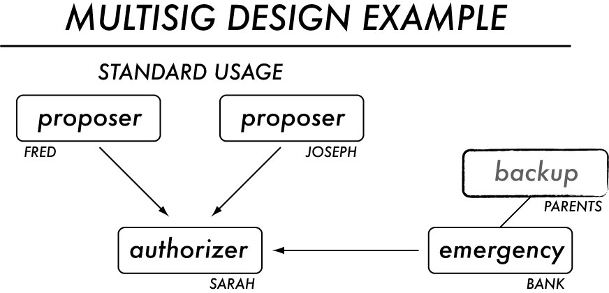
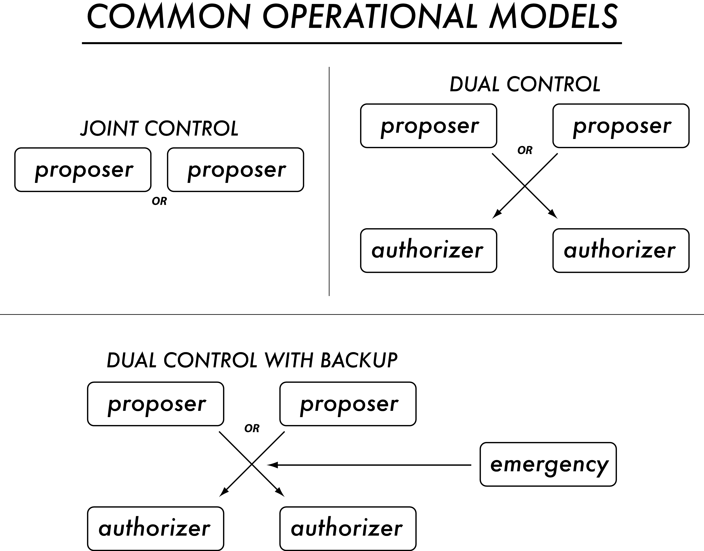
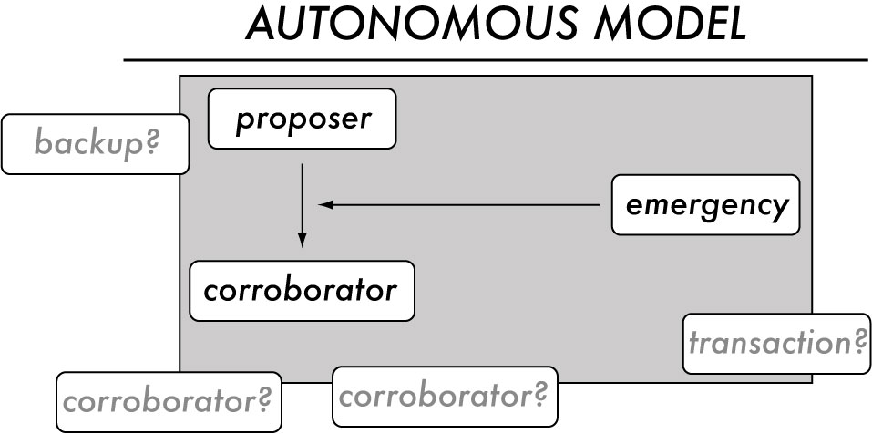
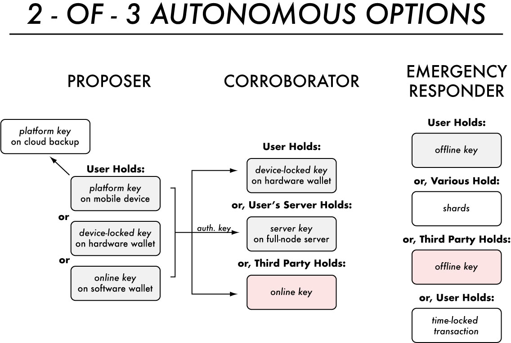
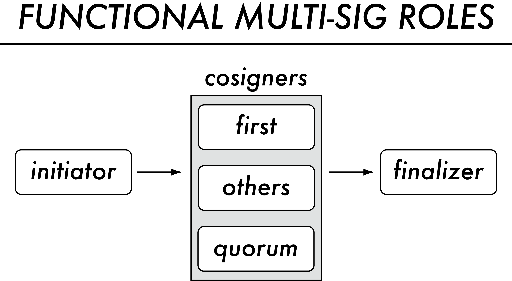

# Designing Multisig for Independence & Resilience
#### v1.0.0: [3/24/21]

###### tags: `article / in process`

Multisig (or multisignature) technology offers a way to balance resilience and security in the control of digital assets. In other words, not only does a multisig ensure you can't accidentally lose your funds, it also makes it much harder for someone to steal those funds.

However, in order to make the best use of that resilience and security requires careful design. That's what this article is about. It provides a paradigm for designing multsigs that addresses topics like single point of failure, separation of interests, separation of duties, dual control, and complexity. It takes you step by step through a process to solve those problems and also offers examples that can be freely used, all with the goal of helping you find the multisig that's right for you.

_If you want more information on any of the terms in this article, please see the appendices, which define resilience terms, key terms, transaction terms, wallet terms, and functional multisig terms._

> _If you want to know more about the multisig used by the Gordian system, jump directly to our [Autonomyous with Independent Corroboration example](https://github.com/BlockchainCommons/Gordian/blob/master/Docs/Multisig.md#autonomous-windependent-corroboration-2-of-3)._

## The Design of a Multisig

Multisig ensures that you are less likely to lose your funds. It does so in large part by balancing three major _goals_ related to digital assets:

* **Accessibility.** Assets may be owned by multiple people; you don't want their rights to be locked up by one of them.
* **Resilience.** Keys can be vulnerable; you don't want to lose assets accidentally due to key lossage.
* **Security.** Assets can be vulnerable; you don't want to lose them maliciously due to key theft.

A good multisig balances all three of these elements: improving your resilience, improving your security, and maximizing accessibility given those needs.

In order to achieve those goals, you must consider the theoretical, functional, operational, and transactional elements of multisig design. Going from the highest to lowest level of design, these elements are defined as following:

* **Theoretical.** What is the goal of a multisig?
* **Transactional.** How is the multisig designed as a transactional address?
* **Operational.** How is the multisig meant to be used by its participants?
* **Functional.** How is a wallet system designed to support a multisig?

This document offers two methods to arrive at a protective multisig: Designing it through a five-step process; or Choosing it based on existing examples.

### The Design of a Autonomous Multisig

Multisig has traditionally been used for scenarios where two or more persons have access to funds. However, it can also be used to secure autonomous scenarios, where an individual wants to independently access his funds while also increasing their resilience. Maintaining resilience in an independent scenario is managed by securing recovery keys, by corroborating a user's identity, and by working with fiduciaries and social networks to support these actions.

Though most of these design procedures are applicable for both multi-person and autonomous multisig scenarios, some sections specifically flag additional design considerations for autonomous multisig usage.

## Design Step 1: Brainstorm Theoretical Design with Patterns

Multisig is a tool. Its goal is to improve the accessibility, resilience, and security of cryptocurrency. However, not all owners of cryptocurrency will have the same needs. What follows is a listing of potential Design Patterns for creating a multisig. Each pattern follows a standard format that includes most or all of the following elements:

> * **Type.** Does the pattern operate at the operational, functional, or transaction level?
> * **Goals.** Is the goal accessibility, resilience, or security?
> * **Obstructed Adversaries.** Which problems does this pattern resolve, drawing  from the listings in Blockchain Commons' [Smart Custody](https://www.smartcustody.com/)?
>
> ***Common Solutions:***
> * **Transactional Design.** How is the multisig defined on the blockchain? (See Step 2.)
> * **Operational Roles.** What operational roles are used? (See Step 3.)
> * **Functional Elements.** What additional functional elements are used? (See Step 4.) Where are they? (See Step 5.)
  
In addition, each pattern contains a description, the intent, a tension, consequences, and one or more examples of usage. The consequences will often reference additional [Smart Custody](https://www.smartcustody.com/) adversaries.

___Begin your multisig design by concentrating either on your Goals or the Adversaries that you want to Obstruct, and using that to choose the design patterns that best address your storage scenario.___

___Ater choosing a few design patterns, you should be able to understand which solutions to consider in the later steps of this design process.___

### Authorization of Usage

* **Type:** Operational
* **Goals:** Security
* **Obstructed Adversaries:** Coercion, Internal Theft

***Common Solutions:***
* **Transactional Design:** 2 of 2; 2 of 3
* **Operational Roles:** Authorizer
 
Only use a key for signing if another signer proposes a proper transaction, meeting criteria for amount, recipients, and any other rules. 

_Intent._ To protect against the theft or misuse of a key.

_Tension._ Supporting individual use of funds, while providing a check on that usage before finalization.

_Consequences._ This introduces _Process Fatigue_ into the system, unless it's automated. A _Social Engineering_ adversary might still be able to foil the system, as recorded in various spear-phishing attempts that have successfully stolen digital assets.

_Exemplary Use: Business._ After using his key, an individual sends a transaction off to the CFO for authorization.

### Backup of Keys

* **Type:** Functional
* **Goals:** Resilience
* **Obstructed Adversaries:** Death/Incapacitation, Key Fragility

***Common Solutions:***
* **Functional Elements:** Mnemonic words; cloud backup of keys
* **Operational Roles:** Backup

Backup keys physically or electronically. This allows reconstruction if they are lost.

_Intent._ To make it difficult to lose funds.

_Tension._ Improving resilience of funds is balanced by increased vulnerability created by having a copy of the key out of the user's close control.

_Consequences._ Extra keys can increase "Theft".

_Exemplary Use: Anyone._ The mnemonic words for a key are etched in steel and stored in a safety deposit box.

### Maximization of Possible Signers

* **Type:** Transactional
* **Goals:** Accessibility, Resilience
* **Obstructed Adversaries:** Death/Incapacitation, Key Fragility

***Example Solutions:***
* **Transactional Design:** 1 of 10; 2 of 5

Create a multisig with a large `n`, allowing many people to sign for funds. The most extreme case is obviously a `1` of `n` multisig, where `n` is a large number. However, this could also be a multisig with any value of `m` and a large `n`, such as `2` of `n`, `3` of `n`, etc.

_Intent._ To make it difficult to lose funds.

_Tension._ Increasing resilience of funds, while balancing that with the complexity and potential vulnerability of many key-holders.

_Consequences._ A large number of people can choose how to use or even steal funds, introducing adversaries such as _Internal Theft_. The _Convenience_ can also be an adversary on its own, as security is decreased for ease of use.

_Exemplary Use: Club_. A 10-member social group has funds that anyone can use for the betterment of the club. They protect it with a 1-of-10 multisig.

_Exemplary Use: Partnership._ A 5-member legal partnership requires at least two people to approve fund use, but any two partners can do so, resulting in a 2-of-5 multisig.

### Maximization of Required Signers

* **Type:** Transactional
* **Goals:** Security
* **Obstructed Adversaries:** Coercion, Convenience, Internal Theft

**Common Solutions:**
* **Transactional Design:** 2 of 2; 3 of 3

Create a multisig with a `m` value that is equal to its `n` value or nearly so. The `m` and `n` values might also be set increasingly high.

_Intent._ To make it difficult to steal funds.

_Tension._ Increasing security of funds, while balancing that with the increased danger from the threat of key loss.

_Consequences._ The more keys in a multisig, the lower the mean time between failures, which means that keys are more likely to be lost more often. This can result in _Key Fragility_ if sufficient keys are lost to make the multisig unusable.

_Exemplary Use: Partnership_. In a 3-member partnership, no one trusts anyone else to make good financial decisions, so they use a 3-of-3 multisig for their funds.

### Partition of Keys

* **Type:** Functional
* **Goals:** Security
* **Obstructed Adversaries:** Internal Theft, Network Attacks, Physical Thefts, Supply-Chain Theft, Systemic Key Compromise

***Common Solutions:***
* **Functional Elements:** Tor Gap with Authorization Key

Divide up keys among multiple physical systems so that no individual system has sufficient keys to sign a multisig.

_Intent._ To make it difficult to collect keys.

_Tensions._ Increasing security of funds, while balancing that with the dangers created by requiring multiple devices.

_Consequences._ Multiplying the number of systems containing keys can increase the likelihood of adversaries like _Bitrot_ and _Systemic Key Compromise_, since there will often be a variety of systems that could each be vulnerable, though these problems are muted by the multiple keys in the multisig.

_Exemplary Use: Autonomous_. An individual locks all of his funds with a 2-of-3 signature, with one key on a hardware wallet and the other on his mobile phone (and the last used as a recovery key).

### Redundancy of Keys

* **Type:** Operational
* **Goals:** Resilience
* **Obstructed Adversaries:** Death/Incapacitation, Key Fragility

***Common Solutions:***
* **Transactional Design:** add a possible signer without increasing the required signers
* **Operational Roles:** Emergency Responder

Only use a key for recovering funds if other keys are lost, misplaced, or stolen.

_Intent._ To make it possible to recover funds.

_Tension._ Ensuring that funds aren't lost if a key is misplaced, while also balancing the security concerns created by the addition of another key.

_Consequences._ Any extra copies of keys can increase all sorts of "Theft", though these consequences are somewhat muted in any multisig scenario where a single key does not allow the use of funds. There is also a threat of "Process Fatigue", which here takes the form of failing to check that the Emergency Responder key remains available.

_Exemplary Use: Partnership._ Two partners each have a key for their funds and typically sign together, but their attorney has an Emergency Responder key in case either active key is lost.

### Separation of Interests

* **Type:** Operational
* **Goals:** Security
* **Obstructed Adversaries:** Internal Theft, Physical Theft

***Common Solutions:***
* **Operational Roles:** Authorizer, Proposer

Divide keys up among people with different interests.

_Intent._ To make it difficult to collude to collect (or use) keys — and even to make it dificult to find the holders of keys, as they belong to different groups. Also: to give different groups of people a say in spending decisions. (This is the heart of many operational multisig designs.)

_Tensions._ Making keys harder to steal, while potentially decreasing the robustness of the system due to spreading keys out to many different people.

_Consequences._ This has the potential to increase _Key Fragility_ as a more spread-out group is less likely to be able to monitor the health of all of their keys. 

_Exemplary Use: Business._ A business locks its funds to a 2-of-3 multisig, with one key given to purchasers, one to accountants, and one to the CEO. Usually purchasers will get the OK of accountants to make a purchase, but any pairwise group can do so.

### Sharing of Rights

* **Type:** Transactional
* **Goals:** Accessibility
* **Obstructed Adversaries:** Death/Incapacitation

***Common Solutions:***
* **Transactional Design:** 1 of 2; 1 of 3; 2 of 2; 2 of 3; 3 of 3

Add entitities who should have rights to a digital asset to a multisig.

_Intent._ To share out accessibility among all rights holders.

_Tensions._ Improving accessibility means giving out more keys, which can either damage resilience (if everyone must sign to release funds) or security (if a minority of keys can sign to release funds).

_Consequences._ Adding more entities to a multisig of course increases the possibility of _Internal Theft_, with the precise danger depending on how the multisig is set up. Many other individual threats such as _Blackmail_ and _Social Engineering_ could also become more likely.

_Exemplary Use: Family._ A husband and wife have a 1-of-2 multisig, but when their daughter goes to college they sweep their funds forward into a 1-of-3 multisig that gives her access as well.

### Time Locking of Funds

* **Type:** Functional
* **Goals:** Resilience
* **Obstructed Adversaries:** Death/Incapacitation, Key Fragility

***Common Solutions:***
* **Functional Elements:** Time-locked transaction

Create _time-locked transactions_ that can send funds to a single key. Whenever a time-locked transaction is about to become available, sweep the funds forward to a new account and create a new time-locked transaction. (Technically, this is a transaction pattern, not a multisig pattern, but is included here because of its usage in one of the examples.)

_Intent._ To create a backup that ensures access to funds if a multisig becomes non-functional.

_Tensions._ Ensuring the resilience of funds, so that they're not lost, but balancing that with annoying needs to keep transactions up to date.

_Consequences._ The biggest threat here is _Process Fatigue_ since constantly sweeping the funds and creating new transactions is tiring. If this pattern falls to Process Fatigue then either it opens up the funds to many types of Theft (if they were not swept forward, as they're now accessible with a single key) or else it eliminates the Resilience goal of this pattern entirely (if a new time-locked transaction is not created).

_Exemplary Use: Autonomous._ An individual uses a third-party to corroborate their fund usage, but if the third party ever disappears, the funds become available in a time-locked transaction.

### Verification of Identity

* **Type:** Operational
* **Goals:** Security
* **Obstructed Adversaries:** Network Attacks, Physical Thefts, Systemic Key Compromise

***Common Solutions:***
* **Transactional Design:** 2 of 3
* **Operational Roles:** Corroborator
* **Functional Elements:** Hardware Token, Two-Factor Authorization

Only use a key for signing if another signer proves their identity. This proof could occur via means such as a hardware token, Two-Factor Authentication (2FA), a video, or an in-person chat. 

_Intent._ To ensure that a key hasn't been stolen and isn't now being misued.

_Tensions._ Improving the security of funds, by ensuring they can't be misused, while balancing that with the introduction of another party to your cryptocurrency-usage procedure.

_Consequences._ This introduces _Process Fatigue_ into the system unless it's automated. A _Social Engineering_ adversary might still be able to foil the system, as (again) recorded in various spear-phishing attempts that have successful stolen digital assets.

_Exemplary Use: Autonomous._ After using his key, an individual must supply 2FA to authorize the use of another key.

### Verification of Process

* **Type:** Operational
* **Goals:** Security
* **Obstructed Adversaries:** Internal Theft, Transaction Error, User Error

**Common Solutions:***
* **Transactional Design:** 2 of 3, 3 of 5
* **Operational Roles:** Proposer
 
Initiate a transaction without a signature, send it to the minimum possible number of cosigners, then act as the quorum cosigner and finalize it yourself.

_Intent._ To ensure that the process being used to authorize funds is being correctly followed.

_Tensions._ Improving the security of funds, while introducing more administration. There's also the issue that it's not entirely supported by cryptocurrency functions, as another potential cosigner might be able to finalize.

_Consequences._ For an `m` of `n` multisig where `m < n`, there's nothing functionally to keep the other signers from colluding, sending the transaction to a different quorum cosigner and finalizing it themselves. Operationally, this is probably a minimal threat. More generally, this type of usage can increase _Process Fatigue_ since it's a very specific and constrained usage of multisig.

_Exemplary Use: Business._ A CFO initiates a multisig for her dual-control system, but requires that she sees the other signature before she finalizes the transaction herself.

## Design Step 1: Design Example

> Fred wants to create a multisig for funds for his family, including his wife, Sarah, and his son, Joseph. He is worried about Accessibility and Resilience. He chooses "Backup of Keys", "Redundancy of Keys", and "Sharing of Rights" as the Design Patterns to concentrate on. Belatedly, he also realizes he should add "Authorization of Usage"; though Security wasn't one of his goals, Sarah maintains their finances and has always OKed any large expenditures, so this models that in a multisig.

## Design Step 2: Layout Transaction Design with Multisig

Transactionally, a multisig is defined by how many keys are available to authorize a transaction (`n`) and how many of them are required (`m`), creating an `m` of `n` multisig. For example, in a `2` of `3` multisig, at least two of three keys must be used.

___With your design patterns in hand, you can now decide how to design the multisig transaction itself.___

___Decide the `m` and `n` values for your multisig.___

## Design Step 2: Design Example

> The "Sharing of Rights" pattern suggests 1 of 3, 2 of 3, and 3 of 3 transaction designs, while "Authorization of Usage" shows that 2 of 3 is the proper one for Fred's household. The "Redundancy of Keys" pattern suggests adding a possible siganture without increasing the required signatures. Fred thus adjusts his 2 of 3 transaction design to be 2 of 4.

## Design Step 3: Choose Operational Roles for Multisig

Simply designing a transaction and giving out keys is insufficient for a robust multisig design. Specific roles should be assigned to each key, such that keys are always used with certain goals, in accordance with your design.

___Identify one or more roles for each key in your multisig.___

### Standard Operational Roles

The following are the typical key-usage roles for a multisig:

* **Proposer.** The key that's used to propose an expenditure. (Functionally, it's often the _Initiator_ and the _Finalizer_, as well as the _First Cosigner_ or _Quorum Cosigner_. See Appendix V.)
* **Authorizer.** A key that approves a multisig transaction. This is typically an alternative to having a _Corroborator_. Its holder might verify that the funds being spent are within the _Proposer's_ scope, that the funds are being spent in an allowed way, and that they are being sent to an allowed receipient.
* **Corroborator.** A key that verifies the _Proposer's_ identity. This is typically an alternative to having an _Authorizer_. The Corroborator is often a computer program, such as one that requires a Two-Factor Authentication (2FA) app, or the replication of a code sent to a mobile device, but it could also be a person verifying a photo or video. (This role is most often used in autonomous multisig scenarios.)
* **Emergency Responder.** A key that is only used in a transaction if there is a problem with some other key, such as a temporary absence or a permanent loss. The holder should only use their key if they have a good understanding of why the regular keys are unavailable. Emergency Responder keys are often _offline_ or _Torgapped_.

There's often a one-to-one relationship between a key and a person fulfilling that usage role. However, it would be just as easy for an individual to possess a variety of keys which together allow them to fulfill a usage role (such as an _Authorizer_ who themselves has a 2-of-2 signature, enabled by an _online key_ and an _offline key_). As a result, the key and the responsiblity attached to it should not be entirely conflated.

In addition, note that these key-usage roles are not always constant;  some are instead per-transactions. For example, in a simple dual-control situation, either key might be used as the _Proposer_, with the other de facto becoming the _Authorizer_. Nonetheless, many of these roles are tightly linked to a key, particularly the _Corroborator_ and _Emergency Responder_ roles. 

### Secure Operational Roles

Certain secure sorts of keys are used in more limited ways.

* **Auditor.** A key that is used to inspect finances, usually by a bookkeeper or accountant. (It is typically a _watch key_. See Appendix II.)
* **Backup.** A copy of a key, not meant for use in transactions, but available if reconstructing keys is required. (It is typically an _offline key_. See Appendix II.)
* **Watcher.** A key that can only be used to watch an account or address. It is always a _watch key_.
* **Watchtower.** A key that is used to initiate a certain action when something occurs. It is typically a _watch key_ linked to a _responsive transaction_. (See Appendix III.)

These key-usage roles are much more optional than the standard roles; they could be introduced into almost any multisig example.

## Design Step 4: Design Example

**Standard Roles:**
> Based on the "Authorization of Usage" pattern, Sarah's key should take the Authorizer role. That makes Fred's and Joe's keys fit the Proposer role. Based on the "Redundancy of Keys" pattern, the fourth key should take the Emergency Recovery role. The one place where the roles shift is if Sarah initiates a purchase, in which case her key takes the Proposer role and Fred agrees to be the Authorizer.

**Secure Operational Roles:**
> Based on the "Backup of Keys" pattern, one or more keys will also be backed up. These keys will take the Backup role.
  
## Design Step 4: Design Functional Elements for multisig

Creating a multisig can be as simple as sending funds to a multisig account and defining the roles of all the keys used to secure the account (steps 2-3). However, functional elements can also be incorporated into a multisig. This is perhaps the most wide-open frontier of multisig design, with a real infinity of possibilities.

Functional elements can including physical designs or the creation of an actual wallet that manages multisig accounts. The software-focused possibilities are currently out of scope of this document other than general suggestions included here.

___Consider what functional elements to bring into your system, primarily by identifying functional elements from the design patterns that either you can personally enable or that designers will need to include in wallet software.___

### Exemplary Functional Roles

Following are the elements mentioned in the design patterns in this document:

* **Authorization Key.** A key that gives access to a server. This is frequently used with a _Torgap_, where the Authorization Key is a Tor client key that is used to authenticate an authorized client.
* **Cloud Backup of Keys.** The backup of a _private key_ to an encrypted vault in the cloud.
* **Hardware Token.** A USB dongle or other hardware device that proves identity, usually through validation at some point in the past.
* **Mnemonic Words.** The backup of a _private key_ using 12 or 24 mnemonic words, which are physically stored in some manner.
* **Time-Locked Transaction.** A transaction protected by a separate _private key_ that can only be used on or after a certain time.
* **Torgap.** A connection that maintains privacy and non-correlation because it is secured by Tor. Usually used in conjunction with an _Authorization Key_.
* **Two-Factor Authenticatio (2FA).** A code that proves identity. It can be provided by a message to a specific phone number or by an app that has been synchronized with the server at some time in the past.

## Design Step 4: Design Example

> The "Backup of Keys" pattern suggests that Fred needs to place a copy of a key in cloud storage or else to scribe the mnemonic words. He doesn't know how to protect his cloud storage with end-to-end encryption so he goes with the easier method: he copies out the mnemonic words for the Emergency Recovery key onto a steel plate, creating a Backup key.

## Design Step 5: Design Functional Locations for Keys

The last step in designing a multi-sig is to functionally determining where private keys are stored. See the Appendices for a listing of major possibilities, particularly the listing of secured key types in Appendix II.

___Decide where you keys are kept, be they hardware, software, or physical locations.___

## Design Step 5: Design Example

> Fred and Joseph secure their keys in software wallets on their mobile devices. Sarah has a hardware wallet which she links to a more sophisticated desktop software wallet. It allows her to finalize transactions created by Fred or Joseph. Finally, Fred realizes that he needs to find locations for both their Backup key and their Emergency Recovery key, and he doesn't want to place them in the same place lest a "Disaster" destroy them both. He ultimately puts the Emergency Recovery key in a hardware wallet that he places in a safety deposit box associated with his and Sarah's joint back account. He leaves the Backup key, etched in steel, with Sarah's parents, who live halfway across the country: if the family ever needs it, they can ask Sarah's parents to read the mnemonic words. In keeping with the precepts of [Smart Custody](https://www.smartcustody.com/), Fred will check in on the Emergency Recovery and Backup keys twice a year.

## The Choices of Multisig

If you prefer not to walk through all the design steps for creating a multisig, the other option is to choose an existing one. The following examples describe a variety of multisigs using the design language laid out in these articles. Again, note that "Tensions" draws on adversaries from the [Smart Custody system](https://www.smartcustody.com/).

Obviously, after choosing a multisig example, you can also modify it based on the transactional, operational, or functional precepts of this article's Design strategies.

For an Autonomous multisig, also see "Alternative: Creating an Autonomous Multisig from Building Blocks" as a more specific way of combining elements from different examples.

## Examples: Traditional Multisig

The following examples, of traditional multisig design involving two or more people, reveal the breadth of multisig possibilities.

### Joint Control: 1 of 2

* **Transaction:** 1-of-2 multisig
* **Participants:** two people
* **Operational Roles:** key #1 (Proposer), key #2 (Proposer)
* **Patterns:** Sharing of Rights

Two persons each have a key that can be used to access an _account_. Either one can be an _Proposer_ at any time, without any _Authorizer_ or _Corroborator_ required.

*Exemplary Use.* Intended for couples or equal business partners,  protecting petty cash or other assets that do not require authorization or verification.

*Tensions.* This usage is simple, but there is no check on funds spent (or stolen!). There's ample opportunity for "Theft" of all sorts.

### Dual Control: 2 of 2

* **Transaction:** 2-of-2 multisig
* **Participants:** two people
* **Operational Roles:** key #1 (Proposer or Authorizer), key #2 (Proposer or Authorizer)
* **Patterns:** Authorization of Usage, Maximization of Required Signatures, Separation of Interests

Two persons each have a key, and they must be used together to access an _account_. Either one person is always the _Proposer_ and the other the _Authorizer_, or the roles switch back and forth per transaction.

*Exemplary Use.* Required for professionals whose [fiduciary responsibility](https://github.com/BlockchainCommons/SmartCustodyBook/blob/master/manuscript/04-custodianship.md) necessitates dual control. It may also be of use in other scenarios, such as with business partners who need to check each other, particularly for the expenditure of larger amounts of funds. 

*Tensions.* This usage is simultaneously cumbersome and fragile. On the one hand, every transaction requires the efforts of two people to process, creating "Process Fatigue". On the other hand, if either person loses their key through "Key Fragility", all of the funds are lost — and depending on two keys instead of one means that loss is much more likely.

### Dual Control w/Fiduciary Resilience: 2 of 3

* **Transaction:** 2-of-3 multisig
* **Participants:** three people
* **Operational Roles:** key #1 (Proposer or Authorizer), key #2 (Proposer or Authorizer), key #3 (Emergency Responder)
* **Patterns:** See _Dual Control_ + Redundancy of Keys
* **Examples:** [Unchained Capital Multi-Institution](https://unchained-capital.com/vaults/)

A typical dual-control situation, where two people each have a key that might be usable as _Proposer_ and/or _Authorizer_. However, there is also a third key held by an _Emergency Responder_, which is only used in a _recovery_ situation — where one key has been lost and the funds must be moved to a new _account_ as a result.

*Exemplary Use.* Usable by the same people who need dual-control accounts, but offering better resilience for the keys. Unchained Capital's variation of the system also notes its usage for loan collateral, which would be an operational variation of the standard Dual Control situation noted here.

*Tensions.* This largely resolves the issues with the "Key Fragility" of a dual-control setup by introducing an emergency backup; it should allow for safe _recovery_ as long as a good process is in place that regularly checks for access to all three keys (avoiding "Process Fatigue"), and which immediately recovers the funds if that is not the case. The biggest threat is the lack of such a process, in which case this scenario can easily degrade to a simple "Dual Control".

## Examples: Autonomous Multisig

The following examples show the breadth of autonomous multisig possibilities, using a multisig to protect the funds of a single user. Their goals are to create _independence_ (by allowing a user to control his own funds) and _resilience_ (by ensuring that he has a social-assisted, fidicuary-assisted, or even independent way to recover funds).

Most autonomous examples use the same transactional design and the same operational roles, with changes being instead in the functional model. However note the _Authorizer_ role entirely disappears, to be replaced by a _Corroborator_: no one OKs your use of autonomous funds, they simply verify that you're who you say you are. 

Some sources call these multisig designs "self-custodial", but we omit that term because it's a negative description: defining what a self-sovereign multisig _isn't_ rather than what it _is_. Some of these multisig designs could also be called "self-sovereign", depending on your precise definition of that phrase.

### Autonomous Design Overview

Broadly, autonomous design requires that a user personally hold sufficient keys to either spend his money or (at least) recover his money. A variety of techniques such as Automation, Backup, Fidicuary Corroboration, Fidicuary Resilience, Independent Corroboration, and Timelock are used to ensure the resilience of a user's funds while maintaining their independence. 

Broadly, these individual techniques answer the following questions:

1. How does the user hold the Proposer key?
2. How is corroboration managed and who holds the Corroborator key?
3. How is resilience managed and who holds the Emergency Recovery key?

Answering each of those three questions could create an autonomous scenario. The following are some examples, most of them drawn from real-life usages.

### Autonomous w/Fidicuary Reslience: 2 of 3

* **Transaction:** 2-of-3 multisig
* **Participants:** one person, two closely held devices, one third-party entity
* **Functional Elements:** mobile device with platform key or device-locked key (key #1), mobile device with platform key or device-locked key (key #2)
* **Operational Roles:** key #1 (Proposer), key #2 (Corroborator), key #3 (Emergency Responder)
* **Patterns:** Partition of Keys, Redundancy of Keys
* **Example:** [Casa Basic Multisig](https://docs.keys.casa/wealth-security-protocol/chosen-key-schemes/2-of-3-basic-multisig), [Unchained Capital Client-Controlled](https://unchained-capital.com/collaborative-custody/)

A user holds two keys on closely held devices. The Casa Basic Multisig scenario uses a _platform key_ on a mobile device and  a _device-locked key_ in a _hardware wallet_ while the Unchained Capital Client-Controlled scenario uses two _hardware wallets_. One of the devices acts as the _Proposer_ and then the other acts as a _Corroborator_. In case of an emergency, the third-party entity uses their key as _Emergency Responder_ to recover funds alongside whichever key the user still has access to.

*Exemplary Use.* Companies have created numerous autonomous scenarios that use multisig designs to allow safer and more secure control of digital funds. This is one of the most classic, leaving the user in total control of his funds, but allowing the company to act as a backup.

*Tensions.* As the name suggests, this is essentially an autonomous scenario with a company acting as a backup in case of a single key loss. The user's maintenance of keys on two different platforms increases the odds they won't lose both at once. The use of one mobile device and one hardware wallet is a nice compromise because it reduces chances of "Bitrot" (where a single device's system got out of date) and "Systemic Key Compromise", but there's obviously an increase in "Process Fatigue" and general complexity.

### Autonomous w/Fidicuary Resilience: 3 of 5

* **Transaction:** 3-of-5 multisig
* **Participants:** one person, one mobile device, three hardware wallets, one third-party entity
* **Functional Elements:** mobile device with platform key (key #1), device-locked key (keys #2 to #4)
* **Operational Roles:** key #1 (Proposer), keys #2 to #4 (Corroborator), key #5 (Emergency Responder)
* **Patterns:** Same as _Autonomous w/Fidicuary Resilience: 2 of 3_ + Maximization of Possible Signatures
* **Example:** [Casa Key Shield](https://docs.keys.casa/wealth-security-protocol/chosen-key-schemes/3-of-5-key-shield)

This is Casa's variation of "Autonomous w/Fiduciary Resilience" that expands the number of hardware wallets used. A user holds four keys, one _platform key_ on a mobile device, which is used as a _Proposer_ and three _device-locked keys_ in _hardware wallets_ which are used as _Corroborators_. In case of an emergency, the third-party entity uses their key with two of the user's own keys to recover funds. 

*Exemplary Usage.* Obviously, this is a variant of the 2-of-3 "Autonomous w/Fidicuary Resilience" example but it instead requires three keys out of five. It's intended for higher value holdings, as Casa has done with their Key Shield.

*Tensions.* For a 3-of-5 scenario like this to be useful, the three hardware wallets should be held in different places. This creates better security than a simple 2-of-3 because a single theft could never gain enough keys to access the funds. However, it also has the opportunity to create exhausting "Process Fatigue", as an extra device has to be retrieved whenever funds are spent. In addition, the increased number of keys perversely increases the chances of loss, as discussed in general Advantages and Disadvantages, below.

### Non-Autonomous w/Fiduciary Corroboration: 2 of 2

* **Transaction:** 2-of-2 multisig
* **Participants:** one person, one third-party entity
* **Functional Elements:** 2FA or Hardware Token
* **Operational Roles:** key #1 (Proposer), key #2 (Corroborator)
* **Patterns:** Verification of Identity

A single user signs his transactions as _Proposer_ with a key held on a mobile device, a _hardware wallet_, a _software wallet_, or some other means, then sends them off to a third party who acts as _Corroborator_ to finalize the transactions, usually via an automated means such as _2FA_.

*Exemplary Usage.* This is _not_ actually an autonomous method since the user doesn't control enough keys to either spend or recover his funds; it's instead intended as a building block for other methods that turn this usage into  autonomous operation.

*Tensions.* As in a _Dual Control_ situation, this scenario is very vulnerable to "Key Fragility", as the loss of either key results in the loss of funds. Depending on a third-party may be better than depending on some other individual for dual-control, as they presumably better understand the importance of a key, or it may be worse, as many third-party keyholders have come under "Network Attack", while others have fallen to "Institutional Theft", absconding with funds (or appearing to). Ultimately, it fails the test of maintaining cryptocurrencies as trustless processes, and thus more work is needed for it to become a good usage. Timelocks and Backups demonstrate two ways in which this can happens.

### Autonomous w/Fiduciary Corroboration & Timelock: 2 of 2

* **Transaction:** 2-of-2 multisig
* **Participants:** one person, one third-party entity, blockchain
* **Functional Elements:** 2FA or Hardware Token, Time-locked Transaction
* **Operational Roles:** key #1 (Proposer), key #2 (Corroborator)
* **Patterns:** See _Non-Autonomous w/Fiduciary Corroboration_ + Time-locking of Funds
* **Example:** [GreenAddress 2of2](https://greenaddress.it/en/faq.html)

A single user signs his own transactions as _Proposer_ via some means, then sends them off to a third party who acts as _Corroborator_ to finalize the transactions. However, the two also regularly create _time-locked transactions_. The funds can always be recovered from that address (when the timelock expires).

*Exemplary Usage.* This is another real-life autonomous solution, as it's the 2of2 solution that [GreenAddress](https://greenaddress.it/en/) uses as their main account. It's a variant to the problematic plain Non-Autonomous w/Corroboration scenario.

*Tensions.* This scenario is less vulnerable to "Key Fragility" than the plain 2-of-2 _Non-Autonomous w/Fiduciary Corroboration_ scenario because at least two keys have to be lost to lose funds: one of the 2-of-2 multisig keys and the timelocked key. However, if one of the 2-of-2 keys is lost, then the funds are unavailable until the timelock expires (90 days maximum at GreenAddress). The autonomous design of this scenario also entirely depends on the timelocked transactions. If the two participants fail to create the timelocked transaction due to "Process Fatigue", then the setup falls back into the standard vulnerabilities of the _Non-Autonomous w/Corroboration_ scenario without a timelock. In addition, as timelocks expire, funds must be swept to new addresses, else the funds become vulnerable to attacks on the 1-of-1 timelocked address. Overall, there's a lot of upkeep.

### Autonomous w/Fiduciary Corroboration & Backup: 2 of 3

* **Transaction:** 2-of-3 multisig
* **Participants:** one person, one third-party entity
* **Functional Elements:** 2FA or Hardware Token
* **Operational Roles:** key #1 (Proposer), key #2 (Corroborator), key #3 (Emergency Responder)
* **Patterns:** See _Non-Autonomous w/Fiduciary Corroboration_ + Redundancy of Keys
* **Example:** [GreenAddress 2of3](https://greenaddress.it/en/faq.html)

A single user signs his own transactions as _Proposer_ via some means, then sends them off to a third party who acts as _Corroborator_ to finalize the transactions. However, the user also has an _offline key_ that he uses as an _Emergency Responder_ if the third party ever disappears.

*Exemplary Usage.* This is another variant to the Non-Autonomous w/Fiduciary Corroboration scenario, and it's another option at [GreenAddress](https://greenaddress.it/en/), making it another real-life example. (They call it a "2of3 account".)

*Tensions.* Obviously, this resolves the "Key Fragility" and the external dependency of the plain _Non-Autonomous w/Corroboration_ scenario. It also removes the "Process Fatigue" of constantly updating transactions and moving funds that's required by the _Autonomous w/Fiduciary Corroboration & Timelock_ scenario. The result is pretty close to both automated and autonomous design, but depends on the holder to safely store two keys.

### Autonomous w/Independent Corroboration: 2 of 3

* **Transaction:** 2-of-3 multisig
* **Participants:** one person, at least two devices
* **Functional Elements:** mobile device with platform key, authorization key, full-node with personal server key
* **Operational Roles:** key #1 (Proposer), key #2 (Corroborator), key #3 (Emergency Responder)
* **Patterns:** Partition of Keys, Redundancy of Keys, Verification of Identity
* **Example:** [Gordian](https://github.com/BlockchainCommons/Gordian)

A single user and his devices automatically protect his holdings by sharing out a set of three keys. The user acts as a _Proposer_ on his mobile device, which holds a _platform key_. He then uses an _authorization key_, also on his mobile device, to access a full-node server. The node acts as a _Corroborator_, using that authorization key as proof of identity, and signs with a _personal server key_ before sending the transaction. The third key is an _offline line_ which is used as an _Emergency Responder_.

*Exemplary Usage.* This is a very rare autonomous scenario, where no third-party entity is involved: the user is totally self-reliant and thus in entirely independent control of assets thanks to the automation of the system. This is the method built into the [Gordian Wallet](https://github.com/BlockchainCommons/GordianWallet-iOS) and thus is another real-life autonomous usage.

*Tensions.* This setup steps away from the earlier scenarios, which tended to focus on fidicuary-assisted resilience and corroboration. Compared to single-signature scenarios, it improves both the resilience of  holdings (so that you don't lose them due to losing a key via "Key Fragility" of other means) and their security (so they can't be easily stolen by "Coercion", "Theft", or other means), all without depending on any external source (avoiding "Institutional Theft" or "Systemic Network Attack"). The biggest disadvantage is that the mobile device is ultimately a concentrated attack surface, since one key is present there and the other accessible there (via the _authorization key_), so this design depends on the security of the mobile device's access control, which could fall to "Physical Theft". Nonetheless, most mobile devices are closely held with strong access protection, so this currently seems like one of the best options for autonomous control of this type.

### Autonomous w/Independent Corroboration & Fiduciary Resilience: 2 of 3

* **Transaction:** 2-of-3 multisig
* **Participants:** one person, at least two devices, one third-party entity
* **Functional Elements:** mobile device with platform key, authorization key, full-node with personal server key
* **Operational Roles:** key #1 (Proposer), key #2 (Corroborator), key #3 (Emergency Responder)
* **Patterns:** See _Autonomous w/Independent Corroboration_ + Backup of Keys

You can combine the elements of these designs! Here, a single user and his devices together automatically protect his holdings as in the plain "Autonomous w/Independent Corroboration" scenario. He acts as an _Proposer_ with a _platform key_ on his mobile device, while an _authorization key_ gives him access to a node, which acts as a _Corroborator_ with a _server key_. The difference is in the third key, which here is held by a  third party for use as an _Emergency Responder_.

*Exemplary Usage.* This is a variation of the "Autonomous w/Independent Corroboration" scenario that should be considered for more valuable Bitcoin holdings where the user has more faith in a third-party entity acting as an _Emergency Responder_ than in his own backup of an _offline key_. (Obiously it's not too far removed from "Autonomous w/Fidicuary Reslience" either, but with improved automation for the corroboration.)

*Tensions.* At heart, this has most of the advantages and disadvantages of the plain "Autonomous w/Independent Corroboration" scenario. The new trade-offs come in how the user assesses the dangers of centralized custodianship versus individual custodianship of that third key. Obviously there are new dangers of "Institutional Theft" or hacking of the custodian, such as "Systemic Network Attack" (though the repercussions are limited, as the attacker would need one more key to steal funds), but the issue of the user having to reliably manage the process of securing their _Emergency Responder_ key are removed.

### Autonomous w/Independent Corroboration & Social Resilience: 2 of 3

* **Transaction:** 2-of-3 multisig
* **Participants:** one person, at least two devices, various third-party entities
* **Functional Elements:** mobile device with platform key, authorization key, full-node with personal server key, sharded key
* **Operational Roles:** key #1 (Proposer), key #2 (Corroborator), key #3 (Emergency Responder)
* **Patterns:** See _Autonomous w/Independent Corroboration_ + Backup of Keys
* **Examples:** Autonomy

A single user and his devices together protect his holdings as in the plain "Autonomous w/Independent Corroboration" scenario. He acts as an _Proposer_ with a _platform key_ on his mobile device, while an _authorization key_ gives him access to a node, which acts as a _Corroborator_ with a _server key_. Again, the variation comes in what's done with the _Emergency Recovery_ key. Here, instead of turning it into an _offline key_ or storing it with a fiduciary, it's turned into a _sharded key_ and and the _shards_ are divvied out to a variety of persons, including a centralized third-party entity, platform backups, and friends using the same application (who can thus store it automatically).

*Exemplary Usage.* This is another variation of the "Autonomous w/Independent Corroboration" scenario, but unlike the "Fiduciary Resilience" variation, this one opts not to put all of the weight of the Emergency Recovery into a single party's hands. Instead, it breaks up the _Emergency Recovery_ role to focus the control of the system on the user, not that third party.

*Tensions.* Obviously, there's increasing complexity here which could create "Process Fatigue". This risks turning the actual wallet application into a single point of failure subect to "Bitrot", if the recovery method is complex enough that it requires the wallet to manage it. Also, there are dangers any time a reconstruction method is used: where the _shards_ are reconstructed becomes a point of vulnerability to any sort of "Theft".

### Autonomous w/Cloud

* **Transaction:** any
* **Participants:** add a third-party entity
* **Functional Elements:** add cloud storage
* **Operational Roles:** add a Backup
* **Patterns:** See any, plus Backup of Key

Any scenario that includes a _platform key_ on a mobile device can enhance its resilience by using the device's cloud backups to store that _platform key_. Provided that the cloud backup is protected by end-to-end encryption, this should remain highly secure and provides a _Backup_ role.

## Examples: Advanced Multisig

There are considerably more complex possibilities for multisig, going beyond the `2` of `3` examples mainly used here. Some of these examples can also combine traditional and autonomous methodologies, allowing individual participants in a multisig to protect their own signing capability using autonomous techniques.

### Extended Control: 4 of 9

* **Transaction:** 2-of-3 of 2-of-3 (grouped 4-of-9) multisig
* **Participants:** Up to 9 entities
* **Functional Elements:** any
* **Operational Roles:** any
* **Patterns:** See any, plus Partition of Keys and Separation of Interests

Funds are protected by a 2-of-3 multisig, and each of those keys is actually a 2-of-3 multisig. Ultimately, two entities each from two different multisig groups must sign in order to verify a transaction. Obviously, there is considerable complexity here in how _Proposer_, _Authorizer_, _Corroborator_, and _Emergency Responder_ roles may be laid out. It's a skeleton more than a specific example.

*Exemplary Usage.* The intent of Extended Control is define groups of signers, at least two groups of which must be involved in a transaction. This could be done pragmatically, such as a _Proposer_ group, an _Authorizer_ group, and an _Emergency Responder_ group; or it might be done socially such as a "family" group, a "friends" group, and a "business" group. In the first example, anyone in the Proposer group could access funds in coordination with either the Authorizer or the Emergency Responder group. In the second example, a family could get together with their friends or their business associates to recover funds. (Obviously, the friends and business associates could also recover the funds together, but there's theoretically resilience here because the groups don't know each other based on the Separation of Interests pattern).

*Tensions.* The biggest advantage here is the grouping. It both requires two out of three groups to be involved and keeps wider (and thus easier to create) cross-sections of the groups from stealing funds. For example, in the second example above, a more scattered group of one family member, one business associate, and two friends couldn't steal the funds. This dramatically reduces concerns such as "Institutional Theft" and "Internal Theft", let alone all the external "Theft" possibilities. However, there is a real complexity to this setup, offering the possibility of "User Error", "Transaction Error", or just "Process Fatigue". Because of the categorization of the keys, it's also possible to lose funds to "Key Fragility" if four specific keys are lost (two each from two groups), whereas six would have to be lost in a more typical 4-of-9 multisig to cause fund lossage.

##  Alternative: Creating an Autonomous Multisig from Building Blocks

As both discussed and illustrated above, autonomous multisig scenarios are much more standardized than other multisig uses because of the tightly constrained goal: allowing a single user to independently control their cryptocurrency while maintaining resilience. 

As noted, three questions need to be answered, for how the Proposer, Corroborator, and Emergency Responder keys are managed. The above examples show real-life (or near-real) examples, but you can also use the questions as building blocks to create new building blocks of your own.

Following are the Operational Roles and the linked Functional Element that appear in the above examples, offering a first cut of these building blocks:

* **Proposer:**
   * User holds _platform key_ on mobile device; or
      * (User may back up _platform key_ to the cloud.)
   * User holds _device-locked key_ on a _hardware wallet_; or
   * User holds _online key_ on a _software wallet_
* **Corroborator:**
   * User holds _device-locked key_ on a _hardware wallet_; or
   * User's server holds _server key_ on _full-node server_
      * (User's server is accessible via an _authorization key_.)
   * Third-party holds _online key_
* **Emergency Responder:**
   * User holds _offline key_; or
   * Various parties hold _sharded key_; or
   * Third-party holds _offline key_; or
   * Transaction holds _timelocked key_

The following diagram shows how these puzzle pieces can be connected together in many ways

As the diagram shows, autonomous multisig building blocks can come in three types:

* Independent holding (gray), where key is closely held by the owner.
* Collaborative holding (white), where key is distantly held by the owner.
* Fiduciary holding (red), where key is held by a centralized third-party.

These building blocks also demonstrate how autonomous any scenario is. Clearly, an all-gray model would demonstrate a fully independent model. As long as at least two of the roles are gray, it's still autonomous.

White or red boxes should be used carefully. The following chart shows the dangers of adopting those methods for specific Operational Roles, ranking them from the most independent to the least:
* Using a colloborative or fiduciary _Backup_ means that reconstructing keys is dependent on the group or centralized entity.
* Using a colloborative or fiduciary _Emergency Responder_ means that recovering funds is dependent on the group or centralized entity.
* Using a colloborative or fiduciary _Corroborator_ means that sending funds is dependent on the group or centralized entity.
* Using both a colloborative or fiduciary _Emergency Responder_ and _Corroborator_ means that the scenario is not truly autonomous. The user could lose access to his funds if the other parties become unavailable and/or colluded.

Obviously, any digital-asset holding model has to balance independence and resilience. A confident cryptocurrency holder may choose an entirely independent scenario, while a less experienced user may maximize his resilience by moving away from independence in some aspect while maintaining an autonomous design.

### Comparing Multisig Examples

Comparing the transactional, functional, and operational elements of an autonomous solution are another way to determine which might work best for you. As the following chart shows, "Dual Control w/Backup", "Autonomous w/Fiduciary Backup", and "Autonomous w/Independent Corroboration & Social Resilience" are all transactionally identical (as are some of the other examples), but they critically vary in Operational Roles and Functional Elements. 

Comparing these three aspects of multisig construction, and the problems they address, is another way to choose the right one for you.

Name | Transactional | Operational | Functional 
---|-----|-------|-----
Dual Control w/Backup | 2-of-3 | <ol><li>Proposer or Authorizer<li>Proposer or Authorizer<li>Emergency Recovery</ol> | <ol><li>private key<li>private key<li>private key</li></li></ol>
Autonomous w/Fiduciary Backup | 2-of-3 | <ol><li>Proposer<li>Corroborator<li>Emergency Recovery</ol>| <ol><li>mobile device with platform key <i>or</I> device-locked key</i></li><li>device-locked key<li>private key</li></ol> 
Autonomous w/Independent Corroboration & Social Resilience | 2-of-3 | <ol><li>Proposer<li>Corroborator<li>Emergency Recovery</ol>| <ol><li>mobile device with platform key<ul><li>authorization key</li></ul><li>full-node with personal server key<li>sharded key</ol> 

## Multisig Advantages

The fundamental advantage of multisig is that it allows you to use cryptocurrencies in the way they were designed, as funds that you have independent control over. The more you step away from these ideals, the more you have to ask yourself, "Are cryptocurrencies right for me?" If you're allowing an exchange to hold your funds, then you might as well be using fiat currency, because it's less prone to theft.

More generally, we saw the biggest advantages of multisig in the goals we laid out for their design.

* **Accessibility.** Standard transactions are linked to individual keys, which not only are single points of failure, but which also tend to be limited to a single person. Multisig provides keys to more people, allowing them to have some level of control of funds, and can also embody complex policies that very precisely define accessibility.
* **Resilience.** One of the biggest adversaries to cryptocurrency users is the threat of accidental lossage, usually due to "Key Fragility" where a user loses the key securing his funds. With an `m` of `n` multisig, where `m < n`, you can lose some number of keys (`n - m`) and still recover your funds.
* **Security.** "Theft" is not the biggest danger for an individual holder, but it is a possibility, and if your cryptocurrency is stolen, it's gone forever. This threat also grows larger the more funds you have. A multisig increases security because it requires multiple keys (`m`) to be stolen in order for funds to be stolen, and if you are doing a good job of managing Partition of Keys this is increasingly difficult.

The bottom line is that a multisig can deter some of the biggest adversaries to cryptocurrency users, and make it less likely that you lose your funds.

## Multisig Challenges

Multisig design has four fundamental challenges: it requires changes to extant technology; it requires new procedures; it modifies the way transactions are created; and it introduces open questions.

### Technology Challenges

**Legacy xpubs.** Some existing devices, such as many hardware wallets, don't interact well with multisig. For example Trezor will always produce the same `xpub` for generating a multisig, not allowing for the variation suggested by cryptocurrency best practices.

### Procedure Challenges

**Backups.** A backup of a multisig require more than just a master seed. It also needs to include `xpubs` as well as ordering information. There also may need to include metadata such as describing who holds keys.

**Lack of Commitment.** Current procedures ask people to add `xpubs` to an empty policy map. This makes it possible for a bad actor to shift your `xpub` to a different address that you didn't agree to. State could help this problem, but the best solution is for multisig contributors to offer a commitment, rather than sending xpubs immediately.

### Transactional Challenges

**Cost.** Multisig transactions are more costly in fees than single signature transactions — though this should change with the future release of Schnorr signatures.

**Privacy.** A multisig transaction reveals that an account is locked with multisignatures, including the policy. Again, this should also be resolved with Schnorr signatures.

### Open Questions

**Mean-Time Paradox.** Paradoxically, the more keys that are used to create a multisig, the lower the mean-time between failures that will result in the loss of a key. How do we address this paradox, and where is the balance? Detection of degradation of keys is essential: systems must be able to easily sweep funds to new keys when access to keys degrades but quorum still exists. But how do we incorporate that into existing systems?

**Unknown Trade-offs.** Increasing the number of required signers for a multisig increases security at the expense of Key Fragility; while decreasing the number of required signers decreases Key Fragility at the cost of security. We need better studies on optimizing this trade-off.

## Conclusion

Multisig is the next step in assuring the independence and resilience of our cryptocurrency and other digital assets. However, it also remains a relatively new frontier, with challenges and open questions existing on everything from terms and usage to questions of fundamental trade-offs.

This article attempts to remove the mystique from multisig by laying out a clear procedure for considering the theoretical, transactional, operational, and functional decisions required to create a multisig that's just right for your cryptocurrency holdings.
   
## Appendices: A Lexicon of Terms

This article is built on a core understanding of terms for resilience, keys, transactions, wallets, and multisig, which is included below as a starting point for discussions of these elements.

### Appendix I: Resilience Terms

There are two main ways to create resilience for digital assets. Generally, you can _reconstruct keys_ or _recover funds_:

* **Reconstruction.** _Recreating lost keys to allow continued use of an account._ 
   * Obviously, any cold-storage methodology that ensures the backup of keys, often by the etching of mnemonic words, can support reconstruction, but programmatically, various forms of _secret sharing_, in particular the well-proven _Shamir Secret Sharing_ (aka _SSS_) are the main way to do so: it supports reconstruction by dividing ("sharding") a key into redundant parts, allowing a user to later reconstruct the key by combining some of those parts.
* **Recovery.**_Retrieving funds that were controlled by a lost key._
   * Allowing a multitude of keys to unlock a fund is the main way to support recovery; in the current landscape, that means use of _multisig_ where not all keys are required for unlocking, possibly with the addition of _presigned transactions_ to allow more nuance.

The multisig designs of this article support the recovery methodology.

### Appendix II: Key Terms

Ultimately a multisig is defined by a set of keys:

* **Cosigner Key Pair.** A public and private key used for multisig transactions. The _public key_ is used to create accounts for receiving funds via an _account map_. The _private key_ is used for spending those funds, possibly in conjunction with other cosigner keys.

In modern, hierarchical wallets, these keys are dependent on a seed:

* **Master Seed.** A cryptographic secret that that is the root for creating a whole sequence of hierarchical (HD) _public_ and _private keys_.

Public and private keys come in two sorts:

* **Private Key.** The first half of a public-key cryptography keypair, which are together based on strong entropy. This is the secret one that locks your assets.
* **Public Key.** The other half of a public-key cryptography keypair, which are together based on strong entropy. This is the open one that is used by others. For cryptocurrencies, public keys are usually incorporated into the address in some way. (For a classic P2SH Bitcoin multisig, a public key is hashed into an address and serialized into a script, which is then hashed again; for a SegWit address, the serialized script instead becomes a Witness Script, which is a hash of the script that includes the public keys.)
* **xpub.** An extended _public key_. It can be used to generate a whole hierarchy of HD _watch keys_ (or to generate the linked hierarchy of addresses).
* **xprv.** An extended _private key_. It can be used to generate a whole hierarchy of HD _private keys_.

These keys can be secured in a variety of ways. These methods are usually applied to _master seeds_ or _private keys_:

* **Airgapped Key.** A key that is stored offline with limited, controlled interactions with a machine that handles the online parts of transactions. Airgapped keys include _device-locked keys_ such as those on Ledger or Trezor hardware wallets and keys held on devices that communicate via QR codes, such as [LetheKit](https://github.com/BlockchainCommons/bc-lethekit). They can also include non-technological solutions such as scribing keys on titanium plates or just printing out or writing down their mnemonic words.
* **Device-Locked Key.** A key that is only accessible by a specific hardware device. This could be a Hardware Security Module (HSM) key in a _hardware wallet_ such as a Ledger or a Trezor, or it could be a key locked in a Trusted Platform Module (TPM) on a mobile device. The fundamental requirement is that the key cannot leave its device, even if that device connects to a network.
* **Offline Key.** An _airgapped key_.
* **Online Key.** A key that is fully accessible to an online computer, such as one stored in a full node.
* **Personal Server Key.** An _online key_ held on a network-connected device such as a full node that the user has exclusive access to. It is typically accessible only through use of the proper _authorization key_ (which is an access token, not a cryptography key).
* **Platform Key.** A key held on a device closely controlled by the holder. This is typically a _Torgapped key_ on a mobile device.
* **Sharded Key.** A key that has been broken into _shards_ using a _reconstruction_ methodology such as Shamir's Secret Sharing. (More generally, the topic of reconstruction requires its own article, but it's touched upon here for how it intersects with recovery.)
   * **Shard.** A part of a _private key_ that has been created for multi-party reconstruction. Retrieval of a specific number of outstanding shards enables the reconstruction of the originating key. Shards are not key types: they are what you get after sharding a secret (which may or may not be a key). 
   * **Share.** A _shard_.
* **Torgapped Key.** A key that is accessible only through a secured, privacy respecting Tor channel. 
* **Watch Key.** A _public key_ used to monitor funds but not spend them.

Obviously, some of these characteristics can be combined, such as having an offline master seed. This could be a master seed that was stored in steel; or it could be the root of a series of cosigner keys, which themselves are kept online.

### Appendix III: Transaction Terms

A multisig is just part of the puzzle. A full [Smart Custody](https://www.smartcustody.com/) solution can also include other cryptocurrency tools to ensure the resilience and security of digital assets. Some of this may come via _pre-signed transactions_, which are intended to be sent or used under specific circumstances. 

* **Partially Pre-Signed Transaction.** A variant of a _pre-signed transaction_ that is only signed by some of the parties, usually not including the holder of the transaction. Not to be confused with a _PSBT_.
* **Pre-Signed Transaction.** A transaction that is completely signed (no more keys required) but is not placed on the blockchain, instead being held by one or more parties in reserve.
* **Responsive Transaction.** A _pre-signed transaction_ or a _partially pre-signed transaction_ that is only intended to be placed on the blockchain in response to a specific event. Some examples of these are Lightning close-channel transactions and covenant-related transactions.
* **Time-Locked Transaction.** A _pre-signed transaction_ or a _partially pre-signed transaction_ locked with a time lock, so that it can only be placed on the blockchain at or after a specific time.

### Appendix IV: Wallet Terms

When considering multisig, the most important definition is whether a wallet contains addresses of that type:

* **Mutual Wallet.** A wallet of any type whose usage is limited by _multisig_.

A second way to classify wallets is by how they're constructed:

* **Hardware Wallet.** A device containing a _device-locked key_. 
* **Software Wallet.** A wallet on a computer device; this could be a mobile wallet with _Torgapped keys_ or _device-locked keys_ or a desktop wallet with _online keys_. 

However, wallets have traditionally been classified by whether their keys are _online_, _offline_, or somewhere in between (such as _Torgapped_). There is disagreement over the utility of some of these terms, especially as "cold wallets" ultimately have to be connected to the internet to be usable (or at least, linked by QR codes), but these terms are nonetheless in common usage:

* **Cold Wallet.** A wallet that cannot be used unless _offline keys_ are accessed and made usable in some way.
* **Cool Wallet.** A _cold wallet_ with _online watch keys_.
* **Hot Wallet.** A wallet with _online keys_ that can be freely used.
* **Warm Wallet.** A _hot wallet_ with some keys on closely held devices under the sole control of the holder; _Torgapped keys_ on mobile devices or _device-locked keys_ on _hardware wallets_ would usually qualify.

Note that a _wallet_ is fundamentally an application, not the actual holder of value (which would be an _account_).

## Appendix V: Functional Multisig Terms

This article divides multisig design into four parts: theoretical design, transactional design, operational design, and functional design. Of these, the theoretical design creates a model, the transactional and operational design fill in that model, and the functional design implements that model.

Since this article mainly focused on modeling your design, the intricacies of the functional design were left out. Some additional details are described here, mainly to complete the picture.

Functionally, a multisig is used to create addresses. Funds are sent to the address created by the multisig, and then those funds are locked by the conditions of the multisig, requiring signatures from the designated number of keys in order to unlock the funds.

### Multisig Tools

Though a multisig just requires multiple parties to sign a transaction, their management is somewhat more complex. The following terms for creating and describing multisig design are being developed in the [Blockchain Commons Airgapped Wallet Community](https://github.com/BlockchainCommons/Airgapped-Wallet-Community); not all are broadly adopted at this time.

* **Account.** A sequential list of _addresses_ that have state in the form of transactions that can be summed into a balance. An account is not the same thing as a _wallet_: a wallet is an application, while an account is a holder of value.
* **Account Map.** A formatted datum that contains a full Bitcoin descriptor for an _account_, using only the _xpubs_, and that adds on additional metadata, such as what the map is for and when it was created. It's typically used as a description of a multisig. An account map could be derived from a _policy map_ or an empty _PSBT_.
   * The v1 specification is JSON-formatted and in use in [Gordian Wallet](https://github.com/BlockchainCommons/GordianWallet-iOS) and [Fully Noded](https://fullynoded.app/).
   * The v2 specification will use the [Uniform Resources specification](https://github.com/BlockchainCommons/Research/blob/master/papers/bcr-2020-005-ur.md) to support compact binary respresentations, enabling Animated QRs. 
* **Address.** A list of empty ledger entries, which when summed up, provide a balance, plus a description of all the conditions needed to spend the funds in those ledger entries.
* **Descriptor.** A precise description of how to derive a Bitcoin _account_. A full descriptor contains a function (_policy_), a fingerprint of the master key, an _xpub_ or an _xprv_, and a derivation path, which together define that _account_; however, a descriptor might not contain all of these elements. _Also see: ["Learning Bitcoin: Understanding the Descriptor"](https://github.com/BlockchainCommons/Learning-Bitcoin-from-the-Command-Line/blob/master/03_5_Understanding_the_Descriptor.md)_. To fully backup a multisig requires backing up not just the private keys, but this descriptor as well.
* **Key Set.** A _descriptor_ that is guaranteed to contain a fingerprint, a derivation path, and an _xpub_ (or _xprv_), but which doesn't contain the function (_policy_). It defines a set of keys, which provide addresses and thus encompasses an _account_.
* **Lifehash.** A UX tool that may be used to verify the continuity of a _policy map_ or an _account map_, so that a user knows that a map he is seeing is the same as a map that he'd previously worked with. _Also see: [LifeHash repo](https://github.com/BlockchainCommons/LifeHash)._
* **Policy.** A general description of the function being used for an _account_. For example, this could be a single-sig witness-hash policy, some script policy, or a more complex multisig policy.
* **Policy Map.** An _account map_ without any _xpubs_, meaning that it contains just the bare descriptor and metadata. It's used to request participation in a multisig, and its metadata could include explanations of the policy or notes from its participants. 
   * **Partial Policy Map.** A _policy map_ with some (but not all) of the _xpubs_ filled in, meaning that some of the participants in the multisig are now defined. 
   * **Account Map.** When a _policy map_ is fully filled in, it becomes an _account map_.
* **PSBT.** A partially signed Bitcoin Transaction. This is a transaction that may not be fully defined and may not be fully signed. One of its primary purposes is to support multisig usage. An empty PSBT can be converted into an _account map_. _Also see: ["Learning Bitcoin: Creating a Partially Signed Bitcoin Transaction"](https://github.com/BlockchainCommons/Learning-Bitcoin-from-the-Command-Line/blob/master/07_1_Creating_a_Partially_Signed_Bitcoin_Transaction.md)_.

### Standard Functional Roles

With these tools in hand, the actual process of creating a multisig comes in three parts: creation; signing; and finalization.

* **Initiator.** The creator of a multisig transaction. This is the entity that puts together a transaction, deciding what funds are being spent and who they are being sent to. This role does not include actually signing the transaction, though the Initiator is often the First Cosigner. Not to be confused with Proposer, which is an operational role (defining how a key is used) rather than a functional role (defining how a wallet's multisig signing process works).
* **Cosigner.** Any of a number of entities who sign a multisig following its creation.
   * **First Cosigner.** The initial cosigner.
   * **Quorum Cosigner.** The cosigner who brings the signatures up to the required number for the multisig.
   * **Final Cosigner.** The last cosigner. This should typically be the same as the _Quorum Cosigner_.
* **Finalizer.** The entity who sends a multisig into the network. It's often the _Initiator_, but it could be _Quorum Cosigner_, or techinically anyone after the required number of signatures is achieved.

_Future articles are planned for transactions and for reconstruction techniques._
