<!-- Do not modify this file directly! -->
<!-- It is generated by the `create_output_formats.sh` script. -->

# Output Formats

A comparison of the various Envelope output formats.

## Overview

These examples compare a series of Gordian Envelope output in its various formats:

* envelope notation
* tree format
* tree format (`hideNodes`)
* [Mermaid](https://mermaid-js.github.io/mermaid/#/) format
* Mermaid format (`hideNodes`)

The `hideNodes` versions are better for understanding an envelope's semantic content. While the regular versions are better for understanding the specific structure of an envelope, including locating all of its digests.


## Plaintext

* Leaf elements (elements having no children) have blue outlines.
* CBOR leaf elements (like strings, but they can be of any complexity) are represented by rectangles.
* The digests shown in each element are the first four bytes of the 32-byte digest associated with each element.
* Every element you see is *itself* an envelope that can be extracted and manipulated. If two digests match, the contents of the envelopes they represent also necessarily match.
* Since they omit the NODE digest points, the `hideNodes` variants don't show any digests for both simplicity and to avoid misleading.

### Envelope CLI Commands

```bash
envelope subject "Hello"
```

### Envelope Notation

```
"Hello"
```

### Tree Format

```
4d303dac "Hello"
```

### Tree Format (`hide-nodes`)

```
"Hello"
```

### Mermaid

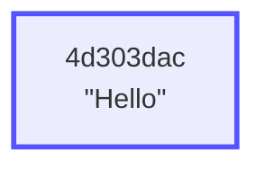

### Mermaid (`hide-nodes`)


## Signed Plaintext

* Internal elements (elements with children) are represented with red outlines.
* A `NODE` element appears when one or more assertions are present on a subject. They are represented by circles. They have one arm for the `subject` and an additional arm for each assertion.
* An `ASSERTION` element is represented by the Mermaid `stadium`  shape, and has exactly two arms: `predicate` and `object`.
* Well-known values like the `verifiedBy` are represented by trapezoids, and are encoded as short integers.
* In the `hideNodes` variants, assertions appear to stem from the subject of the envelope.

### Envelope CLI Commands

```bash
envelope subject "Hello" | \
    envelope sign --prvkeys `envelope generate prvkeys`
```

### Envelope Notation

```
"Hello" [
    verifiedBy: Signature
]
```

### Tree Format

```
de723845 NODE
    4d303dac subj "Hello"
    ca4c6be6 ASSERTION
        9d7ba9eb pred verifiedBy
        fff797cc obj Signature
```

### Tree Format (`hide-nodes`)

```
"Hello"
    ASSERTION
        verifiedBy
        Signature
```

### Mermaid


### Mermaid (`hide-nodes`)

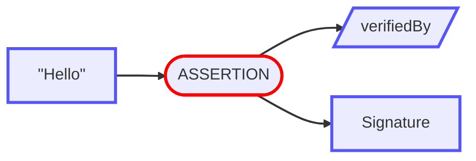

## Encrypted Subject

* `ENCRYPTED`, `ELIDED`, and `COMPRESSED` elements appear with dotted outlines in the Mermaid output formats, to indicate that they may be replaced with their unencrypted/unelided/uncompressed counterparts without invalidating the digest tree.
* `ENCRYPTED` elements are represented by the Mermaid `asymmetric` shape.

### Envelope CLI Commands

```bash
envelope subject "Alice" | \
    envelope assertion "knows" "Bob" | \
    envelope encrypt --key `envelope generate key`
```

### Envelope Notation

```
ENCRYPTED [
    "knows": "Bob"
]
```

### Tree Format

```
8955db5e NODE
    13941b48 subj ENCRYPTED
    78d666eb ASSERTION
        db7dd21c pred "knows"
        13b74194 obj "Bob"
```

### Tree Format (`hide-nodes`)

```
ENCRYPTED
    ASSERTION
        "knows"
        "Bob"
```

### Mermaid

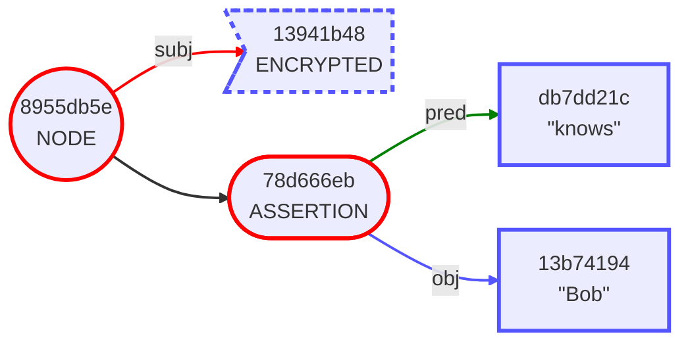

### Mermaid (`hide-nodes`)

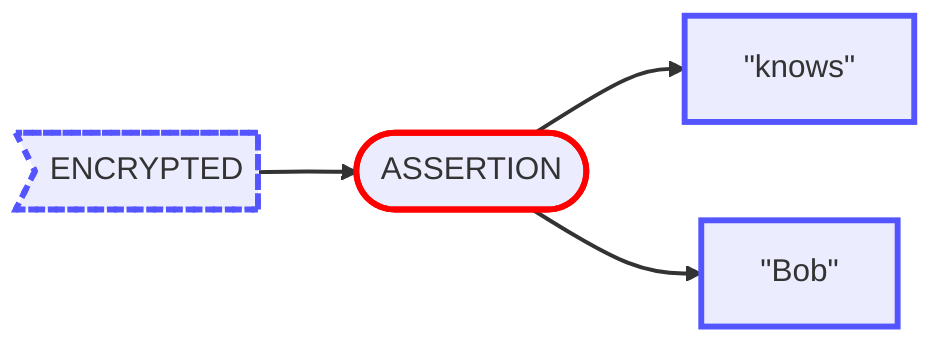

## Top-Level Assertion

* As mentioned previously, all of the element types are themselves envelopes, and can therefore stand alone. In this case, we have extracted a single assertion.

### Envelope CLI Commands

```bash
envelope assertion create "knows" "Bob"
```

### Envelope Notation

```
"knows": "Bob"
```

### Tree Format

```
78d666eb ASSERTION
    db7dd21c pred "knows"
    13b74194 obj "Bob"
```

### Tree Format (`hide-nodes`)

```
ASSERTION
    "knows"
    "Bob"
```

### Mermaid

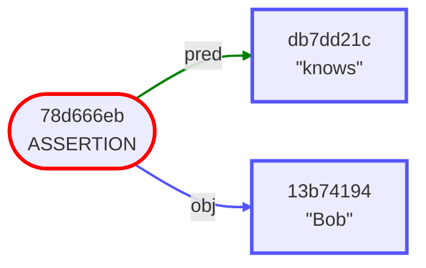

### Mermaid (`hide-nodes`)


## Elided Object

* `ELIDED` elements are represented by dotted hexagons.
* Note that the digest of the element "Bob" in the previous example matches the digest of the elided element above.
* Likewise, note that the digest of the subject "Alice" matches the encrypted version in the previous example.
* In fact, *all* the digests in this envelope match those in the previous example, indicating that the unencrypted/unelided form of this envelope has the exact same content.

### Envelope CLI Commands

```bash
ENVELOPE=`envelope subject "Alice" | envelope assertion "knows" "Bob"`; \
    TARGET=`envelope subject "Bob" | envelope digest`; \
    envelope elide removing $ENVELOPE $TARGET
```

### Envelope Notation

```
"Alice" [
    "knows": ELIDED
]
```

### Tree Format

```
8955db5e NODE
    13941b48 subj "Alice"
    78d666eb ASSERTION
        db7dd21c pred "knows"
        13b74194 obj ELIDED
```

### Tree Format (`hide-nodes`)

```
"Alice"
    ASSERTION
        "knows"
        ELIDED
```

### Mermaid

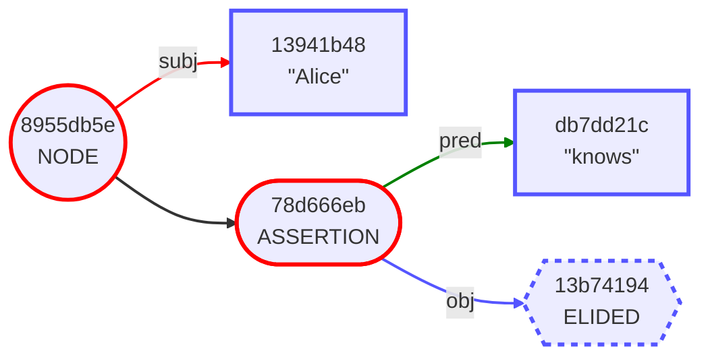

### Mermaid (`hide-nodes`)

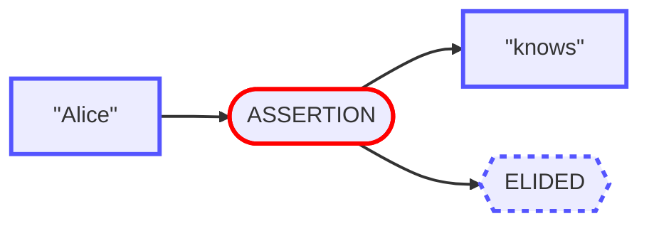

## Signed Subject

* A signature signs only the digest of the subject, in this case "Alice". So in this case, the "knows" assertions are not signed.
* Note that for every internal element, the children are displayed in the order that their digests are combined to form the parent's digest. In particular a `NODE`'s, `ASSERTION` elements are ordered by ascending digest value, so the order of the three assertion digests here: `4012caf2`, `78d666eb`, `c838acb5` reflects that ascending order.

### Envelope CLI Commands

```bash
envelope subject "Alice" | \
    envelope assertion "knows" "Bob" | \
    envelope assertion "knows" "Carol" | \
    envelope sign --prvkeys `envelope generate prvkeys`
```

### Envelope Notation

```
"Alice" [
    "knows": "Bob"
    "knows": "Carol"
    verifiedBy: Signature
]
```

### Tree Format

```
1f38d3ea NODE
    13941b48 subj "Alice"
    4012caf2 ASSERTION
        db7dd21c pred "knows"
        afb8122e obj "Carol"
    78d666eb ASSERTION
        db7dd21c pred "knows"
        13b74194 obj "Bob"
    ccb85af2 ASSERTION
        9d7ba9eb pred verifiedBy
        a4dba81e obj Signature
```

### Tree Format (`hide-nodes`)

```
"Alice"
    ASSERTION
        "knows"
        "Carol"
    ASSERTION
        "knows"
        "Bob"
    ASSERTION
        verifiedBy
        Signature
```

### Mermaid

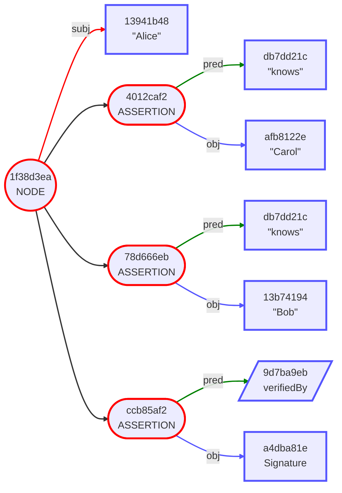

### Mermaid (`hide-nodes`)

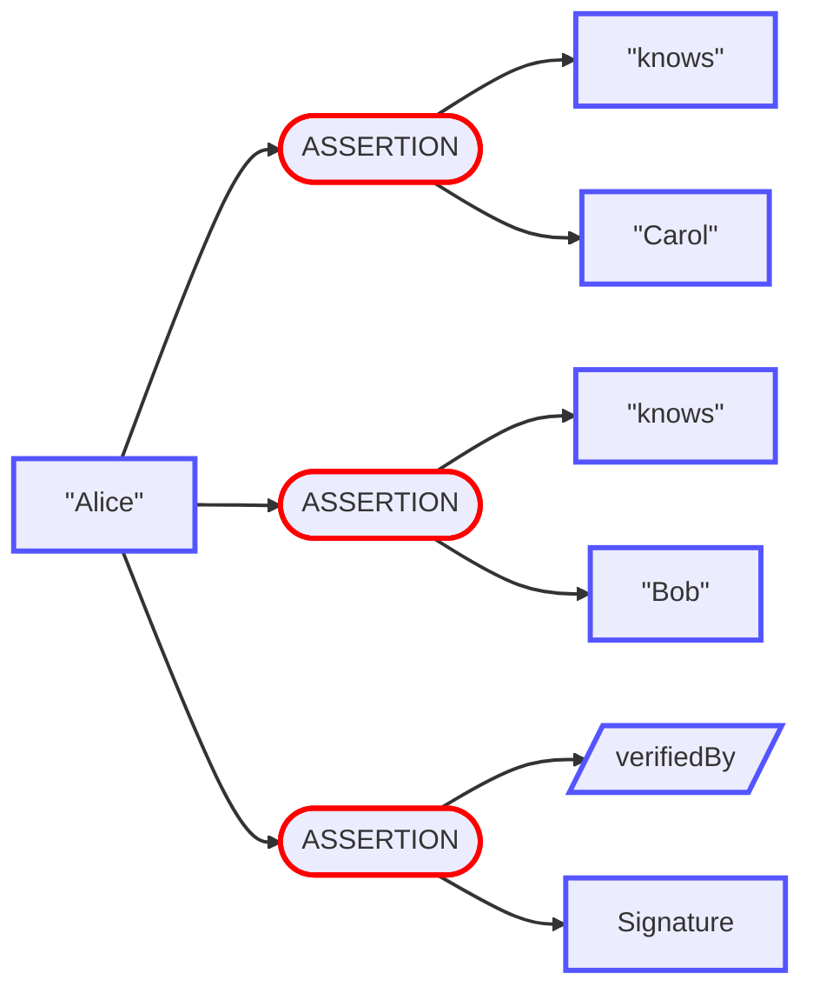

## Elided Assertions

* This is the same envelope from the previous example with its assertions elided. Note that the digests at every level still present are all the same.

### Envelope CLI Commands

```bash
SUBJECT=`envelope subject "Alice"`; \
ENVELOPE=`envelope assertion add "knows" "Bob" $SUBJECT | \
    envelope assertion "knows" "Carol" | \
    envelope sign --prvkeys \`envelope generate prvkeys\``; \
envelope elide revealing $ENVELOPE `envelope digest $ENVELOPE` `envelope digest $SUBJECT`
```

### Envelope Notation

```
"Alice" [
    ELIDED (3)
]
```

### Tree Format

```
25af3dae NODE
    13941b48 subj "Alice"
    35816ffd ELIDED
    4012caf2 ELIDED
    78d666eb ELIDED
```

### Tree Format (`hide-nodes`)

```
"Alice"
    ELIDED
    ELIDED
    ELIDED
```

### Mermaid

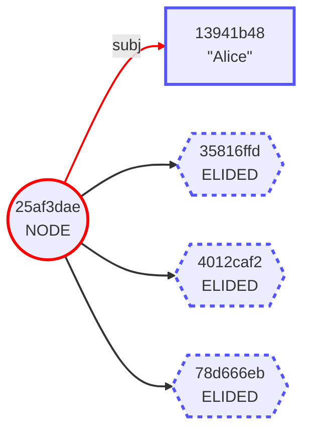

### Mermaid (`hide-nodes`)

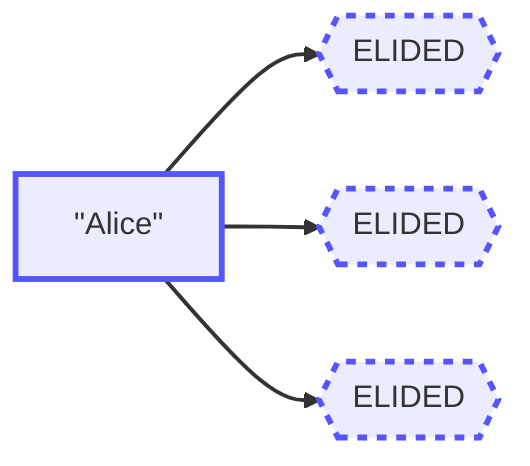

## Wrapped Then Signed

* In this case the signature still only signs the subject, but the subject is an entire envelope that's been wrapped.
* `WRAPPED` elements are represented by trapezoids. They have exactly one arm, which is the root of the wrapped envelope.

### Envelope CLI Commands

```bash
envelope subject "Alice" | \
    envelope assertion add "knows" "Bob" | \
    envelope assertion "knows" "Carol" | \
    envelope subject --wrapped | \
    envelope sign --prvkeys `envelope generate prvkeys`
```

### Envelope Notation

```
{
    "Alice" [
        "knows": "Bob"
        "knows": "Carol"
    ]
} [
    verifiedBy: Signature
]
```

### Tree Format

```
486a7a3f NODE
    9e3b0673 subj WRAPPED
        b8d857f6 subj NODE
            13941b48 subj "Alice"
            4012caf2 ASSERTION
                db7dd21c pred "knows"
                afb8122e obj "Carol"
            78d666eb ASSERTION
                db7dd21c pred "knows"
                13b74194 obj "Bob"
    089bdcdf ASSERTION
        9d7ba9eb pred verifiedBy
        f18ce1dc obj Signature
```

### Tree Format (`hide-nodes`)

```
WRAPPED
    "Alice"
        ASSERTION
            "knows"
            "Carol"
        ASSERTION
            "knows"
            "Bob"
    ASSERTION
        verifiedBy
        Signature
```

### Mermaid

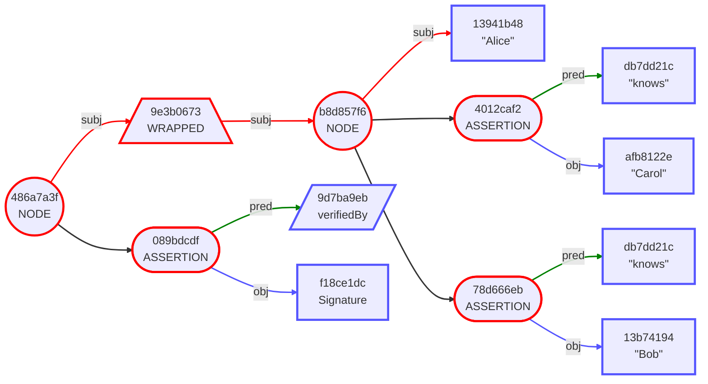

### Mermaid (`hide-nodes`)

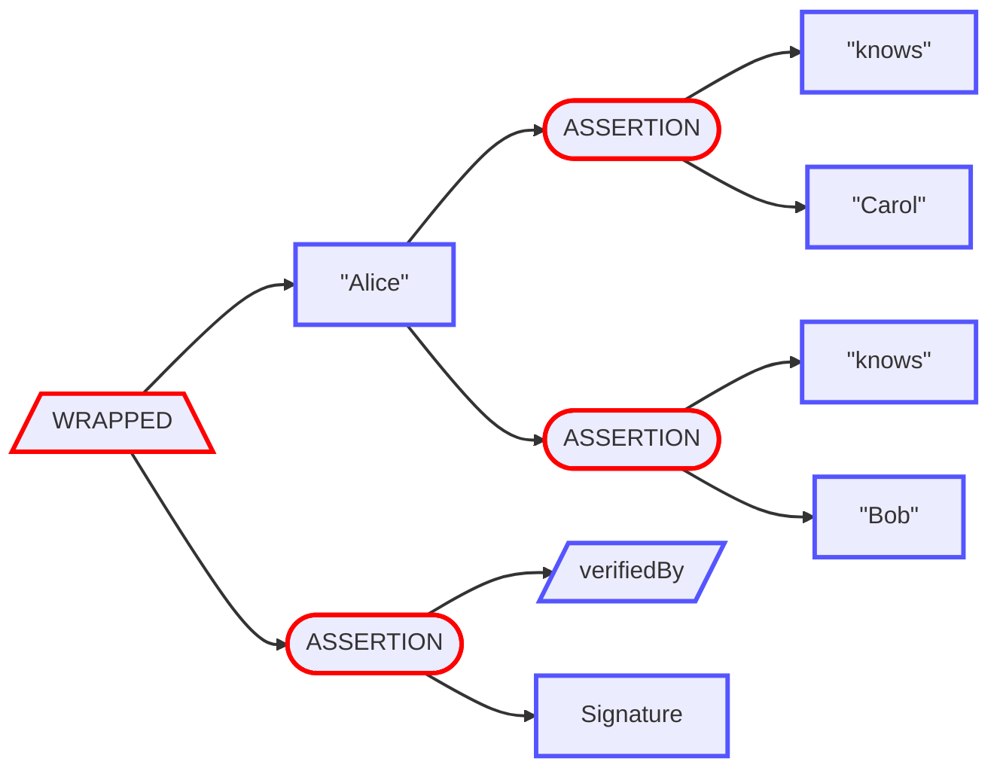

## Encrypt to Recipients

* Top-to-bottom layout is also supported.

### Envelope CLI Commands

```bash
BOB_PUBKEYS="ur:crypto-pubkeys/lftaadfwhdcxndctnnflynethhhnwdkbhtehhdosmhgoclvefhjpehtaethkltsrmssnwfctfggdtaaddmhdcxtipdbagmoertsklaflfhfewsptrlmhjpdeemkbdyktmtfwnninfrbnmwonetwphehdprsepm"; \
CAROL_PUBKEYS="ur:crypto-pubkeys/lftaadfwhdcxeckpgwvyasletilffeeekbtyjlzeimmtkslkpadrtnnytontpyfyeocnecstktkttaaddmhdcxoyndtbndhspebgtewmgrgrgriygmvwckkkaysfzozclbgendfmhfjliorteenlbwzmfswzwk"; \
envelope subject "Hello" | envelope encrypt --recipient $BOB_PUBKEYS --recipient $CAROL_PUBKEYS
```

### Envelope Notation

```
ENCRYPTED [
    hasRecipient: SealedMessage
    hasRecipient: SealedMessage
]
```

### Tree Format

```
ff9022bb NODE
    4d303dac subj ENCRYPTED
    0be96185 ASSERTION
        e41178b8 pred hasRecipient
        3cdfcfc6 obj SealedMessage
    50952b8d ASSERTION
        e41178b8 pred hasRecipient
        311bdb68 obj SealedMessage
```

### Tree Format (`hide-nodes`)

```
ENCRYPTED
    ASSERTION
        hasRecipient
        SealedMessage
    ASSERTION
        hasRecipient
        SealedMessage
```

### Mermaid

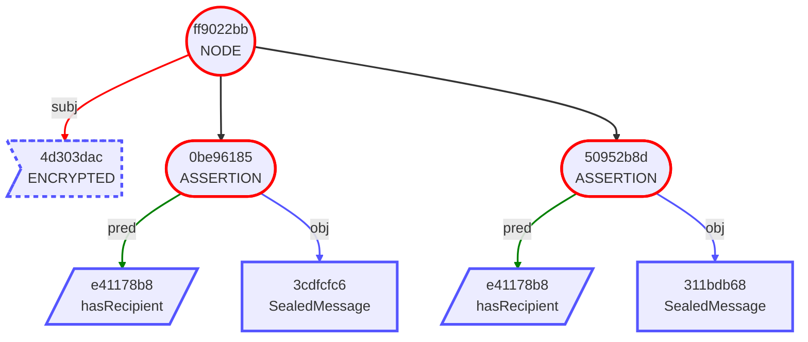

### Mermaid (`hide-nodes`)

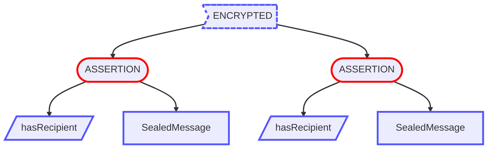

## Complex Metadata

### Envelope CLI Commands

```bash
echo "ur:envelope/lrtpsptpcstpsfhdcxdstihtykswvlcmamsrcwdtgdwscmtyemfdcyprclhtjzsameimtdbedidspkmuvttpsptpsolftpsptpsgastpsptpcsiegagdfggutpsptpsolftpsptpcsiyiyjljpjnhsjytpsptpcsiefegdgofwtpsptpsolftpsptpcsiektjljpjetpsplttpsptpcstaadethdcxlbrhbkntmtrtlbesylhyolpswfmotsnedkctpsglrtrnclcxylspdkldjsckfmlatpsptpsolftpsptpcsieinjkidjttpsptpcsjnesemetdyeeeceheheseheheeeetpsptpsolftpsptpsgbdtpsplftpsptpcskpgshscxjpihidihjzinsrqdjtcxieihcxfpjyjzhsjktpsptpsolftpsptpsgbntpsptpcsidihjktpsptpsolftpsptpsgaotpsptpcsihjtjlkoihjztpsptpsolftpsptpcsiyhskpjyisjljptpsplstpsptpcstaadethdcxnsjykntoksoxspdsesdabeutidlpgockkiwkvwcmfldtoyqdhsmkvwjtadkoiysptpsptpsolftpsptpsgbdtpsptpcsisfpkkjtcxgmhsjtietpsptpsolftpsptpsgastpsptpcsjsgsinidjphsjpkkgwiyfxjljtiojpihjkjktpsptpsolftpsptpsgastpsptpcsjsgsinidjphsjpkkgwiyfxjljtiojpihjkjktpsptpsolftpsptpsgbdtpsplftpsptpcsjtfpjyjzhsjkcxguisjpkpioioihietpsptpsolftpsptpsgbntpsptpcsidihjtrksfcftp"
```

### Envelope Notation

```
Digest(26d05af5) [
    "format": "EPUB"
    "work": CID(7fb90a9d) [
        "author": CID(9c747ace) [
            dereferenceVia: "LibraryOfCongress"
            hasName: "Ayn Rand"
        ]
        "isbn": "9780451191144"
        dereferenceVia: "LibraryOfCongress"
        hasName: "Atlas Shrugged" [
            language: "en"
        ]
        hasName: "La rebelión de Atlas" [
            language: "es"
        ]
        isA: "novel"
    ]
    dereferenceVia: "IPFS"
]
```

### Tree Format

```
f41cbb59 NODE
    5d3e9195 subj Digest(26d05af5)
    05edf8ca ASSERTION
        e25b9baf pred dereferenceVia
        15eac58f obj "IPFS"
    953cdab2 ASSERTION
        a9a86b03 pred "format"
        9536cfe0 obj "EPUB"
    a3400534 ASSERTION
        2ddb0b05 pred "work"
        3d2c3a7f obj NODE
            d8304d46 subj CID(7fb90a9d)
            1786d8b5 ASSERTION
                4019420b pred "isbn"
                69ff76b1 obj "9780451191144"
            1903fe89 ASSERTION
                9d0480e0 pred hasName
                61a11981 obj NODE
                    5e825721 subj "La rebelión de Atlas"
                    62ea333c ASSERTION
                        65fa1c25 pred language
                        b33e79c2 obj "es"
            212af9fb ASSERTION
                96f0167d pred isA
                6d7c7189 obj "novel"
            21af9ce9 ASSERTION
                29c09059 pred "author"
                71bf6c35 obj NODE
                    f4f77a81 subj CID(9c747ace)
                    050a4539 ASSERTION
                        9d0480e0 pred hasName
                        98985bd5 obj "Ayn Rand"
                    24b5a41b ASSERTION
                        e25b9baf pred dereferenceVia
                        34a04547 obj "LibraryOfCongress"
            24b5a41b ASSERTION
                e25b9baf pred dereferenceVia
                34a04547 obj "LibraryOfCongress"
            3d1f0148 ASSERTION
                9d0480e0 pred hasName
                fb15ce3e obj NODE
                    e84c3091 subj "Atlas Shrugged"
                    e6bd65c8 ASSERTION
                        65fa1c25 pred language
                        6700869c obj "en"
```

### Tree Format (`hide-nodes`)

```
Digest(26d05af5)
    ASSERTION
        dereferenceVia
        "IPFS"
    ASSERTION
        "format"
        "EPUB"
    ASSERTION
        "work"
        CID(7fb90a9d)
            ASSERTION
                "isbn"
                "9780451191144"
            ASSERTION
                hasName
                "La rebelión de Atlas"
                    ASSERTION
                        language
                        "es"
            ASSERTION
                isA
                "novel"
            ASSERTION
                "author"
                CID(9c747ace)
                    ASSERTION
                        hasName
                        "Ayn Rand"
                    ASSERTION
                        dereferenceVia
                        "LibraryOfCongress"
            ASSERTION
                dereferenceVia
                "LibraryOfCongress"
            ASSERTION
                hasName
                "Atlas Shrugged"
                    ASSERTION
                        language
                        "en"
```

### Mermaid

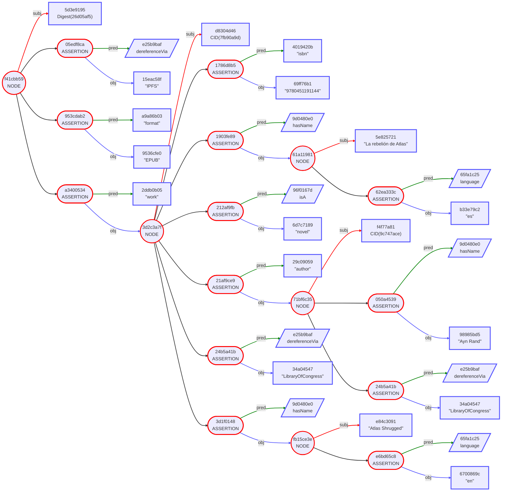

### Mermaid (`hide-nodes`)

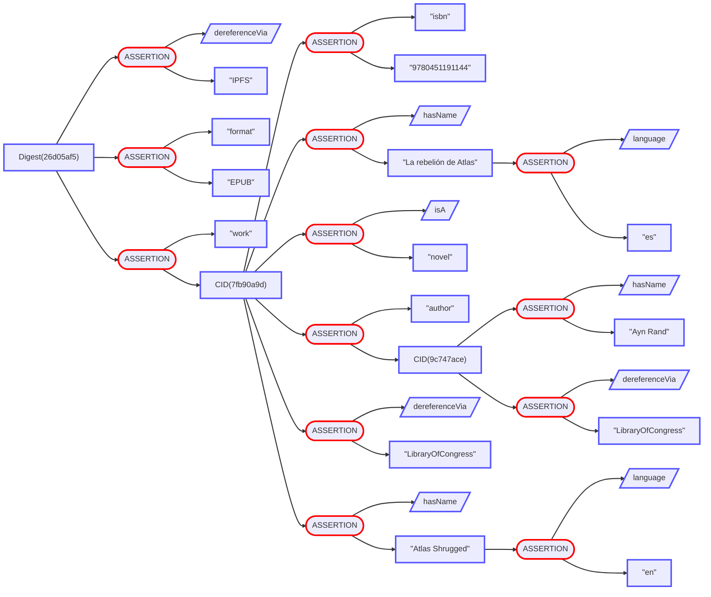

## Verifiable Credential

### Envelope CLI Commands

```bash
echo "ur:envelope/lstpsptpsbmntpsptpcstaadethdcxfgkoiahtjthnissawsfhzcmyyldsutfzcttefpaxjtmobsbwimcaleykvsdtgajntpsptpsolftpsptpcsjsiaihjpjyiniyiniahsjyihglkpjnidihjptpsptpcsjeeheyeodpeeecendpemetestpsptpsolftpsptpcsjtihksjoinjphsjyinjljtfyhsjyihtpsptpcssecyjncscxaetpsptpsolftpsptpcsisjzhsjkjyglhsjnihtpsptpcsiogthsksktihjzjztpsptpsolftpsptpcsininjkjkkpihfyhsjyihtpsptpcssecyhybdvyaetpsptpsolftpsptpcsihjoisjljyjltpsptpcsksckghisinjkcxinjkcxgehsjnihjkcxgthsksktihjzjzdijkcxjoisjljyjldmtpsptpsolftpsptpcskscejojpjliyihjkjkinjljthsjzfyihkoihjzjljojnihjtjyfdjlkpjpjktpsptpcsbstpsptpsolftpsptpcsiniyinjpjkjyglhsjnihtpsptpcsihgehsjnihjktpsptpsolftpsptpcsiyjyjljoiniajktpsptpcslfingukpidimihiajycxehingukpidimihiajycxeytpsptpsolftpsptpcskscsiajljtjyinjtkpinjtiofeiekpiahsjyinjljtgojtinjyjktpsptpcsadtpsptpsolftpsptpsgaotpsptpcskscffxihjpjyiniyiniahsjyihcxjliycxfxjljnjojzihjyinjljttpsptpsolftpsptpcsiojkkpidimihiajytpsptpcskscegmfgcxhsjtiecxgtiniajpjlkthskoihcxfejtioinjtihihjpinjtiotpsptpsolftpsptpsgattpsptpcsksdkfekshsjnjojzihcxfejzihiajyjpiniahsjzcxfejtioinjtihihjpinjtiocxfwjlhsjpietpsptpsolftpsptpsgbttpsptpcsksdkfekshsjnjojzihcxfejzihiajyjpiniahsjzcxfejtioinjtihihjpinjtiocxfwjlhsjpietpsptpsolftpsptpsgaxtpsptpcstaadfzhdfzinglfpkbcyamyladcacnbzcmidwkjehezeispahnpliasbwkpfcwwzgwolrhguzoryntynbynepshljnfhbaghpfaaiyftfwhkdyknrhoelntlnnwmhloyssntskktuotpsptpsolftpsptpsgaatpsptpcsksdmguiniojtihiecxidkkcxfekshsjnjojzihcxfejzihiajyjpiniahsjzcxfejtioinjtihihjpinjtiocxfwjlhsjpietesfkbfd"
```

### Envelope Notation

```
{
    CID(4676635a) [
        "certificateNumber": "123-456-789"
        "continuingEducationUnits": 1
        "expirationDate": 2028-01-01
        "firstName": "James"
        "issueDate": 2020-01-01
        "lastName": "Maxwell"
        "photo": "This is James Maxwell's photo."
        "professionalDevelopmentHours": 15
        "subject": "RF and Microwave Engineering"
        "topics": ["Subject 1", "Subject 2"]
        controller: "Example Electrical Engineering Board"
        isA: "Certificate of Completion"
        issuer: "Example Electrical Engineering Board"
    ]
} [
    note: "Signed by Example Electrical Engineering Board"
    verifiedBy: Signature
]
```

### Tree Format

```
e1335c97 NODE
    5886e784 subj WRAPPED
        c9860567 subj NODE
            5fb45cf1 subj CID(4676635a)
            1f9ff098 ASSERTION
                9e3bff3a pred "certificateNumber"
                21c21808 obj "123-456-789"
            36c254d0 ASSERTION
                6e5d379f pred "expirationDate"
                639ae9bf obj 2028-01-01
            3c114201 ASSERTION
                5f82a16a pred "lastName"
                fe4d5230 obj "Maxwell"
            4a9b2e4d ASSERTION
                222afe69 pred "issueDate"
                cb67f31d obj 2020-01-01
            5171cbaf ASSERTION
                3976ef74 pred "photo"
                231b8527 obj "This is James Maxwell's photo."
            54b3e1e7 ASSERTION
                f13aa855 pred "professionalDevelopmentHours"
                dc0e9c36 obj 15
            5dc6d4e3 ASSERTION
                4395643b pred "firstName"
                d6d0b768 obj "James"
            68895d8e ASSERTION
                e6bf4dd3 pred "topics"
                543fcc09 obj ["Subject 1", "Subject 2"]
            8ec5e912 ASSERTION
                2b191589 pred "continuingEducationUnits"
                4bf5122f obj 1
            922c859a ASSERTION
                96f0167d pred isA
                051beee6 obj "Certificate of Completion"
            caf5ced3 ASSERTION
                8e4e62eb pred "subject"
                202c10ef obj "RF and Microwave Engineering"
            d61e0984 ASSERTION
                e665c567 pred controller
                f8489ac1 obj "Example Electrical Engineering Board"
            ebcbf71f ASSERTION
                fde30b5c pred issuer
                f8489ac1 obj "Example Electrical Engineering Board"
    4025e72d ASSERTION
        9d7ba9eb pred verifiedBy
        73316b2b obj Signature
    55b14b17 ASSERTION
        49a5f41b pred note
        f106bad1 obj "Signed by Example Electrical Engineering…"
```

### Tree Format (`hide-nodes`)

```
WRAPPED
    CID(4676635a)
        ASSERTION
            "certificateNumber"
            "123-456-789"
        ASSERTION
            "expirationDate"
            2028-01-01
        ASSERTION
            "lastName"
            "Maxwell"
        ASSERTION
            "issueDate"
            2020-01-01
        ASSERTION
            "photo"
            "This is James Maxwell's photo."
        ASSERTION
            "professionalDevelopmentHours"
            15
        ASSERTION
            "firstName"
            "James"
        ASSERTION
            "topics"
            ["Subject 1", "Subject 2"]
        ASSERTION
            "continuingEducationUnits"
            1
        ASSERTION
            isA
            "Certificate of Completion"
        ASSERTION
            "subject"
            "RF and Microwave Engineering"
        ASSERTION
            controller
            "Example Electrical Engineering Board"
        ASSERTION
            issuer
            "Example Electrical Engineering Board"
    ASSERTION
        verifiedBy
        Signature
    ASSERTION
        note
        "Signed by Example Electrical Engineering…"
```

### Mermaid

```mermaid
graph LR
    1(("e1335c97<br/>NODE"))
    2[/"5886e784<br/>WRAPPED"\]
    3(("c9860567<br/>NODE"))
    4["5fb45cf1<br/>CID(4676635a)"]
    5(["1f9ff098<br/>ASSERTION"])
    6["9e3bff3a<br/>#quot;certificateNumber#quot;"]
    7["21c21808<br/>#quot;123-456-789#quot;"]
    8(["36c254d0<br/>ASSERTION"])
    9["6e5d379f<br/>#quot;expirationDate#quot;"]
    10["639ae9bf<br/>2028-01-01"]
    11(["3c114201<br/>ASSERTION"])
    12["5f82a16a<br/>#quot;lastName#quot;"]
    13["fe4d5230<br/>#quot;Maxwell#quot;"]
    14(["4a9b2e4d<br/>ASSERTION"])
    15["222afe69<br/>#quot;issueDate#quot;"]
    16["cb67f31d<br/>2020-01-01"]
    17(["5171cbaf<br/>ASSERTION"])
    18["3976ef74<br/>#quot;photo#quot;"]
    19["231b8527<br/>#quot;This is James Maxwell's photo.#quot;"]
    20(["54b3e1e7<br/>ASSERTION"])
    21["f13aa855<br/>#quot;professionalDevelopmentHours#quot;"]
    22["dc0e9c36<br/>15"]
    23(["5dc6d4e3<br/>ASSERTION"])
    24["4395643b<br/>#quot;firstName#quot;"]
    25["d6d0b768<br/>#quot;James#quot;"]
    26(["68895d8e<br/>ASSERTION"])
    27["e6bf4dd3<br/>#quot;topics#quot;"]
    28["543fcc09<br/>[#quot;Subject 1#quot;, #quot;Subject 2#quot;]"]
    29(["8ec5e912<br/>ASSERTION"])
    30["2b191589<br/>#quot;continuingEducationUnits#quot;"]
    31["4bf5122f<br/>1"]
    32(["922c859a<br/>ASSERTION"])
    33[/"96f0167d<br/>isA"/]
    34["051beee6<br/>#quot;Certificate of Completion#quot;"]
    35(["caf5ced3<br/>ASSERTION"])
    36["8e4e62eb<br/>#quot;subject#quot;"]
    37["202c10ef<br/>#quot;RF and Microwave Engineering#quot;"]
    38(["d61e0984<br/>ASSERTION"])
    39[/"e665c567<br/>controller"/]
    40["f8489ac1<br/>#quot;Example Electrical Engineering Board#quot;"]
    41(["ebcbf71f<br/>ASSERTION"])
    42[/"fde30b5c<br/>issuer"/]
    43["f8489ac1<br/>#quot;Example Electrical Engineering Board#quot;"]
    44(["4025e72d<br/>ASSERTION"])
    45[/"9d7ba9eb<br/>verifiedBy"/]
    46["73316b2b<br/>Signature"]
    47(["55b14b17<br/>ASSERTION"])
    48[/"49a5f41b<br/>note"/]
    49["f106bad1<br/>#quot;Signed by Example Electrical Engineering…#quot;"]
    1 -->|subj| 2
    2 -->|subj| 3
    3 -->|subj| 4
    3 --> 5
    5 -->|pred| 6
    5 -->|obj| 7
    3 --> 8
    8 -->|pred| 9
    8 -->|obj| 10
    3 --> 11
    11 -->|pred| 12
    11 -->|obj| 13
    3 --> 14
    14 -->|pred| 15
    14 -->|obj| 16
    3 --> 17
    17 -->|pred| 18
    17 -->|obj| 19
    3 --> 20
    20 -->|pred| 21
    20 -->|obj| 22
    3 --> 23
    23 -->|pred| 24
    23 -->|obj| 25
    3 --> 26
    26 -->|pred| 27
    26 -->|obj| 28
    3 --> 29
    29 -->|pred| 30
    29 -->|obj| 31
    3 --> 32
    32 -->|pred| 33
    32 -->|obj| 34
    3 --> 35
    35 -->|pred| 36
    35 -->|obj| 37
    3 --> 38
    38 -->|pred| 39
    38 -->|obj| 40
    3 --> 41
    41 -->|pred| 42
    41 -->|obj| 43
    1 --> 44
    44 -->|pred| 45
    44 -->|obj| 46
    1 --> 47
    47 -->|pred| 48
    47 -->|obj| 49
    style 1 stroke:red,stroke-width:3.0px
    style 2 stroke:red,stroke-width:3.0px
    style 3 stroke:red,stroke-width:3.0px
    style 4 stroke:#55f,stroke-width:3.0px
    style 5 stroke:red,stroke-width:3.0px
    style 6 stroke:#55f,stroke-width:3.0px
    style 7 stroke:#55f,stroke-width:3.0px
    style 8 stroke:red,stroke-width:3.0px
    style 9 stroke:#55f,stroke-width:3.0px
    style 10 stroke:#55f,stroke-width:3.0px
    style 11 stroke:red,stroke-width:3.0px
    style 12 stroke:#55f,stroke-width:3.0px
    style 13 stroke:#55f,stroke-width:3.0px
    style 14 stroke:red,stroke-width:3.0px
    style 15 stroke:#55f,stroke-width:3.0px
    style 16 stroke:#55f,stroke-width:3.0px
    style 17 stroke:red,stroke-width:3.0px
    style 18 stroke:#55f,stroke-width:3.0px
    style 19 stroke:#55f,stroke-width:3.0px
    style 20 stroke:red,stroke-width:3.0px
    style 21 stroke:#55f,stroke-width:3.0px
    style 22 stroke:#55f,stroke-width:3.0px
    style 23 stroke:red,stroke-width:3.0px
    style 24 stroke:#55f,stroke-width:3.0px
    style 25 stroke:#55f,stroke-width:3.0px
    style 26 stroke:red,stroke-width:3.0px
    style 27 stroke:#55f,stroke-width:3.0px
    style 28 stroke:#55f,stroke-width:3.0px
    style 29 stroke:red,stroke-width:3.0px
    style 30 stroke:#55f,stroke-width:3.0px
    style 31 stroke:#55f,stroke-width:3.0px
    style 32 stroke:red,stroke-width:3.0px
    style 33 stroke:#55f,stroke-width:3.0px
    style 34 stroke:#55f,stroke-width:3.0px
    style 35 stroke:red,stroke-width:3.0px
    style 36 stroke:#55f,stroke-width:3.0px
    style 37 stroke:#55f,stroke-width:3.0px
    style 38 stroke:red,stroke-width:3.0px
    style 39 stroke:#55f,stroke-width:3.0px
    style 40 stroke:#55f,stroke-width:3.0px
    style 41 stroke:red,stroke-width:3.0px
    style 42 stroke:#55f,stroke-width:3.0px
    style 43 stroke:#55f,stroke-width:3.0px
    style 44 stroke:red,stroke-width:3.0px
    style 45 stroke:#55f,stroke-width:3.0px
    style 46 stroke:#55f,stroke-width:3.0px
    style 47 stroke:red,stroke-width:3.0px
    style 48 stroke:#55f,stroke-width:3.0px
    style 49 stroke:#55f,stroke-width:3.0px
    linkStyle 0 stroke:red,stroke-width:2.0px
    linkStyle 1 stroke:red,stroke-width:2.0px
    linkStyle 2 stroke:red,stroke-width:2.0px
    linkStyle 3 stroke-width:2.0px
    linkStyle 4 stroke:green,stroke-width:2.0px
    linkStyle 5 stroke:#55f,stroke-width:2.0px
    linkStyle 6 stroke-width:2.0px
    linkStyle 7 stroke:green,stroke-width:2.0px
    linkStyle 8 stroke:#55f,stroke-width:2.0px
    linkStyle 9 stroke-width:2.0px
    linkStyle 10 stroke:green,stroke-width:2.0px
    linkStyle 11 stroke:#55f,stroke-width:2.0px
    linkStyle 12 stroke-width:2.0px
    linkStyle 13 stroke:green,stroke-width:2.0px
    linkStyle 14 stroke:#55f,stroke-width:2.0px
    linkStyle 15 stroke-width:2.0px
    linkStyle 16 stroke:green,stroke-width:2.0px
    linkStyle 17 stroke:#55f,stroke-width:2.0px
    linkStyle 18 stroke-width:2.0px
    linkStyle 19 stroke:green,stroke-width:2.0px
    linkStyle 20 stroke:#55f,stroke-width:2.0px
    linkStyle 21 stroke-width:2.0px
    linkStyle 22 stroke:green,stroke-width:2.0px
    linkStyle 23 stroke:#55f,stroke-width:2.0px
    linkStyle 24 stroke-width:2.0px
    linkStyle 25 stroke:green,stroke-width:2.0px
    linkStyle 26 stroke:#55f,stroke-width:2.0px
    linkStyle 27 stroke-width:2.0px
    linkStyle 28 stroke:green,stroke-width:2.0px
    linkStyle 29 stroke:#55f,stroke-width:2.0px
    linkStyle 30 stroke-width:2.0px
    linkStyle 31 stroke:green,stroke-width:2.0px
    linkStyle 32 stroke:#55f,stroke-width:2.0px
    linkStyle 33 stroke-width:2.0px
    linkStyle 34 stroke:green,stroke-width:2.0px
    linkStyle 35 stroke:#55f,stroke-width:2.0px
    linkStyle 36 stroke-width:2.0px
    linkStyle 37 stroke:green,stroke-width:2.0px
    linkStyle 38 stroke:#55f,stroke-width:2.0px
    linkStyle 39 stroke-width:2.0px
    linkStyle 40 stroke:green,stroke-width:2.0px
    linkStyle 41 stroke:#55f,stroke-width:2.0px
    linkStyle 42 stroke-width:2.0px
    linkStyle 43 stroke:green,stroke-width:2.0px
    linkStyle 44 stroke:#55f,stroke-width:2.0px
    linkStyle 45 stroke-width:2.0px
    linkStyle 46 stroke:green,stroke-width:2.0px
    linkStyle 47 stroke:#55f,stroke-width:2.0px
```

### Mermaid (`hide-nodes`)

```mermaid
graph LR
    1[/"WRAPPED"\]
    2["CID(4676635a)"]
    3(["ASSERTION"])
    4["#quot;certificateNumber#quot;"]
    5["#quot;123-456-789#quot;"]
    6(["ASSERTION"])
    7["#quot;expirationDate#quot;"]
    8["2028-01-01"]
    9(["ASSERTION"])
    10["#quot;lastName#quot;"]
    11["#quot;Maxwell#quot;"]
    12(["ASSERTION"])
    13["#quot;issueDate#quot;"]
    14["2020-01-01"]
    15(["ASSERTION"])
    16["#quot;photo#quot;"]
    17["#quot;This is James Maxwell's photo.#quot;"]
    18(["ASSERTION"])
    19["#quot;professionalDevelopmentHours#quot;"]
    20["15"]
    21(["ASSERTION"])
    22["#quot;firstName#quot;"]
    23["#quot;James#quot;"]
    24(["ASSERTION"])
    25["#quot;topics#quot;"]
    26["[#quot;Subject 1#quot;, #quot;Subject 2#quot;]"]
    27(["ASSERTION"])
    28["#quot;continuingEducationUnits#quot;"]
    29["1"]
    30(["ASSERTION"])
    31[/"isA"/]
    32["#quot;Certificate of Completion#quot;"]
    33(["ASSERTION"])
    34["#quot;subject#quot;"]
    35["#quot;RF and Microwave Engineering#quot;"]
    36(["ASSERTION"])
    37[/"controller"/]
    38["#quot;Example Electrical Engineering Board#quot;"]
    39(["ASSERTION"])
    40[/"issuer"/]
    41["#quot;Example Electrical Engineering Board#quot;"]
    42(["ASSERTION"])
    43[/"verifiedBy"/]
    44["Signature"]
    45(["ASSERTION"])
    46[/"note"/]
    47["#quot;Signed by Example Electrical Engineering…#quot;"]
    1 --> 2
    2 --> 3
    3 --> 4
    3 --> 5
    2 --> 6
    6 --> 7
    6 --> 8
    2 --> 9
    9 --> 10
    9 --> 11
    2 --> 12
    12 --> 13
    12 --> 14
    2 --> 15
    15 --> 16
    15 --> 17
    2 --> 18
    18 --> 19
    18 --> 20
    2 --> 21
    21 --> 22
    21 --> 23
    2 --> 24
    24 --> 25
    24 --> 26
    2 --> 27
    27 --> 28
    27 --> 29
    2 --> 30
    30 --> 31
    30 --> 32
    2 --> 33
    33 --> 34
    33 --> 35
    2 --> 36
    36 --> 37
    36 --> 38
    2 --> 39
    39 --> 40
    39 --> 41
    1 --> 42
    42 --> 43
    42 --> 44
    1 --> 45
    45 --> 46
    45 --> 47
    style 1 stroke:red,stroke-width:3.0px
    style 2 stroke:#55f,stroke-width:3.0px
    style 3 stroke:red,stroke-width:3.0px
    style 4 stroke:#55f,stroke-width:3.0px
    style 5 stroke:#55f,stroke-width:3.0px
    style 6 stroke:red,stroke-width:3.0px
    style 7 stroke:#55f,stroke-width:3.0px
    style 8 stroke:#55f,stroke-width:3.0px
    style 9 stroke:red,stroke-width:3.0px
    style 10 stroke:#55f,stroke-width:3.0px
    style 11 stroke:#55f,stroke-width:3.0px
    style 12 stroke:red,stroke-width:3.0px
    style 13 stroke:#55f,stroke-width:3.0px
    style 14 stroke:#55f,stroke-width:3.0px
    style 15 stroke:red,stroke-width:3.0px
    style 16 stroke:#55f,stroke-width:3.0px
    style 17 stroke:#55f,stroke-width:3.0px
    style 18 stroke:red,stroke-width:3.0px
    style 19 stroke:#55f,stroke-width:3.0px
    style 20 stroke:#55f,stroke-width:3.0px
    style 21 stroke:red,stroke-width:3.0px
    style 22 stroke:#55f,stroke-width:3.0px
    style 23 stroke:#55f,stroke-width:3.0px
    style 24 stroke:red,stroke-width:3.0px
    style 25 stroke:#55f,stroke-width:3.0px
    style 26 stroke:#55f,stroke-width:3.0px
    style 27 stroke:red,stroke-width:3.0px
    style 28 stroke:#55f,stroke-width:3.0px
    style 29 stroke:#55f,stroke-width:3.0px
    style 30 stroke:red,stroke-width:3.0px
    style 31 stroke:#55f,stroke-width:3.0px
    style 32 stroke:#55f,stroke-width:3.0px
    style 33 stroke:red,stroke-width:3.0px
    style 34 stroke:#55f,stroke-width:3.0px
    style 35 stroke:#55f,stroke-width:3.0px
    style 36 stroke:red,stroke-width:3.0px
    style 37 stroke:#55f,stroke-width:3.0px
    style 38 stroke:#55f,stroke-width:3.0px
    style 39 stroke:red,stroke-width:3.0px
    style 40 stroke:#55f,stroke-width:3.0px
    style 41 stroke:#55f,stroke-width:3.0px
    style 42 stroke:red,stroke-width:3.0px
    style 43 stroke:#55f,stroke-width:3.0px
    style 44 stroke:#55f,stroke-width:3.0px
    style 45 stroke:red,stroke-width:3.0px
    style 46 stroke:#55f,stroke-width:3.0px
    style 47 stroke:#55f,stroke-width:3.0px
    linkStyle 0 stroke-width:2.0px
    linkStyle 1 stroke-width:2.0px
    linkStyle 2 stroke-width:2.0px
    linkStyle 3 stroke-width:2.0px
    linkStyle 4 stroke-width:2.0px
    linkStyle 5 stroke-width:2.0px
    linkStyle 6 stroke-width:2.0px
    linkStyle 7 stroke-width:2.0px
    linkStyle 8 stroke-width:2.0px
    linkStyle 9 stroke-width:2.0px
    linkStyle 10 stroke-width:2.0px
    linkStyle 11 stroke-width:2.0px
    linkStyle 12 stroke-width:2.0px
    linkStyle 13 stroke-width:2.0px
    linkStyle 14 stroke-width:2.0px
    linkStyle 15 stroke-width:2.0px
    linkStyle 16 stroke-width:2.0px
    linkStyle 17 stroke-width:2.0px
    linkStyle 18 stroke-width:2.0px
    linkStyle 19 stroke-width:2.0px
    linkStyle 20 stroke-width:2.0px
    linkStyle 21 stroke-width:2.0px
    linkStyle 22 stroke-width:2.0px
    linkStyle 23 stroke-width:2.0px
    linkStyle 24 stroke-width:2.0px
    linkStyle 25 stroke-width:2.0px
    linkStyle 26 stroke-width:2.0px
    linkStyle 27 stroke-width:2.0px
    linkStyle 28 stroke-width:2.0px
    linkStyle 29 stroke-width:2.0px
    linkStyle 30 stroke-width:2.0px
    linkStyle 31 stroke-width:2.0px
    linkStyle 32 stroke-width:2.0px
    linkStyle 33 stroke-width:2.0px
    linkStyle 34 stroke-width:2.0px
    linkStyle 35 stroke-width:2.0px
    linkStyle 36 stroke-width:2.0px
    linkStyle 37 stroke-width:2.0px
    linkStyle 38 stroke-width:2.0px
    linkStyle 39 stroke-width:2.0px
    linkStyle 40 stroke-width:2.0px
    linkStyle 41 stroke-width:2.0px
    linkStyle 42 stroke-width:2.0px
    linkStyle 43 stroke-width:2.0px
    linkStyle 44 stroke-width:2.0px
    linkStyle 45 stroke-width:2.0px
```

## Warranty

This is the same credential above that has been elided, had additional assertions added, and then been signed by the employer.

### Envelope CLI Commands

```bash
echo "ur:envelope/lstpsptpsblstpsptpsblstpsptpsbmntpsptpcstaadethdcxfgkoiahtjthnissawsfhzcmyyldsutfzcttefpaxjtmobsbwimcaleykvsdtgajntpsptpsfhdcxctnewtmkmyparfrfkiclkihllrmsoxqdwylgkoimestectlurobzlrfhcsfdwlyntpsptpsolftpsptpcsjtihksjoinjphsjyinjljtfyhsjyihtpsptpcssecyjncscxaetpsptpsolftpsptpcsisjzhsjkjyglhsjnihtpsptpcsiogthsksktihjzjztpsptpsfhdcxgenddmgtcmvwmurpbblogwamdevteogujsghetwfeewndymhdygerfonnbbdmhsatpsptpsfhdcxgyjssbpefzurfztnwymwfxayosbesrgufeatzcosftonvwbanysnadesrlinsrprtpsptpsfhdcxghqdvyvdahrnldidkilehsrylnpmfxmkaxmorfhplsrtcsprjortteoejkdwpecxtpsptpsolftpsptpcsiniyinjpjkjyglhsjnihtpsptpcsihgehsjnihjktpsptpsfhdcxisldhlmnbklogopdathhspzsfxzmpkghamplmwzmrnhfwloeahttaelgnynlfxsptpsptpsfhdcxmnskwlbglaluaetbaoyafprohgnnpfmtpdrscpvdeshtssqzcnjsoscyltmodwcktpsptpsolftpsptpsgaotpsptpcskscffxihjpjyiniyiniahsjyihcxjliycxfxjljnjojzihjyinjljttpsptpsolftpsptpcsiojkkpidimihiajytpsptpcskscegmfgcxhsjtiecxgtiniajpjlkthskoihcxfejtioinjtihihjpinjtiotpsptpsfhdcxtbckaslrtsmhwyfttakkoyfhhnplytfsdlcawmtkcxayluspsklnaskgcffelnimtpsptpsolftpsptpsgbttpsptpcsksdkfekshsjnjojzihcxfejzihiajyjpiniahsjzcxfejtioinjtihihjpinjtiocxfwjlhsjpietpsptpsolftpsptpsgaxtpsptpcstaadfzhdfzinglfpkbcyamyladcacnbzcmidwkjehezeispahnpliasbwkpfcwwzgwolrhguzoryntynbynepshljnfhbaghpfaaiyftfwhkdyknrhoelntlnnwmhloyssntskktuotpsptpsolftpsptpsgaatpsptpcsksdmguiniojtihiecxidkkcxfekshsjnjojzihcxfejzihiajyjpiniahsjzcxfejtioinjtihihjpinjtiocxfwjlhsjpietpsptpsolftpsptpcsjsihjnjojzjlkkihihfdinjpihiefyhsjyihtpsptpcssecyhstknllatpsptpsolftpsptpcsjtihjnjojzjlkkihihgujyhsjykpjktpsptpcsiyhsiajyinkoihtpsptpsolftpsptpsgaxtpsptpcstaadfzhdfzlpcwldcxtanyierpionymdylkgmovodatnbgihzmisjtvwtiotwpwpmtdpfefxoektpmcategefpftlradlofpmkgaollgmdmsemgetnkomufwptguzmjzfhfmjettvdtpsptpsolftpsptpsgaatpsptpcskscsguiniojtihiecxidkkcxfejnjojzjlkkihjpcxfxjljpjodmhkndykws"
```

### Envelope Notation

```
{
    {
        {
            CID(4676635a) [
                "expirationDate": 2028-01-01
                "firstName": "James"
                "lastName": "Maxwell"
                "subject": "RF and Microwave Engineering"
                isA: "Certificate of Completion"
                issuer: "Example Electrical Engineering Board"
                ELIDED (7)
            ]
        } [
            note: "Signed by Example Electrical Engineering Board"
            verifiedBy: Signature
        ]
    } [
        "employeeHiredDate": 2022-01-01
        "employeeStatus": "active"
    ]
} [
    note: "Signed by Employer Corp."
    verifiedBy: Signature
]
```

### Tree Format

```
8dcf9489 NODE
    6ef5d69b subj WRAPPED
        08c5bd4a subj NODE
            bb862fc3 subj WRAPPED
                e1335c97 subj NODE
                    5886e784 subj WRAPPED
                        c9860567 subj NODE
                            5fb45cf1 subj CID(4676635a)
                            1f9ff098 ELIDED
                            36c254d0 ASSERTION
                                6e5d379f pred "expirationDate"
                                639ae9bf obj 2028-01-01
                            3c114201 ASSERTION
                                5f82a16a pred "lastName"
                                fe4d5230 obj "Maxwell"
                            4a9b2e4d ELIDED
                            5171cbaf ELIDED
                            54b3e1e7 ELIDED
                            5dc6d4e3 ASSERTION
                                4395643b pred "firstName"
                                d6d0b768 obj "James"
                            68895d8e ELIDED
                            8ec5e912 ELIDED
                            922c859a ASSERTION
                                96f0167d pred isA
                                051beee6 obj "Certificate of Completion"
                            caf5ced3 ASSERTION
                                8e4e62eb pred "subject"
                                202c10ef obj "RF and Microwave Engineering"
                            d61e0984 ELIDED
                            ebcbf71f ASSERTION
                                fde30b5c pred issuer
                                f8489ac1 obj "Example Electrical Engineering Board"
                    4025e72d ASSERTION
                        9d7ba9eb pred verifiedBy
                        73316b2b obj Signature
                    55b14b17 ASSERTION
                        49a5f41b pred note
                        f106bad1 obj "Signed by Example Electrical Engineering…"
            4c159c16 ASSERTION
                e1ae011e pred "employeeHiredDate"
                13b5a817 obj 2022-01-01
            e071508b ASSERTION
                d03e7352 pred "employeeStatus"
                1d7a790d obj "active"
    812cd3d5 ASSERTION
        9d7ba9eb pred verifiedBy
        e188c401 obj Signature
    8f255569 ASSERTION
        49a5f41b pred note
        f59806d2 obj "Signed by Employer Corp."
```

### Tree Format (`hide-nodes`)

```
WRAPPED
    WRAPPED
        WRAPPED
            CID(4676635a)
                ELIDED
                ASSERTION
                    "expirationDate"
                    2028-01-01
                ASSERTION
                    "lastName"
                    "Maxwell"
                ELIDED
                ELIDED
                ELIDED
                ASSERTION
                    "firstName"
                    "James"
                ELIDED
                ELIDED
                ASSERTION
                    isA
                    "Certificate of Completion"
                ASSERTION
                    "subject"
                    "RF and Microwave Engineering"
                ELIDED
                ASSERTION
                    issuer
                    "Example Electrical Engineering Board"
            ASSERTION
                verifiedBy
                Signature
            ASSERTION
                note
                "Signed by Example Electrical Engineering…"
        ASSERTION
            "employeeHiredDate"
            2022-01-01
        ASSERTION
            "employeeStatus"
            "active"
    ASSERTION
        verifiedBy
        Signature
    ASSERTION
        note
        "Signed by Employer Corp."
```

### Mermaid

```mermaid
graph LR
    1(("8dcf9489<br/>NODE"))
    2[/"6ef5d69b<br/>WRAPPED"\]
    3(("08c5bd4a<br/>NODE"))
    4[/"bb862fc3<br/>WRAPPED"\]
    5(("e1335c97<br/>NODE"))
    6[/"5886e784<br/>WRAPPED"\]
    7(("c9860567<br/>NODE"))
    8["5fb45cf1<br/>CID(4676635a)"]
    9{{"1f9ff098<br/>ELIDED"}}
    10(["36c254d0<br/>ASSERTION"])
    11["6e5d379f<br/>#quot;expirationDate#quot;"]
    12["639ae9bf<br/>2028-01-01"]
    13(["3c114201<br/>ASSERTION"])
    14["5f82a16a<br/>#quot;lastName#quot;"]
    15["fe4d5230<br/>#quot;Maxwell#quot;"]
    16{{"4a9b2e4d<br/>ELIDED"}}
    17{{"5171cbaf<br/>ELIDED"}}
    18{{"54b3e1e7<br/>ELIDED"}}
    19(["5dc6d4e3<br/>ASSERTION"])
    20["4395643b<br/>#quot;firstName#quot;"]
    21["d6d0b768<br/>#quot;James#quot;"]
    22{{"68895d8e<br/>ELIDED"}}
    23{{"8ec5e912<br/>ELIDED"}}
    24(["922c859a<br/>ASSERTION"])
    25[/"96f0167d<br/>isA"/]
    26["051beee6<br/>#quot;Certificate of Completion#quot;"]
    27(["caf5ced3<br/>ASSERTION"])
    28["8e4e62eb<br/>#quot;subject#quot;"]
    29["202c10ef<br/>#quot;RF and Microwave Engineering#quot;"]
    30{{"d61e0984<br/>ELIDED"}}
    31(["ebcbf71f<br/>ASSERTION"])
    32[/"fde30b5c<br/>issuer"/]
    33["f8489ac1<br/>#quot;Example Electrical Engineering Board#quot;"]
    34(["4025e72d<br/>ASSERTION"])
    35[/"9d7ba9eb<br/>verifiedBy"/]
    36["73316b2b<br/>Signature"]
    37(["55b14b17<br/>ASSERTION"])
    38[/"49a5f41b<br/>note"/]
    39["f106bad1<br/>#quot;Signed by Example Electrical Engineering…#quot;"]
    40(["4c159c16<br/>ASSERTION"])
    41["e1ae011e<br/>#quot;employeeHiredDate#quot;"]
    42["13b5a817<br/>2022-01-01"]
    43(["e071508b<br/>ASSERTION"])
    44["d03e7352<br/>#quot;employeeStatus#quot;"]
    45["1d7a790d<br/>#quot;active#quot;"]
    46(["812cd3d5<br/>ASSERTION"])
    47[/"9d7ba9eb<br/>verifiedBy"/]
    48["e188c401<br/>Signature"]
    49(["8f255569<br/>ASSERTION"])
    50[/"49a5f41b<br/>note"/]
    51["f59806d2<br/>#quot;Signed by Employer Corp.#quot;"]
    1 -->|subj| 2
    2 -->|subj| 3
    3 -->|subj| 4
    4 -->|subj| 5
    5 -->|subj| 6
    6 -->|subj| 7
    7 -->|subj| 8
    7 --> 9
    7 --> 10
    10 -->|pred| 11
    10 -->|obj| 12
    7 --> 13
    13 -->|pred| 14
    13 -->|obj| 15
    7 --> 16
    7 --> 17
    7 --> 18
    7 --> 19
    19 -->|pred| 20
    19 -->|obj| 21
    7 --> 22
    7 --> 23
    7 --> 24
    24 -->|pred| 25
    24 -->|obj| 26
    7 --> 27
    27 -->|pred| 28
    27 -->|obj| 29
    7 --> 30
    7 --> 31
    31 -->|pred| 32
    31 -->|obj| 33
    5 --> 34
    34 -->|pred| 35
    34 -->|obj| 36
    5 --> 37
    37 -->|pred| 38
    37 -->|obj| 39
    3 --> 40
    40 -->|pred| 41
    40 -->|obj| 42
    3 --> 43
    43 -->|pred| 44
    43 -->|obj| 45
    1 --> 46
    46 -->|pred| 47
    46 -->|obj| 48
    1 --> 49
    49 -->|pred| 50
    49 -->|obj| 51
    style 1 stroke:red,stroke-width:3.0px
    style 2 stroke:red,stroke-width:3.0px
    style 3 stroke:red,stroke-width:3.0px
    style 4 stroke:red,stroke-width:3.0px
    style 5 stroke:red,stroke-width:3.0px
    style 6 stroke:red,stroke-width:3.0px
    style 7 stroke:red,stroke-width:3.0px
    style 8 stroke:#55f,stroke-width:3.0px
    style 9 stroke:#55f,stroke-width:3.0px,stroke-dasharray:5.0 5.0
    style 10 stroke:red,stroke-width:3.0px
    style 11 stroke:#55f,stroke-width:3.0px
    style 12 stroke:#55f,stroke-width:3.0px
    style 13 stroke:red,stroke-width:3.0px
    style 14 stroke:#55f,stroke-width:3.0px
    style 15 stroke:#55f,stroke-width:3.0px
    style 16 stroke:#55f,stroke-width:3.0px,stroke-dasharray:5.0 5.0
    style 17 stroke:#55f,stroke-width:3.0px,stroke-dasharray:5.0 5.0
    style 18 stroke:#55f,stroke-width:3.0px,stroke-dasharray:5.0 5.0
    style 19 stroke:red,stroke-width:3.0px
    style 20 stroke:#55f,stroke-width:3.0px
    style 21 stroke:#55f,stroke-width:3.0px
    style 22 stroke:#55f,stroke-width:3.0px,stroke-dasharray:5.0 5.0
    style 23 stroke:#55f,stroke-width:3.0px,stroke-dasharray:5.0 5.0
    style 24 stroke:red,stroke-width:3.0px
    style 25 stroke:#55f,stroke-width:3.0px
    style 26 stroke:#55f,stroke-width:3.0px
    style 27 stroke:red,stroke-width:3.0px
    style 28 stroke:#55f,stroke-width:3.0px
    style 29 stroke:#55f,stroke-width:3.0px
    style 30 stroke:#55f,stroke-width:3.0px,stroke-dasharray:5.0 5.0
    style 31 stroke:red,stroke-width:3.0px
    style 32 stroke:#55f,stroke-width:3.0px
    style 33 stroke:#55f,stroke-width:3.0px
    style 34 stroke:red,stroke-width:3.0px
    style 35 stroke:#55f,stroke-width:3.0px
    style 36 stroke:#55f,stroke-width:3.0px
    style 37 stroke:red,stroke-width:3.0px
    style 38 stroke:#55f,stroke-width:3.0px
    style 39 stroke:#55f,stroke-width:3.0px
    style 40 stroke:red,stroke-width:3.0px
    style 41 stroke:#55f,stroke-width:3.0px
    style 42 stroke:#55f,stroke-width:3.0px
    style 43 stroke:red,stroke-width:3.0px
    style 44 stroke:#55f,stroke-width:3.0px
    style 45 stroke:#55f,stroke-width:3.0px
    style 46 stroke:red,stroke-width:3.0px
    style 47 stroke:#55f,stroke-width:3.0px
    style 48 stroke:#55f,stroke-width:3.0px
    style 49 stroke:red,stroke-width:3.0px
    style 50 stroke:#55f,stroke-width:3.0px
    style 51 stroke:#55f,stroke-width:3.0px
    linkStyle 0 stroke:red,stroke-width:2.0px
    linkStyle 1 stroke:red,stroke-width:2.0px
    linkStyle 2 stroke:red,stroke-width:2.0px
    linkStyle 3 stroke:red,stroke-width:2.0px
    linkStyle 4 stroke:red,stroke-width:2.0px
    linkStyle 5 stroke:red,stroke-width:2.0px
    linkStyle 6 stroke:red,stroke-width:2.0px
    linkStyle 7 stroke-width:2.0px
    linkStyle 8 stroke-width:2.0px
    linkStyle 9 stroke:green,stroke-width:2.0px
    linkStyle 10 stroke:#55f,stroke-width:2.0px
    linkStyle 11 stroke-width:2.0px
    linkStyle 12 stroke:green,stroke-width:2.0px
    linkStyle 13 stroke:#55f,stroke-width:2.0px
    linkStyle 14 stroke-width:2.0px
    linkStyle 15 stroke-width:2.0px
    linkStyle 16 stroke-width:2.0px
    linkStyle 17 stroke-width:2.0px
    linkStyle 18 stroke:green,stroke-width:2.0px
    linkStyle 19 stroke:#55f,stroke-width:2.0px
    linkStyle 20 stroke-width:2.0px
    linkStyle 21 stroke-width:2.0px
    linkStyle 22 stroke-width:2.0px
    linkStyle 23 stroke:green,stroke-width:2.0px
    linkStyle 24 stroke:#55f,stroke-width:2.0px
    linkStyle 25 stroke-width:2.0px
    linkStyle 26 stroke:green,stroke-width:2.0px
    linkStyle 27 stroke:#55f,stroke-width:2.0px
    linkStyle 28 stroke-width:2.0px
    linkStyle 29 stroke-width:2.0px
    linkStyle 30 stroke:green,stroke-width:2.0px
    linkStyle 31 stroke:#55f,stroke-width:2.0px
    linkStyle 32 stroke-width:2.0px
    linkStyle 33 stroke:green,stroke-width:2.0px
    linkStyle 34 stroke:#55f,stroke-width:2.0px
    linkStyle 35 stroke-width:2.0px
    linkStyle 36 stroke:green,stroke-width:2.0px
    linkStyle 37 stroke:#55f,stroke-width:2.0px
    linkStyle 38 stroke-width:2.0px
    linkStyle 39 stroke:green,stroke-width:2.0px
    linkStyle 40 stroke:#55f,stroke-width:2.0px
    linkStyle 41 stroke-width:2.0px
    linkStyle 42 stroke:green,stroke-width:2.0px
    linkStyle 43 stroke:#55f,stroke-width:2.0px
    linkStyle 44 stroke-width:2.0px
    linkStyle 45 stroke:green,stroke-width:2.0px
    linkStyle 46 stroke:#55f,stroke-width:2.0px
    linkStyle 47 stroke-width:2.0px
    linkStyle 48 stroke:green,stroke-width:2.0px
    linkStyle 49 stroke:#55f,stroke-width:2.0px
```

### Mermaid (`hide-nodes`)

```mermaid
graph LR
    1[/"WRAPPED"\]
    2[/"WRAPPED"\]
    3[/"WRAPPED"\]
    4["CID(4676635a)"]
    5{{"ELIDED"}}
    6(["ASSERTION"])
    7["#quot;expirationDate#quot;"]
    8["2028-01-01"]
    9(["ASSERTION"])
    10["#quot;lastName#quot;"]
    11["#quot;Maxwell#quot;"]
    12{{"ELIDED"}}
    13{{"ELIDED"}}
    14{{"ELIDED"}}
    15(["ASSERTION"])
    16["#quot;firstName#quot;"]
    17["#quot;James#quot;"]
    18{{"ELIDED"}}
    19{{"ELIDED"}}
    20(["ASSERTION"])
    21[/"isA"/]
    22["#quot;Certificate of Completion#quot;"]
    23(["ASSERTION"])
    24["#quot;subject#quot;"]
    25["#quot;RF and Microwave Engineering#quot;"]
    26{{"ELIDED"}}
    27(["ASSERTION"])
    28[/"issuer"/]
    29["#quot;Example Electrical Engineering Board#quot;"]
    30(["ASSERTION"])
    31[/"verifiedBy"/]
    32["Signature"]
    33(["ASSERTION"])
    34[/"note"/]
    35["#quot;Signed by Example Electrical Engineering…#quot;"]
    36(["ASSERTION"])
    37["#quot;employeeHiredDate#quot;"]
    38["2022-01-01"]
    39(["ASSERTION"])
    40["#quot;employeeStatus#quot;"]
    41["#quot;active#quot;"]
    42(["ASSERTION"])
    43[/"verifiedBy"/]
    44["Signature"]
    45(["ASSERTION"])
    46[/"note"/]
    47["#quot;Signed by Employer Corp.#quot;"]
    1 --> 2
    2 --> 3
    3 --> 4
    4 --> 5
    4 --> 6
    6 --> 7
    6 --> 8
    4 --> 9
    9 --> 10
    9 --> 11
    4 --> 12
    4 --> 13
    4 --> 14
    4 --> 15
    15 --> 16
    15 --> 17
    4 --> 18
    4 --> 19
    4 --> 20
    20 --> 21
    20 --> 22
    4 --> 23
    23 --> 24
    23 --> 25
    4 --> 26
    4 --> 27
    27 --> 28
    27 --> 29
    3 --> 30
    30 --> 31
    30 --> 32
    3 --> 33
    33 --> 34
    33 --> 35
    2 --> 36
    36 --> 37
    36 --> 38
    2 --> 39
    39 --> 40
    39 --> 41
    1 --> 42
    42 --> 43
    42 --> 44
    1 --> 45
    45 --> 46
    45 --> 47
    style 1 stroke:red,stroke-width:3.0px
    style 2 stroke:red,stroke-width:3.0px
    style 3 stroke:red,stroke-width:3.0px
    style 4 stroke:#55f,stroke-width:3.0px
    style 5 stroke:#55f,stroke-width:3.0px,stroke-dasharray:5.0 5.0
    style 6 stroke:red,stroke-width:3.0px
    style 7 stroke:#55f,stroke-width:3.0px
    style 8 stroke:#55f,stroke-width:3.0px
    style 9 stroke:red,stroke-width:3.0px
    style 10 stroke:#55f,stroke-width:3.0px
    style 11 stroke:#55f,stroke-width:3.0px
    style 12 stroke:#55f,stroke-width:3.0px,stroke-dasharray:5.0 5.0
    style 13 stroke:#55f,stroke-width:3.0px,stroke-dasharray:5.0 5.0
    style 14 stroke:#55f,stroke-width:3.0px,stroke-dasharray:5.0 5.0
    style 15 stroke:red,stroke-width:3.0px
    style 16 stroke:#55f,stroke-width:3.0px
    style 17 stroke:#55f,stroke-width:3.0px
    style 18 stroke:#55f,stroke-width:3.0px,stroke-dasharray:5.0 5.0
    style 19 stroke:#55f,stroke-width:3.0px,stroke-dasharray:5.0 5.0
    style 20 stroke:red,stroke-width:3.0px
    style 21 stroke:#55f,stroke-width:3.0px
    style 22 stroke:#55f,stroke-width:3.0px
    style 23 stroke:red,stroke-width:3.0px
    style 24 stroke:#55f,stroke-width:3.0px
    style 25 stroke:#55f,stroke-width:3.0px
    style 26 stroke:#55f,stroke-width:3.0px,stroke-dasharray:5.0 5.0
    style 27 stroke:red,stroke-width:3.0px
    style 28 stroke:#55f,stroke-width:3.0px
    style 29 stroke:#55f,stroke-width:3.0px
    style 30 stroke:red,stroke-width:3.0px
    style 31 stroke:#55f,stroke-width:3.0px
    style 32 stroke:#55f,stroke-width:3.0px
    style 33 stroke:red,stroke-width:3.0px
    style 34 stroke:#55f,stroke-width:3.0px
    style 35 stroke:#55f,stroke-width:3.0px
    style 36 stroke:red,stroke-width:3.0px
    style 37 stroke:#55f,stroke-width:3.0px
    style 38 stroke:#55f,stroke-width:3.0px
    style 39 stroke:red,stroke-width:3.0px
    style 40 stroke:#55f,stroke-width:3.0px
    style 41 stroke:#55f,stroke-width:3.0px
    style 42 stroke:red,stroke-width:3.0px
    style 43 stroke:#55f,stroke-width:3.0px
    style 44 stroke:#55f,stroke-width:3.0px
    style 45 stroke:red,stroke-width:3.0px
    style 46 stroke:#55f,stroke-width:3.0px
    style 47 stroke:#55f,stroke-width:3.0px
    linkStyle 0 stroke-width:2.0px
    linkStyle 1 stroke-width:2.0px
    linkStyle 2 stroke-width:2.0px
    linkStyle 3 stroke-width:2.0px
    linkStyle 4 stroke-width:2.0px
    linkStyle 5 stroke-width:2.0px
    linkStyle 6 stroke-width:2.0px
    linkStyle 7 stroke-width:2.0px
    linkStyle 8 stroke-width:2.0px
    linkStyle 9 stroke-width:2.0px
    linkStyle 10 stroke-width:2.0px
    linkStyle 11 stroke-width:2.0px
    linkStyle 12 stroke-width:2.0px
    linkStyle 13 stroke-width:2.0px
    linkStyle 14 stroke-width:2.0px
    linkStyle 15 stroke-width:2.0px
    linkStyle 16 stroke-width:2.0px
    linkStyle 17 stroke-width:2.0px
    linkStyle 18 stroke-width:2.0px
    linkStyle 19 stroke-width:2.0px
    linkStyle 20 stroke-width:2.0px
    linkStyle 21 stroke-width:2.0px
    linkStyle 22 stroke-width:2.0px
    linkStyle 23 stroke-width:2.0px
    linkStyle 24 stroke-width:2.0px
    linkStyle 25 stroke-width:2.0px
    linkStyle 26 stroke-width:2.0px
    linkStyle 27 stroke-width:2.0px
    linkStyle 28 stroke-width:2.0px
    linkStyle 29 stroke-width:2.0px
    linkStyle 30 stroke-width:2.0px
    linkStyle 31 stroke-width:2.0px
    linkStyle 32 stroke-width:2.0px
    linkStyle 33 stroke-width:2.0px
    linkStyle 34 stroke-width:2.0px
    linkStyle 35 stroke-width:2.0px
    linkStyle 36 stroke-width:2.0px
    linkStyle 37 stroke-width:2.0px
    linkStyle 38 stroke-width:2.0px
    linkStyle 39 stroke-width:2.0px
    linkStyle 40 stroke-width:2.0px
    linkStyle 41 stroke-width:2.0px
    linkStyle 42 stroke-width:2.0px
    linkStyle 43 stroke-width:2.0px
    linkStyle 44 stroke-width:2.0px
    linkStyle 45 stroke-width:2.0px
```

## Compressed Warranty

This is the same warranty above, but with its subject compressed. Note that its signature is still valid.

### Envelope CLI Commands

```bash
WARRANTY="ur:envelope/lstpsptpsblstpsptpsblstpsptpsbmntpsptpcstaadethdcxfgkoiahtjthnissawsfhzcmyyldsutfzcttefpaxjtmobsbwimcaleykvsdtgajntpsptpsfhdcxctnewtmkmyparfrfkiclkihllrmsoxqdwylgkoimestectlurobzlrfhcsfdwlyntpsptpsolftpsptpcsjtihksjoinjphsjyinjljtfyhsjyihtpsptpcssecyjncscxaetpsptpsolftpsptpcsisjzhsjkjyglhsjnihtpsptpcsiogthsksktihjzjztpsptpsfhdcxgenddmgtcmvwmurpbblogwamdevteogujsghetwfeewndymhdygerfonnbbdmhsatpsptpsfhdcxgyjssbpefzurfztnwymwfxayosbesrgufeatzcosftonvwbanysnadesrlinsrprtpsptpsfhdcxghqdvyvdahrnldidkilehsrylnpmfxmkaxmorfhplsrtcsprjortteoejkdwpecxtpsptpsolftpsptpcsiniyinjpjkjyglhsjnihtpsptpcsihgehsjnihjktpsptpsfhdcxisldhlmnbklogopdathhspzsfxzmpkghamplmwzmrnhfwloeahttaelgnynlfxsptpsptpsfhdcxmnskwlbglaluaetbaoyafprohgnnpfmtpdrscpvdeshtssqzcnjsoscyltmodwcktpsptpsolftpsptpsgaotpsptpcskscffxihjpjyiniyiniahsjyihcxjliycxfxjljnjojzihjyinjljttpsptpsolftpsptpcsiojkkpidimihiajytpsptpcskscegmfgcxhsjtiecxgtiniajpjlkthskoihcxfejtioinjtihihjpinjtiotpsptpsfhdcxtbckaslrtsmhwyfttakkoyfhhnplytfsdlcawmtkcxayluspsklnaskgcffelnimtpsptpsolftpsptpsgbttpsptpcsksdkfekshsjnjojzihcxfejzihiajyjpiniahsjzcxfejtioinjtihihjpinjtiocxfwjlhsjpietpsptpsolftpsptpsgaxtpsptpcstaadfzhdfzinglfpkbcyamyladcacnbzcmidwkjehezeispahnpliasbwkpfcwwzgwolrhguzoryntynbynepshljnfhbaghpfaaiyftfwhkdyknrhoelntlnnwmhloyssntskktuotpsptpsolftpsptpsgaatpsptpcsksdmguiniojtihiecxidkkcxfekshsjnjojzihcxfejzihiajyjpiniahsjzcxfejtioinjtihihjpinjtiocxfwjlhsjpietpsptpsolftpsptpcsjsihjnjojzjlkkihihfdinjpihiefyhsjyihtpsptpcssecyhstknllatpsptpsolftpsptpcsjtihjnjojzjlkkihihgujyhsjykpjktpsptpcsiyhsiajyinkoihtpsptpsolftpsptpsgaxtpsptpcstaadfzhdfzlpcwldcxtanyierpionymdylkgmovodatnbgihzmisjtvwtiotwpwpmtdpfefxoektpmcategefpftlradlofpmkgaollgmdmsemgetnkomufwptguzmjzfhfmjettvdtpsptpsolftpsptpsgaatpsptpcskscsguiniojtihiecxidkkcxfejnjojzjlkkihjpcxfxjljpjodmhkndykws"; \
envelope compress --subject $WARRANTY
```

### Envelope Notation

```
COMPRESSED [
    note: "Signed by Employer Corp."
    verifiedBy: Signature
]
```

### Tree Format

```
8dcf9489 NODE
    6ef5d69b subj COMPRESSED
    812cd3d5 ASSERTION
        9d7ba9eb pred verifiedBy
        e188c401 obj Signature
    8f255569 ASSERTION
        49a5f41b pred note
        f59806d2 obj "Signed by Employer Corp."
```

### Tree Format (`hide-nodes`)

```
COMPRESSED
    ASSERTION
        verifiedBy
        Signature
    ASSERTION
        note
        "Signed by Employer Corp."
```

### Mermaid

```mermaid
graph LR
    1(("8dcf9489<br/>NODE"))
    2[["6ef5d69b<br/>COMPRESSED"]]
    3(["812cd3d5<br/>ASSERTION"])
    4[/"9d7ba9eb<br/>verifiedBy"/]
    5["e188c401<br/>Signature"]
    6(["8f255569<br/>ASSERTION"])
    7[/"49a5f41b<br/>note"/]
    8["f59806d2<br/>#quot;Signed by Employer Corp.#quot;"]
    1 -->|subj| 2
    1 --> 3
    3 -->|pred| 4
    3 -->|obj| 5
    1 --> 6
    6 -->|pred| 7
    6 -->|obj| 8
    style 1 stroke:red,stroke-width:3.0px
    style 2 stroke:#55f,stroke-width:3.0px,stroke-dasharray:5.0 5.0
    style 3 stroke:red,stroke-width:3.0px
    style 4 stroke:#55f,stroke-width:3.0px
    style 5 stroke:#55f,stroke-width:3.0px
    style 6 stroke:red,stroke-width:3.0px
    style 7 stroke:#55f,stroke-width:3.0px
    style 8 stroke:#55f,stroke-width:3.0px
    linkStyle 0 stroke:red,stroke-width:2.0px
    linkStyle 1 stroke-width:2.0px
    linkStyle 2 stroke:green,stroke-width:2.0px
    linkStyle 3 stroke:#55f,stroke-width:2.0px
    linkStyle 4 stroke-width:2.0px
    linkStyle 5 stroke:green,stroke-width:2.0px
    linkStyle 6 stroke:#55f,stroke-width:2.0px
```

### Mermaid (`hide-nodes`)

```mermaid
graph LR
    1[["COMPRESSED"]]
    2(["ASSERTION"])
    3[/"verifiedBy"/]
    4["Signature"]
    5(["ASSERTION"])
    6[/"note"/]
    7["#quot;Signed by Employer Corp.#quot;"]
    1 --> 2
    2 --> 3
    2 --> 4
    1 --> 5
    5 --> 6
    5 --> 7
    style 1 stroke:#55f,stroke-width:3.0px,stroke-dasharray:5.0 5.0
    style 2 stroke:red,stroke-width:3.0px
    style 3 stroke:#55f,stroke-width:3.0px
    style 4 stroke:#55f,stroke-width:3.0px
    style 5 stroke:red,stroke-width:3.0px
    style 6 stroke:#55f,stroke-width:3.0px
    style 7 stroke:#55f,stroke-width:3.0px
    linkStyle 0 stroke-width:2.0px
    linkStyle 1 stroke-width:2.0px
    linkStyle 2 stroke-width:2.0px
    linkStyle 3 stroke-width:2.0px
    linkStyle 4 stroke-width:2.0px
    linkStyle 5 stroke-width:2.0px
```
