# Output Formats

A comparison of the various Envelope output formats.

## Overview

These examples compare a series of Gordian Envelope output in its various formats:

* envelope notation
* tree format
* tree format (`hideNodes`)
* [Mermaid](https://mermaid-js.github.io/mermaid/#/) format
* Mermaid format (`hideNodes`)

The `hideNodes` versions are better for understanding an envelope's semantic content. While the regular versions are better for understanding the specific structure of an envelope, including locating all of its digests.

## Plaintext

### Envelope Notation

```
"Hello."
```

### Tree Format

```
886a0c85 "Hello."
```

### Tree Format (`hideNodes`)

```
"Hello."
```

### Mermaid

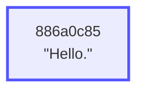

### Mermaid (`hideNodes`)


* Leaf elements (elements having no children) have blue outlines.
* CBOR leaf elements (like strings, but they can be of any complexity) are represented by rectangles.
* The digests shown in each element are the first four bytes of the 32-byte digest associated with each element.
* Every element you see is *itself* an envelope that can be extracted and manipulated. If two digests match, the contents of the envelopes they represent also necessarily match.
* Since they omit the NODE digest points, the `hideNodes` don't show any digests for both simplicity and not to mislead.

## Signed Plaintext

### Envelope Notation

```
"Hello." [
    verifiedBy: Signature
]
```

### Tree Format

```
7b935d2f NODE
    886a0c85 subj "Hello."
    6b05e4c4 ASSERTION
        d59f8c0f pred verifiedBy
        62cbbb8f obj Signature
```

### Tree Format (`hideNodes`)

```
"Hello."
    ASSERTION
        verifiedBy
        Signature
```

### Mermaid

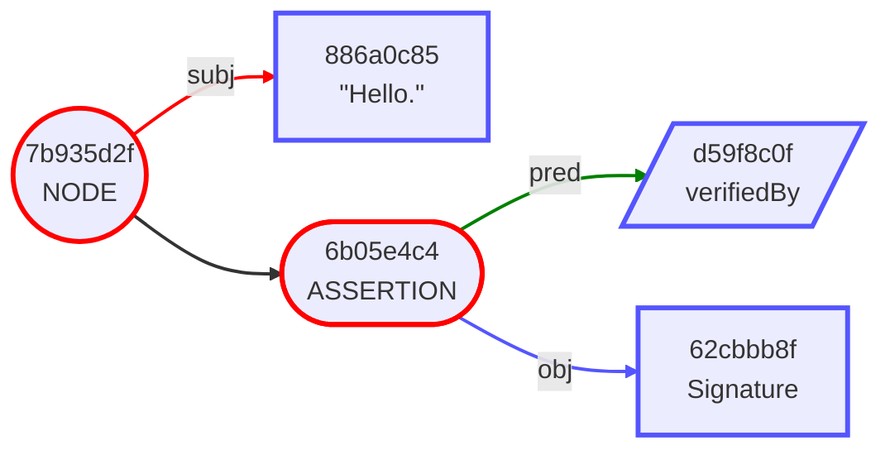

### Mermaid (`hideNodes`)

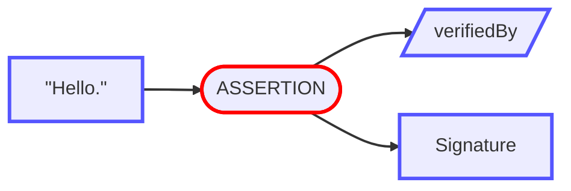

* Internal elements (elements with children) are represented with red outlines.
* A `NODE` element appears when one or more assertions are present on a subject. They are represented by circles. They have one arm for the `subject` and an additional arm for each assertion.
* An `ASSERTION` element is represented by the Mermaid `stadium`  shape, and has exactly two arms: `predicate` and `object`.
* Well-known values like the `verifiedBy` are represented by trapezoids, and are encoded as short integers.
* In the `hideNodes` variants, assertions appear to stem from the subject of the envelope.

## Encrypted Subject

### Envelope Notation

```
ENCRYPTED [
    "knows": "Bob"
]
```

### Tree Format

```
e54d6fd3 NODE
    27840350 subj ENCRYPTED
    55560bdf ASSERTION
        7092d620 pred "knows"
        9a771715 obj "Bob"
```

### Tree Format (`hideNodes`)

```
ENCRYPTED
    ASSERTION
        "knows"
        "Bob"
```

### Mermaid


### Mermaid (`hideNodes`)

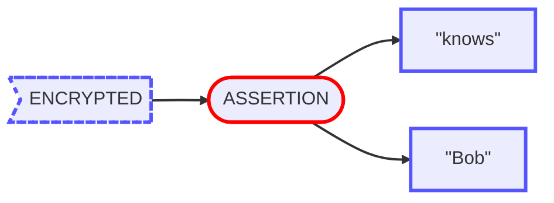

* `ENCRYPTED` and `ELIDED` elements appear with dotted outlines in the Output Formats, to indicate that they may be replaced with their unencrypted/unelided counterparts without invalidating the digest tree.
* `ENCRYPTED` elements are represented by the Mermaid `asymmetric` shape.

## Top-Level Assertion

### Envelope Notation

```
"knows": "Bob"
```

### Tree Format

```
55560bdf ASSERTION
    7092d620 pred "knows"
    9a771715 obj "Bob"
```

### Tree Format (`hideNodes`)

```
ASSERTION
    "knows"
    "Bob"
```

### Mermaid

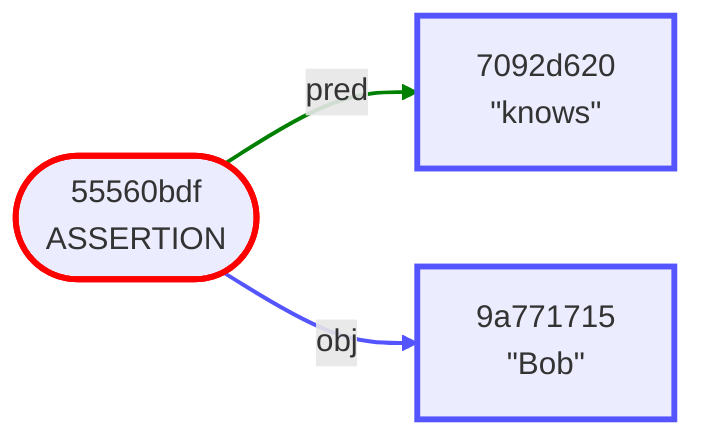

### Mermaid (`hideNodes`)

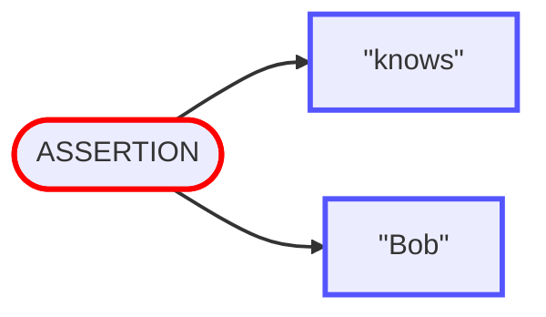

* As mentioned previously, all of the element types are themselves envelopes, and can therefore stand alone. In this case, we have extracted a single assertion.

## Elided Object

### Envelope Notation

```
"Alice" [
    "knows": ELIDED
]
```

### Tree Format

```
e54d6fd3 NODE
    27840350 subj "Alice"
    55560bdf ASSERTION
        7092d620 pred "knows"
        9a771715 obj ELIDED
```

### Tree Format (`hideNodes`)

```
"Alice"
    ASSERTION
        "knows"
        ELIDED
```

### Mermaid

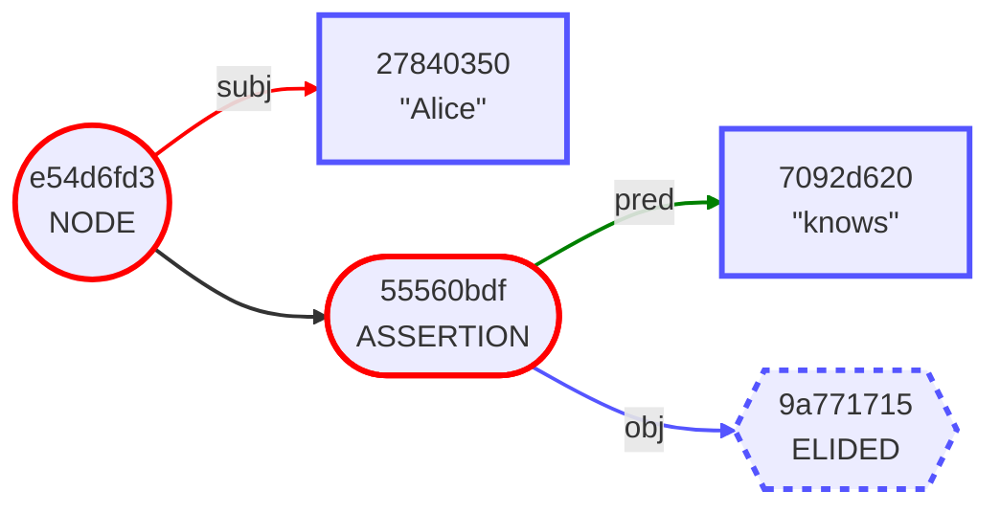

### Mermaid (`hideNodes`)


* `ELIDED` elements are represented by dotted hexagons.
* Note that the digest of the element "Bob" in the previous example matches the digest of the elided element above.
* Likewise, note that the digest of the subject "Alice" matches the encrypted version in the previous example.
* In fact, *all* the digests in this envelope match those in the previous example, indicating that the unencrypted/unelided form of this envelope has the exact same content.

## Signed Subject

### Envelope Notation

```
"Alice" [
    "knows": "Bob"
    "knows": "Carol"
    verifiedBy: Signature
]
```

### Tree Format

```
9a51755e NODE
    27840350 subj "Alice"
    55560bdf ASSERTION
        7092d620 pred "knows"
        9a771715 obj "Bob"
    645921c0 ASSERTION
        d59f8c0f pred verifiedBy
        affdea11 obj Signature
    71a30690 ASSERTION
        7092d620 pred "knows"
        ad2c454b obj "Carol"
```

### Tree Format (`hideNodes`)

```
"Alice"
    ASSERTION
        "knows"
        "Bob"
    ASSERTION
        verifiedBy
        Signature
    ASSERTION
        "knows"
        "Carol"
```

### Mermaid

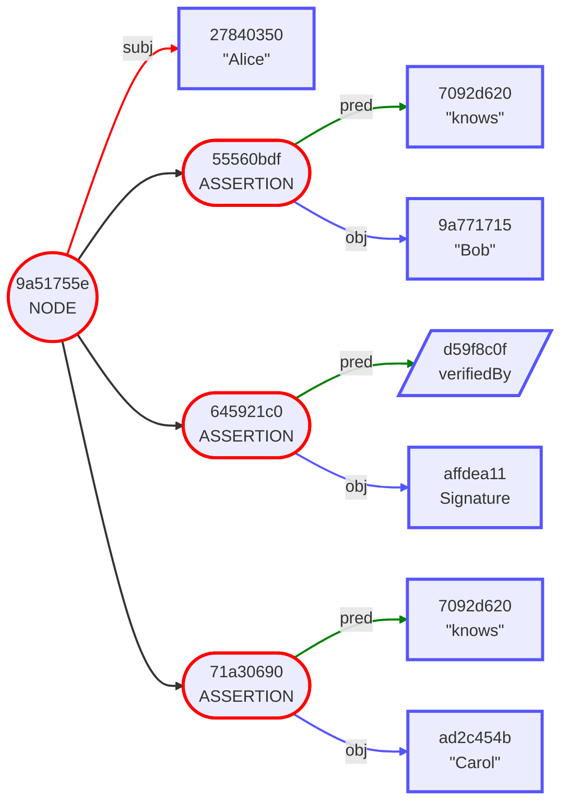

### Mermaid (`hideNodes`)

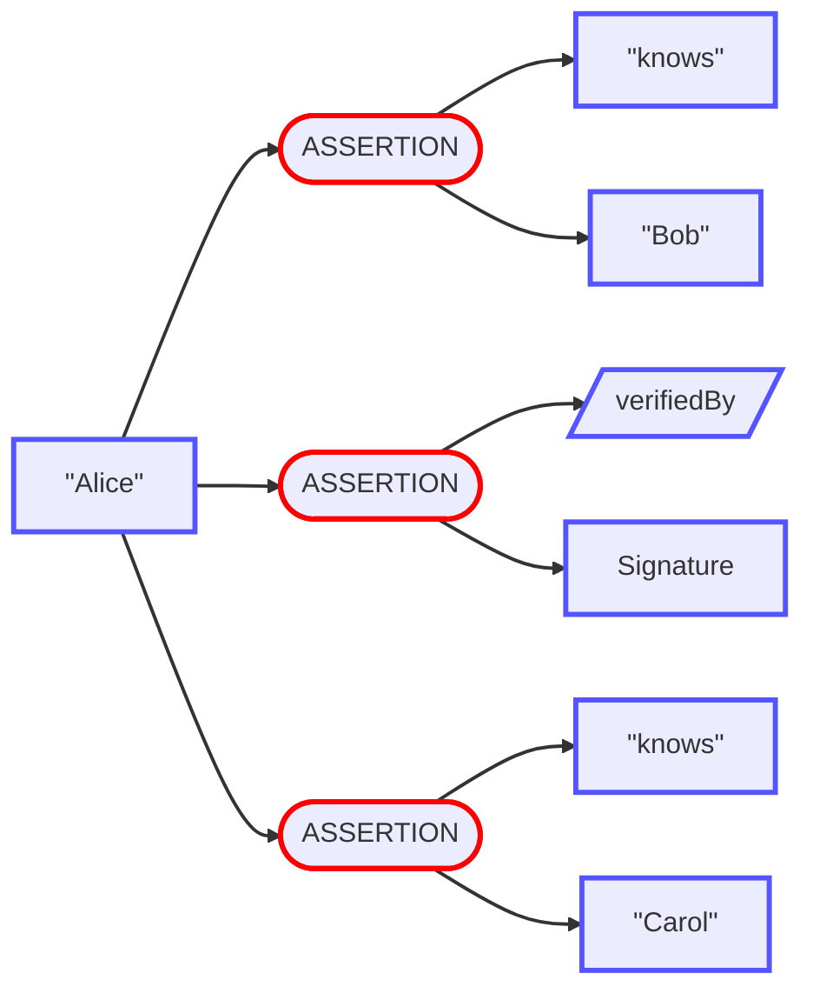

* A signature signs only the digest of the subject, in this case "Alice". So in this case, the "knows" assertions are not signed.
* Note that for every internal element, the children are displayed in the order that their digests are combined to form the parent's digest. In particular a `NODE`'s, `ASSERTION` elements are ordered by ascending digest value, so the order of the three assertion digests here: `3ed95464`, `55560bdf`, `71a30690` reflects that ascending order.

## Elided Assertions

### Envelope Notation

```
"Alice" [
    ELIDED (3)
]
```

### Tree Format

```
9a51755e NODE
    27840350 subj "Alice"
    55560bdf ELIDED
    645921c0 ELIDED
    71a30690 ELIDED
```

### Tree Format (`hideNodes`)

```
"Alice"
    ELIDED
    ELIDED
    ELIDED
```

### Mermaid

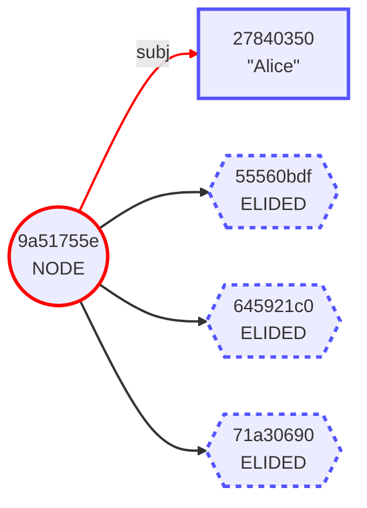

### Mermaid (`hideNodes`)

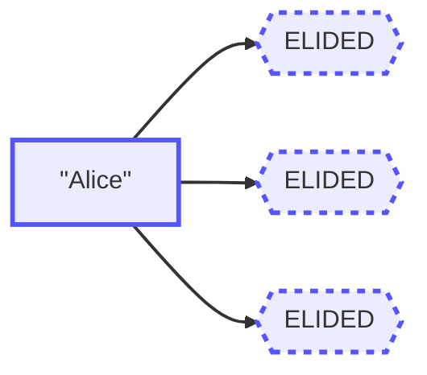

* This is the same envelope from the previous example with its assertions elided. Note that the digests at every level still present are all the same.

## Wrapped Then Signed

### Envelope Notation

```
{
    "Alice" [
        "knows": "Bob"
        "knows": "Carol"
    ]
} [
    verifiedBy: Signature
]
```

### Tree Format

```
e18b6e85 NODE
    3cc750a3 subj WRAPPED
        c733401e subj NODE
            27840350 subj "Alice"
            55560bdf ASSERTION
                7092d620 pred "knows"
                9a771715 obj "Bob"
            71a30690 ASSERTION
                7092d620 pred "knows"
                ad2c454b obj "Carol"
    a18db4cc ASSERTION
        d59f8c0f pred verifiedBy
        c176abe0 obj Signature
```

### Tree Format (`hideNodes`)

```
WRAPPED
    "Alice"
        ASSERTION
            "knows"
            "Bob"
        ASSERTION
            "knows"
            "Carol"
    ASSERTION
        verifiedBy
        Signature
```

### Mermaid

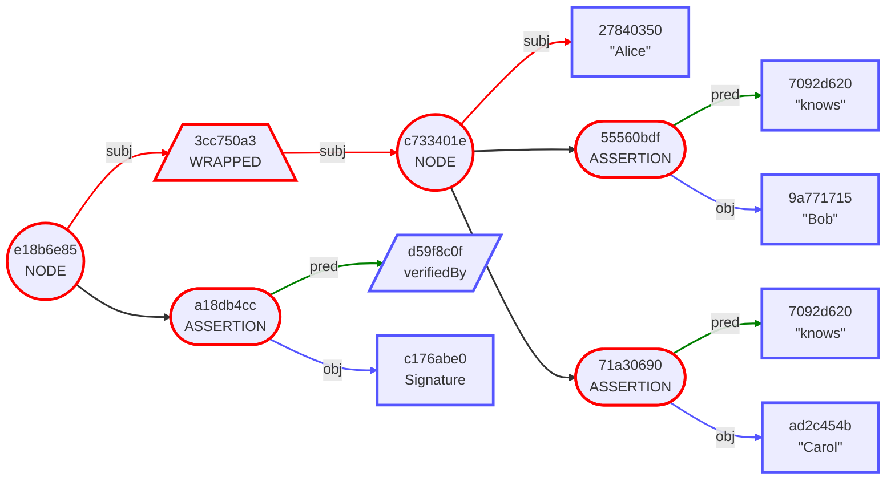

### Mermaid (`hideNodes`)

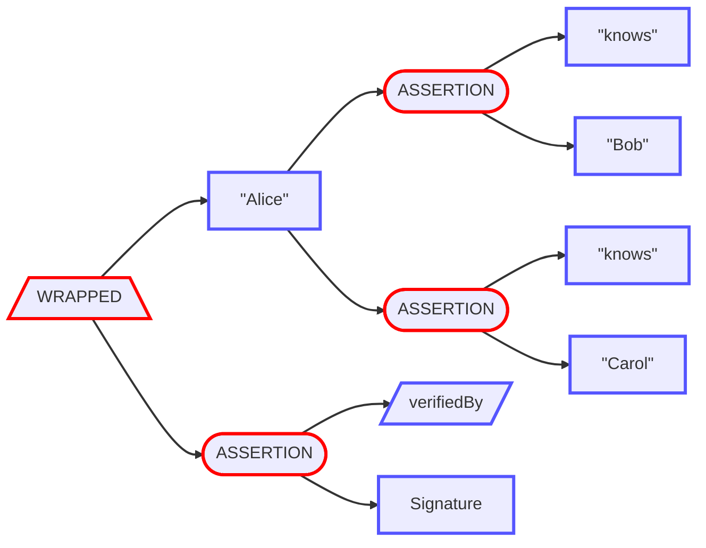

* In this case the signature still only signs the subject, but the subject is an entire envelope that's been wrapped.
* `WRAPPED` elements are represented by trapezoids. They have exactly one arm, which is the root of the wrapped envelope.

## Encrypt to Recipients

### Envelope Notation

```
ENCRYPTED [
    hasRecipient: SealedMessage
    hasRecipient: SealedMessage
]
```

### Tree Format

```
003c3d15 NODE
    886a0c85 subj ENCRYPTED
    9de6ec19 ASSERTION
        f4af70d6 pred hasRecipient
        0eef002e obj SealedMessage
    b05bfebd ASSERTION
        f4af70d6 pred hasRecipient
        b65acdd8 obj SealedMessage
```

### Tree Format (`hideNodes`)

```
ENCRYPTED
    ASSERTION
        hasRecipient
        SealedMessage
    ASSERTION
        hasRecipient
        SealedMessage
```

### Mermaid

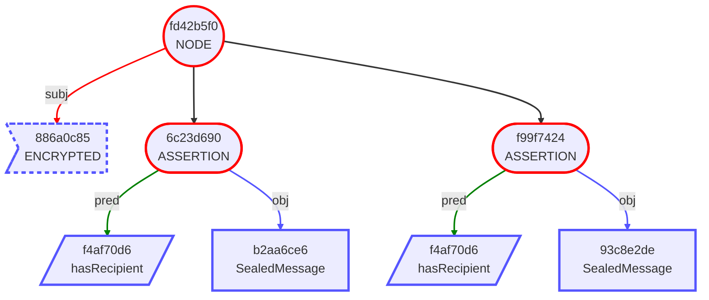

### Mermaid (`hideNodes`)


* Top-to-bottom layout is also supported.

## Complex Metadata

### Envelope Notation

```
Digest(e8aa201d) [
    "format": "EPUB"
    "work": CID(7fb90a9d) [
        "author": CID(9c747ace) [
            dereferenceVia: "LibraryOfCongress"
            hasName: "Ayn Rand"
        ]
        "isbn": "9780451191144"
        dereferenceVia: "LibraryOfCongress"
        hasName: "Atlas Shrugged" [
            language: "en"
        ]
        hasName: "La rebelión de Atlas" [
            language: "es"
        ]
        isA: "novel"
    ]
    dereferenceVia: "IPFS"
]
```

### Tree Format

```
72fdea85 NODE
    ec067552 subj Digest(e8aa201d)
    71573ec4 ASSERTION
        f191c6ea pred dereferenceVia
        920da73e obj "IPFS"
    c2856abd ASSERTION
        48bb1df6 pred "format"
        9afbbb54 obj "EPUB"
    eaa72721 ASSERTION
        8ea19b98 pred "work"
        f70de543 obj NODE
            734250ee subj CID(7fb90a9d)
            049bbd66 ASSERTION
                f191c6ea pred dereferenceVia
                b4580455 obj "LibraryOfCongress"
            1f908002 ASSERTION
                d8c1566f pred "author"
                b51b535c obj NODE
                    306a5d76 subj CID(9c747ace)
                    049bbd66 ASSERTION
                        f191c6ea pred dereferenceVia
                        b4580455 obj "LibraryOfCongress"
                    e7441f7c ASSERTION
                        bf166e5d pred hasName
                        5bb41313 obj "Ayn Rand"
            91ec8590 ASSERTION
                bf166e5d pred hasName
                59cd2799 obj NODE
                    9d76964a subj "Atlas Shrugged"
                    02d3e92e ASSERTION
                        556c14a4 pred language
                        409b5893 obj "en"
            c1029b07 ASSERTION
                8982354d pred isA
                9066de8c obj "novel"
            c1785e1a ASSERTION
                bf166e5d pred hasName
                0412cf19 obj NODE
                    5a42d004 subj "La rebelión de Atlas"
                    a5243b41 ASSERTION
                        556c14a4 pred language
                        dd2f866d obj "es"
            efb00f5e ASSERTION
                b95d2849 pred "isbn"
                2e8d4edd obj "9780451191144"
```

### Tree Format (`hideNodes`)

```
Digest(e8aa201d)
    ASSERTION
        dereferenceVia
        "IPFS"
    ASSERTION
        "format"
        "EPUB"
    ASSERTION
        "work"
        CID(7fb90a9d)
            ASSERTION
                dereferenceVia
                "LibraryOfCongress"
            ASSERTION
                "author"
                CID(9c747ace)
                    ASSERTION
                        dereferenceVia
                        "LibraryOfCongress"
                    ASSERTION
                        hasName
                        "Ayn Rand"
            ASSERTION
                hasName
                "Atlas Shrugged"
                    ASSERTION
                        language
                        "en"
            ASSERTION
                isA
                "novel"
            ASSERTION
                hasName
                "La rebelión de Atlas"
                    ASSERTION
                        language
                        "es"
            ASSERTION
                "isbn"
                "9780451191144"
```

### Mermaid

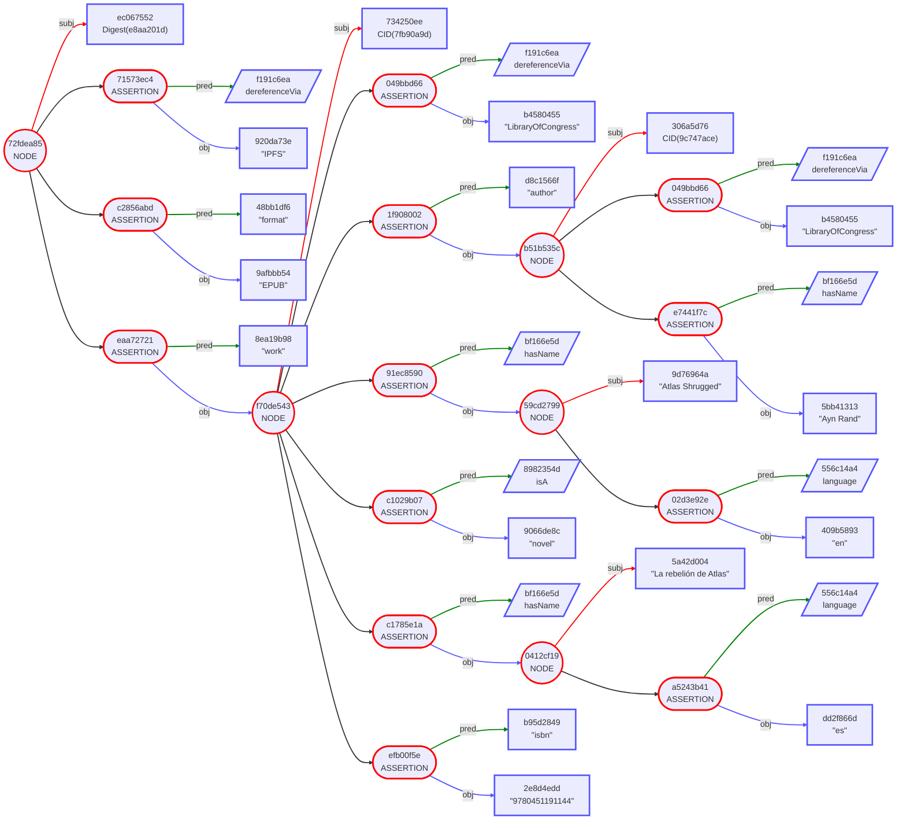

### Mermaid (`hideNodes`)

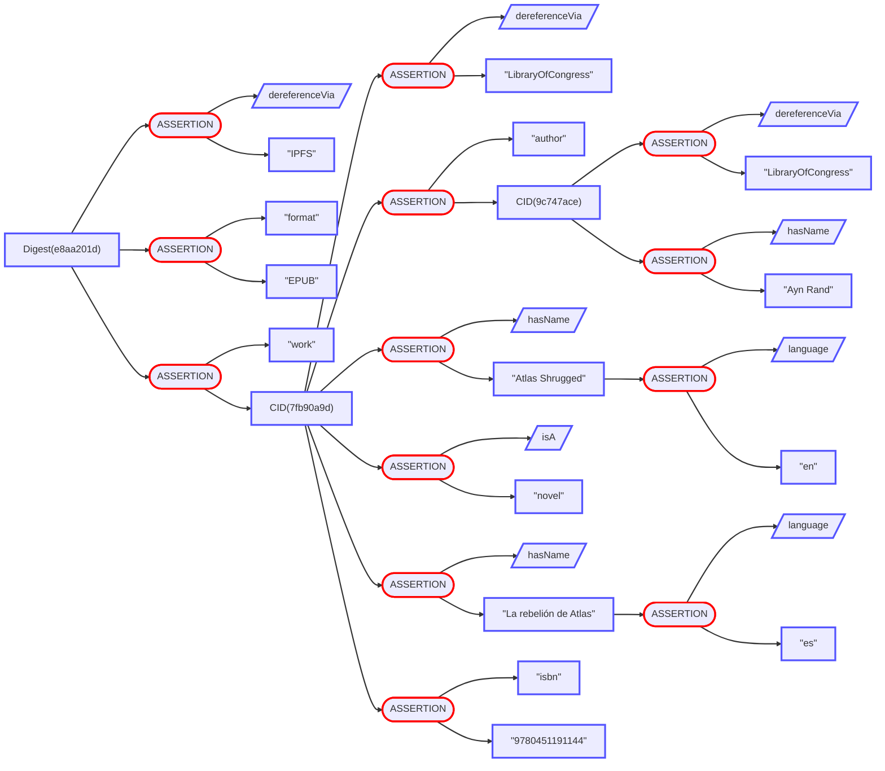

## Verifiable Credential

### Envelope Notation

```
{
    CID(4676635a) [
        "certificateNumber": "123-456-789"
        "continuingEducationUnits": 1.5
        "expirationDate": 2028-01-01
        "firstName": "James"
        "issueDate": 2020-01-01
        "lastName": "Maxwell"
        "photo": "This is James Maxwell's photo."
        "professionalDevelopmentHours": 15
        "subject": "RF and Microwave Engineering"
        "topics": CBOR
        controller: "Example Electrical Engineering Board"
        isA: "Certificate of Completion"
        issuer: "Example Electrical Engineering Board"
    ]
} [
    note: "Signed by Example Electrical Engineering Board"
    verifiedBy: Signature
]
```

### Tree Format

```
6142d9bc NODE
    dbd70e79 subj WRAPPED
        b750a45f subj NODE
            bdd347d4 subj CID(4676635a)
            0536afd8 ASSERTION
                a791d0c7 pred "photo"
                9e77bb70 obj "This is James Maxwell's photo."
            1d598c65 ASSERTION
                eb62836d pred "lastName"
                997a0e2d obj "Maxwell"
            34f8f7d3 ASSERTION
                b1e12d58 pred "issueDate"
                2511c0df obj 2020-01-01
            3d00d64f ASSERTION
                2f9bee2f pred controller
                4035b4bd obj "Example Electrical Engineering Board"
            44736993 ASSERTION
                05651934 pred "topics"
                264aec65 obj CBOR
            46d6cfea ASSERTION
                8982354d pred isA
                112e2cdb obj "Certificate of Completion"
            4a69fca3 ASSERTION
                b6d5ea01 pred "continuingEducationUnits"
                02a61366 obj 1.5
            5545f6e2 ASSERTION
                954c8356 pred issuer
                4035b4bd obj "Example Electrical Engineering Board"
            61689bb7 ASSERTION
                e6c2932d pred "expirationDate"
                b91eea18 obj 2028-01-01
            a0274d1c ASSERTION
                62c0a26e pred "certificateNumber"
                ac0b465a obj "123-456-789"
            d4f678a9 ASSERTION
                c4d5323d pred "firstName"
                bfe9d39b obj "James"
            e0070876 ASSERTION
                0eb38394 pred "subject"
                b059b0f2 obj "RF and Microwave Engineering"
            e96b24d9 ASSERTION
                c8c1a6dd pred "professionalDevelopmentHours"
                0bf6b955 obj 15
    8c02e1c6 ASSERTION
        d59f8c0f pred verifiedBy
        2deb70b6 obj Signature
    afe231cc ASSERTION
        61fb6a6b pred note
        f4bf011f obj "Signed by Example Electrical Engineering Board"
```

### Tree Format (`hideNodes`)

```
WRAPPED
    CID(4676635a)
        ASSERTION
            "photo"
            "This is James Maxwell's photo."
        ASSERTION
            "lastName"
            "Maxwell"
        ASSERTION
            "issueDate"
            2020-01-01
        ASSERTION
            controller
            "Example Electrical Engineering Board"
        ASSERTION
            "topics"
            CBOR
        ASSERTION
            isA
            "Certificate of Completion"
        ASSERTION
            "continuingEducationUnits"
            1.5
        ASSERTION
            issuer
            "Example Electrical Engineering Board"
        ASSERTION
            "expirationDate"
            2028-01-01
        ASSERTION
            "certificateNumber"
            "123-456-789"
        ASSERTION
            "firstName"
            "James"
        ASSERTION
            "subject"
            "RF and Microwave Engineering"
        ASSERTION
            "professionalDevelopmentHours"
            15
    ASSERTION
        verifiedBy
        Signature
    ASSERTION
        note
        "Signed by Example Electrical Engineering Board"
```

### Mermaid

```mermaid
graph LR
    1(("6142d9bc<br/>NODE"))
    2[/"dbd70e79<br/>WRAPPED"\]
    3(("b750a45f<br/>NODE"))
    4["bdd347d4<br/>CID(4676635a)"]
    5(["0536afd8<br/>ASSERTION"])
    6["a791d0c7<br/>#quot;photo#quot;"]
    7["9e77bb70<br/>#quot;This is James Maxwell's photo.#quot;"]
    8(["1d598c65<br/>ASSERTION"])
    9["eb62836d<br/>#quot;lastName#quot;"]
    10["997a0e2d<br/>#quot;Maxwell#quot;"]
    11(["34f8f7d3<br/>ASSERTION"])
    12["b1e12d58<br/>#quot;issueDate#quot;"]
    13["2511c0df<br/>2020-01-01"]
    14(["3d00d64f<br/>ASSERTION"])
    15[/"2f9bee2f<br/>controller"/]
    16["4035b4bd<br/>#quot;Example Electrical Engineering Board#quot;"]
    17(["44736993<br/>ASSERTION"])
    18["05651934<br/>#quot;topics#quot;"]
    19["264aec65<br/>CBOR"]
    20(["46d6cfea<br/>ASSERTION"])
    21[/"8982354d<br/>isA"/]
    22["112e2cdb<br/>#quot;Certificate of Completion#quot;"]
    23(["4a69fca3<br/>ASSERTION"])
    24["b6d5ea01<br/>#quot;continuingEducationUnits#quot;"]
    25["02a61366<br/>1.5"]
    26(["5545f6e2<br/>ASSERTION"])
    27[/"954c8356<br/>issuer"/]
    28["4035b4bd<br/>#quot;Example Electrical Engineering Board#quot;"]
    29(["61689bb7<br/>ASSERTION"])
    30["e6c2932d<br/>#quot;expirationDate#quot;"]
    31["b91eea18<br/>2028-01-01"]
    32(["a0274d1c<br/>ASSERTION"])
    33["62c0a26e<br/>#quot;certificateNumber#quot;"]
    34["ac0b465a<br/>#quot;123-456-789#quot;"]
    35(["d4f678a9<br/>ASSERTION"])
    36["c4d5323d<br/>#quot;firstName#quot;"]
    37["bfe9d39b<br/>#quot;James#quot;"]
    38(["e0070876<br/>ASSERTION"])
    39["0eb38394<br/>#quot;subject#quot;"]
    40["b059b0f2<br/>#quot;RF and Microwave Engineering#quot;"]
    41(["e96b24d9<br/>ASSERTION"])
    42["c8c1a6dd<br/>#quot;professionalDevelopmentHours#quot;"]
    43["0bf6b955<br/>15"]
    44(["8c02e1c6<br/>ASSERTION"])
    45[/"d59f8c0f<br/>verifiedBy"/]
    46["2deb70b6<br/>Signature"]
    47(["afe231cc<br/>ASSERTION"])
    48[/"61fb6a6b<br/>note"/]
    49["f4bf011f<br/>#quot;Signed by Example Electrical Engineering Board#quot;"]
    1 -->|subj| 2
    2 -->|subj| 3
    3 -->|subj| 4
    3 --> 5
    5 -->|pred| 6
    5 -->|obj| 7
    3 --> 8
    8 -->|pred| 9
    8 -->|obj| 10
    3 --> 11
    11 -->|pred| 12
    11 -->|obj| 13
    3 --> 14
    14 -->|pred| 15
    14 -->|obj| 16
    3 --> 17
    17 -->|pred| 18
    17 -->|obj| 19
    3 --> 20
    20 -->|pred| 21
    20 -->|obj| 22
    3 --> 23
    23 -->|pred| 24
    23 -->|obj| 25
    3 --> 26
    26 -->|pred| 27
    26 -->|obj| 28
    3 --> 29
    29 -->|pred| 30
    29 -->|obj| 31
    3 --> 32
    32 -->|pred| 33
    32 -->|obj| 34
    3 --> 35
    35 -->|pred| 36
    35 -->|obj| 37
    3 --> 38
    38 -->|pred| 39
    38 -->|obj| 40
    3 --> 41
    41 -->|pred| 42
    41 -->|obj| 43
    1 --> 44
    44 -->|pred| 45
    44 -->|obj| 46
    1 --> 47
    47 -->|pred| 48
    47 -->|obj| 49
    style 1 stroke:red,stroke-width:3.0px
    style 2 stroke:red,stroke-width:3.0px
    style 3 stroke:red,stroke-width:3.0px
    style 4 stroke:#55f,stroke-width:3.0px
    style 5 stroke:red,stroke-width:3.0px
    style 6 stroke:#55f,stroke-width:3.0px
    style 7 stroke:#55f,stroke-width:3.0px
    style 8 stroke:red,stroke-width:3.0px
    style 9 stroke:#55f,stroke-width:3.0px
    style 10 stroke:#55f,stroke-width:3.0px
    style 11 stroke:red,stroke-width:3.0px
    style 12 stroke:#55f,stroke-width:3.0px
    style 13 stroke:#55f,stroke-width:3.0px
    style 14 stroke:red,stroke-width:3.0px
    style 15 stroke:#55f,stroke-width:3.0px
    style 16 stroke:#55f,stroke-width:3.0px
    style 17 stroke:red,stroke-width:3.0px
    style 18 stroke:#55f,stroke-width:3.0px
    style 19 stroke:#55f,stroke-width:3.0px
    style 20 stroke:red,stroke-width:3.0px
    style 21 stroke:#55f,stroke-width:3.0px
    style 22 stroke:#55f,stroke-width:3.0px
    style 23 stroke:red,stroke-width:3.0px
    style 24 stroke:#55f,stroke-width:3.0px
    style 25 stroke:#55f,stroke-width:3.0px
    style 26 stroke:red,stroke-width:3.0px
    style 27 stroke:#55f,stroke-width:3.0px
    style 28 stroke:#55f,stroke-width:3.0px
    style 29 stroke:red,stroke-width:3.0px
    style 30 stroke:#55f,stroke-width:3.0px
    style 31 stroke:#55f,stroke-width:3.0px
    style 32 stroke:red,stroke-width:3.0px
    style 33 stroke:#55f,stroke-width:3.0px
    style 34 stroke:#55f,stroke-width:3.0px
    style 35 stroke:red,stroke-width:3.0px
    style 36 stroke:#55f,stroke-width:3.0px
    style 37 stroke:#55f,stroke-width:3.0px
    style 38 stroke:red,stroke-width:3.0px
    style 39 stroke:#55f,stroke-width:3.0px
    style 40 stroke:#55f,stroke-width:3.0px
    style 41 stroke:red,stroke-width:3.0px
    style 42 stroke:#55f,stroke-width:3.0px
    style 43 stroke:#55f,stroke-width:3.0px
    style 44 stroke:red,stroke-width:3.0px
    style 45 stroke:#55f,stroke-width:3.0px
    style 46 stroke:#55f,stroke-width:3.0px
    style 47 stroke:red,stroke-width:3.0px
    style 48 stroke:#55f,stroke-width:3.0px
    style 49 stroke:#55f,stroke-width:3.0px
    linkStyle 0 stroke:red,stroke-width:2.0px
    linkStyle 1 stroke:red,stroke-width:2.0px
    linkStyle 2 stroke:red,stroke-width:2.0px
    linkStyle 3 stroke-width:2.0px
    linkStyle 4 stroke:green,stroke-width:2.0px
    linkStyle 5 stroke:#55f,stroke-width:2.0px
    linkStyle 6 stroke-width:2.0px
    linkStyle 7 stroke:green,stroke-width:2.0px
    linkStyle 8 stroke:#55f,stroke-width:2.0px
    linkStyle 9 stroke-width:2.0px
    linkStyle 10 stroke:green,stroke-width:2.0px
    linkStyle 11 stroke:#55f,stroke-width:2.0px
    linkStyle 12 stroke-width:2.0px
    linkStyle 13 stroke:green,stroke-width:2.0px
    linkStyle 14 stroke:#55f,stroke-width:2.0px
    linkStyle 15 stroke-width:2.0px
    linkStyle 16 stroke:green,stroke-width:2.0px
    linkStyle 17 stroke:#55f,stroke-width:2.0px
    linkStyle 18 stroke-width:2.0px
    linkStyle 19 stroke:green,stroke-width:2.0px
    linkStyle 20 stroke:#55f,stroke-width:2.0px
    linkStyle 21 stroke-width:2.0px
    linkStyle 22 stroke:green,stroke-width:2.0px
    linkStyle 23 stroke:#55f,stroke-width:2.0px
    linkStyle 24 stroke-width:2.0px
    linkStyle 25 stroke:green,stroke-width:2.0px
    linkStyle 26 stroke:#55f,stroke-width:2.0px
    linkStyle 27 stroke-width:2.0px
    linkStyle 28 stroke:green,stroke-width:2.0px
    linkStyle 29 stroke:#55f,stroke-width:2.0px
    linkStyle 30 stroke-width:2.0px
    linkStyle 31 stroke:green,stroke-width:2.0px
    linkStyle 32 stroke:#55f,stroke-width:2.0px
    linkStyle 33 stroke-width:2.0px
    linkStyle 34 stroke:green,stroke-width:2.0px
    linkStyle 35 stroke:#55f,stroke-width:2.0px
    linkStyle 36 stroke-width:2.0px
    linkStyle 37 stroke:green,stroke-width:2.0px
    linkStyle 38 stroke:#55f,stroke-width:2.0px
    linkStyle 39 stroke-width:2.0px
    linkStyle 40 stroke:green,stroke-width:2.0px
    linkStyle 41 stroke:#55f,stroke-width:2.0px
    linkStyle 42 stroke-width:2.0px
    linkStyle 43 stroke:green,stroke-width:2.0px
    linkStyle 44 stroke:#55f,stroke-width:2.0px
    linkStyle 45 stroke-width:2.0px
    linkStyle 46 stroke:green,stroke-width:2.0px
    linkStyle 47 stroke:#55f,stroke-width:2.0px
```

### Mermaid (`hideNodes`)

```mermaid
graph LR
    1[/"WRAPPED"\]
    2["CID(4676635a)"]
    3(["ASSERTION"])
    4["#quot;photo#quot;"]
    5["#quot;This is James Maxwell's photo.#quot;"]
    6(["ASSERTION"])
    7["#quot;lastName#quot;"]
    8["#quot;Maxwell#quot;"]
    9(["ASSERTION"])
    10["#quot;issueDate#quot;"]
    11["2020-01-01"]
    12(["ASSERTION"])
    13[/"controller"/]
    14["#quot;Example Electrical Engineering Board#quot;"]
    15(["ASSERTION"])
    16["#quot;topics#quot;"]
    17["CBOR"]
    18(["ASSERTION"])
    19[/"isA"/]
    20["#quot;Certificate of Completion#quot;"]
    21(["ASSERTION"])
    22["#quot;continuingEducationUnits#quot;"]
    23["1.5"]
    24(["ASSERTION"])
    25[/"issuer"/]
    26["#quot;Example Electrical Engineering Board#quot;"]
    27(["ASSERTION"])
    28["#quot;expirationDate#quot;"]
    29["2028-01-01"]
    30(["ASSERTION"])
    31["#quot;certificateNumber#quot;"]
    32["#quot;123-456-789#quot;"]
    33(["ASSERTION"])
    34["#quot;firstName#quot;"]
    35["#quot;James#quot;"]
    36(["ASSERTION"])
    37["#quot;subject#quot;"]
    38["#quot;RF and Microwave Engineering#quot;"]
    39(["ASSERTION"])
    40["#quot;professionalDevelopmentHours#quot;"]
    41["15"]
    42(["ASSERTION"])
    43[/"verifiedBy"/]
    44["Signature"]
    45(["ASSERTION"])
    46[/"note"/]
    47["#quot;Signed by Example Electrical Engineering Board#quot;"]
    1 --> 2
    2 --> 3
    3 --> 4
    3 --> 5
    2 --> 6
    6 --> 7
    6 --> 8
    2 --> 9
    9 --> 10
    9 --> 11
    2 --> 12
    12 --> 13
    12 --> 14
    2 --> 15
    15 --> 16
    15 --> 17
    2 --> 18
    18 --> 19
    18 --> 20
    2 --> 21
    21 --> 22
    21 --> 23
    2 --> 24
    24 --> 25
    24 --> 26
    2 --> 27
    27 --> 28
    27 --> 29
    2 --> 30
    30 --> 31
    30 --> 32
    2 --> 33
    33 --> 34
    33 --> 35
    2 --> 36
    36 --> 37
    36 --> 38
    2 --> 39
    39 --> 40
    39 --> 41
    1 --> 42
    42 --> 43
    42 --> 44
    1 --> 45
    45 --> 46
    45 --> 47
    style 1 stroke:red,stroke-width:3.0px
    style 2 stroke:#55f,stroke-width:3.0px
    style 3 stroke:red,stroke-width:3.0px
    style 4 stroke:#55f,stroke-width:3.0px
    style 5 stroke:#55f,stroke-width:3.0px
    style 6 stroke:red,stroke-width:3.0px
    style 7 stroke:#55f,stroke-width:3.0px
    style 8 stroke:#55f,stroke-width:3.0px
    style 9 stroke:red,stroke-width:3.0px
    style 10 stroke:#55f,stroke-width:3.0px
    style 11 stroke:#55f,stroke-width:3.0px
    style 12 stroke:red,stroke-width:3.0px
    style 13 stroke:#55f,stroke-width:3.0px
    style 14 stroke:#55f,stroke-width:3.0px
    style 15 stroke:red,stroke-width:3.0px
    style 16 stroke:#55f,stroke-width:3.0px
    style 17 stroke:#55f,stroke-width:3.0px
    style 18 stroke:red,stroke-width:3.0px
    style 19 stroke:#55f,stroke-width:3.0px
    style 20 stroke:#55f,stroke-width:3.0px
    style 21 stroke:red,stroke-width:3.0px
    style 22 stroke:#55f,stroke-width:3.0px
    style 23 stroke:#55f,stroke-width:3.0px
    style 24 stroke:red,stroke-width:3.0px
    style 25 stroke:#55f,stroke-width:3.0px
    style 26 stroke:#55f,stroke-width:3.0px
    style 27 stroke:red,stroke-width:3.0px
    style 28 stroke:#55f,stroke-width:3.0px
    style 29 stroke:#55f,stroke-width:3.0px
    style 30 stroke:red,stroke-width:3.0px
    style 31 stroke:#55f,stroke-width:3.0px
    style 32 stroke:#55f,stroke-width:3.0px
    style 33 stroke:red,stroke-width:3.0px
    style 34 stroke:#55f,stroke-width:3.0px
    style 35 stroke:#55f,stroke-width:3.0px
    style 36 stroke:red,stroke-width:3.0px
    style 37 stroke:#55f,stroke-width:3.0px
    style 38 stroke:#55f,stroke-width:3.0px
    style 39 stroke:red,stroke-width:3.0px
    style 40 stroke:#55f,stroke-width:3.0px
    style 41 stroke:#55f,stroke-width:3.0px
    style 42 stroke:red,stroke-width:3.0px
    style 43 stroke:#55f,stroke-width:3.0px
    style 44 stroke:#55f,stroke-width:3.0px
    style 45 stroke:red,stroke-width:3.0px
    style 46 stroke:#55f,stroke-width:3.0px
    style 47 stroke:#55f,stroke-width:3.0px
    linkStyle 0 stroke-width:2.0px
    linkStyle 1 stroke-width:2.0px
    linkStyle 2 stroke-width:2.0px
    linkStyle 3 stroke-width:2.0px
    linkStyle 4 stroke-width:2.0px
    linkStyle 5 stroke-width:2.0px
    linkStyle 6 stroke-width:2.0px
    linkStyle 7 stroke-width:2.0px
    linkStyle 8 stroke-width:2.0px
    linkStyle 9 stroke-width:2.0px
    linkStyle 10 stroke-width:2.0px
    linkStyle 11 stroke-width:2.0px
    linkStyle 12 stroke-width:2.0px
    linkStyle 13 stroke-width:2.0px
    linkStyle 14 stroke-width:2.0px
    linkStyle 15 stroke-width:2.0px
    linkStyle 16 stroke-width:2.0px
    linkStyle 17 stroke-width:2.0px
    linkStyle 18 stroke-width:2.0px
    linkStyle 19 stroke-width:2.0px
    linkStyle 20 stroke-width:2.0px
    linkStyle 21 stroke-width:2.0px
    linkStyle 22 stroke-width:2.0px
    linkStyle 23 stroke-width:2.0px
    linkStyle 24 stroke-width:2.0px
    linkStyle 25 stroke-width:2.0px
    linkStyle 26 stroke-width:2.0px
    linkStyle 27 stroke-width:2.0px
    linkStyle 28 stroke-width:2.0px
    linkStyle 29 stroke-width:2.0px
    linkStyle 30 stroke-width:2.0px
    linkStyle 31 stroke-width:2.0px
    linkStyle 32 stroke-width:2.0px
    linkStyle 33 stroke-width:2.0px
    linkStyle 34 stroke-width:2.0px
    linkStyle 35 stroke-width:2.0px
    linkStyle 36 stroke-width:2.0px
    linkStyle 37 stroke-width:2.0px
    linkStyle 38 stroke-width:2.0px
    linkStyle 39 stroke-width:2.0px
    linkStyle 40 stroke-width:2.0px
    linkStyle 41 stroke-width:2.0px
    linkStyle 42 stroke-width:2.0px
    linkStyle 43 stroke-width:2.0px
    linkStyle 44 stroke-width:2.0px
    linkStyle 45 stroke-width:2.0px
```

## Warranty

This is the same credential above that has been elided, had additional assertions added, and then been signed by the employer.

### Envelope Notation

```
{
    {
        {
            CID(4676635a) [
                "expirationDate": 2028-01-01
                "firstName": "James"
                "lastName": "Maxwell"
                "subject": "RF and Microwave Engineering"
                isA: "Certificate of Completion"
                issuer: "Example Electrical Engineering Board"
                ELIDED (7)
            ]
        } [
            note: "Signed by Example Electrical Engineering Board"
            verifiedBy: Signature
        ]
    } [
        "employeeHiredDate": 2022-01-01
        "employeeStatus": "active"
    ]
} [
    note: "Signed by Employer Corp."
    verifiedBy: Signature
]
```

### Tree Format

```
697b9b63 NODE
    0cbbb246 subj WRAPPED
        ceecf43c subj NODE
            6e5c92a5 subj WRAPPED
                6142d9bc subj NODE
                    dbd70e79 subj WRAPPED
                        b750a45f subj NODE
                            bdd347d4 subj CID(4676635a)
                            0536afd8 ELIDED
                            1d598c65 ASSERTION
                                eb62836d pred "lastName"
                                997a0e2d obj "Maxwell"
                            34f8f7d3 ELIDED
                            3d00d64f ELIDED
                            44736993 ELIDED
                            46d6cfea ASSERTION
                                8982354d pred isA
                                112e2cdb obj "Certificate of Completion"
                            4a69fca3 ELIDED
                            5545f6e2 ASSERTION
                                954c8356 pred issuer
                                4035b4bd obj "Example Electrical Engineering Board"
                            61689bb7 ASSERTION
                                e6c2932d pred "expirationDate"
                                b91eea18 obj 2028-01-01
                            a0274d1c ELIDED
                            d4f678a9 ASSERTION
                                c4d5323d pred "firstName"
                                bfe9d39b obj "James"
                            e0070876 ASSERTION
                                0eb38394 pred "subject"
                                b059b0f2 obj "RF and Microwave Engineering"
                            e96b24d9 ELIDED
                    8c02e1c6 ASSERTION
                        d59f8c0f pred verifiedBy
                        2deb70b6 obj Signature
                    afe231cc ASSERTION
                        61fb6a6b pred note
                        f4bf011f obj "Signed by Example Electrical Engineering Board"
            310b027f ASSERTION
                f942ee55 pred "employeeStatus"
                919eb85d obj "active"
            5901b070 ASSERTION
                134a1704 pred "employeeHiredDate"
                24c173c5 obj 2022-01-01
    648b2cc3 ASSERTION
        61fb6a6b pred note
        46f4bfd7 obj "Signed by Employer Corp."
    b370f85a ASSERTION
        d59f8c0f pred verifiedBy
        efe20914 obj Signature
```

### Tree Format (`hideNodes`)

```
WRAPPED
    WRAPPED
        WRAPPED
            CID(4676635a)
                ELIDED
                ASSERTION
                    "lastName"
                    "Maxwell"
                ELIDED
                ELIDED
                ELIDED
                ASSERTION
                    isA
                    "Certificate of Completion"
                ELIDED
                ASSERTION
                    issuer
                    "Example Electrical Engineering Board"
                ASSERTION
                    "expirationDate"
                    2028-01-01
                ELIDED
                ASSERTION
                    "firstName"
                    "James"
                ASSERTION
                    "subject"
                    "RF and Microwave Engineering"
                ELIDED
            ASSERTION
                verifiedBy
                Signature
            ASSERTION
                note
                "Signed by Example Electrical Engineering Board"
        ASSERTION
            "employeeStatus"
            "active"
        ASSERTION
            "employeeHiredDate"
            2022-01-01
    ASSERTION
        note
        "Signed by Employer Corp."
    ASSERTION
        verifiedBy
        Signature
```

### Mermaid

```mermaid
graph LR
    1(("697b9b63<br/>NODE"))
    2[/"0cbbb246<br/>WRAPPED"\]
    3(("ceecf43c<br/>NODE"))
    4[/"6e5c92a5<br/>WRAPPED"\]
    5(("6142d9bc<br/>NODE"))
    6[/"dbd70e79<br/>WRAPPED"\]
    7(("b750a45f<br/>NODE"))
    8["bdd347d4<br/>CID(4676635a)"]
    9{{"0536afd8<br/>ELIDED"}}
    10(["1d598c65<br/>ASSERTION"])
    11["eb62836d<br/>#quot;lastName#quot;"]
    12["997a0e2d<br/>#quot;Maxwell#quot;"]
    13{{"34f8f7d3<br/>ELIDED"}}
    14{{"3d00d64f<br/>ELIDED"}}
    15{{"44736993<br/>ELIDED"}}
    16(["46d6cfea<br/>ASSERTION"])
    17[/"8982354d<br/>isA"/]
    18["112e2cdb<br/>#quot;Certificate of Completion#quot;"]
    19{{"4a69fca3<br/>ELIDED"}}
    20(["5545f6e2<br/>ASSERTION"])
    21[/"954c8356<br/>issuer"/]
    22["4035b4bd<br/>#quot;Example Electrical Engineering Board#quot;"]
    23(["61689bb7<br/>ASSERTION"])
    24["e6c2932d<br/>#quot;expirationDate#quot;"]
    25["b91eea18<br/>2028-01-01"]
    26{{"a0274d1c<br/>ELIDED"}}
    27(["d4f678a9<br/>ASSERTION"])
    28["c4d5323d<br/>#quot;firstName#quot;"]
    29["bfe9d39b<br/>#quot;James#quot;"]
    30(["e0070876<br/>ASSERTION"])
    31["0eb38394<br/>#quot;subject#quot;"]
    32["b059b0f2<br/>#quot;RF and Microwave Engineering#quot;"]
    33{{"e96b24d9<br/>ELIDED"}}
    34(["8c02e1c6<br/>ASSERTION"])
    35[/"d59f8c0f<br/>verifiedBy"/]
    36["2deb70b6<br/>Signature"]
    37(["afe231cc<br/>ASSERTION"])
    38[/"61fb6a6b<br/>note"/]
    39["f4bf011f<br/>#quot;Signed by Example Electrical Engineering Board#quot;"]
    40(["310b027f<br/>ASSERTION"])
    41["f942ee55<br/>#quot;employeeStatus#quot;"]
    42["919eb85d<br/>#quot;active#quot;"]
    43(["5901b070<br/>ASSERTION"])
    44["134a1704<br/>#quot;employeeHiredDate#quot;"]
    45["24c173c5<br/>2022-01-01"]
    46(["648b2cc3<br/>ASSERTION"])
    47[/"61fb6a6b<br/>note"/]
    48["46f4bfd7<br/>#quot;Signed by Employer Corp.#quot;"]
    49(["b370f85a<br/>ASSERTION"])
    50[/"d59f8c0f<br/>verifiedBy"/]
    51["efe20914<br/>Signature"]
    1 -->|subj| 2
    2 -->|subj| 3
    3 -->|subj| 4
    4 -->|subj| 5
    5 -->|subj| 6
    6 -->|subj| 7
    7 -->|subj| 8
    7 --> 9
    7 --> 10
    10 -->|pred| 11
    10 -->|obj| 12
    7 --> 13
    7 --> 14
    7 --> 15
    7 --> 16
    16 -->|pred| 17
    16 -->|obj| 18
    7 --> 19
    7 --> 20
    20 -->|pred| 21
    20 -->|obj| 22
    7 --> 23
    23 -->|pred| 24
    23 -->|obj| 25
    7 --> 26
    7 --> 27
    27 -->|pred| 28
    27 -->|obj| 29
    7 --> 30
    30 -->|pred| 31
    30 -->|obj| 32
    7 --> 33
    5 --> 34
    34 -->|pred| 35
    34 -->|obj| 36
    5 --> 37
    37 -->|pred| 38
    37 -->|obj| 39
    3 --> 40
    40 -->|pred| 41
    40 -->|obj| 42
    3 --> 43
    43 -->|pred| 44
    43 -->|obj| 45
    1 --> 46
    46 -->|pred| 47
    46 -->|obj| 48
    1 --> 49
    49 -->|pred| 50
    49 -->|obj| 51
    style 1 stroke:red,stroke-width:3.0px
    style 2 stroke:red,stroke-width:3.0px
    style 3 stroke:red,stroke-width:3.0px
    style 4 stroke:red,stroke-width:3.0px
    style 5 stroke:red,stroke-width:3.0px
    style 6 stroke:red,stroke-width:3.0px
    style 7 stroke:red,stroke-width:3.0px
    style 8 stroke:#55f,stroke-width:3.0px
    style 9 stroke:#55f,stroke-width:3.0px,stroke-dasharray:5.0 5.0
    style 10 stroke:red,stroke-width:3.0px
    style 11 stroke:#55f,stroke-width:3.0px
    style 12 stroke:#55f,stroke-width:3.0px
    style 13 stroke:#55f,stroke-width:3.0px,stroke-dasharray:5.0 5.0
    style 14 stroke:#55f,stroke-width:3.0px,stroke-dasharray:5.0 5.0
    style 15 stroke:#55f,stroke-width:3.0px,stroke-dasharray:5.0 5.0
    style 16 stroke:red,stroke-width:3.0px
    style 17 stroke:#55f,stroke-width:3.0px
    style 18 stroke:#55f,stroke-width:3.0px
    style 19 stroke:#55f,stroke-width:3.0px,stroke-dasharray:5.0 5.0
    style 20 stroke:red,stroke-width:3.0px
    style 21 stroke:#55f,stroke-width:3.0px
    style 22 stroke:#55f,stroke-width:3.0px
    style 23 stroke:red,stroke-width:3.0px
    style 24 stroke:#55f,stroke-width:3.0px
    style 25 stroke:#55f,stroke-width:3.0px
    style 26 stroke:#55f,stroke-width:3.0px,stroke-dasharray:5.0 5.0
    style 27 stroke:red,stroke-width:3.0px
    style 28 stroke:#55f,stroke-width:3.0px
    style 29 stroke:#55f,stroke-width:3.0px
    style 30 stroke:red,stroke-width:3.0px
    style 31 stroke:#55f,stroke-width:3.0px
    style 32 stroke:#55f,stroke-width:3.0px
    style 33 stroke:#55f,stroke-width:3.0px,stroke-dasharray:5.0 5.0
    style 34 stroke:red,stroke-width:3.0px
    style 35 stroke:#55f,stroke-width:3.0px
    style 36 stroke:#55f,stroke-width:3.0px
    style 37 stroke:red,stroke-width:3.0px
    style 38 stroke:#55f,stroke-width:3.0px
    style 39 stroke:#55f,stroke-width:3.0px
    style 40 stroke:red,stroke-width:3.0px
    style 41 stroke:#55f,stroke-width:3.0px
    style 42 stroke:#55f,stroke-width:3.0px
    style 43 stroke:red,stroke-width:3.0px
    style 44 stroke:#55f,stroke-width:3.0px
    style 45 stroke:#55f,stroke-width:3.0px
    style 46 stroke:red,stroke-width:3.0px
    style 47 stroke:#55f,stroke-width:3.0px
    style 48 stroke:#55f,stroke-width:3.0px
    style 49 stroke:red,stroke-width:3.0px
    style 50 stroke:#55f,stroke-width:3.0px
    style 51 stroke:#55f,stroke-width:3.0px
    linkStyle 0 stroke:red,stroke-width:2.0px
    linkStyle 1 stroke:red,stroke-width:2.0px
    linkStyle 2 stroke:red,stroke-width:2.0px
    linkStyle 3 stroke:red,stroke-width:2.0px
    linkStyle 4 stroke:red,stroke-width:2.0px
    linkStyle 5 stroke:red,stroke-width:2.0px
    linkStyle 6 stroke:red,stroke-width:2.0px
    linkStyle 7 stroke-width:2.0px
    linkStyle 8 stroke-width:2.0px
    linkStyle 9 stroke:green,stroke-width:2.0px
    linkStyle 10 stroke:#55f,stroke-width:2.0px
    linkStyle 11 stroke-width:2.0px
    linkStyle 12 stroke-width:2.0px
    linkStyle 13 stroke-width:2.0px
    linkStyle 14 stroke-width:2.0px
    linkStyle 15 stroke:green,stroke-width:2.0px
    linkStyle 16 stroke:#55f,stroke-width:2.0px
    linkStyle 17 stroke-width:2.0px
    linkStyle 18 stroke-width:2.0px
    linkStyle 19 stroke:green,stroke-width:2.0px
    linkStyle 20 stroke:#55f,stroke-width:2.0px
    linkStyle 21 stroke-width:2.0px
    linkStyle 22 stroke:green,stroke-width:2.0px
    linkStyle 23 stroke:#55f,stroke-width:2.0px
    linkStyle 24 stroke-width:2.0px
    linkStyle 25 stroke-width:2.0px
    linkStyle 26 stroke:green,stroke-width:2.0px
    linkStyle 27 stroke:#55f,stroke-width:2.0px
    linkStyle 28 stroke-width:2.0px
    linkStyle 29 stroke:green,stroke-width:2.0px
    linkStyle 30 stroke:#55f,stroke-width:2.0px
    linkStyle 31 stroke-width:2.0px
    linkStyle 32 stroke-width:2.0px
    linkStyle 33 stroke:green,stroke-width:2.0px
    linkStyle 34 stroke:#55f,stroke-width:2.0px
    linkStyle 35 stroke-width:2.0px
    linkStyle 36 stroke:green,stroke-width:2.0px
    linkStyle 37 stroke:#55f,stroke-width:2.0px
    linkStyle 38 stroke-width:2.0px
    linkStyle 39 stroke:green,stroke-width:2.0px
    linkStyle 40 stroke:#55f,stroke-width:2.0px
    linkStyle 41 stroke-width:2.0px
    linkStyle 42 stroke:green,stroke-width:2.0px
    linkStyle 43 stroke:#55f,stroke-width:2.0px
    linkStyle 44 stroke-width:2.0px
    linkStyle 45 stroke:green,stroke-width:2.0px
    linkStyle 46 stroke:#55f,stroke-width:2.0px
    linkStyle 47 stroke-width:2.0px
    linkStyle 48 stroke:green,stroke-width:2.0px
    linkStyle 49 stroke:#55f,stroke-width:2.0px
```

### Mermaid (`hideNodes`)

```mermaid
graph LR
    1[/"WRAPPED"\]
    2[/"WRAPPED"\]
    3[/"WRAPPED"\]
    4["CID(4676635a)"]
    5{{"ELIDED"}}
    6(["ASSERTION"])
    7["#quot;lastName#quot;"]
    8["#quot;Maxwell#quot;"]
    9{{"ELIDED"}}
    10{{"ELIDED"}}
    11{{"ELIDED"}}
    12(["ASSERTION"])
    13[/"isA"/]
    14["#quot;Certificate of Completion#quot;"]
    15{{"ELIDED"}}
    16(["ASSERTION"])
    17[/"issuer"/]
    18["#quot;Example Electrical Engineering Board#quot;"]
    19(["ASSERTION"])
    20["#quot;expirationDate#quot;"]
    21["2028-01-01"]
    22{{"ELIDED"}}
    23(["ASSERTION"])
    24["#quot;firstName#quot;"]
    25["#quot;James#quot;"]
    26(["ASSERTION"])
    27["#quot;subject#quot;"]
    28["#quot;RF and Microwave Engineering#quot;"]
    29{{"ELIDED"}}
    30(["ASSERTION"])
    31[/"verifiedBy"/]
    32["Signature"]
    33(["ASSERTION"])
    34[/"note"/]
    35["#quot;Signed by Example Electrical Engineering Board#quot;"]
    36(["ASSERTION"])
    37["#quot;employeeStatus#quot;"]
    38["#quot;active#quot;"]
    39(["ASSERTION"])
    40["#quot;employeeHiredDate#quot;"]
    41["2022-01-01"]
    42(["ASSERTION"])
    43[/"note"/]
    44["#quot;Signed by Employer Corp.#quot;"]
    45(["ASSERTION"])
    46[/"verifiedBy"/]
    47["Signature"]
    1 --> 2
    2 --> 3
    3 --> 4
    4 --> 5
    4 --> 6
    6 --> 7
    6 --> 8
    4 --> 9
    4 --> 10
    4 --> 11
    4 --> 12
    12 --> 13
    12 --> 14
    4 --> 15
    4 --> 16
    16 --> 17
    16 --> 18
    4 --> 19
    19 --> 20
    19 --> 21
    4 --> 22
    4 --> 23
    23 --> 24
    23 --> 25
    4 --> 26
    26 --> 27
    26 --> 28
    4 --> 29
    3 --> 30
    30 --> 31
    30 --> 32
    3 --> 33
    33 --> 34
    33 --> 35
    2 --> 36
    36 --> 37
    36 --> 38
    2 --> 39
    39 --> 40
    39 --> 41
    1 --> 42
    42 --> 43
    42 --> 44
    1 --> 45
    45 --> 46
    45 --> 47
    style 1 stroke:red,stroke-width:3.0px
    style 2 stroke:red,stroke-width:3.0px
    style 3 stroke:red,stroke-width:3.0px
    style 4 stroke:#55f,stroke-width:3.0px
    style 5 stroke:#55f,stroke-width:3.0px,stroke-dasharray:5.0 5.0
    style 6 stroke:red,stroke-width:3.0px
    style 7 stroke:#55f,stroke-width:3.0px
    style 8 stroke:#55f,stroke-width:3.0px
    style 9 stroke:#55f,stroke-width:3.0px,stroke-dasharray:5.0 5.0
    style 10 stroke:#55f,stroke-width:3.0px,stroke-dasharray:5.0 5.0
    style 11 stroke:#55f,stroke-width:3.0px,stroke-dasharray:5.0 5.0
    style 12 stroke:red,stroke-width:3.0px
    style 13 stroke:#55f,stroke-width:3.0px
    style 14 stroke:#55f,stroke-width:3.0px
    style 15 stroke:#55f,stroke-width:3.0px,stroke-dasharray:5.0 5.0
    style 16 stroke:red,stroke-width:3.0px
    style 17 stroke:#55f,stroke-width:3.0px
    style 18 stroke:#55f,stroke-width:3.0px
    style 19 stroke:red,stroke-width:3.0px
    style 20 stroke:#55f,stroke-width:3.0px
    style 21 stroke:#55f,stroke-width:3.0px
    style 22 stroke:#55f,stroke-width:3.0px,stroke-dasharray:5.0 5.0
    style 23 stroke:red,stroke-width:3.0px
    style 24 stroke:#55f,stroke-width:3.0px
    style 25 stroke:#55f,stroke-width:3.0px
    style 26 stroke:red,stroke-width:3.0px
    style 27 stroke:#55f,stroke-width:3.0px
    style 28 stroke:#55f,stroke-width:3.0px
    style 29 stroke:#55f,stroke-width:3.0px,stroke-dasharray:5.0 5.0
    style 30 stroke:red,stroke-width:3.0px
    style 31 stroke:#55f,stroke-width:3.0px
    style 32 stroke:#55f,stroke-width:3.0px
    style 33 stroke:red,stroke-width:3.0px
    style 34 stroke:#55f,stroke-width:3.0px
    style 35 stroke:#55f,stroke-width:3.0px
    style 36 stroke:red,stroke-width:3.0px
    style 37 stroke:#55f,stroke-width:3.0px
    style 38 stroke:#55f,stroke-width:3.0px
    style 39 stroke:red,stroke-width:3.0px
    style 40 stroke:#55f,stroke-width:3.0px
    style 41 stroke:#55f,stroke-width:3.0px
    style 42 stroke:red,stroke-width:3.0px
    style 43 stroke:#55f,stroke-width:3.0px
    style 44 stroke:#55f,stroke-width:3.0px
    style 45 stroke:red,stroke-width:3.0px
    style 46 stroke:#55f,stroke-width:3.0px
    style 47 stroke:#55f,stroke-width:3.0px
    linkStyle 0 stroke-width:2.0px
    linkStyle 1 stroke-width:2.0px
    linkStyle 2 stroke-width:2.0px
    linkStyle 3 stroke-width:2.0px
    linkStyle 4 stroke-width:2.0px
    linkStyle 5 stroke-width:2.0px
    linkStyle 6 stroke-width:2.0px
    linkStyle 7 stroke-width:2.0px
    linkStyle 8 stroke-width:2.0px
    linkStyle 9 stroke-width:2.0px
    linkStyle 10 stroke-width:2.0px
    linkStyle 11 stroke-width:2.0px
    linkStyle 12 stroke-width:2.0px
    linkStyle 13 stroke-width:2.0px
    linkStyle 14 stroke-width:2.0px
    linkStyle 15 stroke-width:2.0px
    linkStyle 16 stroke-width:2.0px
    linkStyle 17 stroke-width:2.0px
    linkStyle 18 stroke-width:2.0px
    linkStyle 19 stroke-width:2.0px
    linkStyle 20 stroke-width:2.0px
    linkStyle 21 stroke-width:2.0px
    linkStyle 22 stroke-width:2.0px
    linkStyle 23 stroke-width:2.0px
    linkStyle 24 stroke-width:2.0px
    linkStyle 25 stroke-width:2.0px
    linkStyle 26 stroke-width:2.0px
    linkStyle 27 stroke-width:2.0px
    linkStyle 28 stroke-width:2.0px
    linkStyle 29 stroke-width:2.0px
    linkStyle 30 stroke-width:2.0px
    linkStyle 31 stroke-width:2.0px
    linkStyle 32 stroke-width:2.0px
    linkStyle 33 stroke-width:2.0px
    linkStyle 34 stroke-width:2.0px
    linkStyle 35 stroke-width:2.0px
    linkStyle 36 stroke-width:2.0px
    linkStyle 37 stroke-width:2.0px
    linkStyle 38 stroke-width:2.0px
    linkStyle 39 stroke-width:2.0px
    linkStyle 40 stroke-width:2.0px
    linkStyle 41 stroke-width:2.0px
    linkStyle 42 stroke-width:2.0px
    linkStyle 43 stroke-width:2.0px
    linkStyle 44 stroke-width:2.0px
    linkStyle 45 stroke-width:2.0px
```
