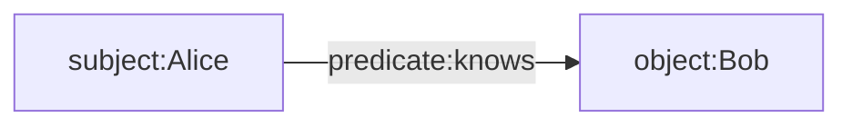
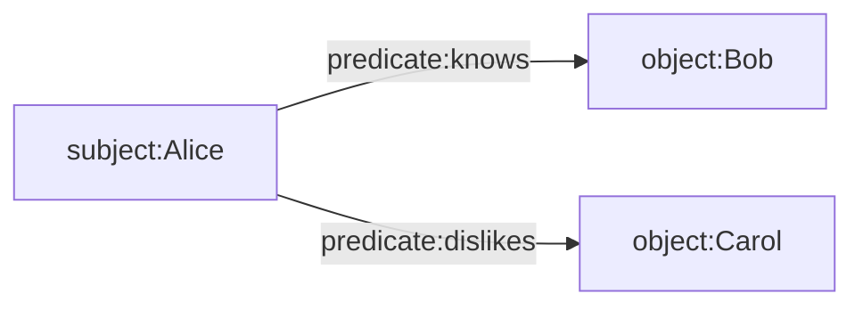

# Envelope Overview

A high-level introduction to Gordian Envelope.

## Overview

The `Envelope` type efficiently supports everything from enclosing the most basic of plaintext messages, to innumerable recursive permutations of encryption, signing, sharding, and representing semantic graphs. Here is its notional definition in Swift:

```swift
struct Envelope {
    let subject: Envelope
    let assertions: [Assertion]
}
```

The basic idea is that an `Envelope` contains some [deterministically-encoded CBOR](https://datatracker.ietf.org/doc/draft-mcnally-deterministic-cbor/) data (the `subject`) that may or may not be encrypted or elided, and zero or more assertions about the `subject`.

Assertions combine two specific parts, `subject` and `predicate`, both of which themselves are also of type `Envelope`:

```swift
struct Assertion {
    let predicate: Envelope
    let object: Envelope
}
```

Combining the `subject` of an `Envelope` with the `predicate` and `object` of an assertion forms a [semantic triple](https://en.wikipedia.org/wiki/Semantic_triple), which may be part of a larger [knowledge graph](https://en.wikipedia.org/wiki/Knowledge_graph).

This assertion-predicate-object triplet may be more easily understood by considering its linguistic usage:



```
"Alice knows Bob."
```

There can be any number assertions associated with each subject:



```
"Alice knows Bob and dislikes Carol."
```

In "Envelope notation" the above would be written:

```
"Alice" [
    "knows": "Bob"
    "dislikes": "Carol"
]
```

## Actual Definition

While useful for initial understanding, the "notional" definition of envelope above is not technically correct. Envelope is actually an enumerated type with eight cases, any of which can exist as a stand-alone envelope:

```swift
enum Envelope {
    /// Represents an envelope with one or more assertions.
    case node(subject: Envelope, assertions: [Envelope], digest: Digest)

    /// Represents an envelope with encoded CBOR data.
    case leaf(CBOR, Digest)

    /// Represents an envelope that wraps another envelope.
    case wrapped(Envelope, Digest)

    /// Represents a value from a namespace of unsigned integers.
    case knownValue(KnownValue, Digest)

    /// Represents an assertion.
    case assertion(Assertion)

    /// Represents an encrypted envelope.
    case encrypted(EncryptedMessage)

    /// Represents a compressed envelope.
    case compressed(Compressed)

    /// Represents an elided envelope.
    case elided(Digest)
}
```

## Assertions

Assertions are themselves `Envelope`s, and can therefore be encrypted, elided, compressed, or carry assersions.

Within an assertion, the `predicate` and `object` are themselves `Envelope`s, and so they may also be encrypted or elided, or carry assertions.

It is therefore possible to "obscure" any part of an `Envelope` or any of its assertions by encrypting, eliding, or compressing its parts. Here is a simple example consisting of an `Envelope` whose `subject` is a simple text string, which has been signed.

```
"Hello." [
    verifiedBy: Signature
]
```

* You can hide the `subject` about which assertions are made:

```
ELIDED [
    verifiedBy: Signature
]
```

* You can hide the `predicate` to reveal that the `subject` and `object` are related, but hide *how* they are related:

```
"Hello." [
    ELIDED: Signature
]
```

* You can hide the `object` to assert that the subject is related in a specific way to some other hidden object:

```
"Hello." [
    verifiedBy: ELIDED
]
```

* You can hide both parts of the assertion separately by hiding the `subject`, `predicate`, and `object`, while still revealing that an assertion *exists*, and allowing verification of the digests of the two parts separately:

```
"Hello." [
    ELIDED: ELIDED
]
```

* You can hide a complete assertion, hiding the digests of the individual `predicate` and `object`,

```
"Hello." [
    ELIDED
]
```

* Finally, you can hide even the fact of the assertion's existence by encrypting or eliding the entire envelope, including its assertions.

```
ELIDED
```

It is important to understand that because `Envelope` supports "complex metadata", i.e., "assertions with assertions," users are not limited to semantic triples. Adding context, as in a [semantic quad](https://en.wikipedia.org/wiki/Named_graph#Named_graphs_and_quads), is easily accomplished with an assertion on the subject.

In fact, any `Envelope` can also be an element of a [cons pair](https://en.wikipedia.org/wiki/Cons), with the "first" element being the `subject` and the "rest" being the assertions. And since the `subject` of an `Envelope` can be any CBOR object, a `subject` can also be any structure (such as an array or map) containing other `Envelope`s.

## Digests

Each `Envelope` produces an associated `Digest`, such that if the `subject` and `assertions` of the `Envelope` are semantically identical, then the same `Digest` must necessarily be produced.

Because hashing a concatenation of items is non-commutative, the order of the elements in the `assertions` array is determined by sorting them lexicographically by the `Digest` of each assertion, and disallowing identical assertions. Combined with the required use of [deterministically-encoded CBOR](https://datatracker.ietf.org/doc/draft-mcnally-deterministic-cbor/), this ensures that an identical `subject` with identical `assertions` will yield the same `Envelope` digest, and `Envelope`s containing other `Envelope`s will yield the same digest tree, also called a [Merkle tree](https://en.wikipedia.org/wiki/Merkle_tree).

Envelopes can be be in several forms, for any of these forms, the same digest is present for the same binary object:

* Present locally or referenced by a `Digest`.
* Unencrypted or encrypted.
* Unelided or elided.
* Compressed or uncompressed.

Thus the `Digest` of an `Envelope` identifies the `subject` and its assertions as if they were all present (dereferenced), unelided, unencrypted, and uncompressed. This allows an `Envelope` to be transformed either into or out of the various encrypted/decrypted, local/reference, elided/unelided, and compressed/uncompressed forms without changing the cumulative Merkle tree of digests. This also means that any transformations that do not preserve the digest tree invalidate the signatures of any enclosing `Envelope`s.

This architecture supports selective disclosure of contents of nested `Envelope`s by revealing only the minimal objects necessary to traverse to a particular nesting path, and having done so, calculating the hashes back to the root allows verification that the correct and included contents were disclosed. On a structure where only a minimal number of fields have been revealed, a signature can still be verified.

## CID

This proposal uses the [`CID` (Common Identifier)](https://github.com/BlockchainCommons/Research/blob/master/papers/bcr-2022-002-cid-common-identifier.md) type as an analogue for a [DID (Decentralized Identifier)](https://www.w3.org/TR/did-core). Both `CID` and `Digest` may be dereferenceable through some form of distributed ledger or registry. The main difference is that the dereferenced content of a `CID` may differ depending on what system dereferenced it or when it was dereferenced (in other words, it may be viewed as mutable), while a `Digest` always dereferences to a unique, immutable object.

Put another way, a `CID` resolves to a *projection* of a current view of an object, while a `Digest` resolves only to a specific immutable object.

## References

In the [DID spec](https://www.w3.org/TR/did-core/), a given DID URI is tied to a single specific method for resolving it. However, there are many cases where one may want a resource (possibly a DID document-like object) or third-party assertions about such a resource to persist in a multiplicity of places, retrievable by a multiplicity of methods. Therefore, in this proposal, one or more methods for dereferencing a `CID` or `Digest` (analogous to DID methods) may be added to an `Envelope` as assertions with the `dereferenceVia` predicate. This allows the referent to potentially exist in many places (including local caches), with the assertions providing guidance to authoritative or recommended methods for dereferencing them.
