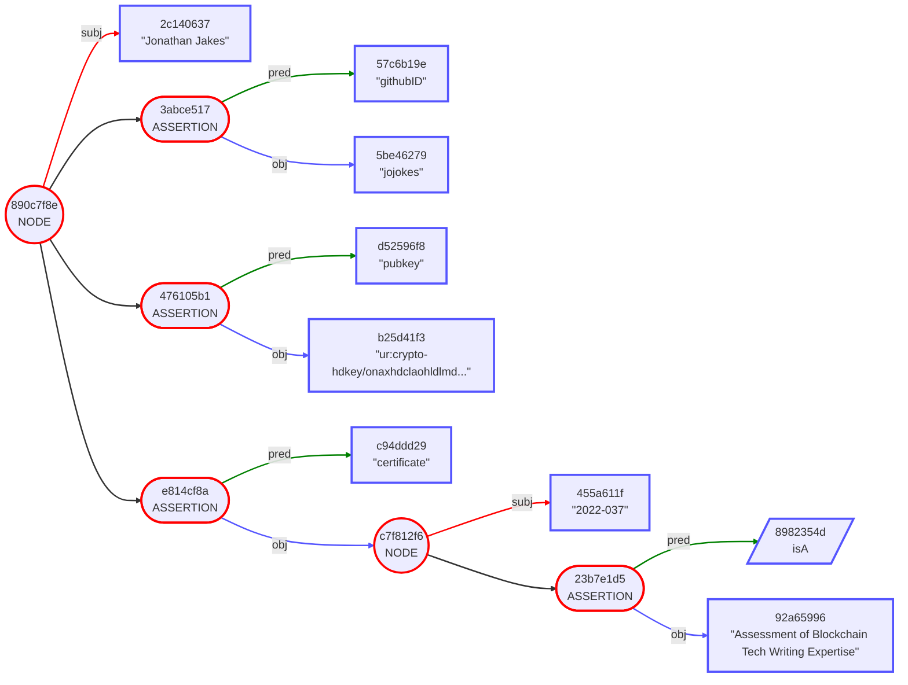

# Gordian Envelope Use Cases: Educational & Credential Industries

Gordian Envelopes can be used in educational credential-issuing industries to encode and transmit sensitive student  information. This allows authorized parties, such as potential employers or other educational institutions, to access only the information they are authorized to view while still preserving the privacy and security of the rest of the data.

For example, a student's transcript could be encoded and transmitted using a Gordian Envelope, with portions of that data elided, to allow potential employers to verify some of the student's educational qualifications without having access to the student's full transcript or other sensitive information. Similarly, a credential such as a certification or license could be encoded and transmitted using a Gordian Envelope, to allow employers or regulators to verify the credential without having access to irrelevant details.

An Envelope's routing instructions and seals can additionally be used to verify the authenticity and provenance of a student's credentials, ensuring that they have not been tampered with. This adds an extra layer of security and trust to the information transmitted using Gordian Envelopes. 

Overall, Gordian Envelopes offer a flexible and privacy-enhancing solution for the transmission and storage of sensitive educational credential information, creating opportunities to transmit sensitive information in restrictive ways.

## Educational Use Case Table of Contents

The following set of use cases demonstrates the use of Gordian Envelopes to store educational credentials. Individual categories are presented progressively: each use case builds on the previous one by demonstrating a new capability. The first set refers to Danika Kaschak, an electrical engineer, and her official credentials. A standalone use case then focuses on the more ad-hoc credentials possible through a Web of Trust. A final set of use cases then demonstrates the distribution of educational credentials with a different priority: herd privacy.

Gordian Envelopes are useful for credentials in large part because of their ability to support advanced features such as elision, peer-based attestation, and herd privacy. They go far beyond just presenting validatable credentials to allowing the individual holders to decide what gets shown, how, and in what context. They thus add self-sovereign control to the standard rubric of Verifiable Credentials.

* [Part One: Official Credentials](Educational.md#part-one-official-credentials)
   * #1: [Danika Proves Her Worth (Credentials, Signature)](Educational.md#1-danika-proves-her-worth-credentials-signature)
   * #2: [Danika Restricts Her Revelations (Elision)](Educational.md#2-danika-restricts-her-revelations-elision)
   * #3: [Thunder & Lightning Spotlights Danika (Third-Party Repackaging)](Educational.md#3-thunder--lightning-spotlights-danika-third-party--repackaging)
* [Part Two: Web of Trust Credentials](Educational.md#part-two-web-of-trust-credentials)
   * #4: [Omar Offers an Open Badge (Web of Trust Credentials)](Educational.md#4-omar-offers-an-open-badge-web-of-trust-credentials)
* [Part Three: Herd Privacy Credentials](Educational.md#part-three-herd-privacy-credentials)
   * #5: [Paul Private Proves Proficiency (Herd Privacy)](Educational.md#5-paul-privately-proves-proficiency-herd-privacy)
   * #6: [Paul Proves His Proficiency with Improved Privacy (Herd Privacy with Non-Correlation)](Educational.md#6-paul-proves-proficiency-with-improved-privacy-herd-privacy-with-non-correlation)
   * #7: [Burton Bank Avoids Toxicity (Herd Privacy with Selective Correlation)](Educational.md#7-burton-bank-avoids-toxicity-herd-privacy-with-selective-correlation)
 
_The Danika Kaschak examples in #1 through #3 are drawn directly from [07-Elision-Example](https://github.com/BlockchainCommons/envelope-cli-swift/blob/master/Docs/7-VC-ELISION-EXAMPLE.md), one of the documents for the [Envelope-CLI app](https://github.com/BlockchainCommons/envelope-cli-swift). The Burton Bank example is drawn from a use case in a [Selective Disclosure white paper](https://github.com/WebOfTrustInfo/rwot11-the-hague/blob/master/draft-documents/selective-correlation.md) in process from Rebooting the Web of Trust XI._

## Part One: Official Credentials

This first set of use cases demonstrates how to create (and sign) simple credentials, how the subject can elide data, how another holder can elide data, and how additional parties can add data and even new signatures to a credential.

### #1. Danika Proves Her Worth (Credentials, Signature)

> _Problem Solved:_ Danika needs to be able to prove her credentials as an electrical engineer without depending on a centralized authority.

Danika is a credentialed electrical engineer who maintains her certification through continuing education. In past years she would have listed her credentials and then potential employers would have had to go to the certification board to verify them. This was ideal for no one, because most employers didn't check certifications (leaving them vulnerable), and if they did, the check was beholden to the certification board, who might fail to verify valid credentials for any number of reasons.

Enter the new world of digital credentials. The certification board can now produce a signed version of Danika's credentials that lists all of her professional development and continuing employment using a Gordian Envelope. There's no need to contact the cerification board afterward because Danika can produce the credential and it can be validated by compared the signature to the board's public key, stored in Public Key Infrastructure (PKI). Danika can also prove that the credential belongs to her by signing something with the private key linked to the public key stored in the Envelope.

To create the credential, Danika submits information to the Electrical Engineering Board listing her experience:

```
CID(4676635a) [
    "certificateNumber": "123-456-789"
    "continuingEducationUnits": 1.5
    "expirationDate": 2028-01-01
    "firstName": "Danika"
    "issueDate": 2022-09-01
    "lastName": "Kaschak"
    "photo": "This is Danika Kaschak's photo."
    "professionalDevelopmentHours": 15
    "subject": "RF and Microwave Engineering"
    "topics": CBOR
    "ur:pub": "ur:crypto-pubkeys/lftaaosehdcxztpl..."
    controller: "Example Electrical Engineering Board"
    isA: "Certificate of Completion"
    issuer: "Example Electrical Engineering Board"
]
```

The certification board validates the information submitted by Danika, and then wraps the Envelope and signs it before returning it to Danika. This is what gives the Envelope its power. Because it's signed, no one now needs to contact the board (as long as their public key is indeed stored in a PKI, or at some other well-known site, to allow for validation).
```
{
    CID(4676635a) [
        "certificateNumber": "123-456-789"
        "continuingEducationUnits": 1.5
        "expirationDate": 2028-01-01
        "firstName": "Danika"
        "issueDate": 2022-09-01
        "lastName": "Kaschak"
        "photo": "This is Danika Kaschak's photo."
        "professionalDevelopmentHours": 15
        "subject": "RF and Microwave Engineering"
        "topics": CBOR
        "ur:pub": "ur:crypto-pubkeys/lftaaosehdcxztpl..."
        controller: "Example Electrical Engineering Board"
        isA: "Certificate of Completion"
        issuer: "Example Electrical Engineering Board"
    ]
} [
    note: "Signed by Example Electrical Engineering Board"
    verifiedBy: Signature
]

```

To make the validation process easier, additional hints for public-key look up could have been added, though a validator would have then needed to assess whether that information was itself valid or not.

### #2. Danika Restricts Her Revelations (Elision)

> _Problem Solved:_ Danika wants to avoid prejudice when using her credentials in job applications.

Danika is very confident in her prowess as an electrical engineer, but she fears prejudice when she seeks employment. Primarily, she is concerned about prejudice over her Eastern Europe name, but she also fears prejudice over the recent date of her certification. As a result, she wants to elide (omit) that information in her credential, as well as other details that she considers irrelevent to her application.

Gordian Envelope gives any holder of a credential the ability to elide information from a credential. Danika simply needs to use an application such as `envelope-cli` that removes specific content. Gordian Envelope is designed so that this removal of information doesn't affect any of the digital hashes within the Envelope. As a result, the signature on the Envelope remains valid. Danika can still present the information and someone examining it can then assess the remaining information and verify that it's been signed, in this case by the certification board.

When Danika elides her envelope, it shows that information has been removed:
```
{
    CID(4676635a) [
        "expirationDate": 2028-01-01
        "subject": "RF and Microwave Engineering"
        isA: "Certificate of Completion"
        issuer: "Example Electrical Engineering Board"
        ELIDED (10)
    ]
} [
    note: "Signed by Example Electrical Engineering Board"
    verifiedBy: Signature
]
```

After submitting her credentials, Danika supplements them with excellent scores in a third-party proctored test (producing another credential) and is hired by Thunder & Lightning Inc.

## 3. Thunder & Lightning Spotlights Danika (Third-Party  Repackaging)

> _Problem Solved:_ Thunder & Lightning Inc. needs to repackage Danika's credentials for their customers.

Thunder & Lightning Inc. is ready to send Danika to a job site! To do so they must both reveal and affirm her credentials to the job-site supervisors. Even though they are neither the issuer nor the subject of Danika's educational credentials, Thunder & Lightning is able to produce their own version of those credentials based on the copy of the Gordian Envelope that they hold.

They want Danika's name in the credentials, so they must ask her for a copy of the credentials containing that information, but then they elide the rest of the information just like she did, using an application such as `envelope-cli`. This is one of the strengths of Gordian Envelope: each party who holds the Envelope (or even an already-elided form of the Envelope) can choose how to further elide it to match their own requirements and their own risk models.

But a holder can do more than that: they can also add information. In this case, Thunder & Lightning wants to add details about Danika's work with them. They can do so by wrapping the original, signed information, adding content, and then putting another signature on top of that. The original certification information remains verified by the certification board, and the new employment information is verified by Thunder & Lightning.

Thunder & Lightning's elided version of Danika's certification reveals slightly different information than the previous version:
```
{
    CID(4676635a) [
        "expirationDate": 2028-01-01
        "firstName": "Danika"
        "lastName": "Kaschak"
        "subject": "RF and Microwave Engineering"
        isA: "Certificate of Completion"
        issuer: "Example Electrical Engineering Board"
        ELIDED (8)
    ]
} [
    note: "Signed by Example Electrical Engineering Board"
    verifiedBy: Signature
]
```

Thunder & Lightning Inc. wraps that envelope (to preserve the original signature) and then adds additional data on Danika's work with them:
```
{
    {
        CID(4676635a) [
            "expirationDate": 2028-01-01
            "firstName": "Danika"
            "lastName": "Kaschak"
            "subject": "RF and Microwave Engineering"
            isA: "Certificate of Completion"
            issuer: "Example Electrical Engineering Board"
            ELIDED (8)
        ]
    } [
        note: "Signed by Example Electrical Engineering Board"
        verifiedBy: Signature
    ]
} [
    "employeeHiredDate": 2022-10-01
    "employeeStatus": "active"
]
```

There's one final step. Since Thunder & Lightning Inc. added what are essentially new credentials, they need to wrap the envelope one more time, then sign it, to make their new claims verifiable.
```
{
    {
        {
            CID(4676635a) [
                "expirationDate": 2028-01-01
                "firstName": "Danika"
                "lastName": "Kaschak"
                "subject": "RF and Microwave Engineering"
                isA: "Certificate of Completion"
                issuer: "Example Electrical Engineering Board"
                ELIDED (8)
            ]
        } [
            note: "Signed by Example Electrical Engineering Board"
            verifiedBy: Signature
        ]
    } [
        "employeeHiredDate": 2022-10-01
        "employeeStatus": "active"
    ]
} [
    note: "Signed by Thunder & Lightning Inc."
    verifiedBy: Signature
]
```


In case the hashes have gotten too small to read, here's a look at the three stages of this use case using the `--tree` function from `envelope-cli`:

**Redacted Credential:**
```
820fcb63 NODE
    d8f990a1 subj WRAPPED
        b891373a subj NODE
            3b888f3c subj CID(4676635a)
            3d00d64f ELIDED
            44736993 ELIDED
            46d6cfea ASSERTION
                8982354d pred isA
                112e2cdb obj "Certificate of Completion"
            4a69fca3 ELIDED
            5545f6e2 ASSERTION
                954c8356 pred issuer
                4035b4bd obj "Example Electrical Engineering Board"
            5e75ff3b ELIDED
            61689bb7 ASSERTION
                e6c2932d pred "expirationDate"
                b91eea18 obj 2028-01-01
            82825e3e ASSERTION
                eb62836d pred "lastName"
                86236e63 obj "Kaschak"
            a0274d1c ELIDED
            e0070876 ASSERTION
                0eb38394 pred "subject"
                b059b0f2 obj "RF and Microwave Engineering"
            e96b24d9 ELIDED
            eb1f3ba0 ELIDED
            f57c11a8 ASSERTION
                c4d5323d pred "firstName"
                03ead475 obj "Danika"
            fcb3d37a ELIDED
    040e7274 ASSERTION
        d59f8c0f pred verifiedBy
        3f1752a0 obj Signature
    afe231cc ASSERTION
        61fb6a6b pred note
        f4bf011f obj "Signed by Example Electrical Engineering Board"
```
**Redacted Credential with Employment Credentials:**
```
abdedfa9 NODE
    41c818e9 subj WRAPPED
        820fcb63 subj NODE
            d8f990a1 subj WRAPPED
                b891373a subj NODE
                    3b888f3c subj CID(4676635a)
                    3d00d64f ELIDED
                    44736993 ELIDED
                    46d6cfea ASSERTION
                        8982354d pred isA
                        112e2cdb obj "Certificate of Completion"
                    4a69fca3 ELIDED
                    5545f6e2 ASSERTION
                        954c8356 pred issuer
                        4035b4bd obj "Example Electrical Engineering Board"
                    5e75ff3b ELIDED
                    61689bb7 ASSERTION
                        e6c2932d pred "expirationDate"
                        b91eea18 obj 2028-01-01
                    82825e3e ASSERTION
                        eb62836d pred "lastName"
                        86236e63 obj "Kaschak"
                    a0274d1c ELIDED
                    e0070876 ASSERTION
                        0eb38394 pred "subject"
                        b059b0f2 obj "RF and Microwave Engineering"
                    e96b24d9 ELIDED
                    eb1f3ba0 ELIDED
                    f57c11a8 ASSERTION
                        c4d5323d pred "firstName"
                        03ead475 obj "Danika"
                    fcb3d37a ELIDED
            040e7274 ASSERTION
                d59f8c0f pred verifiedBy
                3f1752a0 obj Signature
            afe231cc ASSERTION
                61fb6a6b pred note
                f4bf011f obj "Signed by Example Electrical Engineering Board"
    0001c9c5 ASSERTION
        134a1704 pred "employeeHiredDate"
        a3687c5b obj 2022-10-01
    310b027f ASSERTION
        f942ee55 pred "employeeStatus"
        919eb85d obj "active"
```
**Redacted Credentials with Employment Warranty:**
```
275ac4ea NODE
    a7bf95d5 subj WRAPPED
        abdedfa9 subj NODE
            41c818e9 subj WRAPPED
                820fcb63 subj NODE
                    d8f990a1 subj WRAPPED
                        b891373a subj NODE
                            3b888f3c subj CID(4676635a)
                            3d00d64f ELIDED
                            44736993 ELIDED
                            46d6cfea ASSERTION
                                8982354d pred isA
                                112e2cdb obj "Certificate of Completion"
                            4a69fca3 ELIDED
                            5545f6e2 ASSERTION
                                954c8356 pred issuer
                                4035b4bd obj "Example Electrical Engineering Board"
                            5e75ff3b ELIDED
                            61689bb7 ASSERTION
                                e6c2932d pred "expirationDate"
                                b91eea18 obj 2028-01-01
                            82825e3e ASSERTION
                                eb62836d pred "lastName"
                                86236e63 obj "Kaschak"
                            a0274d1c ELIDED
                            e0070876 ASSERTION
                                0eb38394 pred "subject"
                                b059b0f2 obj "RF and Microwave Engineering"
                            e96b24d9 ELIDED
                            eb1f3ba0 ELIDED
                            f57c11a8 ASSERTION
                                c4d5323d pred "firstName"
                                03ead475 obj "Danika"
                            fcb3d37a ELIDED
                    040e7274 ASSERTION
                        d59f8c0f pred verifiedBy
                        3f1752a0 obj Signature
                    afe231cc ASSERTION
                        61fb6a6b pred note
                        f4bf011f obj "Signed by Example Electrical Engineering Board"
            0001c9c5 ASSERTION
                134a1704 pred "employeeHiredDate"
                a3687c5b obj 2022-10-01
            310b027f ASSERTION
                f942ee55 pred "employeeStatus"
                919eb85d obj "active"
    36367ff6 ASSERTION
        d59f8c0f pred verifiedBy
        edca9a73 obj Signature
    829934e2 ASSERTION
        61fb6a6b pred note
        0dca250c obj "Signed by Thunder & Lightning Inc."
```

## Part Two: Web of Trust Credentials

It can be relatively easy to validate official credentials from centralized authorities. However, Gordian Envelopes also allow for the issuance of peer-to-peer credentials by incorporating metadata that can aid in their validation.

### 4. Omar Offers an Open Badge [Web of Trust Credentials]

> _Problem Solved:_ Jonathan wants to prove his expertise in blockchain tech writing, but there are no official credentials. 

Jonathan has been doing technical writing on blockchains for a few years and wants to extend that into a freelance career. Unfortunately, most of his extant writing has been internal documents, and so he can't point potential employers to them. 

Omar, an expert in blockchain technical writing, has GitHub repos that are filled with examples of his own excellent writing, and that's led him to offer Open Badges for other people whose writing he thinks is up to spec. Omar can create a badge for Jonathan by writing a credential and signing it with his GitHub private key. Validators can then assess the validity of that peer-to-peer credential by looking at the contents of Omar's own GitHub and determining whether he has sufficient expertise to provide that credential.

After positively assessing Jonath's tech writing, Omar thus creates a credential that identifies Jonathan and certifies his expertise:
```
"Jonathan Jakes" [
    "certificate": "2022-037" [
        isA: "Assessment of Blockchain Tech Writing Expertise"
    ]
    "githubID": "jojokes"
    "pubkey": "ur:crypto-hdkey/onaxhdclaohldlmdrtlacxhnfpptplfyltwelafsnezslyndhllnvdimmwlpylkbwzjltbdmenaahdcxlejt"
]
```

While creating the credential, Omar adds on information to identify himself by using a `certifiedBy` predicate that he places in the `certificate`:
```
"Jonathan Jakes" [
    "certificate": "2022-037" [
        "certifiedBy": "Omar Chaim" [
            "githubID": "omarc-bc-guy"
            "pubkeyURL": "https://github.com/omarc-bc-guy.keys"
        ]
        isA: "Assessment of Blockchain Tech Writing Expertise"
    ]
    "githubID": "jojokes"
    "pubkey": "ur:crypto-hdkey/onaxhdclaohldlmdrtlacxhnfpptplfyltwelafsnezslyndhllnvdimmwlpylkbwzjltbdmenaahdcxlejt"
]
```

The `githubID` is what acts as Omar's own credential. Validators can view it to decide the worth of Omar's certification, as is traditional in a web of trust. `pubkeyURL` is meant as a hint so that validators don't have to figure out where to look up the public key associated with the GitHub-ID, but obviously any validator will need to thoughtfully consider whether the hint is proper and links to the ID shown.

To finalize the Open Badge, Omar must then wrap the envelope and sign it with the private key associated with the public key he has registered on GitHub.
```
{
    "Jonathan Jakes" [
        "certificate": "2022-037" [
            "certifiedBy": "Omar Chaim" [
                "githubID": "omarc-bc-guy"
                "pubkeyURL": "https://github.com/omarc-bc-guy.keys"
            ]
            isA: "Assessment of Blockchain Tech Writing Expertise"
        ]
        "githubID": "jojokes"
        "pubkey": "ur:crypto-hdkey/onaxhdclaohldlmdrtlacxhnfpptplfyltwelafsnezslyndhllnvdimmwlpylkbwzjltbdmenaahdcxlejt"
    ]
} [
    verifiedBy: Signature
]
```


## Part Three: Herd Privacy Credentials

Educational credentials are usually presumed to be packaged in discrete Envelopes that identify a single user. However, some situations may benefit from conglomerating thousands of credentials in a single Envelope, giving each of those users privacy  even from the credential issuer! The following examples include a pair of progressive use cases showing how an internet user can benefit from herd privacy and then a single example demonstrating how a company can do so.

### 5. Paul Privately Proves Proficiency [Herd Privacy]

> _Problem Solved:_ Paul wants a credential, but he doesn't trust the organization giving out the credentials with his personal information!

Paul wants to get a credential showing proficiency in Gordian Envelope from Blockchain Commons, but he's a good Cypherpunk: he knows not to trust any organization. Fortunately, Blockchain Commons has privacy-protecting options.

Paul can take an online test in either Basic form (automated Q&A with a time limit) or Advanced form (Q&A with a live proctor on Zoom). He chooses the former, again for privacy reasons. After he succeeds at the test (50 out of 50, of course!), he needs to get his credential.

At this point, most credential issuers would require Paul to give up an email address and then mail them the personal credential, but Blockchain Commons' privacy preserving methodology simply requires Paul to give them a self certifying identifier or some sort (for which he presumably controls the private key). They'll then embed that identifier in a very large Envelope with the credentials of everyone who succeeded at the test that month. (Paul must wait until the Envelope is generated before he can prove anything!)

At the end of the month, Blockchain Commons will create a large Gordian Envelope that contains the identifiers of everyone who passed their test that month, with a statement as to whether each DID `isBasic` or `isAdvanced`. However, it will be largely elided to protect everyone's privacy! Paul will then be able to create a simple proof that shows he's a member of the class ... but remains relatively anonymous until he does so.

The following example shows a credential for a number of different participants. A real-life example would likely have hundreds of entries to ensure herd privacy, but that's reduced here for readability:
```
"Blockchain Commons Certifactions #13" [
    "certifiedBy": "Blockchain Commons" [
        "pubkeyURL": "https://www.blockchaincommons.com/certification.keys"
    ]
    "date": "11-01-2022"
    "isAdvanced": "ur:crypto-cid/hdcxbetimuglwppshfqdsahsktgmnelsjnbdcanspmnshkpecxcfztlkiohgenytntmkaxjngadt"
    "isAdvanced": "ur:crypto-cid/hdcxjsdwaegrpfwmbkehhscwmshpchlnhhayadadwszcghhtmnzcgomhutcmytldfwpadmdlcwfe"
    "isAdvanced": "ur:crypto-cid/hdcxmhtnnlcshsjzhywyhgttsrgulstdwdnezesekosndnfxswzezolrfdcwlulacxeopdkghnht"
    "isBasic": "ur:crypto-cid/hdcxaepthffshppabkgydawmlftbpfrnaefzrdjehybwtskgmwveenwzntpyhdrpsfqzsgqdftnb"
    "isBasic": "ur:crypto-cid/hdcxdkmhpfathyyltnnboypsemehkimudnkgeyosgolncfmdnboypsecpsghtefzetkndpeylrfz"
    "isBasic": "ur:crypto-cid/hdcxfnmdsrgdkbvekoecwevystbaztbwcshpqdbzkeatjlndlywepyctlkvwemhkiyhtenwnghda"
    "isBasic": "ur:crypto-cid/hdcxhnutcyktgtfxotvegrhllypakenlgoetmnnlimsktppkssloghpahsdeparktbkerebatyce"
    "isBasic": "ur:crypto-cid/hdcxiadtuowtsrynlfbslgplynrlonpfbaeolkbzztsngtasjpenwmdevojsgmplishhurkebnts"
    "isBasic": "ur:crypto-cid/hdcxmnktvdgeettlfmbklytaseayoeplwynbsawdurmuuelbbsfxbbaxkkpsemjovybzswqdssva"
    "isBasic": "ur:crypto-cid/hdcxuykblalfdalsvaplrfzsoxqdvdclstmdtssfdatkmecwnsbzmseohswldaytdmsfbwaxvewp"
]

```

As usual, a signature is required to verify credentials. The credentials are thus wrapped and signed. This signature should match the `pubkeyURL` provided.
```
{
    "Blockchain Commons Certifactions #13" [
        "certifiedBy": "Blockchain Commons" [
            "pubkeyURL": "https://www.blockchaincommons.com/certification.keys"
        ]
        "date": "11-01-2022"
        "isAdvanced": "ur:crypto-cid/hdcxbetimuglwppshfqdsahsktgmnelsjnbdcanspmnshkpecxcfztlkiohgenytntmkaxjngadt"
        "isAdvanced": "ur:crypto-cid/hdcxjsdwaegrpfwmbkehhscwmshpchlnhhayadadwszcghhtmnzcgomhutcmytldfwpadmdlcwfe"
        "isAdvanced": "ur:crypto-cid/hdcxmhtnnlcshsjzhywyhgttsrgulstdwdnezesekosndnfxswzezolrfdcwlulacxeopdkghnht"
        "isBasic": "ur:crypto-cid/hdcxaepthffshppabkgydawmlftbpfrnaefzrdjehybwtskgmwveenwzntpyhdrpsfqzsgqdftnb"
        "isBasic": "ur:crypto-cid/hdcxdkmhpfathyyltnnboypsemehkimudnkgeyosgolncfmdnboypsecpsghtefzetkndpeylrfz"
        "isBasic": "ur:crypto-cid/hdcxfnmdsrgdkbvekoecwevystbaztbwcshpqdbzkeatjlndlywepyctlkvwemhkiyhtenwnghda"
        "isBasic": "ur:crypto-cid/hdcxhnutcyktgtfxotvegrhllypakenlgoetmnnlimsktppkssloghpahsdeparktbkerebatyce"
        "isBasic": "ur:crypto-cid/hdcxiadtuowtsrynlfbslgplynrlonpfbaeolkbzztsngtasjpenwmdevojsgmplishhurkebnts"
        "isBasic": "ur:crypto-cid/hdcxmnktvdgeettlfmbklytaseayoeplwynbsawdurmuuelbbsfxbbaxkkpsemjovybzswqdssva"
        "isBasic": "ur:crypto-cid/hdcxuykblalfdalsvaplrfzsoxqdvdclstmdtssfdatkmecwnsbzmseohswldaytdmsfbwaxvewp"
    ]
} [
    verifiedBy: Signature
]
```

However, to create herd privacy, Blockchain Commons doesn't release the full Envelope. Instead, they release an elided version that only contains the certification information and signature.
```
{
    "Blockchain Commons Certifactions #13" [
        "certifiedBy": "Blockchain Commons" [
            "pubkeyURL": "https://www.blockchaincommons.com/certification.keys"
        ]
        "date": "11-01-2022"
        ELIDED (10)
    ]
} [
    verifiedBy: Signature
]
```

Note that each elided entry of certification still has its prior hash. All that Paul needs to do to prove participation in the class is to show that he can generate one of those hashes with his identifier. That will prove his certification!

Blockchain Commons publishes instructions for how to do so. Test takers just need to create an assertion with either the "isBasic" predicate or the "isAdvanced" predicate and their portable `ur:crypto-cid` identifier. When they hash that assertion with BLAKE3, they can then prove that the digest is part of the partially redacted list of credentials.

Paul creates his assertion based on the instructions:
```
"isBasic": "ur:crypto-cid/hdcxiadtuowtsrynlfbslgplynrlonpfbaeolkbzztsngtasjpenwmdevojsgmplishhurkebnts"
```

He then creates the hashed digest of that credential:
```
ur:crypto-digest/hdcxhdwnsntebthnrhzmzsjpvazttpzctlmhcwrffnlthhgdkptscsayzmcxndpdessabzjekbur
```
That's the Blake3 hash of his assertion in UR form. If converted to hex, it is:
```
58F1CDD30D60B9FFFA72E6FCD8FDD5901BBC3C875C5075D71808FF209BA839C2
```
As can be seen, that matches the third redacted hash in the Mermaid diagram above, which was the `isBasic` assertion for `ur:crypto-cid/hdcxiadtuowtsrynlfbslgplynrlonpfbaeolkbzztsngtasjpenwmdevojsgmplishhurkebnts`.

Now, Paul can point to Blockchain Common's partially redacted tree of November 2022 certifications, reveal his CID, acknowledge that he passed the basic testing, and show his digest. Together these facts prove that his identifier is part of the tree. 

More notably, Paul can decide never to reveal his CID, in which case it is at least somewhat difficult for anyone else to prove that Paul is a member of the group. 

Mind you, because the tree is partially redacted, and because no particular attempt has been made to prevent correlation, it's possible that identifiers in the Envelope could be guessed (though someone would have to know a precise identifier to look for). There are several ways this could be prevented. They all require Blockchain Commons to provide additional information to Paul, increasing the communication requirements (and thus potentially impacting privacy), but they add strong non-correlation defenses.

1.) Blockchain Commons could choose to fully redact the Envelope, publishing only a top-level hash. They would then supply Paul with a path to his lower-level hash by partially redacting the tree when he supplied them with his CID. Paul could then prove his presence in the Envelope with his digest and that path. If that path were to be more widely released, there would be the same correlation problems, but obviously they'd be lesser because it probably would never be widely published.

2.) Alternatively, Blockchain Commons could restructure the Envelope so that every 5 or 10 or 20 CIDs were placed in a subenvelope. Their publicly published proof would only show the hashes of these subenvelopes, which will be relatively impossible to correlate. Paul would then be able to request a path to his own subenvelope. Even if this path were more widely released, there would only be a possibility of correlation for the other CIDs that happen to be in that subenvelope. (This example is shown in the next use case.)

3.) Finally, Blockchain Commons could choose to salt every CID in the Envelope. They would then have to supply Paul with his salt. (The twin limitations here are that salting everything dramatically increases the size of the Envelope and that Paul then has a piece of data that he can't lose).

### 6. Paul Proves Proficiency with Improved Privacy [Herd Privacy with Non-Correlation]

> _Problem Solved:_ Blockchain Commons wants to improve the herd privacy of its test takers by reducing correlation.

Blockchain Commons is aware of the correlation possibilities in their test-result Envelopes. They choose a middle road to dramatically reduce correlation: they store every 5 CIDs in a separate sub-Envelope. (A real-life example might instead have clumps of 10 or 20 CIDs, but again this one is reduced in size to make it manageable.) Paul will then be able to request a path to his specific envelope, which he can combine with an assertion and the published top-level hashes of the envelope to, once more, show his participation. However the published hashes, which just contain the subenvelope, are more-or-less impossible to correlate.

The envelope of certifications is bundled in a new, hierarchical manner:
```
"Blockchain Commons Certifactions #13A" [
    "certifiedBy": "Blockchain Commons" [
        "pubkeyURL": "https://www.blockchaincommons.com/certification.keys"
    ]
    "date": "11-01-2022"
    "isBundle": "13A-001" [
        "isAdvanced": "ur:crypto-cid/hdcxbetimuglwppshfqdsahsktgmnelsjnbdcanspmnshkpecxcfztlkiohgenytntmkaxjngadt"
        "isAdvanced": "ur:crypto-cid/hdcxjsdwaegrpfwmbkehhscwmshpchlnhhayadadwszcghhtmnzcgomhutcmytldfwpadmdlcwfe"
        "isAdvanced": "ur:crypto-cid/hdcxmhtnnlcshsjzhywyhgttsrgulstdwdnezesekosndnfxswzezolrfdcwlulacxeopdkghnht"
        "isBasic": "ur:crypto-cid/hdcxaepthffshppabkgydawmlftbpfrnaefzrdjehybwtskgmwveenwzntpyhdrpsfqzsgqdftnb"
        "isBasic": "ur:crypto-cid/hdcxdkmhpfathyyltnnboypsemehkimudnkgeyosgolncfmdnboypsecpsghtefzetkndpeylrfz"
    ]
    "isBundle": "13A-002" [
        "isBasic": "ur:crypto-cid/hdcxfnmdsrgdkbvekoecwevystbaztbwcshpqdbzkeatjlndlywepyctlkvwemhkiyhtenwnghda"
        "isBasic": "ur:crypto-cid/hdcxhnutcyktgtfxotvegrhllypakenlgoetmnnlimsktppkssloghpahsdeparktbkerebatyce"
        "isBasic": "ur:crypto-cid/hdcxiadtuowtsrynlfbslgplynrlonpfbaeolkbzztsngtasjpenwmdevojsgmplishhurkebnts"
        "isBasic": "ur:crypto-cid/hdcxmnktvdgeettlfmbklytaseayoeplwynbsawdurmuuelbbsfxbbaxkkpsemjovybzswqdssva"
        "isBasic": "ur:crypto-cid/hdcxuykblalfdalsvaplrfzsoxqdvdclstmdtssfdatkmecwnsbzmseohswldaytdmsfbwaxvewp"
    ]
]
```

Of course, it must still be signed. (This example uses a different signing key primarily because the former example key was no longer available due to a reboot resetting shell variables; practice #SmartCustody & keep your keys safe!)
```
{
    "Blockchain Commons Certifactions #13A" [
        "certifiedBy": "Blockchain Commons" [
            "pubkeyURL": "https://www.blockchaincommons.com/certification.keys"
        ]
        "date": "11-01-2022"
        "isBundle": "13A-001" [
            "isAdvanced": "ur:crypto-cid/hdcxbetimuglwppshfqdsahsktgmnelsjnbdcanspmnshkpecxcfztlkiohgenytntmkaxjngadt"
            "isAdvanced": "ur:crypto-cid/hdcxjsdwaegrpfwmbkehhscwmshpchlnhhayadadwszcghhtmnzcgomhutcmytldfwpadmdlcwfe"
            "isAdvanced": "ur:crypto-cid/hdcxmhtnnlcshsjzhywyhgttsrgulstdwdnezesekosndnfxswzezolrfdcwlulacxeopdkghnht"
            "isBasic": "ur:crypto-cid/hdcxaepthffshppabkgydawmlftbpfrnaefzrdjehybwtskgmwveenwzntpyhdrpsfqzsgqdftnb"
            "isBasic": "ur:crypto-cid/hdcxdkmhpfathyyltnnboypsemehkimudnkgeyosgolncfmdnboypsecpsghtefzetkndpeylrfz"
        ]
        "isBundle": "13A-002" [
            "isBasic": "ur:crypto-cid/hdcxfnmdsrgdkbvekoecwevystbaztbwcshpqdbzkeatjlndlywepyctlkvwemhkiyhtenwnghda"
            "isBasic": "ur:crypto-cid/hdcxhnutcyktgtfxotvegrhllypakenlgoetmnnlimsktppkssloghpahsdeparktbkerebatyce"
            "isBasic": "ur:crypto-cid/hdcxiadtuowtsrynlfbslgplynrlonpfbaeolkbzztsngtasjpenwmdevojsgmplishhurkebnts"
            "isBasic": "ur:crypto-cid/hdcxmnktvdgeettlfmbklytaseayoeplwynbsawdurmuuelbbsfxbbaxkkpsemjovybzswqdssva"
            "isBasic": "ur:crypto-cid/hdcxuykblalfdalsvaplrfzsoxqdvdclstmdtssfdatkmecwnsbzmseohswldaytdmsfbwaxvewp"
        ]
    ]
} [
    verifiedBy: Signature
]
```

As before, Blockchain Commons publishes a partially elided Envelope with the foundational information about the test results.
```
{
    "Blockchain Commons Certifactions #13A" [
        "certifiedBy": "Blockchain Commons" [
            "pubkeyURL": "https://www.blockchaincommons.com/certification.keys"
        ]
        "date": "11-01-2022"
        ELIDED (2)
    ]
} [
    verifiedBy: Signature
]
```

This time there's effectively zero chance of correlation because the two remaining `ELIDED` elements each contain several (5) identifiers, drawn from the set of all identifiers. There's no practical way to figure out what is in each bundle.

In order to prove his participation, Paul creates an assertion, just like before:
```
"isBasic": "ur:crypto-cid/hdcxiadtuowtsrynlfbslgplynrlonpfbaeolkbzztsngtasjpenwmdevojsgmplishhurkebnts"
```

However, due to the fact that the contents of the bundles of identifiers remain hidden, that's not enough. Paul needs to hand his assertion to Blockchain Commons, and then they need to send back a proof that reveals just enough of the Envelope structure to open up the bundle that contains his identifier. Though this is more back-and-forth than in the previous Use Case, it can still be done in a privacy preserving way, such as Paul requesting the Proof over a Tor connection.

Here's what the proof looks like. 
```
{
    ELIDED [
        ELIDED: ELIDED [
            ELIDED (5)
        ]
        ELIDED (3)
    ]
} [
    ELIDED
]
```

A proof is the minimum path needed to reveal the hash that a user requires to demonstrate the existence of his assertion. As can be seen, one of the bundles (`f51ac46f`) has now been opened up. That reveals Paul's hash (`58F1CDD3`). 

To prove his inclusion, Paul would now have to reveal his assertion digest, the "proof" from Blockchain Commons, and the original publication from Blockchain Commons.

Through this methodology, the possibility of correlation is much reduced. The proof is the only thing that contains a hash that could theoretically be correlated if someone knew what to look for. They're not meant to be published, which greatly reduces their danger, but even if they were, only the other DIDs in the same bundle are subject to potential correlation. (Salted assertions still offer better correlation protection, but as noted previously, only at a cost in space, complexity, and required secrets. The bundled assertions of this example offer an excellent middle ground.)

### 7. Burton Bank Avoids Toxicity (Herd Privacy with Selective Correlation)

> _Problem Solved:_ Burton Bank needs to verify the success of its student loans without acquiring toxic data while doing so!

Personal data can be toxic! It can be a major liability for companies holding the data, especially in an age where online data breaches are becoming increasingly common and where laws such the GDPR and the CCPA are providing increasing protections to users (while simultaneously punishing companies who do not successfully protect user information).

Despite that, companies still need to work with personal information, and that's the case for Burton Bank. They fund student loans based on government backing, and as a result they have to follow a variety of regulations. One of them states that they may only offer funds to educational institutes whose loan holders maintain an 80% graduation rate within two years for professional schools and within four years for colleges. As a result, Burton Bank needs to receive information on the graduation of its loan holders, but this can be tricky as they sometimes buy loans from other banks or sell them to other banks: no one but Burton knows what loans they hold!

Acme Professional School thus prepares a general report on graduation for all of their students three times a year. To protect the recipients, they elide it so that no toxic data is transmitted. Burton Bank can then selectively correlate the elided data using the personal data they already have on hand, but without accepting any new responsibility for the data of students not associated with the bank!

Acme's yearly report lists the identifiers for their students, plus enough additional information to allow verification, all signed by Acme.
```
{
    "Acme Professional School 2022-12-24 Graduation" [
        "freedoniaID": "fasa-marx-1" [
            "dateOfBirth": "2002-12-06"
            "lastName": "Elsher"
        ]
        "socialSecurity": "000345678" [
            "dateOfBirth": "2001-07-04"
            "lastName": "Hansley"
        ]
        "socialSecurity": "078051120" [
            "dateOfBirth": "1984-03-21"
            "lastName": "Dawson"
        ]
        "socialSecurity": "123004567" [
            "dateOfBirth": "1999-12-31"
            "lastName": "Hayes"
        ]
        "socialSecurity": "123456789" [
            "dateOfBirth": "2004-02-29"
            "lastName": "Gray"
        ]
        "socialSecurity": "567890000" [
            "dateOfBirth": "2002-06-06"
            "lastName": "Wang"
        ]
        "socialSecurity": "666786543" [
            "dateOfBirth": "2001-10-31"
            "lastName": "Liu"
        ]
        "wakandaID": "W6368616420626f73656d616e" [
            "dateOfBirth": "1997-08-28"
            "lastName": "Challa"
        ]
    ]
} [
    verifiedBy: Signature
]
```

Obviously, this is highly toxic information. Social security numbers are so toxic that a [reference](https://www.lexjansen.com/nesug/nesug07/ap/ap19.pdf) was used just to verify that invalid numbers were being used in this example. Worse, names and birthdates could aid in identity theft, especially if associated with a social security number (or other identifer). As a result, Acme doesn't want to transmit this bare information, and Burton Bank doesn't want to receive information on students not associated with the bank. But, a full set of information must be transmitted to support the governmental regulations!

Acme thus sends out the information in a fully elided form:
```
{
    "Acme Professional School 2022-12-24 Graduation" [
        ELIDED (8)
    ]
} [
    verifiedBy: Signature
]
```

They also include precise information on how to form the elided assertions, with examples.

Using a tool such as `envelope-cli`, Burton can now use the exact format specified by Acme to form an assertion for each of their loan holders that combines their identifier, their last name, and their date of birth:
```
"socialSecurity": "123456789" [
    "dateOfBirth": "2004-02-29"
    "lastName": "Gray"
]
```
```
0fbe062c ASSERTION
    32f06bb1 pred "socialSecurity"
    68b165ed obj NODE
        3e7d4a32 subj "123456789"
        0d206284 ASSERTION
            eb62836d pred "lastName"
            c8027fab obj "Gray"
        e3ff7458 ASSERTION
            06d2aaa3 pred "dateOfBirth"
            c246b6c0 obj "2004-02-29"
```
```mermaid
graph LR
    1(["0fbe062c<br/>ASSERTION"])
    2["32f06bb1<br/>#quot;socialSecurity#quot;"]
    3(("68b165ed<br/>NODE"))
    4["3e7d4a32<br/>#quot;123456789#quot;"]
    5(["0d206284<br/>ASSERTION"])
    6["eb62836d<br/>#quot;lastName#quot;"]
    7["c8027fab<br/>#quot;Gray#quot;"]
    8(["e3ff7458<br/>ASSERTION"])
    9["06d2aaa3<br/>#quot;dateOfBirth#quot;"]
    10["c246b6c0<br/>#quot;2004-02-29#quot;"]
    1 -->|pred| 2
    1 -->|obj| 3
    3 -->|subj| 4
    3 --> 5
    5 -->|pred| 6
    5 -->|obj| 7
    3 --> 8
    8 -->|pred| 9
    8 -->|obj| 10
    style 1 stroke:red,stroke-width:3.0px
    style 2 stroke:#55f,stroke-width:3.0px
    style 3 stroke:red,stroke-width:3.0px
    style 4 stroke:#55f,stroke-width:3.0px
    style 5 stroke:red,stroke-width:3.0px
    style 6 stroke:#55f,stroke-width:3.0px
    style 7 stroke:#55f,stroke-width:3.0px
    style 8 stroke:red,stroke-width:3.0px
    style 9 stroke:#55f,stroke-width:3.0px
    style 10 stroke:#55f,stroke-width:3.0px
    linkStyle 0 stroke:green,stroke-width:2.0px
    linkStyle 1 stroke:#55f,stroke-width:2.0px
    linkStyle 2 stroke:red,stroke-width:2.0px
    linkStyle 3 stroke-width:2.0px
    linkStyle 4 stroke:green,stroke-width:2.0px
    linkStyle 5 stroke:#55f,stroke-width:2.0px
    linkStyle 6 stroke-width:2.0px
    linkStyle 7 stroke:green,stroke-width:2.0px
    linkStyle 8 stroke:#55f,stroke-width:2.0px
```
If the hash for the assertion (`0fbe062c` for `Gray`) appears in the elided Gordian Envelope, then the Bank knows that they can update their records to show that loan holder has graduated.

And, this was all done without exchanging toxic information, but instead _depending_ on selective correlation. Only someone who already held the information could possibly correlate the hash back to its original data!

### Related Files

* [Other Envelope Use Cases](https://www.blockchaincommons.com/introduction/Envelope-Intro/#usage-of-envelopes)

