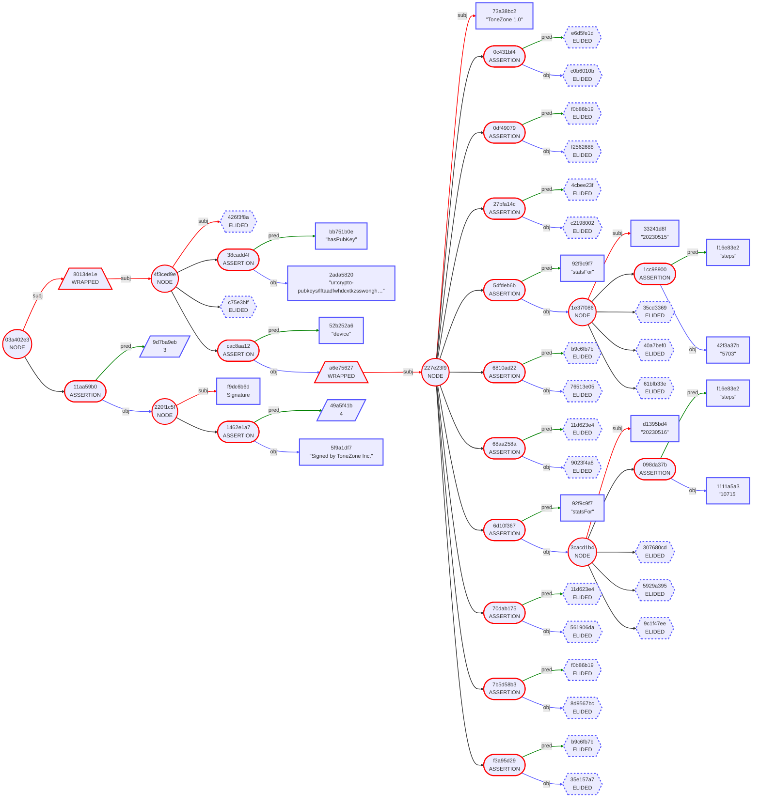

```mermaid
graph LR
    1(("03a402e3<br/>NODE"))
    2[/"80134e1e<br/>WRAPPED"\]
    3(("4f3ced9e<br/>NODE"))
    4{{"426f3f8a<br/>ELIDED"}}
    5(["38cadd4f<br/>ASSERTION"])
    6["bb751b0e<br/>#quot;hasPubKey#quot;"]
    7["2ada5820<br/>#quot;ur:crypto-pubkeys/lftaadfwhdcxtkzsswongh…#quot;"]
    8{{"c75e3bff<br/>ELIDED"}}
    9(["cac8aa12<br/>ASSERTION"])
    10["52b252a6<br/>#quot;device#quot;"]
    11[/"a6e75627<br/>WRAPPED"\]
    12(("227e23f9<br/>NODE"))
    13["73a38bc2<br/>#quot;ToneZone 1.0#quot;"]
    14(["0c431bf4<br/>ASSERTION"])
    15{{"e6d5fe1d<br/>ELIDED"}}
    16{{"c0b6010b<br/>ELIDED"}}
    17(["0df49079<br/>ASSERTION"])
    18{{"f0b86b19<br/>ELIDED"}}
    19{{"f2562688<br/>ELIDED"}}
    20(["27bfa14c<br/>ASSERTION"])
    21{{"4cbee23f<br/>ELIDED"}}
    22{{"c2198002<br/>ELIDED"}}
    23(["54fdeb6b<br/>ASSERTION"])
    24["92f9c9f7<br/>#quot;statsFor#quot;"]
    25(("1e37f086<br/>NODE"))
    26["33241d8f<br/>#quot;20230515#quot;"]
    27(["1cc98900<br/>ASSERTION"])
    28["f16e83e2<br/>#quot;steps#quot;"]
    29["42f3a37b<br/>#quot;5703#quot;"]
    30{{"35cd3369<br/>ELIDED"}}
    31{{"40a7bef0<br/>ELIDED"}}
    32{{"61bfb33e<br/>ELIDED"}}
    33(["6810ad22<br/>ASSERTION"])
    34{{"b9c6fb7b<br/>ELIDED"}}
    35{{"76513e05<br/>ELIDED"}}
    36(["68aa258a<br/>ASSERTION"])
    37{{"11d623e4<br/>ELIDED"}}
    38{{"9023f4a8<br/>ELIDED"}}
    39(["6d10f367<br/>ASSERTION"])
    40["92f9c9f7<br/>#quot;statsFor#quot;"]
    41(("3cacd1b4<br/>NODE"))
    42["d1395bd4<br/>#quot;20230516#quot;"]
    43(["098da37b<br/>ASSERTION"])
    44["f16e83e2<br/>#quot;steps#quot;"]
    45["1111a5a3<br/>#quot;10715#quot;"]
    46{{"307680cd<br/>ELIDED"}}
    47{{"5929a395<br/>ELIDED"}}
    48{{"9c1f47ee<br/>ELIDED"}}
    49(["70dab175<br/>ASSERTION"])
    50{{"11d623e4<br/>ELIDED"}}
    51{{"561906da<br/>ELIDED"}}
    52(["7b5d58b3<br/>ASSERTION"])
    53{{"f0b86b19<br/>ELIDED"}}
    54{{"8d9567bc<br/>ELIDED"}}
    55(["f3a95d29<br/>ASSERTION"])
    56{{"b9c6fb7b<br/>ELIDED"}}
    57{{"35e157a7<br/>ELIDED"}}
    58(["11aa59b0<br/>ASSERTION"])
    59[/"9d7ba9eb<br/>3"/]
    60(("220f1c5f<br/>NODE"))
    61["f9dc6b6d<br/>Signature"]
    62(["1462e1a7<br/>ASSERTION"])
    63[/"49a5f41b<br/>4"/]
    64["5f9a1df7<br/>#quot;Signed by ToneZone Inc.#quot;"]
    1 -->|subj| 2
    2 -->|subj| 3
    3 -->|subj| 4
    3 --> 5
    5 -->|pred| 6
    5 -->|obj| 7
    3 --> 8
    3 --> 9
    9 -->|pred| 10
    9 -->|obj| 11
    11 -->|subj| 12
    12 -->|subj| 13
    12 --> 14
    14 -->|pred| 15
    14 -->|obj| 16
    12 --> 17
    17 -->|pred| 18
    17 -->|obj| 19
    12 --> 20
    20 -->|pred| 21
    20 -->|obj| 22
    12 --> 23
    23 -->|pred| 24
    23 -->|obj| 25
    25 -->|subj| 26
    25 --> 27
    27 -->|pred| 28
    27 -->|obj| 29
    25 --> 30
    25 --> 31
    25 --> 32
    12 --> 33
    33 -->|pred| 34
    33 -->|obj| 35
    12 --> 36
    36 -->|pred| 37
    36 -->|obj| 38
    12 --> 39
    39 -->|pred| 40
    39 -->|obj| 41
    41 -->|subj| 42
    41 --> 43
    43 -->|pred| 44
    43 -->|obj| 45
    41 --> 46
    41 --> 47
    41 --> 48
    12 --> 49
    49 -->|pred| 50
    49 -->|obj| 51
    12 --> 52
    52 -->|pred| 53
    52 -->|obj| 54
    12 --> 55
    55 -->|pred| 56
    55 -->|obj| 57
    1 --> 58
    58 -->|pred| 59
    58 -->|obj| 60
    60 -->|subj| 61
    60 --> 62
    62 -->|pred| 63
    62 -->|obj| 64
    style 1 stroke:red,stroke-width:3.0px
    style 2 stroke:red,stroke-width:3.0px
    style 3 stroke:red,stroke-width:3.0px
    style 4 stroke:#55f,stroke-width:3.0px,stroke-dasharray:5.0 5.0
    style 5 stroke:red,stroke-width:3.0px
    style 6 stroke:#55f,stroke-width:3.0px
    style 7 stroke:#55f,stroke-width:3.0px
    style 8 stroke:#55f,stroke-width:3.0px,stroke-dasharray:5.0 5.0
    style 9 stroke:red,stroke-width:3.0px
    style 10 stroke:#55f,stroke-width:3.0px
    style 11 stroke:red,stroke-width:3.0px
    style 12 stroke:red,stroke-width:3.0px
    style 13 stroke:#55f,stroke-width:3.0px
    style 14 stroke:red,stroke-width:3.0px
    style 15 stroke:#55f,stroke-width:3.0px,stroke-dasharray:5.0 5.0
    style 16 stroke:#55f,stroke-width:3.0px,stroke-dasharray:5.0 5.0
    style 17 stroke:red,stroke-width:3.0px
    style 18 stroke:#55f,stroke-width:3.0px,stroke-dasharray:5.0 5.0
    style 19 stroke:#55f,stroke-width:3.0px,stroke-dasharray:5.0 5.0
    style 20 stroke:red,stroke-width:3.0px
    style 21 stroke:#55f,stroke-width:3.0px,stroke-dasharray:5.0 5.0
    style 22 stroke:#55f,stroke-width:3.0px,stroke-dasharray:5.0 5.0
    style 23 stroke:red,stroke-width:3.0px
    style 24 stroke:#55f,stroke-width:3.0px
    style 25 stroke:red,stroke-width:3.0px
    style 26 stroke:#55f,stroke-width:3.0px
    style 27 stroke:red,stroke-width:3.0px
    style 28 stroke:#55f,stroke-width:3.0px
    style 29 stroke:#55f,stroke-width:3.0px
    style 30 stroke:#55f,stroke-width:3.0px,stroke-dasharray:5.0 5.0
    style 31 stroke:#55f,stroke-width:3.0px,stroke-dasharray:5.0 5.0
    style 32 stroke:#55f,stroke-width:3.0px,stroke-dasharray:5.0 5.0
    style 33 stroke:red,stroke-width:3.0px
    style 34 stroke:#55f,stroke-width:3.0px,stroke-dasharray:5.0 5.0
    style 35 stroke:#55f,stroke-width:3.0px,stroke-dasharray:5.0 5.0
    style 36 stroke:red,stroke-width:3.0px
    style 37 stroke:#55f,stroke-width:3.0px,stroke-dasharray:5.0 5.0
    style 38 stroke:#55f,stroke-width:3.0px,stroke-dasharray:5.0 5.0
    style 39 stroke:red,stroke-width:3.0px
    style 40 stroke:#55f,stroke-width:3.0px
    style 41 stroke:red,stroke-width:3.0px
    style 42 stroke:#55f,stroke-width:3.0px
    style 43 stroke:red,stroke-width:3.0px
    style 44 stroke:#55f,stroke-width:3.0px
    style 45 stroke:#55f,stroke-width:3.0px
    style 46 stroke:#55f,stroke-width:3.0px,stroke-dasharray:5.0 5.0
    style 47 stroke:#55f,stroke-width:3.0px,stroke-dasharray:5.0 5.0
    style 48 stroke:#55f,stroke-width:3.0px,stroke-dasharray:5.0 5.0
    style 49 stroke:red,stroke-width:3.0px
    style 50 stroke:#55f,stroke-width:3.0px,stroke-dasharray:5.0 5.0
    style 51 stroke:#55f,stroke-width:3.0px,stroke-dasharray:5.0 5.0
    style 52 stroke:red,stroke-width:3.0px
    style 53 stroke:#55f,stroke-width:3.0px,stroke-dasharray:5.0 5.0
    style 54 stroke:#55f,stroke-width:3.0px,stroke-dasharray:5.0 5.0
    style 55 stroke:red,stroke-width:3.0px
    style 56 stroke:#55f,stroke-width:3.0px,stroke-dasharray:5.0 5.0
    style 57 stroke:#55f,stroke-width:3.0px,stroke-dasharray:5.0 5.0
    style 58 stroke:red,stroke-width:3.0px
    style 59 stroke:#55f,stroke-width:3.0px
    style 60 stroke:red,stroke-width:3.0px
    style 61 stroke:#55f,stroke-width:3.0px
    style 62 stroke:red,stroke-width:3.0px
    style 63 stroke:#55f,stroke-width:3.0px
    style 64 stroke:#55f,stroke-width:3.0px
    linkStyle 0 stroke:red,stroke-width:2.0px
    linkStyle 1 stroke:red,stroke-width:2.0px
    linkStyle 2 stroke:red,stroke-width:2.0px
    linkStyle 3 stroke-width:2.0px
    linkStyle 4 stroke:green,stroke-width:2.0px
    linkStyle 5 stroke:#55f,stroke-width:2.0px
    linkStyle 6 stroke-width:2.0px
    linkStyle 7 stroke-width:2.0px
    linkStyle 8 stroke:green,stroke-width:2.0px
    linkStyle 9 stroke:#55f,stroke-width:2.0px
    linkStyle 10 stroke:red,stroke-width:2.0px
    linkStyle 11 stroke:red,stroke-width:2.0px
    linkStyle 12 stroke-width:2.0px
    linkStyle 13 stroke:green,stroke-width:2.0px
    linkStyle 14 stroke:#55f,stroke-width:2.0px
    linkStyle 15 stroke-width:2.0px
    linkStyle 16 stroke:green,stroke-width:2.0px
    linkStyle 17 stroke:#55f,stroke-width:2.0px
    linkStyle 18 stroke-width:2.0px
    linkStyle 19 stroke:green,stroke-width:2.0px
    linkStyle 20 stroke:#55f,stroke-width:2.0px
    linkStyle 21 stroke-width:2.0px
    linkStyle 22 stroke:green,stroke-width:2.0px
    linkStyle 23 stroke:#55f,stroke-width:2.0px
    linkStyle 24 stroke:red,stroke-width:2.0px
    linkStyle 25 stroke-width:2.0px
    linkStyle 26 stroke:green,stroke-width:2.0px
    linkStyle 27 stroke:#55f,stroke-width:2.0px
    linkStyle 28 stroke-width:2.0px
    linkStyle 29 stroke-width:2.0px
    linkStyle 30 stroke-width:2.0px
    linkStyle 31 stroke-width:2.0px
    linkStyle 32 stroke:green,stroke-width:2.0px
    linkStyle 33 stroke:#55f,stroke-width:2.0px
    linkStyle 34 stroke-width:2.0px
    linkStyle 35 stroke:green,stroke-width:2.0px
    linkStyle 36 stroke:#55f,stroke-width:2.0px
    linkStyle 37 stroke-width:2.0px
    linkStyle 38 stroke:green,stroke-width:2.0px
    linkStyle 39 stroke:#55f,stroke-width:2.0px
    linkStyle 40 stroke:red,stroke-width:2.0px
    linkStyle 41 stroke-width:2.0px
    linkStyle 42 stroke:green,stroke-width:2.0px
    linkStyle 43 stroke:#55f,stroke-width:2.0px
    linkStyle 44 stroke-width:2.0px
    linkStyle 45 stroke-width:2.0px
    linkStyle 46 stroke-width:2.0px
    linkStyle 47 stroke-width:2.0px
    linkStyle 48 stroke:green,stroke-width:2.0px
    linkStyle 49 stroke:#55f,stroke-width:2.0px
    linkStyle 50 stroke-width:2.0px
    linkStyle 51 stroke:green,stroke-width:2.0px
    linkStyle 52 stroke:#55f,stroke-width:2.0px
    linkStyle 53 stroke-width:2.0px
    linkStyle 54 stroke:green,stroke-width:2.0px
    linkStyle 55 stroke:#55f,stroke-width:2.0px
    linkStyle 56 stroke-width:2.0px
    linkStyle 57 stroke:green,stroke-width:2.0px
    linkStyle 58 stroke:#55f,stroke-width:2.0px
    linkStyle 59 stroke:red,stroke-width:2.0px
    linkStyle 60 stroke-width:2.0px
    linkStyle 61 stroke:green,stroke-width:2.0px
    linkStyle 62 stroke:#55f,stroke-width:2.0px
```
