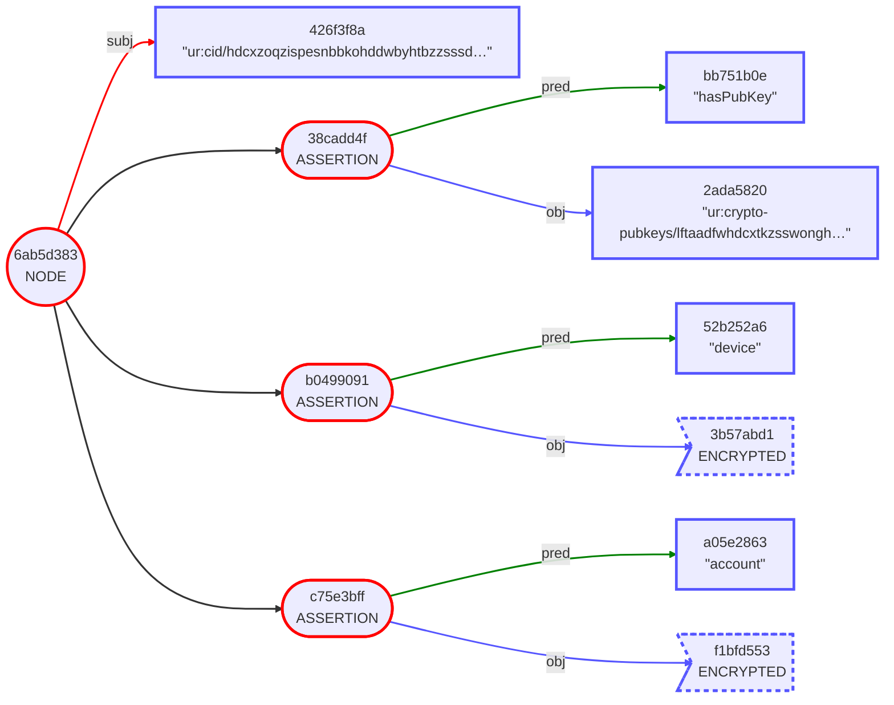
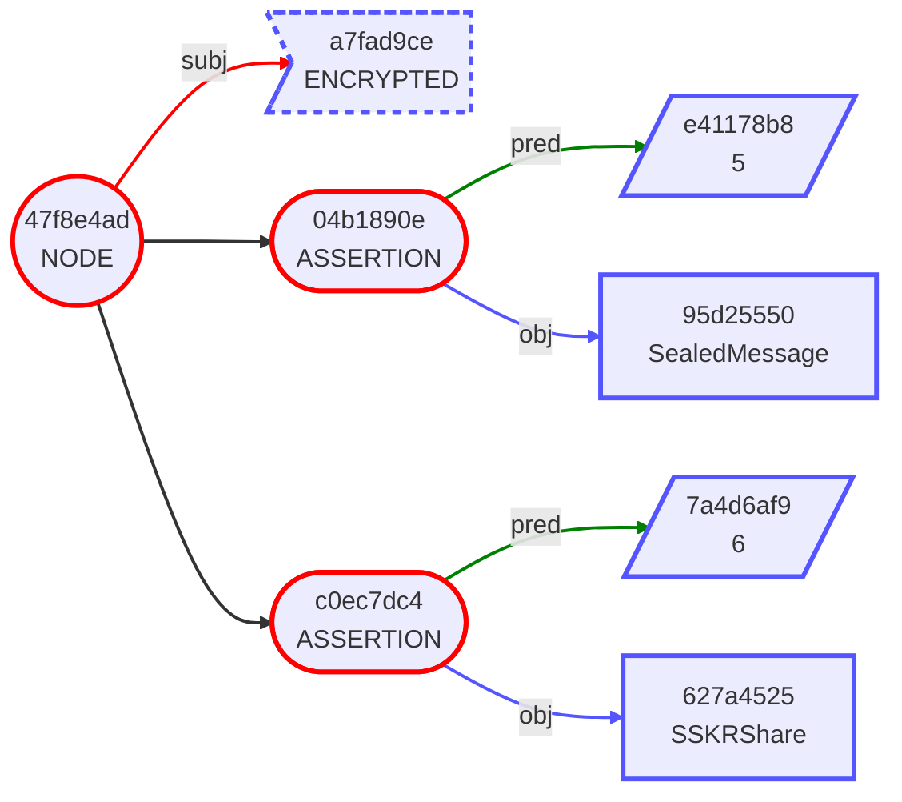
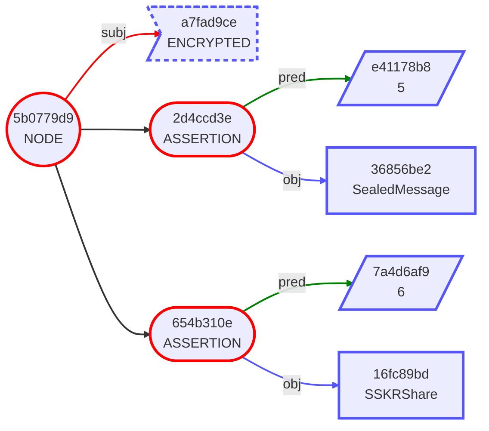
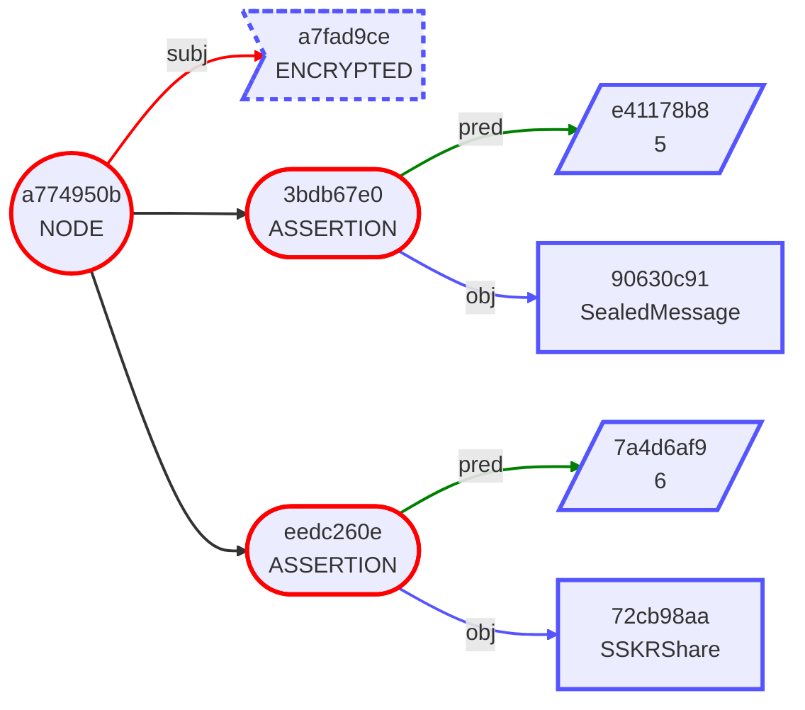

# Gordian Envelope Use Cases: Health Care

[intro]

## Health Care Use Case Table of Contents

[intro]

## Part One: Personal Sensor Data

This first set of use cases details engineer Nadia's work designing a
new wearable activity tracker, the ToneZone, which will focus on
keeping her data private.

### 1. Nadia Gets Fit (Metadata)

* **Use Case:** Nadia need a wearable activity tracker that can store her data.
* **Openness Benefits:** Nadia uses a self-describing format that ensures that her data will be readable in the far future.

Nadia has used wearable activity trackers for years, but she's slowly
become aware that she's playing with fire. She's storing away high
levels of very personal data about her health and her location, and
she has no assurance that any of the data is actually safe and
secure. As a result, Nadia decides to design her own data tracker, the
ToneZone. Its main priority will be securing data (and its secondary
priority will be sharing that data as its user sees fit, but that
issue is down the road a bit).

The first thing that Nadia has to do is to design her data
format. This is easy to do using Gordian Envelope, which allows for
the encoding of tiered data laid out as assertions.

While deciding how to lay out her info, Nadia has to think about not
just a simple-to-use structure, but also a structure that will allow
for the individual selection (and elision) of specific data. She
settles on the following:
```
"ur:cid/hdcxzoqzispesnbbkohddwbyhtbzzsssdldassamdeeofdtndsaazsjpdtnnvwfnatglbgbnehwe" [
    "account": {
        "00000001" [
            "birthdate": "19891109"
            "fullName": "Nadia Levedeva"
            "height": "65.1"
            "weight": "132.7"
        ]
    }
    "device": {
        "ToneZone 1.0-SN102313A" [
            "gpsInfoFor": "20230516" [
                "gpsQueue": "1684274400" [
                    "distance": "0"
                    "latitude": "2.122778"
                    "longitude": "41.380833"
                    "status": "0"
                ]
                "gpsQueue": "1684279978" [
                    "distance": "5230"
                    "latitude": "2.456944"
                    "length": "36000"
                    "longitude": "41.430278"
                    "status": "8"
                ]
            ]
            "heartInfoFor": "20230515" [
                "1684274400": "59"
                "1684274460": "60"
                "1684274520": "60"
                "1684274580": "59"
                "1684274640": "59"
            ]
            "heartInfoFor": "20230516" [
                "1684274400": "85"
                "1684274460": "87"
                "1684274520": "91"
                "1684274580": "90"
                "1684274640": "88"
            ]
            "statsFor": "20230515" [
                "floors": "3"
                "restingHeartRate": "55"
                "steps": "5703"
                "zoneMinutes": "0"
            ]
            "statsFor": "20230516" [
                "floors": "17"
                "restingHeartRate": "56"
                "steps": "10715"
                "zoneMinutes": "25"
            ]
            "stepInfoFor": "20230515" [
                "1684188000": "0"
                "1684188060": "0"
                "1684188120": "7"
                "1684188180": "2"
                "1684188240": "0"
            ]
            "stepInfoFor": "20230516" [
                "1684274400": "95"
                "1684274460": "99"
                "1684274520": "103"
                "1684274580": "103"
                "1684274640": "101"
            ]
            "tempInfoFor": "20230515" [
                "1684188000": "97"
                "1684188060": "97.1"
                "1684188120": "97.3"
                "1684188180": "97.2"
                "1684188240": "97.1"
            ]
            "tempInfoFor": "20230516" [
                "1684274400": "98.2"
                "1684274460": "98.2"
                "1684274520": "98.3"
                "1684274580": "98.2"
                "1684274640": "98.2"
            ]
        ]
    }
    "hasPubKey": "ur:crypto-pubkeys/lftaadfwhdcxtkzsswonghpdemptcpludkktialnnyzmadtldlbstabwwmecvtfghkckfztldemwtaaddmhdcxryptseesdrjpssbzwmoxwkvleyrnbgnszoatatqzglpaetdelfnbpyglaotlktcyfllubzeh"
]
```
[see the mermaid diagram](Healthcare-mermaid-1a.md)

This data structure includes not just device data from the tone zone,
but also personal account information that Nadia has entered, to help
provide context for her wearable data. 

Device data is divided out among several categories and also for
individual days. This will make it easy for Nadia in the future to
differentiate highly personal data (such as `gpsInfoFor` and
unfortunately `tempInfoFor`) and more general data (such as
`statsFor`) and also to do it on a granular, daily basis.  Obviously,
the actual ToneZone tracker will have _lots_ more data both total and
for each day. This is just a cut-down example intended to show some of
the functionality possible.

Notably, the entirely data structure is cleanly self-describing. The
Google Envelope assertions clearly denote each type of data, while
some data is additional stored as a [Uniform Resource
(UR)](https://github.com/BlockchainCommons/crypto-commons/blob/master/Docs/ur-1-overview.md),
which is also self-describing and built atop
[dCBOR](https://github.com/BlockchainCommons/crypto-commons/blob/master/dcbor.md),
yet another self-describing format.

Basically, it's self-describing all the way down, ensuring the data's
openness, which will be vital when Nadia goes beyond the protection she builds into the ToneZone to allow some sharing of data (in Part Two).

### 2. Nadia Protects Her Privacy (Encryption)

* **Use Case:** Nadia wants to make sure that her tracker data isn't
easily accessible by unauthorized parties.**
* **Privacy Benefits:** Encryption ensures that the data is closely protected on a few devices.

Of course, just formatting the data in a open manner isn't enough. For
Nadia's ToneZone to fulfill its core goal, the data has to be
protected.

This is simple with Gordian Envelope. All Nadia has to do is to
encrypt her wrapped envelopes for her device data and her account
info. Then, the data can only be encrypted or decrypted with her
symmetric key, which Nadia plans to store both in the ToneZone device
and on its mobile app, but nowhere else.

```
ur:cid/hdcxzoqzispesnbbkohddwbyhtbzzsssdldassamdeeofdtndsaazsjpdtnnvwfnatglbgbnehwe" [
    "account": ENCRYPTED
    "device": ENCRYPTED
    "hasPubKey": "ur:crypto-pubkeys/lftaadfwhdcxtkzsswonghpdemptcpludkktialnnyzmadtldlbstabwwmecvtfghkckfztldemwtaaddmhdcxryptseesdrjpssbzwmoxwkvleyrnbgnszoatatqzglpaetdelfnbpyglaotlktcyfllubzeh"
]
```



Note by comparing with the [unencrypted mermaid diagram]([see the
mermaid diagram](Healthcare-mermaid-1a.md) that the checksums for the
encrypted data remains consistent. The device assertion is still
`b0499091`, the device assertion is still `c75e3bff` and the master
checksum is still `6ab5d383`. This is a crucial technique within
Gordian, because it ensures that data can still be validated even when
encrypted or elided.

Thus the first goal of Nadia's new tracker, ensuring privacy, is fulfilled!

### 3. Nadia Protects Her Key (SSKR)

* **Use Case:** Nadia needs to ensure that her private key isn't a
single point of failure for her data!
* **Openness Benefits:** Using an open-sharding system, Nadia ensures
that her key can be recovered easily.
* **Resilience Benefits:** SSKR allows Nadia to remove her SPOF while
keeping her key secure.

Though it's great that Nadia can protect her personal data with a key
that she holds, it can also be a Single Point of Failure (SPOF). If
she loses her key, she loses her data.

Fortunately, the solution is easy with Gordian Envelope: create an
envelope with the symmetric key, then lock that envelope with a
multipermit so that it can either be recovered by Nadia using her
private key or by putting together any two shares. She's now created a
robust storage mechanism for her key that could be improved any
further by a system such as
[CSR](https://github.com/BlockchainCommons/Gordian/blob/master/CSR/README.md)
that could be used to automate authentication and reconstruction.

Here's the original envelope:
```
"ur:crypto-key/hdcxvaftbypkwlstdsaabefgnbsfmnclctlohdhnplimdphyqdpakibejyemkofmyabtghftntfr"
```

Here's what it looks like after it's been encrypted with her public
key and sharded:
```
ENCRYPTED [
    hasRecipient: SealedMessage
    sskrShare: SSKRShare
]

ENCRYPTED [
    hasRecipient: SealedMessage
    sskrShare: SSKRShare
]

ENCRYPTED [
    hasRecipient: SealedMessage
    sskrShare: SSKRShare
]

```

The `hasRecipient:` allows Nadia to recover from any of the three
shares using her private key. The `sskrShare:` allows anyone to
combine any two shares to recover the envelope.







Nadia now has a fully functional store for her ToneZone that is
_independent_, _private_, _resilient_, and _open_, fulfilling the
[Gordian
Principles](https://github.com/BlockchainCommons/Gordian#gordian-principles). She's
ready to move on to the next step, using this setup to share her data
in meaningful ways.

## Part Two: Personal Shared Sensor Data

[Nadia has protected her data, but now she also wants to share her
data selectively, as she choses.]

### 4. Nadia Hearts Her Doctor (Elision)

* **Use Case:** Nadia wants to share a selection of her data with her doctor.
* **Independence Benefits:** Nadia can choose exactly what data to send.
* **Privacy Benefits:** Nadia can cut out data that she doesn't want to share.
* **Openness Benefits:** The self-describing format means that the doctor's app can easily unspool Nadia's data.

Ideally, Nadia would like to share all of her data with her doctor, to
maximize the efficacy of her care. Unfortunately, some of the data is
very private. For example, her doctor just doesn't need to know her
geo data.

Moreso, in the currently oppressive environment in parts of the United
States, some of her data could be personally dangerous if released,
such as her temperature data, which could provide insights into her
reproductive cycle and thus be weaponized by states that are
restricting womens' rights. Though she trusts her doctor, she doesn't
trust the state not to subpoena data of that sort.

Fortunately, Gordian Envelope allows her as the holder to elide her
data as she sees fit. She starts with her unencrypted envelope and
cuts it down as appropriate (something that's easy to do with the UI
that Nadia designed for her ToneZone software).

The elided data Nadia hands her doctor looks like this:
```
ELIDED [
    "account": {
        "00000001" [
            "birthdate": "19891109"
            "fullName": "Nadia Levedeva"
            "height": "65.1"
            "weight": "132.7"
        ]
    }
    "device": {
        "ToneZone 1.0-SN102313A" [
            "heartInfoFor": "20230515" [
                "1684274400": "59"
                "1684274460": "60"
                "1684274520": "60"
                "1684274580": "59"
                "1684274640": "59"
            ]
            "heartInfoFor": "20230516" [
                "1684274400": "85"
                "1684274460": "87"
                "1684274520": "91"
                "1684274580": "90"
                "1684274640": "88"
            ]
            "statsFor": "20230515" [
                "floors": "3"
                "restingHeartRate": "55"
                "steps": "5703"
                "zoneMinutes": "0"
            ]
            "statsFor": "20230516" [
                "floors": "17"
                "restingHeartRate": "56"
                "steps": "10715"
                "zoneMinutes": "25"
            ]
            "stepInfoFor": "20230515" [
                "1684188000": "0"
                "1684188060": "0"
                "1684188120": "7"
                "1684188180": "2"
                "1684188240": "0"
            ]
            "stepInfoFor": "20230516" [
                "1684274400": "95"
                "1684274460": "99"
                "1684274520": "103"
                "1684274580": "103"
                "1684274640": "101"
            ]
            ELIDED: ELIDED
            ELIDED: ELIDED
            ELIDED: ELIDED
        ]
    }
    "hasPubKey": "ur:crypto-pubkeys/lftaadfwhdcxtkzsswonghpdemptcpludkktialnnyzmadtldlbstabwwmecvtfghkckfztldemwtaaddmhdcxryptseesdrjpssbzwmoxwkvleyrnbgnszoatatqzglpaetdelfnbpyglaotlktcyfllubzeh"
]
```
[see the mermaid diagram](Healthcare-mermaid-1b.md)

She can see heart rates and how that relates to exercise, but she
doesn't have unneccessary or potentially dangerous data. Nadia's goal of being able to share data in an independent, personal way is thus met.

### 5. Nadia is a Bit Remote (Multi-Permit)

* **Use Case:** Because of irregularities in her heart rate, Nadia wants to regularly share her data with a third-party health monitoring agency.
* **Privacy Benefits:** By creating multi-permits, Nadia can decide exactly what third-parties have access to her data.
* **Openness Benefits:** Like the doctor, the health monitoring agency can read the data because of its self-describing format.

Unfortunately, Nadia's ToneZone data helps to alert her doctor to a
potential heart condition, an arrhythmia, which is verified with
additional testing.

Nadia has been forming partnerships with health monitoring services
for situations exactly like this: they'll engage in automted
monitoring of a client's health data, to watch for dangerous events,
such as afib or a heart attack. Now Nadia takes advantage of the
service herself.


[heart condition, keeps someone remote up to date using SSKR]

* Streaming to caretaker, monitor kids, elderly parents

### 6. Nadia Steps Up (Signature)

* **Use Case:** Nadia wants to submit validated step data to a stepping contest.
* **Privacy Benefits:** Multiple signatures assure everyone that the data is valid.
* **Openness Benefits:** This is another example of how self-describing data can open many doors.

[step contest; signed by Nadia and signed by ToneZone.]]

## Part Two: Community Shared Sensor Data

[Nadia has protected her data, but now she also wants to share her
data selectively, as she choses.]

### 7. Nadia Gets Clinical (Proof of Inclusion)

* **Use Case:** Nadia wants to submit data to a clinical try, and to later prove that she did.
* **Privacy Benefits:** Nadia only reveals that her data is part of the clinical try when she chooses to do so.
* **Openness Benefits:** Clinical trials are one of the most important communities that can benefit from open data.

[reveal data with hashed public key, and then later reveal public key in a message signed by private key]

* Proof of Provenance [competitions, but also clinical trial!, make sure data isn't contaminated, especially when grant money is involved]

* WANT TO OFFER TRIALS
   * With simplified admin (just ring/fitbit/tonezone)
   * With simplified HIPAA requirements
   * It's an economic approach.

* ANOTHER USER CASE:
   * Having collected data be shared to a third-party without App seeing it
   * Sensitive Clinical Trial
   * Other Sensitive Partnerships
   * App Company might still want some of data, might not all, complete data set
   * Multiple Keys, one generated with third-party on initial signup
   * But App Maker is still the one that can do easy collection.

### 8. Nadia Becomes a Demographic (Anonymization)

* **Use Case:** Nadia's data is further anonymized so that it can be part of large-scale demographics, but it still needs to retain its proof of provenance.
* **Privacy Benefits:** Nadia's data becomes even more anonymous.

* Aggregated Demographic Data [is what demographic trials use], thus herd privacy — need to demonstrate appropriate demographic spread without compromising information, may need to correlate data points with demographics with compromising individual's privacy
* Double-Blind Data Collection for Clinical Trials [no leakage of data between data acquiring & adminstering]

* Differential Data Set
   * "Blur" Data +/-5 or whatever
   * With some proofs back to original
   * DATA BRANCH


### 9. Nadia Goes Viral (Herd Privacy)

* **Use Case:** Nadia wants to Support the Public Health of COVID Contact Tracing without Revealing Her Location.
* **Privacy Benefits:** Nadia's location is never revealed.
* **Openness Benefits:** A large, discrete public-health system is able to share in data.

[Nadia's redacted location is uploaded; a private key can let her update it with a flag if she has COVID; a one-time contact lets her know if someone else does.]

Additional Examples:
* Health Insurance

Privacy Concerns:
* Data is SAFE and SOUND and NOT USED TO INCRIMINATING USERS
* Eliding info
* or Differentely Encrypting info so that only some of it
* SO WANT TO PEOPLE ABLE TO COLLECTING SOME ACTIVITY DATA FOR COACHING.
   * But some is removed or elided or opt-in from user.
   * So swap out Doctor for this?
* WANT TO OFFER TRIALS
   * With simplified admin (just ring/fitbit/tonezone)
   * With simplified HIPAA requirements
   * It's an economic approach.
* There may also be linked/non-sensor data
   * Such as age
   * That is attested to
