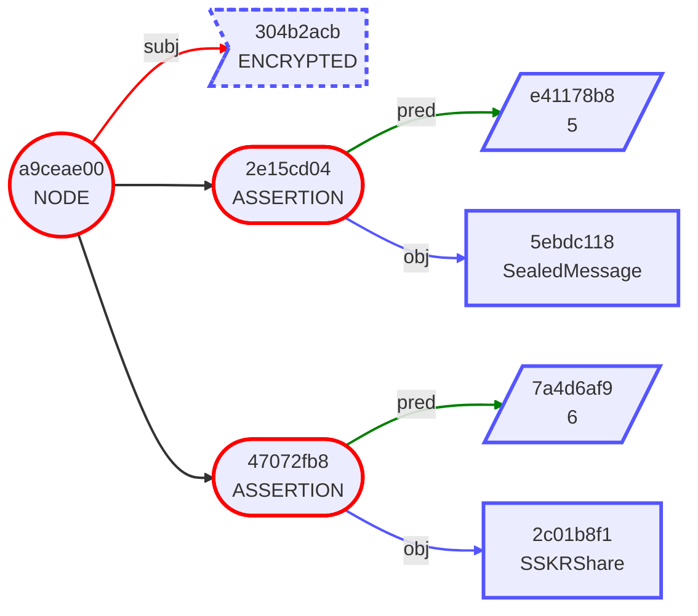
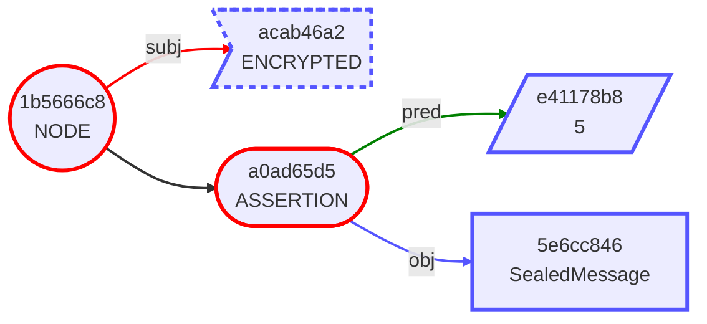

# Gordian Envelope Use Cases: Wellness

The Wellness industry includes fitness, sleep and activity,
preventative care, and ultimately healthcare. It's an industry that
generates highly private information that can be used to the owner's
advantage when shared with wellness professionals, but which also can
(and has) been used to its owner's disadvantage in multiple
situations.

Thus, the need for privacy-protecting data formats such as Gordian
Envelope. This allows a holder of wellness information to elide and
encrypt that data, so that only the minimal necessary information goes
out, and only to the appropriate people. The ability to create
multipermits for different people can also be highly useful in the
complex wellness environment.

Ultimately, Wellness software can use Gordian Envelopes to:

* Ensure data is safe.
* Prevent data from being used to incriminate users.
* Transfer different subsets of data to different people.
* Encrypt different data for different people.
* Anonymize data for clinical trials and other public health initiatives.
* In doing so, also simplify HIPAA requirements.

## Health Care Use Case Table of Contents

The following set of use cases demonstrates how to use Gordian
Emvelope to store and share wellness data. Individual cases are
presented progressively: each use case within a section builds on the
previous onne by demonstrating a new capability. All use cases refer
to Nadia, an activity tracker user. The first set describes how the
tracker can protect data; the second set describes how it can allow
Nadia to share that data with individuals in her wellness team; and
the third set describes how she can also share that data to support
public health. A final use case discusses some of the special
challenges that rose up concerning contact tracing during the COVID
pandemic.

Gordian Envelopes are useful for wellness because of their precise
ability to elide and encrypt information, allowing for crucial data
minimization when sharing some of the most personal data that a person
can possess.

* [Part One: Personal Sensor Data](Wellness.md#part-one-personal-sensor-data)
   * #1: [Nadia Gets Fit (Metadata)](Wellness.md#1-nadia-gets-fit-metadata)
   * #2: [Nadia Protects Her Privacy (Encryption)](Wellness.md#2-nadia-protects-her-privacy-encryption)
   * #3: [Nadia Protects Her Key (SSKR)](Wellness.md#3-nadia-protects-her-key-sskr)
* [Part Two: Personal Shared Sensor Data](Wellness.md#part-two-personal-shared-sensor-data)
   * #4: [Nadia Hearts Her Doctor (Elision)](Wellness.md#4-nadia-hearts-her-doctor-elision)
   * #5: [Nadia is a Bit Remote (Multi-Permit)](Wellness.md#5-nadia-is-a-bit-remote-multi-permit)
   * #6: [Nadia Steps Up (Signature)](Wellness.md#6-nadia-steps-up-signature)
   * #7: [Nadia Foils Fusion (Salting)](Wellness.md#7-nadia-foils-fusion-salting)
* [Part Three: Clinically Shared Sensor Data](Wellness.md#part-three-clinically-shared-sensor-data)
   * #8: [Nadia Gets Clinical (Elision, Third-Party Encryption)](Wellness.md#8-nadia-gets-clinical-elision-third-party-encryption)
   * #9: [Nadia Proves Her Worth (Proof of Inclusion)](Wellness.md#9-nadia-proves-her-worth-proof-of-inclusion)
   * #10: [Nadia Becomes a Number (Anonymization, Provenance)](Wellness.md#10-nadia-becomes-a-number-anonymization-provenance)
* [Part Four: The COVID-19 Appendix](Wellness.md#part-four-the-covid-19-appendix)
   * #11: [Nadia Goes Viral (Herd Privacy)](Wellness.md#11-nadia-goes-viral-herd-privacy)
   
## Part One: Personal Sensor Data

This first set of use cases describes the data format of Nadia's new
wearable activity tracker, the ToneZone, which is focused on keeping
her data private.

### 1. Nadia Gets Fit (Metadata)

* **Use Case:** Nadia need a wearable activity tracker that can store her data.
* **Openness Benefits:** ToneZone uses a self-describing format that ensures that Nadia's data will be readable in the far future.

Nadia has used wearable activity trackers for years, but she's slowly
become aware that she's playing with fire. She's storing away high
levels of very personal data about her health and her location, and
she has no assurance that any of the data is actually safe and
secure. As a result, Nadia decides to purchase a new privacy-focused
activity tracker, the ToneZone. Its main priority is securing data
(with a secondary priority of sharing that data as its user sees fit,
but that issue is down the road a bit).

The ToneZone's data format is designed using Gordian Envelope, which
allows for the encoding of tiered data laid out as assertions. The
format was laid out not just as a simple-to-use structure, but also a
structure that allows for the individual selection (and elision) of
specific data:

```
"ur:cid/hdcxzoqzispesnbbkohddwbyhtbzzsssdldassamdeeofdtndsaazsjpdtnnvwfnatglbgbnehwe" [
    "account": {
        "00000001" [
            "birthdate": "19891109"
            "fullName": "Nadia Levedeva"
            "height": "65.1"
            "weight": "132.7"
        ]
    }
    "device": {
        "ToneZone 1.0" [
            "gpsInfoFor": "20230516" [
                "gpsQueue": "1684274400" [
                    "distance": "0"
                    "latitude": "2.122778"
                    "longitude": "41.380833"
                    "status": "0"
                ]
                "gpsQueue": "1684279978" [
                    "distance": "5230"
                    "latitude": "2.456944"
                    "length": "36000"
                    "longitude": "41.430278"
                    "status": "8"
                ]
            ]
            "heartInfoFor": "20230515" [
                "1684274400": "59"
                "1684274460": "60"
                "1684274520": "60"
                "1684274580": "59"
                "1684274640": "59"
            ]
            "heartInfoFor": "20230516" [
                "1684274400": "85"
                "1684274460": "87"
                "1684274520": "91"
                "1684274580": "90"
                "1684274640": "88"
            ]
            "serialNumber": "SN102313A"
            "statsFor": "20230515" [
                "floors": "3"
                "restingHeartRate": "55"
                "steps": "5703"
                "zoneMinutes": "0"
            ]
            "statsFor": "20230516" [
                "floors": "17"
                "restingHeartRate": "56"
                "steps": "10715"
                "zoneMinutes": "25"
            ]
            "stepInfoFor": "20230515" [
                "1684188000": "0"
                "1684188060": "0"
                "1684188120": "7"
                "1684188180": "2"
                "1684188240": "0"
            ]
            "stepInfoFor": "20230516" [
                "1684274400": "95"
                "1684274460": "99"
                "1684274520": "103"
                "1684274580": "103"
                "1684274640": "101"
            ]
            "tempInfoFor": "20230515" [
                "1684188000": "97"
                "1684188060": "97.1"
                "1684188120": "97.3"
                "1684188180": "97.2"
                "1684188240": "97.1"
            ]
            "tempInfoFor": "20230516" [
                "1684274400": "98.2"
                "1684274460": "98.2"
                "1684274520": "98.3"
                "1684274580": "98.2"
                "1684274640": "98.2"
            ]
        ]
    }
    "hasPubKey": "ur:crypto-pubkeys/lftaadfwhdcxtkzsswonghpdemptcpludkktialnnyzmadtldlbstabwwmecvtfghkckfztldemwtaaddmhdcxryptseesdrjpssbzwmoxwkvleyrnbgnszoatatqzglpaetdelfnbpyglaotlktcyfllubzeh"
]
```
See the [mermaid output](Welnness-mermaid-1a.md).

This data structure includes not just device data from the ToneZone,
but also personal account information that Nadia entered when she set
up her ToneZone account, providing context for her wearable data.

The device data is divided among several categories and also for
individual days. This will make it easy for Nadia in the future to
differentiate highly personal data (such as `gpsInfoFor` and
unfortunately `tempInfoFor`) and more general data (such as
`statsFor`) and also to do it on a granular, daily basis.  Obviously,
the actual ToneZone tracker will have _lots_ more data both total and
for each day. This is just a cut-down example intended to show some of
the functionality possible.

Notably, the entire data structure is cleanly self-describing. The
Gordian Envelope assertions clearly denote each type of data, while
some data is additionally stored as a [Uniform Resource
(UR)](https://github.com/BlockchainCommons/crypto-commons/blob/master/Docs/ur-1-overview.md),
which is also self-describing and built atop
[dCBOR](https://github.com/BlockchainCommons/crypto-commons/blob/master/dcbor.md),
yet another self-describing format.  Basically, it's self-describing
all the way down, ensuring the data's openness, which will be vital
when Nadia goes beyond the protection built into the ToneZone to allow
some sharing of data (in Parts Two, Three, and Four).

### 2. Nadia Protects Her Privacy (Encryption)

* **Use Case:** Nadia wants to tracker data that isn't
easily accessible by unauthorized parties.**
* **Privacy Benefits:** Encryption ensures that the ToneZone data is closely protected on a few devices.

Of course, just formatting the data in a open manner isn't enough. For
Nadia's ToneZone to fulfill its core goal, the data has to be
protected.

This is simple with Gordian Envelope. The ToneZone creates "wrapped
envelopes" that encrypt Nadia's device data and account info. That
data can only be decrypted with Nadia's symmetric key, which is only
stored on the ToneZone device and on its mobile app -- nowhere else.

```
"ur:cid/hdcxzoqzispesnbbkohddwbyhtbzzsssdldassamdeeofdtndsaazsjpdtnnvwfnatglbgbnehwe" [
    "account": ENCRYPTED
    "device": ENCRYPTED
    "hasPubKey": "ur:crypto-pubkeys/lftaadfwhdcxtkzsswonghpdemptcpludkktialnnyzmadtldlbstabwwmecvtfghkckfztldemwtaaddmhdcxryptseesdrjpssbzwmoxwkvleyrnbgnszoatatqzglpaetdelfnbpyglaotlktcyfllubzeh"
]
```


Note by comparing with the [unencrypted mermaid
diagram](Healthcare-mermaid-1a.md) that the checksums for the
encrypted data remains consistent. The account assertion is still
`c75e3bff`, the device assertion is still `cac8aa12` and the master
checksum is still `4f3ced9e`. This is a crucial technique within
Gordian, because it ensures that if data is signed, it can still be
validated even when encrypted or elided.

Thus the first goal of Nadia's new tracker, ensuring privacy, is fulfilled!

### 3. Nadia Protects Her Key (SSKR)

* **Use Case:** Nadia needs to ensure that her private key isn't a
Single Point of Failure (SPOF) for her data!
* **Openness Benefits:** Using an open-sharding system, Nadia's
key can be recovered easily.
* **Resilience Benefits:** SSKR allows Nadia to remove her SPOF while
keeping her key secure.

Though it's great that Nadia can protect her personal data with a key
that she holds, it can also be a Single Point of Failure (SPOF). If
she loses her key, she loses her data.

Fortunately, the solution is easy with Gordian Envelope: create an
envelope with the symmetric key, then lock that envelope with a
multipermit so that it can either be recovered by Nadia using her
private key or by putting together any two shares. The ToneZone uses
this technique to create robust storage mechanism for Nadia's key that
could be improved any further by a system such as
[CSR](https://github.com/BlockchainCommons/Gordian/blob/master/CSR/README.md),
which could automate authentication and reconstruction.

Here's the original envelope for the symmetric key::
```
"ur:crypto-key/hdcxvaftbypkwlstdsaabefgnbsfmnclctlohdhnplimdphyqdpakibejyemkofmyabtghftntfr"
```

Here's what it looks like after it's been encrypted with Nadia's public
key and sharded:
```
ENCRYPTED [
    hasRecipient: SealedMessage
    sskrShare: SSKRShare
]

ENCRYPTED [
    hasRecipient: SealedMessage
    sskrShare: SSKRShare
]

ENCRYPTED [
    hasRecipient: SealedMessage
    sskrShare: SSKRShare
]

```

We'll return to the topic of a multipermit in the future, but
essentially it enables an Envelope to be opened in multiple ways.
Here, the `hasRecipient:` allows Nadia to recover from any of the
three shares using her private key, while the `sskrShare:` allows
anyone to combine any two shares to recover the envelope.




Nadia's ToneZone now has a data store that is _independent_,
_private_, _resilient_, and _open_, fulfilling the [Gordian
Principles](https://github.com/BlockchainCommons/Gordian#gordian-principles). But
the ToneZone does more than that: it also allows Nadia to share her
data in meaningful ways.

## Part Two: Personal Shared Sensor Data

This second set of use cases describes how Nadia can leverage the data
within her activity tracker in selective ways, to improve her personal
wellness without giving away too much info.


### 4. Nadia Hearts Her Doctor (Elision)

* **Use Case:** Nadia wants to share a selection of her data with her doctor.
* **Independence Benefits:** Nadia can choose exactly what data to send.
* **Privacy Benefits:** Nadia can cut out data that she doesn't want to share.
* **Openness Benefits:** The self-describing format means that the doctor's app can easily unspool Nadia's data.

Ideally, Nadia would like to share all of her data with her doctor, to
maximize the efficacy of her care. Unfortunately, some of the data is
very private. For example, her doctor just doesn't need to know her
geo data.

Moreso, in the currently oppressive environment in parts of the United
States, some of her data could be personally dangerous if released,
such as her temperature data, which could provide insights into her
reproductive cycle and thus be weaponized by states that are
restricting womens' rights. Though she trusts her doctor, Nadia
doesn't trust the state not to subpoena data of that sort.

Fortunately, Gordian Envelope allows Nadia as the holder to elide her
data as she sees fit. She starts with her unencrypted Envelope and
cuts it down as appropriate (something that's easy to do with the
handy UI built into the ToneZone software).

The elided data Nadia hands her doctor looks like this:
```
ELIDED [
    "account": {
        "00000001" [
            "birthdate": "19891109"
            "fullName": "Nadia Levedeva"
            "height": "65.1"
            "weight": "132.7"
        ]
    }
    "device": {
        "ToneZone 1.0" [
            "heartInfoFor": "20230515" [
                "1684274400": "59"
                "1684274460": "60"
                "1684274520": "60"
                "1684274580": "59"
                "1684274640": "59"
            ]
            "heartInfoFor": "20230516" [
                "1684274400": "85"
                "1684274460": "87"
                "1684274520": "91"
                "1684274580": "90"
                "1684274640": "88"
            ]
            "statsFor": "20230515" [
                "floors": "3"
                "restingHeartRate": "55"
                "steps": "5703"
                "zoneMinutes": "0"
            ]
            "statsFor": "20230516" [
                "floors": "17"
                "restingHeartRate": "56"
                "steps": "10715"
                "zoneMinutes": "25"
            ]
            "stepInfoFor": "20230515" [
                "1684188000": "0"
                "1684188060": "0"
                "1684188120": "7"
                "1684188180": "2"
                "1684188240": "0"
            ]
            "stepInfoFor": "20230516" [
                "1684274400": "95"
                "1684274460": "99"
                "1684274520": "103"
                "1684274580": "103"
                "1684274640": "101"
            ]
            ELIDED: ELIDED
            ELIDED: ELIDED
            ELIDED: ELIDED
            ELIDED: ELIDED
        ]
    }
    "hasPubKey": "ur:crypto-pubkeys/lftaadfwhdcxtkzsswonghpdemptcpludkktialnnyzmadtldlbstabwwmecvtfghkckfztldemwtaaddmhdcxryptseesdrjpssbzwmoxwkvleyrnbgnszoatatqzglpaetdelfnbpyglaotlktcyfllubzeh"
]
```
See the [mermaid output](Wellness-mermaid-1b.md).

Nadia's doctor can see heart rates and how they relate to exercise,
but she doesn't have unneccessary or potentially dangerous
data. Nadia's goal of being able to share data in an independent,
personal way is thus met.

### 5. Nadia is a Bit Remote (Multi-Permit)

* **Use Case:** Because of irregularities in her heart rate, Nadia wants to regularly share her data with a third-party health monitoring agency.
* **Privacy Benefits:** By creating multi-permits for her ToneZone data, Nadia can decide exactly what third-parties have access to her data.
* **Openness Benefits:** Like the doctor, the health monitoring agency can read the data because of its self-describing format.

Unfortunately, Nadia's ToneZone data helps to alert her doctor to a
potential heart condition, an arrhythmia, which is verified with
additional testing.

ToneZone has formed partnerships with health monitoring services for
situations exactly like this: they automatically monitor theira
clients' wellness data, to watch for dangerous events, such as afib or
a heart attack. Nadia decides to take advantage of this service.

Nadia transfers data to the service using the same technique as
casually mentioned in the SSKR example above: she generates a
multipermit. This is a method by which she can encrypt the same data
with multiple keys.

This is a two-step process. First, Nadia decides what data to encrypt
for privacy, then she decides what data should also be locked with the
account service's public key. Though Nadia keeps her account info
entirely private (with a single-key permit), she gives the monitoring
service access to her device data (with a multipermit that can be
unlocked with her encryption key or the service's private key).

```     	     
"ur:cid/hdcxzoqzispesnbbkohddwbyhtbzzsssdldassamdeeofdtndsaazsjpdtnnvwfnatglbgbnehwe" [
    "account": ENCRYPTED
    "device": ENCRYPTED [
        hasRecipient: SealedMessage
    ]
    "hasPubKey": "ur:crypto-pubkeys/lftaadfwhdcxtkzsswonghpdemptcpludkktialnnyzmadtldlbstabwwmecvtfghkckfztldemwtaaddmhdcxryptseesdrjpssbzwmoxwkvleyrnbgnszoatatqzglpaetdelfnbpyglaotlktcyfllubzeh"
]
```


Now Nadia's data can be safely transmitted to her monitoring service,
but they can only access the exact data she allows.  Meanwhile, Nadia
also retains access to the data herself.

Note that this _does_ change the hash, unlike simple encryption,
because a new assertion has been added (the `hasRecipient` sealed
message).

A similar technique could be used to allow parents to monitor their
children or to help their elderly parents, with encrypted data being
regularly streamed to an appropriate monitoring app.

### 6. Nadia Steps Up (Signature)

* **Use Case:** Nadia wants to submit validated step data to a stepping contest.
* **Privacy Benefits:** Multiple signatures assure everyone that the data is valid.
* **Openness Benefits:** This is another example of how self-describing data can open many doors.

Nadia is told to step up her steps for heart health, so she's now
working hard to get 10,000 steps a day. To encourage herself, she
enters a step contest. Her ToneZone will submit elided daily counts of
her steps, but the data must be validated since there are real prizes
in the contest! Fortunately, ToneZone has its own private key. Data
can be signed by it and submitted.

The data is heavily elided for this usage, something again
automatically managed by the ToneZone UI:
```
ELIDED [
    "device": {
        "ToneZone 1.0" [
            "statsFor": "20230515" [
                "steps": "5703"
                ELIDED (3)
            ]
            "statsFor": "20230516" [
                "steps": "10715"
                ELIDED (3)
            ]
            ELIDED: ELIDED
            ELIDED: ELIDED
            ELIDED: ELIDED
            ELIDED: ELIDED
            ELIDED: ELIDED
            ELIDED: ELIDED
            ELIDED: ELIDED
            ELIDED: ELIDED
        ]
    }
    "hasPubKey": "ur:crypto-pubkeys/lftaadfwhdcxtkzsswonghpdemptcpludkktialnnyzmadtldlbstabwwmecvtfghkckfztldemwtaaddmhdcxryptseesdrjpssbzwmoxwkvleyrnbgnszoatatqzglpaetdelfnbpyglaotlktcyfllubzeh"
n    ELIDED
]
```
The document must then be wrapped (so that the signature will apply to
the entire Envelope) and signed.

The result looks like this:
```
{
    ELIDED [
        "device": {
            "ToneZone 1.0" [
                "statsFor": "20230515" [
                    "steps": "5703"
                    ELIDED (3)
                ]
                "statsFor": "20230516" [
                    "steps": "10715"
                    ELIDED (3)
                ]
                ELIDED: ELIDED
                ELIDED: ELIDED
                ELIDED: ELIDED
                ELIDED: ELIDED
                ELIDED: ELIDED
                ELIDED: ELIDED
                ELIDED: ELIDED
                ELIDED: ELIDED
            ]
        }
        "hasPubKey": "ur:crypto-pubkeys/lftaadfwhdcxtkzsswonghpdemptcpludkktialnnyzmadtldlbstabwwmecvtfghkckfztldemwtaaddmhdcxryptseesdrjpssbzwmoxwkvleyrnbgnszoatatqzglpaetdelfnbpyglaotlktcyfllubzeh"
        ELIDED
    ]
} [
    verifiedBy: Signature [
        note: "Signed by ToneZone Inc."
    ]
]
```
See the [mermaid output](Wellness-mermaid-1c.md).

The stepping contest can now verify the signature against ToneZone's
public key, and know that the data that Nadia submitted is valid. They
could also ask Nadia to prove who she is by signing something using
the private key associated with the public key referenced in the
Envelope.

### 7. Nadia Foils Fusion (Salting)

* **Use Case:** Nadia needs to submit data to multiple parties and doesn't want it correlated.
* **Privacy Benefits:** Nadia's data is individually salted to prevent undesirable correlation.

[Sensor Fusion](https://en.wikipedia.org/wiki/Sensor_fusion) is a
general problem where data from multiple sensors can be combined in
undesirable ways. Just the accelerometer in Nadia's cell phone and the
sensors in her activity tracker might be enough to create correlations
that Nadia doesn't want. Even if data isn't personally identifiable,
specific correlations might be enough to place someone into a certain
category: overly high heart rate while at a geolocation revealed as a
gym, for example, might place a data set into the undesirable category
for a health insurance company.  To properly protect private data,
data streams need to be split in some way so that they're not
correlatable.

The issue can become even more problematic with elided data that
retains its hashes, because multiple parties could combine data to
give a more complete picture of the individual, each filling in data
that was elided in the Envelope received by another person.
Fortunately, there are a number of potential ways to deal with
this issue.

Witness Nadia, who has continued to diversify her ToneZone data
sharing. She wasn't worried when she was mainly sharing data with
doctors, who would be violating HIPAA if they shared her data
incorrectly. But now she's just sent information to a stepping contest
and is about to send some data to her physical trainer. She's becoming
worried about how much of her overall information would be revealed if
they and future recipients merged ("fused") their data.

To avoid this problem, Nadia begins salting her data. This means that
each batch of data that she sends out contains random numbers
alongside her data. They might be totally random or they might be
chained from some master salt, but either way they're randomized and
then applied to either individual assertions or data branches. By
resalting her data each time it goes to a different part, Nadia
reduces the opportunity for undesirable correlation because a
recipient can't look at an elided hash and realize that it matches a
hash in someone else's data record (whether it's elided or not).

The following example shows Nadia's sensor data with the major
elements all salted in preparation for sending it to the step contest:
```
"ur:cid/hdcxzoqzispesnbbkohddwbyhtbzzsssdldassamdeeofdtndsaazsjpdtnnvwfnatglbgbnehwe" [
    {
        "hasPubKey": "ur:crypto-pubkeys/lftaadfwhdcxtkzsswonghpdemptcpludkktialnnyzmadtldlbstabwwmecvtfghkckfztldemwtaaddmhdcxryptseesdrjpssbzwmoxwkvleyrnbgnszoatatqzglpaetdelfnbpyglaotlktcyfllubzeh"
    } [
        salt: Salt
    ]
    "account": {
        "00000001" [
            "birthdate": "19891109"
            "fullName": "Nadia Levedeva"
            "height": "65.1"
            "weight": "132.7"
            salt: Salt
        ]
    }
    "device": {
        "ToneZone 1.0" [
            {
                "serialNumber": "SN102313A"
            } [
                salt: Salt
            ]
            "gpsInfoFor": "20230516" [
                "gpsQueue": "1684274400" [
                    "distance": "0"
                    "latitude": "2.122778"
                    "longitude": "41.380833"
                    "status": "0"
                ]
                "gpsQueue": "1684279978" [
                    "distance": "5230"
                    "latitude": "2.456944"
                    "length": "36000"
                    "longitude": "41.430278"
                    "status": "8"
                ]
                salt: Salt
            ]
            "heartInfoFor": "20230515" [
                "1684274400": "59"
                "1684274460": "60"
                "1684274520": "60"
                "1684274580": "59"
                "1684274640": "59"
                salt: Salt
            ]
            "heartInfoFor": "20230516" [
                "1684274400": "85"
                "1684274460": "87"
                "1684274520": "91"
                "1684274580": "90"
                "1684274640": "88"
                salt: Salt
            ]
            "statsFor": "20230515" [
                "floors": "3"
                "restingHeartRate": "55"
                "steps": "5703"
                "zoneMinutes": "0"
                salt: Salt
            ]
            "statsFor": "20230516" [
                "floors": "17"
                "restingHeartRate": "56"
                "steps": "10715"
                "zoneMinutes": "25"
                salt: Salt
            ]
            "stepInfoFor": "20230515" [
                "1684188000": "0"
                "1684188060": "0"
                "1684188120": "7"
                "1684188180": "2"
                "1684188240": "0"
                salt: Salt
            ]
            "stepInfoFor": "20230516" [
                "1684274400": "95"
                "1684274460": "99"
                "1684274520": "103"
                "1684274580": "103"
                "1684274640": "101"
                salt: Salt
            ]
            "tempInfoFor": "20230515" [
                "1684188000": "97"
                "1684188060": "97.1"
                "1684188120": "97.3"
                "1684188180": "97.2"
                "1684188240": "97.1"
                salt: Salt
            ]
            "tempInfoFor": "20230516" [
                "1684274400": "98.2"
                "1684274460": "98.2"
                "1684274520": "98.3"
                "1684274580": "98.2"
                "1684274640": "98.2"
                salt: Salt
            ]
            salt: Salt
        ]
    }
    salt: Salt
]
```
As the [mermaid diagram](Wellness-mermaid-1f.md) demonstrates, the
hashes for those elements are all changed thanks to the inclusion of
the Salt.

The elided data would then reveal only the info needed by the
contest. Everything else is elided (as usual) and much of it was
already salted so that the hashes can't be correlated:
```
ELIDED [
    {
        "hasPubKey": "ur:crypto-pubkeys/lftaadfwhdcxtkzsswonghpdemptcpludkktialnnyzmadtldlbstabwwmecvtfghkckfztldemwtaaddmhdcxryptseesdrjpssbzwmoxwkvleyrnbgnszoatatqzglpaetdelfnbpyglaotlktcyfllubzeh"
    } [
        salt: Salt
    ]
    "device": {
        "ToneZone 1.0" [
            {
                ELIDED: ELIDED
            } [
                ELIDED
            ]
            "statsFor": "20230515" [
                "steps": "5703"
                ELIDED (4)
            ]
            "statsFor": "20230516" [
                "steps": "10715"
                ELIDED (4)
            ]
            ELIDED: ELIDED
            ELIDED: ELIDED
            ELIDED: ELIDED
            ELIDED: ELIDED
            ELIDED: ELIDED
            ELIDED: ELIDED
            ELIDED: ELIDED
            salt: ELIDED
        ]
    }
    ELIDED (2)
]
```

Every branch containing a salt has a different hash now. More
importantly, they'll have another different hash when Nadia
regenerates her data for her physical trainer.


However, this individual incarnation of the Envelope, with its
individual salt(s), will remain consistent, so that a signature can
still be applied and it will remain valid.

```
{
    ELIDED [
        {
            "hasPubKey": "ur:crypto-pubkeys/lftaadfwhdcxtkzsswonghpdemptcpludkktialnnyzmadtldlbstabwwmecvtfghkckfztldemwtaaddmhdcxryptseesdrjpssbzwmoxwkvleyrnbgnszoatatqzglpaetdelfnbpyglaotlktcyfllubzeh"
        } [
            salt: Salt
        ]
        "device": {
            "ToneZone 1.0" [
                {
                    ELIDED: ELIDED
                } [
                    ELIDED
                ]
                "statsFor": "20230515" [
                    "steps": "5703"
                    ELIDED (4)
                ]
                "statsFor": "20230516" [
                    "steps": "10715"
                    ELIDED (4)
                ]
                ELIDED: ELIDED
                ELIDED: ELIDED
                ELIDED: ELIDED
                ELIDED: ELIDED
                ELIDED: ELIDED
                ELIDED: ELIDED
                ELIDED: ELIDED
                salt: ELIDED
            ]
        }
        ELIDED (2)
    ]
} [
    verifiedBy: Signature [
        note: "Signed by ToneZone Inc."
    ]
]
```


There are other methods to help blur the types of behavioral
fingerprint. Improving methodologies to avoid sensor fusion is likely
to be a big topic for the future. But, it needs to be balanced with
the fact that _some_ correlation is desirable: one of the purposes of
hashed elision is to allow continued authentication, but another is to
allow proof that hidden data was part of a data package (as Nadia will
do after she submits data to a clinical trial). Ultimately, that means
that designers and users both must decide when to try and foil
correlation and when to embrace it.

## Part Three: Clinically Shared Sensor Data

This third set of use cases describes how Nadia can also support
clinical trials, which are important public health initiatives. In
these situations, even more care might be taken to ensure data
privacy, but that has to be done simultaneously with provenance that
maintains the validity of the trials.

### 8. Nadia Gets Clinical (Elision, Third-Party Encryption)

* **Use Case:** Nadia wants to submit data to a clinical trial.
* **Privacy Benefits:** Nadia's data is protected so that she can't be identified. ToneZone is protected from accidentally acquiring any "toxic" data as well.
* **Openness Benefits:** Clinical trials are one of the most important communities that can benefit from open data.

Personal health is important, but so is public health, and wearable
activity trackers make it easy to support that type of research. Nadia
believes strongly is this type of public good, so she's decided to
take part in a clinical trial.

Nadia can apply for trials directly using the ToneZone app. When she
does so, she agrees exactly what data will be shared and also receives
a public key to encrypt the data.

This results in the creation of elided data, such as this one, for a
clinical trial relating steps to heart rate:
```
ELIDED [
    "device": {
        "ToneZone 1.0" [
            "heartInfoFor": "20230515" [
                "1684274400": "59"
                "1684274460": "60"
                "1684274520": "60"
                "1684274580": "59"
                "1684274640": "59"
            ]
            "heartInfoFor": "20230516" [
                "1684274400": "85"
                "1684274460": "87"
                "1684274520": "91"
                "1684274580": "90"
                "1684274640": "88"
            ]
            "statsFor": "20230515" [
                "restingHeartRate": "55"
                "steps": "5703"
                ELIDED (2)
            ]
            "statsFor": "20230516" [
                "restingHeartRate": "56"
                "steps": "10715"
                ELIDED (2)
            ]
            "stepInfoFor": "20230515" [
                "1684188000": "0"
                "1684188060": "0"
                "1684188120": "7"
                "1684188180": "2"
                "1684188240": "0"
            ]
            "stepInfoFor": "20230516" [
                "1684274400": "95"
                "1684274460": "99"
                "1684274520": "103"
                "1684274580": "103"
                "1684274640": "101"
            ]
            ELIDED: ELIDED
            ELIDED: ELIDED
            ELIDED: ELIDED
            ELIDED: ELIDED
        ]
    }
    "hasPubKey": ELIDED
    ELIDED
]
```

See the [mermaid output](Wellness-mermaid-1d.md).

The clinical trial will require proof of provenance. This is managed
with a ToneZone signature, validating the date, just as with the step
contest that Nadia participated in.
```
{
    ELIDED [
        "device": {
            "ToneZone 1.0" [
                "heartInfoFor": "20230515" [
                    "1684274400": "59"
                    "1684274460": "60"
                    "1684274520": "60"
                    "1684274580": "59"
                    "1684274640": "59"
                ]
                "heartInfoFor": "20230516" [
                    "1684274400": "85"
                    "1684274460": "87"
                    "1684274520": "91"
                    "1684274580": "90"
                    "1684274640": "88"
                ]
                "statsFor": "20230515" [
                    "restingHeartRate": "55"
                    "steps": "5703"
                    ELIDED (2)
                ]
                "statsFor": "20230516" [
                    "restingHeartRate": "56"
                    "steps": "10715"
                    ELIDED (2)
                ]
                "stepInfoFor": "20230515" [
                    "1684188000": "0"
                    "1684188060": "0"
                    "1684188120": "7"
                    "1684188180": "2"
                    "1684188240": "0"
                ]
                "stepInfoFor": "20230516" [
                    "1684274400": "95"
                    "1684274460": "99"
                    "1684274520": "103"
                    "1684274580": "103"
                    "1684274640": "101"
                ]
                ELIDED: ELIDED
                ELIDED: ELIDED
                ELIDED: ELIDED
                ELIDED: ELIDED
            ]
        }
        "hasPubKey": ELIDED
        ELIDED
    ]
} [
    verifiedBy: Signature [
        note: "Signed by ToneZone Inc."
    ]
]
```

See the [mermaid output](Wellness-mermaid-1e.md).

Finally, Nadia wraps the data and encrypts it with the clinical
trial's public key:
```
ENCRYPTED [
    hasRecipient: SealedMessage
]
```


This last step is crucial, not just because the data should be
encrypted (though it's largely been anonymized through elision). It's
also important because ToneZone is out of necessity the carrier of the
information: going through the ToneZone app is the only way to
automatically and easily ensure this data is regularly updated, which
is the whole point, since it makes the clinical trials more likely to
succeed thanks to robust and regular data collection.

But, Nadia doesn't want her data to go to ToneZone, and ToneZone
doesn't want data that could be potentially toxic, depending on how
personal and identifiable the data being collected is. Fortunately,
the use of third-party encryption through the clinical trial's own key
provides a perfect solution.

Overall:
* Administration has been dramatically simplified through automation.
* HIPAA requirements for the clinical study have been dramatically simplified through careful elision of data.
* ToneZone has been entirely exempted from HIPAA concerns thanks to third-party encryption.
* Costs have been overall reduced.

As a result, clinical trials can be much more successful at dealing
with the health questions at their core!

A more complex situation might have data being regularly uploaded to
ToneZone, some of which ToneZone keeps, to help Nadia with her wellness,
and some of which is passed on to the clinical trial. In this case,
multipermits are again used, designating which data goes to which
people via different encryption keys.

### 9. Nadia Proves her Worth (Proof of Inclusion)

* **Use Case:** Nadia wants to prove that she participated in a clinical study.
* **Privacy Benefits:** Nadia only reveals that her data is part of the clinical trial when she chooses to do so.

Nadia learns that her health insurance company encourages
participation in clinical trials with a 2% discount on her insurance
rate. She has to think about whether she's willing to give her
insurance company this info, but ultimately decides that the dangers
are relatively low for them being able to discriminate against her as
a result, thanks to the ACA. She just needs to prove that she
participated.

This is done with a proof of inclusion.

Obviously, the clinic trial needs to make a publication to support
this, but it's something that they want to do anyway, to offer support
for the validity of their trial.

One possibility is for them to release further elided versions of the
unencrypted, signed data packets that they receive. That's one of the
advantages of Gordian Envelope: each holder can further elide or
repackage data as they see fit.

The following shows a further elided envelope that only contains the
validation info for the data: the ToneZone signature and the
`hasPubKey` statement (though the clinical trial doesn't actually know
what the public key is because Nadia elided it before submission!)

```
{
    ELIDED [
        "hasPubKey": ELIDED
        ELIDED: ELIDED
        ELIDED
    ]
} [
    verifiedBy: Signature [
        note: "Signed by ToneZone Inc."
    ]
]
```

The other option would be for the clinical trial to create a totally
new Gordian Envelope, which contains only the (elided) public key
data. This would have the benefit of there being just a single publication.

In either case, the clinical trial publishes data that contains
Nadia's public key in elided form. Nadia can now prove her
participation.  She does this by having her ToneZone extract her
`hasPubKey` info from her data:
```
ur:envelope/tpsolftpsptpcsinishsjkgdkpidgrihkktpsptpcskspfkpjpftiajpkkjojyjldpjokpidjeihkkjkdljziyjyhshsieiyktisieiaksjyjeknjkjkktjljtioisjoieihjnjojyiajojzkpiejejejyinhsjzjtjtkkknjnhsiejyjziejzidjkjyhsidktktjnihiakojyiyioisjeiajeiyknjyjzieihjnktjyhshsieiejnisieiaksjpkkjojyjkihihjkiejpimjojkjkidknktjnjlksktjekojzihkkjpjtidiojtjkknjlhsjyhsjyjskniojzjohsihjyieihjziyjtidjokkiojzhsjljyjzjejyiakkiyjzjzkpidknihiskgsnfyao
```

```
"hasPubKey": "ur:crypto-pubkeys/lftaadfwhdcxtkzsswonghpdemptcpludkktialnnyzmadtldlbstabwwmecvtfghkckfztldemwtaaddmhdcxryptseesdrjpssbzwmoxwkvleyrnbgnszoatatqzglpaetdelfnbpyglaotlktcyfllubzeh"
```


if she reveals this, anyone can then compared the hash of the
assertion (`38cadd4f`) with the `ELIDED` assertion in the published
(but elided) clinical trial assertion. They match up!

Since collisions are nearly impossible in strong hashes such as the
one used with Gordian Envelope, that's sufficient proof that Nadia was
a participant — though it would have been impossible for anyone to
figure out without Nadia's revelation, as hashes are also one-way
functions.

### 10. Nadia Becomes a Number (Anonymization, Provenance)

* **Use Case:** Clinical trials sometimes need to further de-identify data but want to maintain its provenance.
* **Privacy Benefits:** Nadia's data becomes even more anonymous.

There is a submarket for further de-identifying clinical data. Some of
this must be done by hand, which overall results in higher costs and
lower efficiencies in trials.

Gordian Envelope allows Nadia's data to be further de-identified while
still maintaining its provenance. This is done by maintaining the
original data in deep data silos, but fully eliding data used in the
trial: only the master hash and the signature data are maintained, the
first to allow for lookup of the original data if its existence ever
needs to be proven, the second to maintain easy lookup of the data's
validation, in case any validator is ever proven to be untrustworthy.

The clinical trial then wraps that provenance information and creates
a new set of data with five-minute averages from the previous data,
making it less identifiable. (Even more extreme data blurring
techniques could be used, if required, provided that the same
methodology for linking the new data with the provenance for
its origin is used.)

```
{
    ELIDED [
        verifiedBy: Signature [
            note: "Signed by ToneZone Inc."
        ]
    ]
} [
    "heartInfoBlur": "20230515" [
        "1684188000": "59.4"
        "1684188300": "59.6"
    ]
    "heartInfoBlur": "20230516" [
        "1684274400": "88.2"
        "1684274700": "87.4"
    ]
    "stepInfoBlur": "20230515" [
        "1684188000": "9"
        "1684188300": "67"
    ]
    "stepInfoBlur": "20230516" [
        "1684188300": "470"
        "1684274400": "502"
    ]
]
```

Note that even in the heavily elided root data, the root hash
(`0410cc94`) continues to be visible. That's what connects this elided
data to the original if the clinical trial's data ever needs to be
validated. 

To further validate everything, the Clinical Trial would of course
sign this blurred data as well, verifying the standards by which the
blurring had occurred:
```
{
    {
        ELIDED [
            verifiedBy: Signature [
                note: "Signed by ToneZone Inc."
            ]
        ]
    } [
        "heartInfoBlur": "20230515" [
            "1684188000": "59.4"
            "1684188300": "59.6"
        ]
        "heartInfoBlur": "20230516" [
            "1684274400": "88.2"
            "1684274700": "87.4"
        ]
        "stepInfoBlur": "20230515" [
            "1684188000": "9"
            "1684188300": "67"
        ]
        "stepInfoBlur": "20230516" [
            "1684188300": "470"
            "1684274400": "502"
        ]
    ]
} [
    verifiedBy: Signature [
        note: "Signed by Clinical Trial Inc."
    ]
]
```


Additional validation could be done to ascertain that specific
protocols such as double-blind data collection had been followed,
signed either by the clinical trial or some third-party verifier.

## Part Four: The COVID-19 Appendix

This final use case looks at some of the problems with public-health
data that were highlighted during the height of the COVID crisis.

### 11. Nadia Goes Viral (Herd Privacy)

* **Use Case:** Nadia wants to support the public health of COVID Contact Tracing without revealing her location.
* **Privacy Benefits:** Nadia's location is never revealed.
* **Openness Benefits:** A large, discrete public-health system is able to share in data.

Contact tracing became critically important during the height of the
COVID-19 pandemic. Some of this was done in an analog manner, such as
recordings of names and phone numbers at restaurants, so that everyone
could be contacted if a COVID case was discovered. More automated
digital tracing occurred through use the mobile phones and GPS
records.

The problem (which was a recurring one throughout the pandemic) was
that there was no consideration for privacy.

Hashed elision of data provides one way to create that privacy. If
using GPS coordinates, the user's data itself might be elided, but if
a more sophisticated system were able to instead correlate GPS
coordinates to physical addresses, those addresses could be
standardized, elided, and still matched through hashes.

Example data might include:
```
"ur:crypto-pubkeys/lftaadfwhdcxdwjemhpaiopfzoneayzemutlsblychlkfpytmtcnpfonssuojzdpendprfbdenmytaaddmhdcxreglstcyjpmuiatojksgbncenehttkgawlckmkhylfkkmedpwfftlydaptuokihkmnjnospk" [
    "addressFor": "1684922400" [
        "address": "70 Pine Street Ground Floor, New York, NY 10005"
        "dailySalt": "nNyhg9Hpz6b0g48Y1LJ1"
    ]
    "arrivalTime": "1684994608"
    "departureTime": "1685000074"
    "hasCOVID": "0"
]
```

It of course should be signed:

```
{
    "ur:crypto-pubkeys/lftaadfwhdcxdwjemhpaiopfzoneayzemutlsblychlkfpytmtcnpfonssuojzdpendprfbdenmytaaddmhdcxreglstcyjpmuiatojksgbncenehttkgawlckmkhylfkkmedpwfftlydaptuokihkmnjnospk" [
        "addressFor": "1684922400" [
            "address": "70 Pine Street Ground Floor, New York, NY 10005"
            "dailySalt": "nNyhg9Hpz6b0g48Y1LJ1"
        ]
        "arrivalTime": "1684994608"
        "departureTime": "1685000074"
        "hasCOVID": "0"
    ]
} [
    verifiedBy: Signature
]
```

The signature not only provides validation, but allows for automated
updating of the Envelope (with `hasCOVID` equal to `1` if necessary!)
at a later point, provided that the `pubkey` and signature continue to
match.

A Envelope like this would be generated for each close locale that
someone stays at for more than a few minutes. The keypairs that
identify the person would be constantly changing, generated by HD
(Hierarchical Deterministic) Key algorithms, providing the user with
easy access to the whole set of them while maintaining their
non-correlatability.

This would probably be sufficient to maintain privacy, but as an additional
protection, location data can also be elided:
```
{
    "ur:crypto-pubkeys/lftaadfwhdcxdwjemhpaiopfzoneayzemutlsblychlkfpytmtcnpfonssuojzdpendprfbdenmytaaddmhdcxreglstcyjpmuiatojksgbncenehttkgawlckmkhylfkkmedpwfftlydaptuokihkmnjnospk" [
        "addressFor": ELIDED
        "arrivalTime": "1684994608"
        "departureTime": "1685000074"
        "hasCOVID": "0"
    ]
} [
    verifiedBy: Signature
]

```


Despite the elision of the addresses, the standardization of the
hashes allows for two addresses to be correlated when it's discovered
that there was COVID at a location.

Meanwhile, the use of a `dailySalt` ensures that there isn't an easy
way to create large-scale correlation. The hash for each location will
change each day based on the random Salt. Particularly if this Salt is
kept internal to the public-health agency, determining what locations
relate to which hashes becomes nearly impossible.

This is what creates herd privacy: not only are the individuals
protected by their HD keys, but the locations are protected from
unwarranted recognition as viral hotspots, unless some of the infected
individuals identify them.

The final hurdle for a privacy-focused contact tracer of this sort is
how to communicate outbreaks. Having the public agency reach out to
the individuals is likely the most effective means of transmitting
information, and could perhaps be managed with some sort of anonymous
email or messaging. However, asking users to regularly poll the
contract-tracing server, querying against their various public keys is
likely to be the best privacy-preserving -- though it would itself
require Tor or something other privacy-preserving query mechanism.

Obviously, the question is a difficult one, but the elision of Gordian
Envelope and the ability to match elided hashes provide a strong
foundation for contract tracing with a privacy bent.


