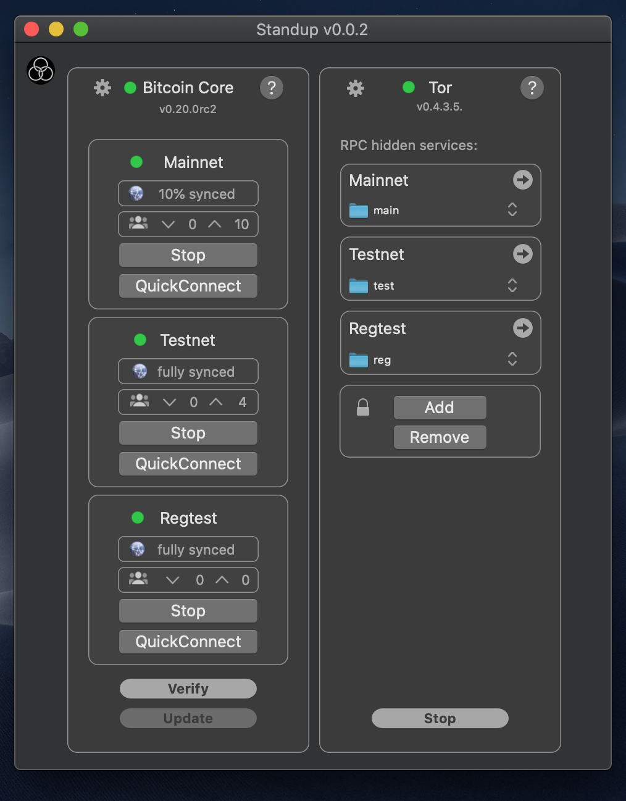
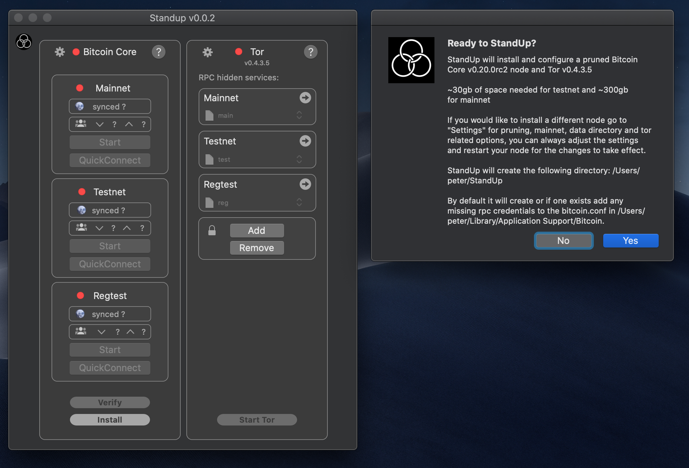
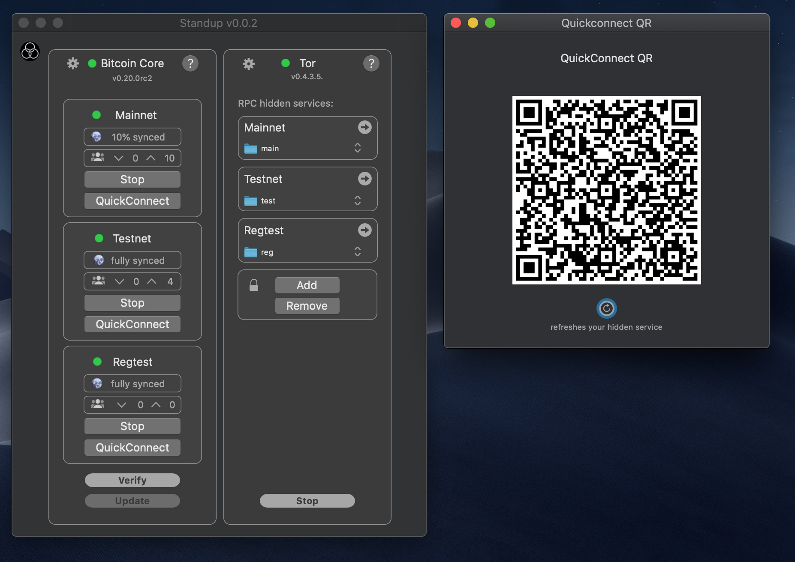

# 🛠 GordianSystem

*(Previously known as Bitcoin Standup and FullyNoded-2)*

**GordianSystem** is a suite of powerful open-source tools that offers a self-sovereign solution for Bitcoin by using Tor and QuickConnect technology to link a protected GordianNode with a mobile GordianWallet so that you access full-node capabilities from a mobile device. ([See more on what Gordian means to us.](Docs/Why-Gordian.md))

**GordianNode** uses Bitcoin Standup technology to help users to install a [Bitcoin-Core](https://bitcoin.org/) full-node on a fresh computer or VPS and to add important privacy tools like onion services. GordianNode will harden and secure your OS to current best practices and will add sufficient system tools to support basic Bitcoin development. It will also eventually support optional Bitcoin-related tools like [Electrum Personal Server](https://github.com/chris-belcher/electrum-personal-server), [C-Lightning](https://github.com/ElementsProject/lightning), [Esplora](https://github.com/Blockstream/esplora), and [BTCPay Server](https://github.com/btcpayserver/btcpayserver), as well as emerging technologies like Bitcoin-based Decentralized Identifiers. GordianNode is currently available for [MacOS](https://github.com/BlockchainCommons/GordianNode-macOS), with more limited functionality provided for [Linux machines](https://github.com/BlockchainCommons/Bitcoin-StandUp-Scripts) by the Bitcoin Standup technology.

**QuickConnect** is an APPI that generates a QR code (and/or special URI) to link your *GordianNode* to other devices, such as a mobile phone using [GordianWallet](https://testflight.apple.com/join/OQHyL0a8), a remote desktop, or the [Fully Noded](https://apps.apple.com/us/app/fully-noded/id1436425586) app on iOS.

**GordianWallet** is a mobile wallet special-built as part of the *GordianSystem*. It was built to support self-sovereign interactions while providing protected communications, and to utilize the newest cutting-edge Bitcoin technology, such as PSBTs and multi-sig addresses, which can multiply the protection of your Bitcoin funds.

*This repo contains a table of contents for various *GordianSystem* projects and features. Please see individual repos and pages for more information.*

## Gordian Node on MacOS

[GordianNode-macOS.app](https://github.com/BlockchainCommons/GordianNode-macOS) is an app that provides personal one-click installation for Bitcoin Core and Tor. It's built on Bitcoin Standup technology that presents a QuickConnect QR code that can be used to pair mobile wallets for remote use over Tor V3.

*GordianNode-macOS* has been developed and tested on "Mojave" and "Catalina", it can be installed via a DMG or an Xcode compilation

### Other Node Options: Bitcoin Standup for Linux

[Linux Bitcoin-StandUp-Scripts](https://github.com/BlockchainCommons/Bitcoin-StandUp-Scripts) achieves the same thing as GordianNode-macOS, but come in the form of Linux scripts rather than a central app.

The easiest-to-use Linux scripts run through the StackScript system at Linode, but you can alternatively use Linux scripts that have been tested with Debian Stretch and Ubuntu 18.04.

## GordianWallet on iOS

[GordianWallet-iOS](https://github.com/BlockchainCommons/GordianWallet-iOS) is a purpose-built remote app for securely connecting to your node over Tor from anywhere in the world. Combined with your *GordianNode*, it provides you with a powerful suite of tools for managing Bitcoin. You can scan the QuickConnect QR code from *GordianNode-macOS* and easily create mutli-sig wallets where one key gets stored on your device, one on your node, and one in offline backup.

 

### Other Wallet Options: FullyNoded for iOS

GordianWallet author Peter Denton also provides an alternative app: [FullyNoded-iOS](https://fullynoded.app/), a feature-rich Bitcoin wallet.

## Quick Connect for the GordianSystem

TheGordianSystem is built on the [Quick Connect API](Docs/Quick-Connect-API.md), which defines the spec for a deep link URI and a scannable QR Code, and which links your *GordianNode* (or other Bitcoin Standup node) to a *GordianWallet*. Besides being used by *GordianNode-macOS*, it's also supported by several server-side node manufacturers.

 

## Additional Information

### Further Docs

More information about the purpose and design of *GordianNode-macOS* can be found in the following documents:

1. [Why Run a Full Node?](Docs/Why-Full.md) Why would you want to run a full node in the first place? There are advantages in validation, privacy, security, liquidity, and education.
2. [Security for GordianNode-macOS](Docs/Security.md). Notes on ensuring the security of your *GordianNode-macOS* node.
3. [Why Gordian?](Docs/Why-Gordian.md) An explanation of the name.

### Related Projects

The full node created by *GordianNode-macOS* can also be interlinked with other projects from Blockchain Commons.

1. [Learning Bitcoin from the Command Line](https://github.com/ChristopherA/Learning-Bitcoin-from-the-Command-Line) is a tutorial for programming the `bitcoin-cli`, which can be run using a full node such as the one created by *GordianNode-macOS*.

## Financial Support

*GordianNode-macOS* is a project of [Blockchain Commons](https://www.blockchaincommons.com/). We are proudly a "not-for-profit" social benefit corporation committed to open source & open development. Our work is funded entirely by donations and collaborative partnerships with people like you. Every contribution will be spent on building open tools, technologies, and techniques that sustain and advance blockchain and internet security infrastructure and promote an open web.

To financially support further development of *GordianNode-macOS* and other projects, please consider becoming a Patron of Blockchain Commons through ongoing monthly patronage as a [GitHub Sponsor](https://github.com/sponsors/BlockchainCommons). You can also support Blockchain Commons with bitcoins at our [BTCPay Server](https://btcpay.blockchaincommons.com/).
