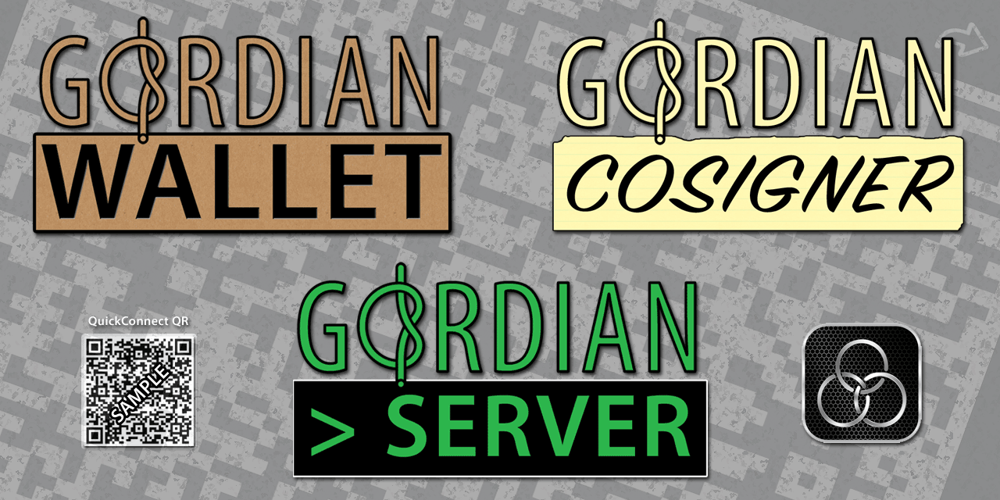

# 🛠 Gordian Products & Technologies

### **Architect:** _[Christopher Allen](https://github.com/ChristopherA)_ **Developers:** _[Peter Denton](https://github.com/Fonta1n3) and [Wolf McNally](https:github.com/WolfMcNally)_
*  ***uses [gordian](https://github.com/BlockchainCommons/gordian/blob/master/README.md) technology***
*  ***uses [torgap](https://github.com/BlockchainCommons/torgap/blob/master/README.md) technology***

Gordian offers a new approach to managing digital assets based on a set of principles and best practices that put the user first. It enhances independence and resilience by granting users the ability to robustly control their own digital assets using responsible key management and creates openness so that users won't be locked into anyone else's system. ([It's meant to cut through a traditionally knotty problem in Bitcoin development.](Docs/Why-Gordian.md))

The Gordian system supports these principles with a number of interoperable specifications such as [Bytewords](https://github.com/BlockchainCommons/Research/blob/master/papers/bcr-2020-012-bytewords.md), [Lifehash](https://github.com/BlockchainCommons/LifeHash), [SSKR](https://github.com/BlockchainCommons/crypto-commons/blob/master/Docs/README.md#sharded-secret-key-reconstruction-sskr), and [UR](https://github.com/BlockchainCommons/crypto-commons/blob/master/Docs/ur-1-overview.md) as well architectural elements such as Airgaps and [Torgaps](https://github.com/BlockchainCommons/torgap). 

Blockchain Commons provides a number of reference libraries and reference implementations intended as examples for these specifications and architectures that display how they can be used in real-life. We invite developers to use these references based on our open licenses, as detailed in our individual repos, as guides for creating your own software that will support the Gordian Principles.

*This repo contains a table of contents for various the Gordian system projects and features. Please see individual repos and pages for more information.*

## Gordian Principles

Blockchain Commons' interoperable specifications are meant to support four core principles that put the user first and that enable responsible key management:

* **Independence.** Gordian improves user freedom from involuntary oversight or external control.
* **Privacy.** Gordian protects against coercion with non-correlation, privacy, and pseudonymity.
* **Resilience.** Gordian protects users to decrease the likelihood of them losing their funds via any means.
* **Openness.** Gordian supports open infrastructure that allows developers to create their own applications.

Look at our individual reference apps for guidance on how each acts as a model for these principles.

## Quick Links for Reference Apps

Blockchain Commons has released a number of apps to exemplify the deployment of Gordian Principles

### Mobile Apps

Our two most advanced reference apps are both available from the Apple App Store for Macs or iOS devices:

* [GordianSeedTool-iOS](https://github.com/BlockchainCommons/GordianSeedTool-iOS)
   * [Download from Appstore](https://apps.apple.com/us/app/gordian-seed-tool/id1545088229)
* [GordianQRTool-iOS](https://github.com/BlockchainCommons/GordianQRTool-iOS)
   * [Download from Appstore](https://apps.apple.com/us/app/gordian-qr-tool/id1506851070)

We also have released two additional mobile apps, which demonstrate Gordian principles, but which have not been advanced to full release:

* GordianCosigner
   * [GordianCosigner-Android](https://github.com/BlockchainCommons/GordianSigner-Android)
   * [GordianCosigner-catalyst (iOS)](https://github.com/BlockchainCommons/GordianSigner-Catalyst)
   * [GordianCosigner-MacOS](https://github.com/BlockchainCommons/GordianSigner-macOS)
* [GordianWallet-iOS](https://github.com/BlockchainCommons/GordianWallet-iOS)

### CLI Apps

Many of our CLI apps were built to exercise our [crypto-commons libraries](https://github.com/BlockchainCommons/crypto-commons) but they also serve as references for the Gordian Principles, the UNIX/command-line equivalent of some of our mobile apps.

* **[Bytewords](https://github.com/BlockchainCommons/bc-bytewords-cli) \(CLI\).** A tool for testing bytewords.
* **[Keytool](https://github.com/BlockchainCommons/bc-keytool-cli) \(CLI\).** A tool for deriving keys and addresses from seeds. 
* **[LifeHashTool](https://github.com/BlockchainCommons/LifeHashTool) \(Swift CLI\).** A tool for generating Lifehash PNGs from the command line.
* **[Mori](https://github.com/BlockchainCommons/mori-cli) \(CLI\).** A timelock tool to make sure your assets aren't lost.
* **[Musign](https://github.com/BlockchainCommons/musign-cli) \(CLI\).** A research project for signing and verifying messages with ECDSA and Schnorr.
* **[Seedtool](https://github.com/BlockchainCommons/bc-seedtool-cli) \(Rust CLI\).** A tool for generating seeds from a variety of random inputs and for translating seeds among formats.
* **[Sweeptool](https://github.com/BlockchainCommons/sweeptool-cli) \(Rust CLI\).**  A tool for moving funds out of a descriptor wallet.

### Server Apps

Ultimately, Bitcoin apps require a Bitcoin server. The Gordian Server demonstrates how to set one up and abide by the Gordian Principles, particularly independence and privacy.

* [GordianServer-macOS.app](https://github.com/BlockchainCommons/GordianServer-macOS)
   * [Install from DMG](https://github.com/BlockchainCommons/GordianServer-macOS/blob/master/GordianServer-macOS-v0.1.3.dmg)
   * [Linux Bitcoin-StandUp-Scripts](https://github.com/BlockchainCommons/Bitcoin-StandUp-Scripts)

### Web Microservices

Web microservices are meant to support mobile or CLI apps by providing specific, small-scale services, such as price-lookups.

* [SpotBit](https://github.com/BlockchainCommons/spotbit)

### Hardware Apps

We've also produced one DIY hardware app that you can build to demonstrate the Gordian Principles.

* [LetheKit](https://github.com/BlockchainCommons/bc-lethekit)

## Quick Links for #SmartCustody Articles

Please see the [SmartCustody repo](https://github.com/BlockchainCommons/SmartCustody) for articles on Multisigs, Timelocks, and other SmartCustody topics.

## Overview: Gordian Architectural Model

The Gordian reference architecture, supporting the Gordian principles, is based on a theory of functional partition. 

Rather than following the design pattern of classic services, which group multiple services into singular applications, Blockchain Commons instead separates both services and confidential data from each other, paritioning them with airgaps and torgaps. Doing so improves privacy and security by reducing the value of honeypots and also improves functional design by ensuring that each application is precisely and concisely able to perform a specific function. Many of the Gordian reference apps are actually microservices, intended to perform small and simple but necessary activities as part of the blockchain ecosystem. 

Using functionally partitioned services, linked by airgaps and torgaps, the Gordian architecture creates a powerful and safe new methodology for financial, data, and information operations on the internet. It also creates an interoperable market for cooperative competition, where various creators can introduce their own services, improving the overall architecture through their competitive designs and ensuring survivability of the model as a whole.

### Gordian Architecture Roles

Roles that can be funtionally partitioned include:

***Cosigner.*** Accepts partially signed or unsigned transactions (typically PSBTs on the Bitcoin network) and signs them, either as part of a single-sig or multisig transaction. This typically means that the _Cosigner_ is also a _Seed Vault_, but this is not required: seeds could be hand-entered or scanned from another source whenever a signature is requested. This role was first demonstrated at Blockchain Commons in [Gordian Cosigner](https://github.com/BlockchainCommons/GordianCosigner-iOS) and is now part of the more fully feature [Gordian Seed Tool](https://github.com/BlockchainCommons/GordianSeedTool-iOS). Second-generation wallets, which are airgapped, such as Foundation Devices Passport and Keystone Pro also support the functionality. 

***Fee Calculator.*** Determines appropriate fees for uses of a blockchain network. There is no Blockchain Commons reference for fee calculation services. Sources such as `bitcoinfees.earn.com` and `mempool.space` provide the service, which is also often supported by a _Network Server_.

***Network Server.*** Talks directly to a cryptocurrency network, accepting inputs of blocks and enabling transmission of new transactions. Typically a full node. De facto, also a _Broadcast Coordinator_, and so the role is not separated out. At Blockchain Commons, this is [Gordian Wallet](https://github.com/BlockchainCommons/GordianWallet-iOS). In a self-sovereign scenario, a Bitcoin Core or Electrum server could also fulfill the role.

***Policy Coordinator.*** Manages the creation of multisigs. Blockchain Commons' [Gordian Wallet](https://github.com/BlockchainCommons/GordianWallet-iOS) was an early example, but at this point we lean toward Sparrow as a more fully featured piece of software.

***Pricing Calculator.*** Determines current values of cryptocurrencies, usually in fiat currencies. Blockchain offers the [Spotbit](https://github.com/BlockchainCommons/spotbit) microservice to fulfill this role.

***Seed Generator.*** Creates new seeds. This typically means that the _Seed Generator_ is also a _Seed Vault_, but this is not required: a highly partitioned architecture could separate out the functions for increased security. The prime examples that Blockchain Commons offers for partitioned seed generation are [LetheKit](https://github.com/BlockchainCommons/lethekit) and [Gordian Seed Tool](https://github.com/BlockchainCommons/GordianSeedTool-iOS). Most hardware and software wallets also support seed generation, but in a non-partitioned way.

***Seed Vault.*** Stores seeds securely. [Gordian Seed Tool](https://github.com/BlockchainCommons/GordianSeedTool-iOS) is Blockchain Commons' reference for seed storage. Hardware wallets, both first-generation connected wallets such as Ledger and Trezor and second-generation airgapped wallets such as Keystone and Passport, also provide the service.

***Transaction Coordinator.*** Creates transactions. Though Blockchain Commons' [Gordian Wallet](https://github.com/BlockchainCommons/GordianWallet-iOS) creates transactions, it role as a transaction coordinator is a bit dated. Instead, we suggest the Sparrow wallet as a released software wallet that can act as a transaction coordinator, interacting with a variety of Cosigners and Seed Vaults.  

### Gordian Architecture Gaps

In order to maximize the utility of its functional partitions, the Gordian architecture introduces gaps between services, which further the privacy and security capabilities of the architectural model.

 ***Airgaps.***  The traditional manner for partitioning services within a cryptographic network is to use an airgap. This is a physical gap that keeps the partitioned services from talking via any sort of connected network. Instead, data flow between the services occurs via QR codes, MicroSD cards, or other methods of small-scale data-only transfer. An airgap is often used to protect private keys on a non-networked device, but it can also be used with closely held devices such as phones to carefully control data flow and keep it off the network. The [UR specification](https://github.com/BlockchainCommons/crypto-commons/blob/master/Docs/ur-1-overview.md) was built explicitly to enable safe, secure airgapping. Airgaps are built into some of Blockchain Commons' reference apps, but are optional.

***Torgaps.***  This is a new methodology for partitioning cryptographic services, used when the services must be networked. As the name suggests, it places an onion link between the two services, enabling privacy and security while still allowing connectivity. Its power can be increased further with quorum computing, which aggregates services across different providers.

### Enabling the Gordian Principles with the Gordian Architecture

As a reference architecture, the Gordian Architecture also demonstrates the Gordian Principles.

* **Independence.** Users can choose which applications to use within an open ecosystem.
* **Privacy.** Airgaps create strong data protection, while torgaps do the same for networked interactions.
* **Resilience.** The paritioned design minimizes Single Points of Compromise.
* **Openness.** Airgaps and torgaps are connected via standard specifications such as URs, which allow anyone to add apps to the ecosystem.

## Overview: Gordian App Map

The Gordian architecture model is demonstrated through the Gordian reference apps, all linked by airgaps and torgaps, as laid out in the following diagram.

### Airgapped Apps

_The current generation of Blockchain Commons reference apps demonstrate how services can be both partitioned and airgapped (most of them on closely held networked devices), but still act as easy-to-use members of a blockchain ecosystem._

**[Gordian Seed Tool](https://github.com/BlockchainCommons/GordianSeedTool-iOS)**
**Roles:** Cosigner, Seed Generator, Seed Vault

A cryptographic seed manager for your iOS device. Allows the maintenance of seeds in a closely held device and the easy use of those seeds through `crypto-requests` for either specific keys or for the signature of PSBTs. This is our most developed app, and the one that best displays a variety of ways to achieve the Gordian Principles.

**[Gordian QRTool](https://github.com/BlockchainCommons/GordianQRTool-iOS)** 
**Roles:** Seed Vault

A more general data storage tool that displays how the Gordian Principles can apply to the protection of a variety of digital data that has been encoded as QRs. It also shows the tightest partitioning, allowing secure seed storage and nothing else. This is also a fully released app.

**[Gordian Cosigner](https://github.com/BlockchainCommons/GordianSigner-Catalyst).** 
**Roles:** Cosigner, Seed Vault

An offline PSBT and multi-sig signer. You can import keys and read PSBTs via QR code. After you sign the PSBT, you can then transfer it back to your Wallet across an airgap, which will coordinate the broadcast of the transaction. The current iteration supports Seed Generation, but the plan was to remove it to better partition the services. This app has never advanced to a full release, in large part because its functionality, and thus its reference examples, have been superceded by Seed Tool.

**[LetheKit](https://github.com/BlockchainCommons/bc-lethekit)**
**Roles:** Seed Generator

A do-it-yourself hardware kit that can be used to generate secure seeds for Bitcoin. It shares functionality with Seed Tool, but functions as fully airgapped hardware rather than software on a closely held but potentially connected device. It's also more tightly partitioned, focusing exclusively on seed generation.

### Microservices

_Blockchain Commons also produces reference apps to demonstrate microservices within its architecture._

**[SpotBit](https://github.com/BlockchainCommons/spotbit)** 
**Roles:** Pricing Calculator

A price-info microservice, used by Gordian Wallet (and potentially other paritioned services) through a _torgap_. Spotbit can be used to aggregate Bitcoin pricing information from a variety of exchanges and to store that data.

### Wallet & Server

_The first generation of Blockchain Commons reference apps focused on partitioning of wallet and server services and creating a first model for a self-sovereign multisig. The Wallet design has been superceded by better partitioned services, but remains as a reference. The server remains a crucial element of our infrastructure, usable by any properly partitioned Transaction Coordinator, whether it be Gordian Wallet or Sparrow._

**[Gordian Wallet](https://github.com/BlockchainCommons/GordianWallet-iOS)** 
**Roles:** Cosigner, Policy Coordinator, Seed Vault (partial), Transaction Coordinator

Gordian Wallet is a mobile Bitcoin wallet that supports sophisticated [#SmartCustody](https://www.smartcustody.com/) features such as multi-sigs and PSBTs. It acts as: a policy coordinator, determining how you set up your accounts; a transaction coordinator, creating transactions based on your policies; and a broadcast coordinator, determining how to send our your transactions. Note that the Seed role of Gordian Wallet is limited because its multisig design shares Seeds with the linked [Gordian Server](https://github.com/BlockchainCommons/GordianServer-macOS).

**[Gordian Server](https://github.com/BlockchainCommons/GordianServer-macOS).**
**Roles:** Cosigner, Network Server, Seed Generator, Seed Vault (partial)

A full-node server, created by Blockchain Commons' Bitcoin Standup scripts, running on a Mac or Linux machine. It connects to Gordian Wallet via a _torgap_. In conjunction with Gordian Wallets, its transactions are signed with a 2-of-3 multi-sig, with one key secured by Gordian Wallet, one key used by Gordian Server, and one key saved offline.

## Overview: Gordian Specifications

The Gordian system of course uses standard protocols for Bitcoin, to interact with the trustless network. Blockchain Commons has also developed specifications of its own and expanded those created for other technology categories, to better fulfill the Gordian Principles. These specifications are demonstrated in many of the Blockchain Commons reference apps, to show how they can be used to full Gordian's requirements for Independent, Privacy, Resilience, and Openness. 

***[Bytewords](https://github.com/BlockchainCommons/Research/blob/master/papers/bcr-2020-012-bytewords.md).*** Blockchain Commons developed its own binary-to-text format because of flaws in current ones, such as the variants that exist for base-64, and the fact that none of them convert efficiently to the QR codes used widely in Bitcoin applications. Bytewords stay within the 31 characters that are well supported by QR codes (that's letters plus numbers minus URL-breaking characters), allowing more efficient and safe usage.

***[CBOR](https://cbor.io/).*** Blockchain Commons represents binary data as CBOR, or Concise Binary Object Representation, which is RFC 7049. We feel that this self-descriptive language overcomes some of the flaws in pure JSON, while still retaining solid compatibility.

***[LifeHash](https://github.com/BlockchainCommons/lifehash.info#readme).*** A visual hashing algorithm that allows users to recognize seeds and other digital data by sight.

***[Quick Connect API](https://github.com/BlockchainCommons/Gordian/blob/master/Docs/Quick-Connect-API.md).*** A spec for a deep link URI and a scannable QR Code, used to connect a wallet and server across a gap.

***[SSKR](9https://github.com/BlockchainCommons/bc-sskr).*** A replacement for SLIP-39 to resolve issues where SLIP-39 and BIP-39 do not round-trip.

***[URs](https://github.com/BlockchainCommons/Research/blob/master/papers/bcr-2020-005-ur.md).*** The objective of many of our protocol expansions was to create a more robust system for encoding PSBTs, which were otherwise limited by the maximimum size of QR codes and the inefficient ways in which current text formats interacted with them. Much of that comes together in our Uniform Resource (UR) encoding, which is built upon Byteword and CBOR structures. It creates a methodology for encoding PSBTs as QR codes, either using sequential or animated QRs.

Please see the [Airgapped Wallet repo](https://github.com/BlockchainCommons/Airgapped-Wallet-Community), especially its [discussions](https://github.com/BlockchainCommons/Airgapped-Wallet-Community/discussions), for more on our work with the community to advance wallet state of the art.

## Overview: Gordian Crypto Commons

To further support Gordian's principles and best practices, Blockchain Commons has created a number of Gordian reference libraries, which embody our specifications, as well as reference apps and command-line programs. 

These are fully described in the [Crypto Commons Overview](https://github.com/BlockchainCommons/crypto-commons/blob/master/README.md).

Blockchain Commons is also happy to use libraries from other sources, if they're stabled and well-supported.

## Spotlight: Gordian SeedTool on iOS (and macOS)

**Roles:** Cosigner, Seed Generator, Seed Vault

[Gordian Seed Tool](https://github.com/BlockchainCommons/GordianSeedTool-iOS) for iOS And MacOS is Blockchain Commons' most sophisticated reference tool for demonstrating the usage of Blockchain Commons specifications and the Gordian principles.

Gordian SeedTool:

* Allows the storage of seeds in a protected, closely held device.
* Derives Keys that can be sent to other devices.
* Signs PSBTs for seeds that it holds.
* Answers `crypto-requests` with `crypto-responses`.
* Demonstrates other UR, SSKR, ByteWord, and LifeHash functionality.

* **[Download from the Apple App Store](https://apps.apple.com/us/app/gordian-seed-tool/id1545088229).**
* **[Visit the Repo](https://github.com/BlockchainCommons/GordianSeedTool-iOS).**

## Spotlight: Gordian Server on MacOS

**Roles:** Cosigner, Network Server, Seed Generator, Seed Vault (partial)

[GordianServer-macOS.app](https://github.com/BlockchainCommons/GordianServer-macOS) provides personal one-click installation for Bitcoin Core and Tor. It's built on Bitcoin Standup technology that presents a QuickConnect QR code that can be used to pair mobile wallets for remote use over Tor V3. If you want to have your own, independent and self-sovereign Bitcoin node, this is all you need. [Linux Bitcoin-StandUp-Scripts](https://github.com/BlockchainCommons/Bitcoin-StandUp-Scripts) achieves the same thing as GordianServer-macOS, but comes in the form of Linux scripts rather than a central app.

*GordianServer-macOS* has been developed for Macs using Catalina or better; it can be installed via a DMG or an Xcode compilation

* **[Install from DMG](https://github.com/BlockchainCommons/GordianServer-macOS/releases).**
* **[Visit the Repo](https://github.com/BlockchainCommons/GordianServer-macOS).**

## Additional Information

### Further Docs

More information about the purpose and design of the Gordian architecture can be found in the following documents:

1. [Why Run a Full Node?](Docs/Why-Full.md) Why would you want to run a full node in the first place? There are advantages in validation, privacy, security, liquidity, and education.
2. [Security for Your Gordian system](Docs/Security.md). Notes on ensuring the security of your GordianServer.
3. [Why Gordian?](Docs/Why-Gordian.md) What the Gordian name means to us.

### Discussions

The best place to talk about Blockchain Commons and its projects is in our GitHub Discussions areas.

[**Gordian System Discussions**](https://github.com/BlockchainCommons/Gordian/discussions). For users and developers of the Gordian system, including the Gordian Server, Bitcoin Standup technology, QuickConnect, and the Gordian Wallet. If you want to talk about our linked full-node and wallet technology, suggest new additions to our Bitcoin Standup standards, or discuss the implementation our standalone wallet, the Discussions area of the [main Gordian repo](https://github.com/BlockchainCommons/Gordian) is the place.

[**Blockchain Commons Discussions**](https://github.com/BlockchainCommons/Community/discussions). For developers, interns, and patrons of Blockchain Commons, please use the discussions area of the [Community repo](https://github.com/BlockchainCommons/Community) to talk about general Blockchain Commons issues, the intern program, or topics other than the [Gordian System](https://github.com/BlockchainCommons/Gordian/discussions) or the [wallet standards](https://github.com/BlockchainCommons/AirgappedSigning/discussions), each of which have their own discussion areas.

### Related Projects

The full node created by the Gordian system can also be interlinked with other projects from Blockchain Commons.

1. [Learning Bitcoin from the Command Line](https://github.com/BlockchainCommons/Learning-Bitcoin-from-the-Command-Line) is a tutorial for programming the `bitcoin-cli`, which can be run using a full node such as the one created by the Gordian system.

## Status - Varied

Please see individual projects for current status.

## Origin, Authors, Copyright & Licenses

Unless otherwise noted (either in this [/README.md](./README.md) or in the file's header comments) the contents of this repository are Copyright © 2020 by Blockchain Commons, LLC, and are [licensed](./LICENSE) under the [spdx:BSD-2-Clause Plus Patent License](https://spdx.org/licenses/BSD-2-Clause-Patent.html).

In most cases, the authors, copyright, and license for each file reside in header comments in the source code. When it does not, we have attempted to attribute it accurately in the table below.

This table below also establishes provenance (repository of origin, permalink, and commit id) for files included from repositories that are outside of this repo. Contributors to these files are listed in the commit history for each repository, first with changes found in the commit history of this repo, then in changes in the commit history of their repo of their origin.

| File      | From                                                         | Commit                                                       | Authors & Copyright (c)                                | License                                                     |
| --------- | ------------------------------------------------------------ | ------------------------------------------------------------ | ------------------------------------------------------ | ----------------------------------------------------------- |

## Financial Support

The Gordian system is a project of [Blockchain Commons](https://www.blockchaincommons.com/). We are proudly a "not-for-profit" social benefit corporation committed to open source & open development. Our work is funded entirely by donations and collaborative partnerships with people like you. Every contribution will be spent on building open tools, technologies, and techniques that sustain and advance blockchain and internet security infrastructure and promote an open web.

To financially support further development of the Gordian system and other projects, please consider becoming a Patron of Blockchain Commons through ongoing monthly patronage as a [GitHub Sponsor](https://github.com/sponsors/BlockchainCommons). You can also support Blockchain Commons with bitcoins at our [BTCPay Server](https://btcpay.blockchaincommons.com/).

## Contributing

We encourage public contributions through issues and pull requests! Please review [CONTRIBUTING.md](./CONTRIBUTING.md) for details on our development process. All contributions to this repository require a GPG signed [Contributor License Agreement](./CLA.md).

### Discussions

The best place to talk about Blockchain Commons and its projects is in our GitHub Discussions areas.

[**Gordian System Discussions**](https://github.com/BlockchainCommons/Gordian/discussions). For users and developers of the Gordian system, including the Gordian Server, Bitcoin Standup technology, QuickConnect, and the Gordian Wallet. If you want to talk about our linked full-node and wallet technology, suggest new additions to our Bitcoin Standup standards, or discuss the implementation our standalone wallet, the Discussions area of the [main Gordian repo](https://github.com/BlockchainCommons/Gordian) is the place.

[**Wallet Standard Discussions**](https://github.com/BlockchainCommons/AirgappedSigning/discussions). For standards and open-source developers who want to talk about wallet standards, please use the Discussions area of the [Airgapped Signing repo](https://github.com/BlockchainCommons/AirgappedSigning). This is where you can talk about projects like our [LetheKit](https://github.com/BlockchainCommons/bc-lethekit) and command line tools such as [seedtool](https://github.com/BlockchainCommons/bc-seedtool-cli), both of which are intended to testbed wallet technologies, plus the libraries that we've built to support your own deployment of wallet technology such as [bc-bip39](https://github.com/BlockchainCommons/bc-bip39), [bc-slip39](https://github.com/BlockchainCommons/bc-slip39), [bc-shamir](https://github.com/BlockchainCommons/bc-shamir), [Shamir Secret Key Recovery](https://github.com/BlockchainCommons/bc-sskr), [bc-ur](https://github.com/BlockchainCommons/bc-ur), and the [bc-crypto-base](https://github.com/BlockchainCommons/bc-crypto-base). If it's a wallet-focused technology or a more general discussion of wallet standards,discuss it here.

[**Blockchain Commons Discussions**](https://github.com/BlockchainCommons/Community/discussions). For developers, interns, and patrons of Blockchain Commons, please use the discussions area of the [Community repo](https://github.com/BlockchainCommons/Community) to talk about general Blockchain Commons issues, the intern program, or topics other than the [Gordian System](https://github.com/BlockchainCommons/Gordian/discussions) or the [wallet standards](https://github.com/BlockchainCommons/AirgappedSigning/discussions), each of which have their own discussion areas.

### Other Questions & Problems

As an open-source, open-development community, Blockchain Commons does not have the resources to provide direct support of our projects. Please consider the discussions area as a locale where you might get answers to questions. Alternatively, please use this repository's [issues](./issues) feature. Unfortunately, we can not make any promises on response time.

If your company requires support to use our projects, please feel free to contact us directly about options. We may be able to offer you a contract for support from one of our contributors, or we might be able to point you to another entity who can offer the contractual support that you need.

### Credits

The following people directly contributed to this repository. You can add your name here by getting involved. The first step is learning how to contribute from our [CONTRIBUTING.md](./CONTRIBUTING.md) documentation.

| Name              | Role                | Github                                            | Email                                 | GPG Fingerprint                                    |
| ----------------- | ------------------- | ------------------------------------------------- | ------------------------------------- | -------------------------------------------------- |
| Christopher Allen | Principal Architect | [@ChristopherA](https://github.com/ChristopherA) | \<ChristopherA@LifeWithAlacrity.com\> | FDFE 14A5 4ECB 30FC 5D22  74EF F8D3 6C91 3574 05ED |
| Peter Denton      | Project Lead        | [@Fonta1n3](https://github.com/Fonta1n3)          | <[FontaineDenton@gmail.com](mailto:FontaineDenton@gmail.com)> | 1C72 2776 3647 A221 6E02  E539 025E 9AD2 D3AC 0FCA  |

## Responsible Disclosure

We want to keep all of our software safe for everyone. If you have discovered a security vulnerability, we appreciate your help in disclosing it to us in a responsible manner. We are unfortunately not able to offer bug bounties at this time.

We do ask that you offer us good faith and use best efforts not to leak information or harm any user, their data, or our developer community. Please give us a reasonable amount of time to fix the issue before you publish it. Do not defraud our users or us in the process of discovery. We promise not to bring legal action against researchers who point out a problem provided they do their best to follow the these guidelines.

### Reporting a Vulnerability

Please report suspected security vulnerabilities in private via email to ChristopherA@BlockchainCommons.com (do not use this email for support). Please do NOT create publicly viewable issues for suspected security vulnerabilities.

The following keys may be used to communicate sensitive information to developers:

| Name              | Fingerprint                                        |
| ----------------- | -------------------------------------------------- |
| Christopher Allen | FDFE 14A5 4ECB 30FC 5D22  74EF F8D3 6C91 3574 05ED |

You can import a key by running the following command with that individual’s fingerprint: `gpg --recv-keys "<fingerprint>"` Ensure that you put quotes around fingerprints that contain spaces.
