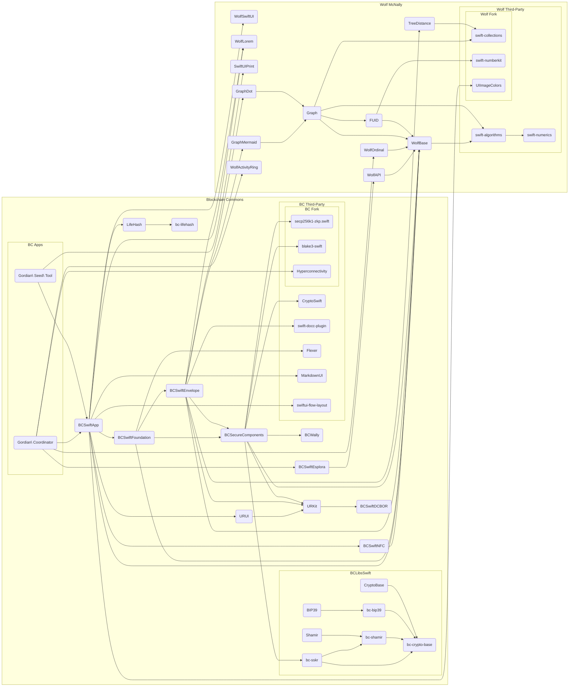

# Swift Software Module Dependencies

The diagram below details the dependencies between many of our reference libraries and apps in the Swift/iOS/macOS ecosystem. Many of the higher-level libraries are written in Swift, while there are a number of important lower-level libraries that are written in C or C++.

## iOS Apps by Blockchain Commons

* [Gordian Coordinator](https://github.com/BlockchainCommons/iOS-GordianCoordinator): Multisig Bitcoin transaction coordinator for iOS.
* [Gordian Seed Tool](https://github.com/BlockchainCommons/GordianSeedTool-iOS): Cryptographic Seed Manager for iOS.

## Reference Libraries by Blockchain Commons

* [bc-crypto-base](https://github.com/BlockchainCommons/bc-crypto-base): Audited cryptographic functions reference library in C.
* [bc-lifehash](https://github.com/BlockchainCommons/bc-lifehash): A beautiful method of hash visualization based on Conway’s Game of Life: reference library in C/C++.
* [bc-shamir](https://github.com/BlockchainCommons/bc-shamir): Shamir Secret Sharing reference library in C.
* [bc-sskr](https://github.com/BlockchainCommons/bc-sskr): Sharded Secret Key Reconstruction (SSKR) reference library in C.
* [BCSwiftApp](https://github.com/BlockchainCommons/BCSwiftApp): Conveniences in Swift common to Blockchain Commons apps.
* [BCSwiftDCBOR](https://github.com/BlockchainCommons/BCSwiftDCBOR): A pure Swift CBOR codec that focuses on writing and parsing "deterministic" CBOR per §4.2 of RFC-8949.
* [BCSwiftEnvelope](https://github.com/BlockchainCommons/BCSwiftEnvelope): Gordian Envelope - Swift Reference Implementation.
* [BCSwiftEsplora](https://github.com/BlockchainCommons/BCSwiftEsplora): A pure Swift interface to the Esplora block explorer REST API.
* [BCSwiftFoundation](https://github.com/BlockchainCommons/BCSwiftFoundation): A collection of useful primitives for cryptocurrency wallets.
* [BCSwiftNFC](https://github.com/BlockchainCommons/BCSwiftNFC): A modern Swift library for reading and writing NFC tags.
* [BCSwiftSecureComponents](https://github.com/BlockchainCommons/BCSwiftSecureComponents): A collection of useful primitives for cryptography, semantic graphs, and cryptocurrency in Swift.
* [BCSwiftWally](https://github.com/BlockchainCommons/BCSwiftWally): Thin Swift wrapper around LibWally.
* [LifeHash](https://github.com/BlockchainCommons/LifeHash): A beautiful method of hash visualization based on Conway’s Game of Life: reference library in Swift.
* [URKit](https://github.com/BlockchainCommons/URKit): UR (Uniform Resources) reference framework for Swift.
* [URUI](https://github.com/BlockchainCommons/URUI): UI reference framework for displaying and scanning URs for Swift.

## Forks of Third-Party Open Source Libraries Maintained by Blockchain Commons

* [blake3-swift](https://github.com/BlockchainCommons/blake3-swift): Swift implementation of the BLAKE3 cryptographic hash function.
* [Hyperconnectivity](https://github.com/BlockchainCommons/Hyperconnectivity): Modern replacement for Apple's Reachability written in Swift and made elegant using Combine.
* [secp256k1-zkp.swift](https://github.com/BlockchainCommons/secp256k1-zkp.swift): Elliptic Curve public key, ECDSA, and Schnorr for Bitcoin, experimental fork. Supports iOS macOS tvOS watchOS + Linux.

## Third-Party Dependencies of Blockchain Commons Apps and Libraries

* [CryptoSwift](https://github.com/krzyzanowskim/CryptoSwift): A growing collection of standard and secure cryptographic algorithms implemented in Swift.
* [Flexer](https://github.com/ChimeHQ/Flexer): Lexing library for Swift.
* [MarkdownUI](https://github.com/gonzalezreal/MarkdownUI): Display and customize Markdown text in SwiftUI.
* [swift-docc-plugin](https://github.com/apple/swift-docc-plugin): Swift Package Manager command plugin for Swift-DocC.
* [swiftui-flow-layout](https://github.com/globulus/swiftui-flow-layout): Flow layout / tag cloud / collection view in SwiftUI.

## Open Source Libraries Written and Maintained by [Wolf McNally](https://github.com/wolfmcnally)

* [FUID](https://github.com/wolfmcnally/FUID): Friendly Universal IDs.
* [Graph](https://github.com/wolfmcnally/Graph): A Swift graph structure with value semantics.
* [GraphDot](https://github.com/wolfmcnally/GraphDot): An adaptor for the Graph type providing export to the GraphVis Dot format.
* [GraphMermaid](https://github.com/wolfmcnally/GraphMermaid): An adaptor for the Graph type providing export to the Mermaid format.
* [swift-numberkit](https://github.com/wolfmcnally/swift-numberkit): Advanced numeric data types for Swift 5, including BigInt, Rational, and Complex numbers.
* [TreeDistance](https://github.com/wolfmcnally/TreeDistance): A Swift implementation of Zhang-Shasha algorithm for ordered tree distance calculation.
* [WolfActivityRing](https://github.com/wolfmcnally/WolfActivityRing): Apple Watch-style activity ring for SwiftUI.
* [WolfAPI](https://github.com/wolfmcnally/WolfAPI): A Swift package for easily creating REST HTTP APIs and managing call progress and results.
* [WolfBase](https://github.com/wolfmcnally/WolfBase): Small and generally useful extensions to pure Swift/Foundation.
* [WolfLorem](https://github.com/wolfmcnally/WolfLorem): Functions to generate random placeholders in the style of Lorem Ipsum.
* [WolfOrdinal](https://github.com/wolfmcnally/WolfOrdinal): A Swift framework for generating partially-ordered sort keys used to facilitate arrangeable lists in databases.

## Forks of Third-Party Open Source Libraries Maintained by [Wolf McNally](https://github.com/wolfmcnally)

* [swift-collections](https://github.com/wolfmcnally/swift-collections): Commonly used data structures for Swift.
* [UIImageColors](https://github.com/wolfmcnally/UIImageColors): Fetches the most dominant and prominent colors from an image.

## Third-Party Dependencies of [Wolf McNally](https://github.com/wolfmcnally)'s Libraries

* [swift-algorithms](https://github.com/apple/swift-algorithms): Commonly used sequence and collection algorithms for Swift.
* [swift-numerics](https://github.com/apple/swift-numerics): Advanced mathematical types and functions for Swift.
